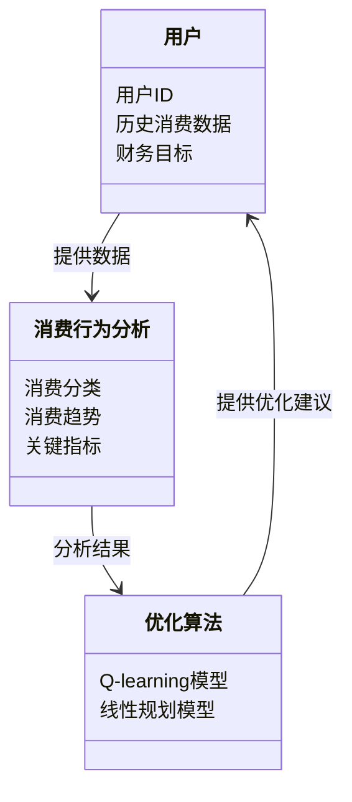

                 


# 开发智能化的个人消费行为优化与财务目标对齐工具

## 关键词：人工智能，消费行为优化，财务目标对齐，强化学习，系统架构设计

## 摘要：本文旨在探讨如何利用人工智能技术开发智能化的个人消费行为优化工具，以实现消费行为与财务目标的对齐。通过分析消费行为的特征、优化算法的设计、系统架构的搭建，以及实际案例的分析，本文详细阐述了如何利用技术手段帮助个人实现财务健康和目标管理。

---

# 第一部分: 背景与核心概念

# 第1章: 个人消费行为优化与财务目标对齐的背景与问题

## 1.1 个人消费行为优化的背景

### 1.1.1 当代消费行为的特点
当代消费行为呈现出多样化、个性化和数字化的特点。随着互联网和移动支付的普及，人们的消费行为变得更加复杂，涉及线上线下的多种场景。消费行为不仅受到价格、质量等传统因素的影响，还受到用户评价、社交网络、个性化推荐等多种因素的影响。

### 1.1.2 消费行为对个人财务健康的影响
消费行为直接关系到个人的财务健康。不合理的消费习惯可能导致超支、债务积累等问题，而合理的消费行为则有助于实现财务自由和目标的实现。因此，优化消费行为是个人财务管理的重要环节。

### 1.1.3 数字化与智能化消费行为分析的必要性
随着大数据和人工智能技术的发展，消费行为的分析可以从传统的经验判断转向数据驱动的智能化决策。通过收集和分析大量的消费数据，可以更精准地识别消费习惯，制定个性化的优化策略。

## 1.2 财务目标对齐的重要性

### 1.2.1 财务目标的定义与分类
财务目标是个人在一定时间内希望通过财务管理实现的具体目标，通常包括短期目标（如月度预算）和长期目标（如购房、退休储蓄）。不同目标的优先级和时间跨度不同，需要在消费行为中进行权衡。

### 1.2.2 消费行为与财务目标的矛盾与协调
消费行为往往受到即时需求的驱动，而财务目标则需要长期的规划和克制。这两者之间可能存在矛盾，例如高消费支出可能影响储蓄目标的实现。因此，如何在消费行为和财务目标之间找到平衡点是关键。

### 1.2.3 智能化工具在财务目标对齐中的作用
智能化工具可以通过分析用户的消费数据，预测未来的消费趋势，并根据财务目标提供个性化的建议。通过实时监控和调整消费行为，帮助用户逐步实现财务目标。

## 1.3 问题背景与问题描述

### 1.3.1 当前消费行为优化的痛点
- 消费行为缺乏计划性，容易导致超支。
- 缺乏对消费数据的系统分析，难以制定有效的优化策略。
- 传统财务管理方法过于笼统，难以满足个性化需求。

### 1.3.2 财务目标对齐的难点
- 不同目标之间可能存在冲突，需要进行复杂的权衡。
- 消费行为的动态变化使得目标对齐的难度增加。
- 用户的财务状况和消费习惯可能随时间变化，需要动态调整策略。

### 1.3.3 智能化工具解决的核心问题
- 提供个性化的消费行为分析和优化建议。
- 实现实时消费监控和目标对齐的动态调整。
- 通过人工智能技术，帮助用户实现长期财务目标。

## 1.4 问题解决与边界

### 1.4.1 问题解决的思路与方法
- 数据驱动：通过收集和分析消费数据，提供精准的优化建议。
- 智能推荐：利用机器学习算法，预测未来的消费趋势。
- 个性化策略：根据用户的财务目标和消费习惯，制定个性化的优化方案。

### 1.4.2 工具的边界与适用场景
- 边界：工具主要针对个人消费行为的优化，不涉及企业或投资理财。
- 适用场景：适用于需要优化消费行为、实现财务目标的个人用户。

### 1.4.3 核心概念的外延与内涵
- 消费行为优化：通过分析消费数据，制定合理的消费计划，减少不必要的开支。
- 财务目标对齐：确保消费行为与长期财务目标一致，实现财务健康。

## 1.5 核心概念结构

### 1.5.1 消费行为优化的系统架构
消费行为优化的系统架构包括数据采集、行为分析、优化建议和反馈调整四个模块。

### 1.5.2 财务目标对齐的逻辑框架
财务目标对齐的逻辑框架包括目标设定、消费监控、目标评估和调整优化四个步骤。

### 1.5.3 核心要素的组成与关系
核心要素包括消费数据、财务目标、优化算法和用户反馈。消费数据是输入，优化算法是处理核心，财务目标是对齐的结果，用户反馈用于优化算法的调整。

---

# 第2章: 核心概念与联系

## 2.1 消费行为优化的核心原理

### 2.1.1 消费行为的分类与特征
消费行为可以分为必需品消费和可选消费品消费。必需品消费是基本生活需求，而可选消费品消费则是提升生活质量的支出。不同类型的消费行为在优化策略上有所不同。

### 2.1.2 消费决策的驱动因素
消费决策的驱动因素包括价格、质量、品牌、用户评价、促销活动等。通过分析这些因素，可以制定更有效的优化策略。

### 2.1.3 智能化优化的算法基础
智能化优化的算法基础包括强化学习、协同过滤和聚类分析等。这些算法可以帮助识别消费模式，预测未来的消费趋势。

## 2.2 财务目标对齐的数学模型

### 2.2.1 财务目标的层次化分解
财务目标可以分为短期目标和长期目标。短期目标包括月度预算，长期目标包括储蓄和投资。

### 2.2.2 目标对齐的数学表达
目标对齐的数学表达可以通过线性规划模型来实现。目标函数是最大化财务目标的实现程度，约束条件是消费行为的限制。

### 2.2.3 模型的输入与输出
模型的输入包括消费数据和财务目标，输出是优化后的消费计划和调整建议。

## 2.3 核心概念的ER实体关系图

```mermaid
er
actor: 用户
goal: 财务目标
behavior: 消费行为
optimizer: 优化算法
```

---

# 第3章: 算法原理与数学模型

## 3.1 强化学习算法原理

### 3.1.1 强化学习的基本概念
强化学习是一种通过试错和反馈来优化决策的算法。它通过与环境的交互，学习最优策略。

### 3.1.2 Q-learning算法的流程
Q-learning算法的流程包括状态转移、动作选择、奖励计算和Q值更新四个步骤。

### 3.1.3 算法的数学模型
$$ Q(s,a) = r + \gamma \max Q(s',a') $$

## 3.2 联合优化算法实现

### 3.2.1 联合优化的目标函数
$$ \min_{x} \sum_{i=1}^{n} c_i x_i + \lambda \sum_{j=1}^{m} w_j y_j $$

### 3.2.2 算法的收敛性分析
联合优化算法的收敛性分析需要考虑目标函数的凸性、步长的选择等因素。

### 3.2.3 实现的代码框架
```python
def optimize_behavior(user_data):
    # 算法实现
    pass
```

## 3.3 数学模型与公式

### 3.3.1 消费行为优化的数学表达
$$ \min_{x} \sum_{i=1}^{n} c_i x_i + \lambda \sum_{j=1}^{m} w_j y_j $$

### 3.3.2 财务目标对齐的约束条件
$$ \sum_{i=1}^{n} x_i \leq budget $$

---

# 第4章: 系统分析与架构设计

## 4.1 系统功能设计

### 4.1.1 领域模型


### 4.1.2 系统架构设计


## 4.2 接口设计与交互流程

### 4.2.1 接口设计
- 用户输入消费数据
- 系统提供优化建议
- 用户反馈调整需求

### 4.2.2 交互流程
用户输入消费数据 → 系统分析消费行为 → 优化算法计算 → 提供优化建议 → 用户反馈调整需求 → 重新优化

---

# 第5章: 项目实战

## 5.1 环境搭建与代码实现

### 5.1.1 环境安装
需要安装Python、相关库（如NumPy、Pandas、Scikit-learn）。

### 5.1.2 核心代码实现
```python
def optimize_behavior(user_data):
    # 数据预处理
    # 算法实现
    return optimized_plan
```

## 5.2 案例分析与解读

### 5.2.1 实际案例
以月度预算管理为例，展示如何通过工具优化消费行为。

### 5.2.2 案例分析
分析消费数据，制定优化计划，并验证目标对齐的效果。

## 5.3 工具小结
通过实际案例，验证工具的有效性和实用性。

---

# 第6章: 最佳实践与总结

## 6.1 最佳实践

### 6.1.1 数据隐私保护
用户数据的安全性是开发工具的重要考虑因素。

### 6.1.2 算法的持续优化
根据用户的反馈和数据的变化，持续优化算法，提高优化效果。

## 6.2 小结

### 6.2.1 核心内容总结
本文详细介绍了如何利用人工智能技术开发智能化的个人消费行为优化工具，实现消费行为与财务目标的对齐。

### 6.2.2 未来展望
随着人工智能技术的发展，消费行为优化工具将更加智能化和个性化，帮助更多人实现财务健康。

## 6.3 注意事项

### 6.3.1 数据准确性
消费数据的准确性是优化的基础，需要确保数据的完整性和准确性。

### 6.3.2 用户教育
用户需要理解工具的工作原理和使用方法，才能更好地利用工具实现目标。

## 6.4 拓展阅读

### 6.4.1 推荐书籍
- 《算法导论》
- 《机器学习实战》

### 6.4.2 推荐博客
- 人工智能技术博客
- 数据科学社区

---

# 结语

通过本文的详细介绍，读者可以全面了解如何开发智能化的个人消费行为优化与财务目标对齐工具。从背景分析到算法实现，从系统设计到项目实战，再到最佳实践，每一步都进行了详细的探讨。希望本文能为读者提供有价值的参考和启发，帮助他们在实际应用中更好地实现消费行为优化与财务目标对齐。

