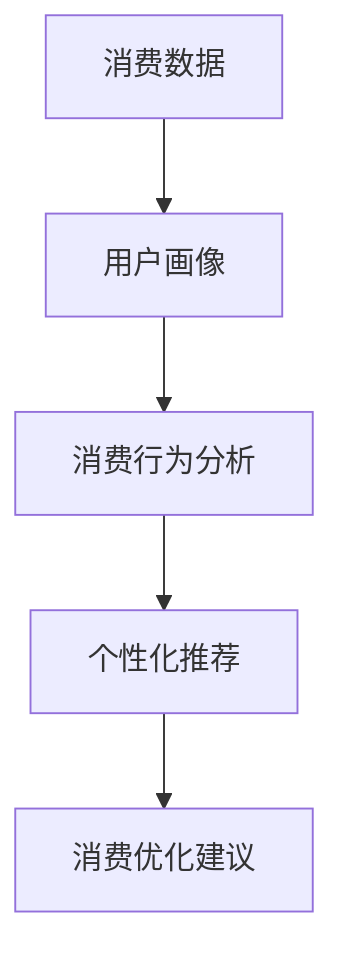
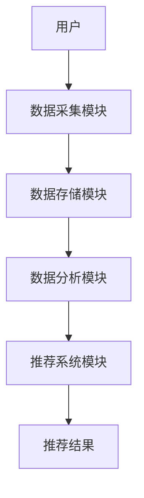
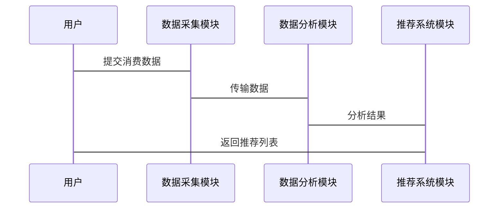

                 


# 开发智能化的个人消费行为优化建议工具

## 关键词：人工智能、消费行为优化、推荐系统、大数据、系统架构

## 摘要：  
随着人工智能和大数据技术的快速发展，个人消费行为优化工具正逐渐成为人们生活中不可或缺的一部分。本文旨在探讨如何利用智能技术，开发一个能够有效优化个人消费行为的工具。通过分析消费数据、构建用户画像、设计推荐算法和实现系统架构，本文将详细阐述如何利用技术手段帮助用户做出更明智的消费决策。

---

## 第1章：背景介绍

### 1.1 问题背景  
个人消费行为优化工具的开发背景可以追溯到人们对更高效、更智能生活方式的追求。随着生活节奏的加快和消费选择的多样化，人们需要一个能够帮助他们合理规划消费、避免浪费、提升生活质量的工具。  

#### 1.1.1 当前消费行为的问题与挑战  
- 消费信息过载：用户每天面临海量的商品和服务选择，难以快速决策。  
- 财务管理复杂：用户需要跟踪和管理自己的消费支出，避免超支或浪费。  
- 消费决策不透明：用户难以获取商品的真实价值和性价比信息。  

#### 1.1.2 个人消费行为优化的必要性  
- 帮助用户合理分配预算，提升资金使用效率。  
- 提供个性化消费建议，避免冲动消费。  
- 通过数据分析，帮助用户发现消费习惯中的问题并改进。  

#### 1.1.3 智能化工具在消费优化中的作用  
- 智能化工具可以通过数据分析和机器学习算法，为用户提供个性化的消费建议。  
- 工具可以实时跟踪用户的消费数据，帮助用户更好地管理支出。  
- 工具可以通过推荐系统，为用户提供最优的消费选择。  

### 1.2 问题描述  
智能化的个人消费行为优化工具需要解决以下核心问题：  
- 如何采集和处理用户的消费数据？  
- 如何分析用户的消费行为并构建用户画像？  
- 如何设计高效的推荐算法，为用户提供个性化的消费建议？  

### 1.3 问题解决  
通过结合人工智能和大数据技术，我们能够实现消费数据的智能分析和个性化推荐。  

#### 1.3.1 智能化工具的核心功能  
- 数据采集与存储：收集用户的消费记录、预算设置、消费偏好等信息。  
- 数据分析：通过统计分析和机器学习算法，分析用户的消费行为模式。  
- 个性化推荐：基于用户画像和行为分析，推荐最优的消费方案。  

#### 1.3.2 工具如何实现消费行为优化  
- 数据驱动：通过数据分析，识别用户的消费习惯和偏好。  
- 智能推荐：基于用户画像和历史数据，推荐最优的消费选择。  
- 实时反馈：根据用户的实时消费行为，动态调整推荐策略。  

#### 1.3.3 工具的边界与外延  
- 边界：工具仅关注用户的消费行为优化，不涉及投资或其他财务决策。  
- 外延：工具可以与其他金融工具（如银行账户、信用卡）集成，提供更全面的财务管理服务。  

### 1.4 核心概念与联系  
通过构建核心概念之间的关系图，我们可以更好地理解工具的设计逻辑。  



---

## 第2章：人工智能与大数据基础  

### 2.1 人工智能基础  

#### 2.1.1 机器学习的基本概念  
机器学习是一种人工智能技术，通过训练模型从数据中学习模式，并用于预测或分类任务。  

#### 2.1.2 深度学习的核心原理  
深度学习是一种基于人工神经网络的机器学习技术，通过多层网络结构提取数据的高层次特征。  

#### 2.1.3 自然语言处理（NLP）的应用  
NLP技术可以用于分析用户的消费评论和反馈，提取情感倾向和关键词。  

### 2.2 大数据基础  

#### 2.2.1 数据采集与处理  
- 数据采集：通过API接口获取用户的消费记录。  
- 数据清洗：去除无效数据，处理缺失值。  

#### 2.2.2 数据分析与挖掘  
- 数据分析：通过统计分析识别用户的消费习惯。  
- 数据挖掘：利用聚类算法发现用户群体的消费模式。  

#### 2.2.3 数据可视化  
数据可视化可以帮助用户直观地理解自己的消费行为。  

### 2.3 推荐系统简介  

#### 2.3.1 推荐系统的定义与分类  
推荐系统是一种基于用户行为和偏好，为用户推荐商品或服务的系统。  

#### 2.3.2 基于协同过滤的推荐算法  
- 基于用户的协同过滤：通过寻找与用户相似的用户群体，推荐相似的商品。  
- 基于物品的协同过滤：通过分析商品之间的相似性，推荐相关的商品。  

#### 2.3.3 基于内容的推荐算法  
基于商品的描述信息（如类别、标签），推荐与用户兴趣相符的商品。  

---

## 第3章：消费行为分析  

### 3.1 消费数据的采集与处理  

#### 3.1.1 数据来源与采集方法  
- 数据来源：用户的消费记录、交易数据、用户问卷等。  
- 采集方法：通过API接口、数据库查询等方式获取数据。  

#### 3.1.2 数据清洗与预处理  
- 数据清洗：去除重复数据、处理无效值。  
- 数据转换：将数据转换为适合分析的格式。  

#### 3.1.3 数据存储与管理  
- 数据存储：将数据存储在数据库中，方便后续分析。  
- 数据管理：通过数据仓库技术，管理海量消费数据。  

### 3.2 消费行为分析方法  

#### 3.2.1 基于统计的分析方法  
- 描述性统计：计算用户的平均消费金额、消费频率等指标。  

#### 3.2.2 基于机器学习的分析方法  
- 分类算法：将用户分为不同的消费群体（如高消费用户、低消费用户）。  
- 聚类算法：发现用户消费行为的相似性，形成消费模式。  

#### 3.2.3 基于规则的分析方法  
- 规则引擎：通过预定义的规则，识别用户的异常消费行为。  

### 3.3 用户画像与行为建模  

#### 3.3.1 用户画像的构建过程  
- 数据采集：收集用户的消费记录、兴趣爱好等信息。  
- 数据分析：通过机器学习算法，提取用户的特征。  
- 画像构建：将提取的特征组合成用户画像。  

#### 3.3.2 用户行为的特征提取  
- 特征提取：从消费数据中提取用户的消费金额、消费频率、消费类别等特征。  

#### 3.3.3 用户行为模型的建立  
- 行为模型：基于用户特征，建立用户行为预测模型。  

---

## 第4章：推荐系统算法原理  

### 4.1 协同过滤算法  

#### 4.1.1 基于用户的协同过滤  
- 算法流程：  
  1. 找到与目标用户相似的用户群体。  
  2. 基于相似用户的购买记录，推荐商品。  

#### 4.1.2 基于物品的协同过滤  
- 算法流程：  
  1. 计算商品之间的相似性。  
  2. 基于目标用户的购买记录，推荐相似商品。  

#### 4.1.3 混合协同过滤的优缺点  
- 优点：结合了用户和物品的特征，推荐效果更佳。  
- 缺点：计算复杂度较高，需要大量的存储空间。  

### 4.2 基于深度学习的推荐算法  

#### 4.2.1 神经网络在推荐系统中的应用  
- 神经网络模型：通过多层感知机（MLP）提取数据的高层次特征。  

#### 4.2.2 基于深度学习的推荐算法实现  
- 算法实现：  
  1. 数据预处理：将用户和商品的特征向量化。  
  2. 网络训练：通过反向传播算法训练神经网络。  
  3. 推荐生成：基于训练好的模型，生成推荐结果。  

#### 4.2.3 深度学习推荐算法的优势  
- 优势：能够捕捉数据的非线性关系，推荐效果更优。  

---

## 第5章：系统分析与架构设计方案  

### 5.1 系统功能设计  

#### 5.1.1 系统功能模块  
- 数据采集模块：负责采集用户的消费数据。  
- 数据分析模块：对消费数据进行分析和处理。  
- 推荐系统模块：基于用户画像和行为分析，生成推荐结果。  

#### 5.1.2 系统功能流程  
- 流程图：  
  1. 用户输入消费数据。  
  2. 数据采集模块将数据传输至数据分析模块。  
  3. 数据分析模块生成用户画像和行为分析结果。  
  4. 推荐系统模块基于分析结果生成推荐列表。  

### 5.2 系统架构设计  

#### 5.2.1 系统架构图  


#### 5.2.2 系统架构实现  
- 分层架构：将系统划分为数据层、业务逻辑层和用户界面层。  

### 5.3 系统接口设计  

#### 5.3.1 接口定义  
- 接口名称：消费数据采集接口。  
- 接口参数：用户ID、消费金额、消费时间。  

#### 5.3.2 接口实现  
- 使用RESTful API设计接口，支持JSON格式的数据传输。  

### 5.4 系统交互设计  

#### 5.4.1 系统交互流程  
- 用户通过移动应用提交消费数据。  
- 数据采集模块将数据传输至后端数据库。  
- 数据分析模块生成用户画像和行为分析结果。  
- 推荐系统模块基于分析结果生成推荐列表。  

#### 5.4.2 交互流程图  


---

## 第6章：项目实战  

### 6.1 环境安装  

#### 6.1.1 环境配置  
- 安装Python、Jupyter Notebook、Pandas、NumPy等工具。  

#### 6.1.2 数据集准备  
- 数据来源：公开数据集（如Kaggle平台）或模拟数据。  

### 6.2 系统核心实现  

#### 6.2.1 数据采集与处理  
```python
import pandas as pd

# 数据采集
data = pd.read_csv('consumption.csv')

# 数据清洗
data.dropna(inplace=True)
data['amount'] = data['amount'].astype(int)
```

#### 6.2.2 推荐系统实现  
```python
from sklearn.metrics.pairwise import cosine_similarity

# 基于用户的协同过滤
user_similarity = cosine_similarity(user_features)

def get_recommendations(user_id):
    similar_users = user_similarity[user_id]
    recommendations = []
    for i in range(len(similar_users)):
        if similar_users[i] > 0.8:
            recommendations.append(similar_users[i])
    return recommendations
```

### 6.3 案例分析与总结  

#### 6.3.1 实际案例分析  
- 案例背景：某用户的消费记录分析。  
- 分析结果：用户主要在食品和娱乐方面消费较高。  
- 推荐结果：推荐用户减少在娱乐方面的支出，增加在教育方面的投入。  

#### 6.3.2 项目总结  
- 项目实现的关键点：数据采集、数据分析、推荐系统实现。  
- 项目实现的难点：如何提高推荐系统的准确性和实时性。  

---

## 第7章：总结与展望  

### 7.1 最佳实践 tips  
- 数据采集要尽可能全面，确保分析结果的准确性。  
- 推荐系统要根据用户反馈不断优化，提升推荐效果。  

### 7.2 小结  
通过本文的探讨，我们了解了如何利用人工智能和大数据技术开发智能化的个人消费行为优化工具。从数据采集到推荐系统实现，每一步都需要精心设计和优化。  

### 7.3 注意事项  
- 保护用户隐私，确保数据安全。  
- 定期更新算法模型，适应用户行为的变化。  

### 7.4 拓展阅读  
- 推荐系统领域的最新研究进展。  
- 大数据技术在其他领域的应用。  

---

通过以上内容，我们详细探讨了开发智能化的个人消费行为优化建议工具的各个方面，从理论到实践，为读者提供了一个完整的解决方案。

