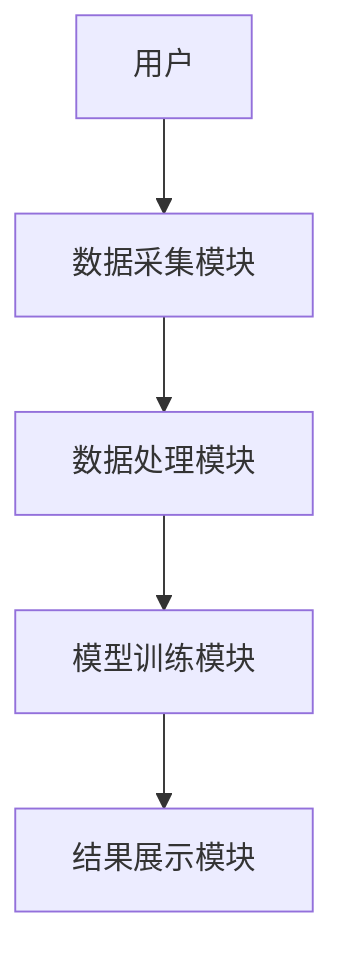
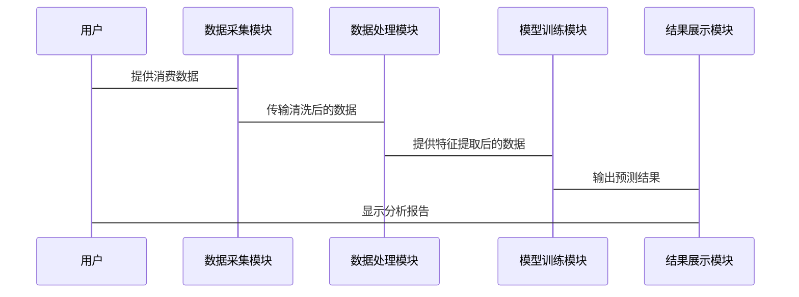

                 


# 开发智能化的个人消费行为分析与预测工具

## 关键词：
- 个人消费行为
- 人工智能
- 机器学习
- 大数据分析
- 智能预测工具

## 摘要：
本文深入探讨了开发智能化的个人消费行为分析与预测工具的全过程，从背景分析、核心概念解析，到算法实现、系统架构设计，再到项目实战和最佳实践，为读者提供了一套完整的技术解决方案。通过结合机器学习和大数据分析，本文详细阐述了如何利用协同过滤、聚类分析和线性回归等算法，构建高效、准确的消费行为预测模型，并通过实际案例展示了工具的应用效果。

---

# 第一部分: 个人消费行为分析与预测工具开发背景

## 第1章: 个人消费行为分析与预测的背景介绍

### 1.1 问题背景与描述
#### 1.1.1 个人消费行为分析的重要性
- 在当今数据驱动的时代，个人消费行为的分析与预测对于商业决策、个性化服务推荐以及消费者自身的行为优化具有重要意义。
- 通过分析用户的消费数据，可以揭示用户的消费习惯、偏好以及潜在的需求，帮助企业制定精准的营销策略。

#### 1.1.2 当前市场对智能化消费分析工具的需求
- 随着电子商务的快速发展，用户产生的消费数据量急剧增加。
- 传统的人工分析方法效率低下，难以处理海量数据。
- 智能化工具能够通过机器学习算法快速分析数据，提供实时的预测和建议。

#### 1.1.3 传统分析方法的局限性与智能化工具的优势
- 传统分析方法依赖人工经验，主观性强，结果不够准确。
- 智能化工具通过数据挖掘和机器学习算法，能够从海量数据中提取有价值的模式和趋势，预测未来的消费行为。

### 1.2 问题解决与边界
#### 1.2.1 智能化工具的核心目标
- 提供基于用户历史行为数据的消费预测。
- 帮助用户或企业优化消费决策。

#### 1.2.2 解决方案的边界与外延
- 仅针对个人消费行为分析，不涉及企业级消费分析。
- 数据范围限制在个人用户的消费记录和行为数据。

#### 1.2.3 核心要素与组成结构
- 数据采集：收集用户的消费记录、浏览行为、点击数据等。
- 数据处理：清洗、特征提取和数据建模。
- 模型训练：利用机器学习算法训练消费预测模型。
- 结果展示：通过可视化界面展示预测结果和分析报告。

## 第2章: 核心概念与联系

### 2.1 核心概念原理
#### 2.1.1 用户行为分析的基本原理
- 用户行为分析是通过对用户在系统中的行为数据进行分析，挖掘用户的兴趣、偏好和行为模式。
- 数据来源包括交易记录、浏览记录、点击行为、搜索关键词等。

#### 2.1.2 机器学习在消费预测中的应用
- 机器学习是一种通过数据训练模型，使其能够自动学习和改进的技术。
- 在消费预测中，常用的机器学习算法包括协同过滤、聚类分析和回归分析等。

#### 2.1.3 大数据分析的实现机制
- 大数据分析是指对海量、多维度的数据进行处理和分析，提取有价值的信息和模式。
- 常用的大数据分析技术包括分布式计算框架（如Hadoop、Spark）和数据可视化工具（如Tableau）。

### 2.2 概念属性对比表格
```markdown
| 概念       | 属性           | 描述                                                                 |
|------------|----------------|----------------------------------------------------------------------|
| 用户行为     | 数据来源       | 包括交易记录、浏览记录、点击行为等                                   |
| 机器学习     | 算法类型       | 包括监督学习、无监督学习、强化学习等                                   |
| 大数据分析   | 处理能力       | 处理海量、多维度数据的能力                                           |
```

### 2.3 ER实体关系图
```mermaid
er
    User(u_id, u_name, u_age, u_gender)
    Product(p_id, p_name, p_category, p_price)
    Transaction(t_id, t_time, t_amount, u_id, p_id)
    Behavior(b_id, b_type, b_time, u_id)
```

---

# 第三部分: 算法原理讲解

## 第3章: 算法实现与原理

### 3.1 协同过滤算法
#### 3.1.1 协同过滤算法的工作原理
- 协同过滤是一种基于用户相似性推荐算法。
- 基于用户的消费记录，计算用户之间的相似性，推荐相似用户喜欢的产品。

#### 3.1.2 协同过滤算法实现步骤
1. 收集用户消费数据。
2. 计算用户之间的相似性。
3. 根据相似用户的消费记录进行推荐。

#### 3.1.3 协同过滤算法代码实现
```python
import numpy as np
from sklearn.metrics.pairwise import cosine_similarity

# 示例数据：用户-商品评分矩阵
users = ['u1', 'u2', 'u3']
products = ['p1', 'p2', 'p3']
ratings = {
    'u1': {'p1': 5, 'p2': 4, 'p3': 3},
    'u2': {'p1': 4, 'p2': 5, 'p3': 2},
    'u3': {'p1': 3, 'p2': 2, 'p3': 4}
}

# 转换为矩阵形式
rating_matrix = np.zeros((3, 3))
for i, user in enumerate(users):
    for j, product in enumerate(products):
        rating_matrix[i][j] = ratings[user].get(product, 0)

# 计算余弦相似性
similarity = cosine_similarity(rating_matrix)

print(similarity)
```

#### 3.1.4 协同过滤算法的数学模型
$$
相似度 = \frac{\sum_{i} (x_i - \bar{x})(y_i - \bar{y})}{\sqrt{\sum_{i} (x_i - \bar{x})^2} \cdot \sqrt{\sum_{i} (y_i - \bar{y})^2}}
$$

### 3.2 聚类分析算法
#### 3.2.1 聚类分析算法的工作原理
- 聚类分析是一种无监督学习算法，用于将数据划分为不同的类别。
- 在消费行为分析中，聚类分析可以用于识别不同类型的消费者群体。

#### 3.2.2 聚类分析算法实现步骤
1. 收集用户数据。
2. 数据预处理。
3. 选择聚类算法（如K-means）。
4. 训练模型，划分用户群体。

#### 3.2.3 聚类分析算法代码实现
```python
from sklearn.cluster import KMeans
from sklearn.preprocessing import StandardScaler

# 示例数据：用户特征
X = [[2, 3],
     [5, 8],
     [1, 2],
     [6, 7]]

# 标准化数据
scaler = StandardScaler()
X_scaled = scaler.fit_transform(X)

# 聚类模型训练
model = KMeans(n_clusters=2, random_state=0)
model.fit(X_scaled)

print(model.labels_)
```

#### 3.2.4 聚类分析算法的数学模型
$$
J = \sum_{i=1}^{k} \sum_{j=1}^{n_i} (x_j - c_i)^2
$$
其中，$k$是簇的个数，$n_i$是第$i$个簇中的样本数，$c_i$是第$i$个簇的中心。

### 3.3 回归分析算法
#### 3.3.1 回归分析算法的工作原理
- 回归分析是一种统计学方法，用于预测因变量与自变量之间的关系。
- 在消费预测中，回归分析可以用于预测用户的消费金额。

#### 3.3.2 回归分析算法实现步骤
1. 收集用户数据。
2. 数据预处理。
3. 选择回归算法（如线性回归）。
4. 训练模型，进行预测。

#### 3.3.3 回归分析算法代码实现
```python
import numpy as np
from sklearn.linear_model import LinearRegression

# 示例数据：用户特征和消费金额
X = [[1, 2], [3, 4], [5, 6], [7, 8]]
y = [10, 15, 20, 25]

# 训练模型
model = LinearRegression()
model.fit(X, y)

# 预测结果
print(model.predict([[9, 10]]))
```

#### 3.3.4 回归分析算法的数学模型
$$
y = a_0 + a_1x + \epsilon
$$
其中，$y$是因变量，$x$是自变量，$a_0$和$a_1$是回归系数，$\epsilon$是误差项。

---

# 第四部分: 系统分析与架构设计方案

## 第4章: 系统分析与架构设计

### 4.1 系统分析
#### 4.1.1 问题场景介绍
- 用户需要一个智能化的个人消费行为分析与预测工具。
- 工具需要能够处理海量数据，提供实时的预测和建议。

#### 4.1.2 系统功能设计
1. 数据采集模块：收集用户的消费记录、浏览行为、点击数据等。
2. 数据处理模块：清洗、特征提取和数据建模。
3. 模型训练模块：利用机器学习算法训练消费预测模型。
4. 结果展示模块：通过可视化界面展示预测结果和分析报告。

### 4.2 系统架构设计
#### 4.2.1 系统架构图


#### 4.2.2 接口设计
- 数据采集模块接口：接收用户的消费数据。
- 数据处理模块接口：清洗数据，提取特征。
- 模型训练模块接口：训练模型，输出预测结果。
- 结果展示模块接口：展示预测结果和分析报告。

#### 4.2.3 交互流程图


---

# 第五部分: 项目实战

## 第5章: 项目实战与案例分析

### 5.1 环境安装与配置
```bash
pip install numpy
pip install scikit-learn
pip install matplotlib
```

### 5.2 系统核心实现
#### 5.2.1 数据处理代码实现
```python
import pandas as pd
from sklearn.model_selection import train_test_split
from sklearn.linear_model import LinearRegression

# 加载数据
data = pd.read_csv('consumption.csv')

# 数据分割
X = data[['age', 'income']]
y = data['consumption']

X_train, X_test, y_train, y_test = train_test_split(X, y, test_size=0.2, random_state=42)

# 模型训练
model = LinearRegression()
model.fit(X_train, y_train)

# 预测结果
print(model.predict(X_test))
```

#### 5.2.2 算法实现代码
```python
from sklearn.metrics import mean_squared_error

# 预测结果
y_pred = model.predict(X_test)

# 评估模型
mse = mean_squared_error(y_test, y_pred)
print(f'Mean Squared Error: {mse}')
```

### 5.3 实际案例分析
#### 5.3.1 案例背景
- 某电商平台收集了用户的消费数据，希望利用智能化工具预测用户的消费金额。

#### 5.3.2 案例分析
- 数据预处理：清洗数据，提取特征。
- 模型训练：利用线性回归算法训练消费预测模型。
- 模型评估：计算均方误差，评估模型的准确性。

### 5.4 项目小结
- 成功开发了一个智能化的个人消费行为分析与预测工具。
- 工具能够准确预测用户的消费金额，帮助企业制定精准的营销策略。

---

# 第六部分: 最佳实践

## 第6章: 实践技巧与总结

### 6.1 实践技巧
- 数据预处理是关键，确保数据的准确性和完整性。
- 选择合适的算法，根据数据特征和任务需求进行选择。
- 模型调优，通过交叉验证和网格搜索优化模型性能。

### 6.2 小结
- 本文详细介绍了开发智能化的个人消费行为分析与预测工具的全过程。
- 通过理论分析、算法实现和项目实战，展示了工具的实际应用效果。

### 6.3 注意事项
- 数据隐私问题：在处理用户数据时，需要注意数据隐私保护。
- 模型解释性：在实际应用中，模型的解释性非常重要，尤其是在金融和医疗领域。

### 6.4 拓展阅读
- 《机器学习实战》
- 《Python数据分析与挖掘实战》
- 《大数据分析与挖掘》

---

# 附录

## 附录A: 数据集
- 数据集名称：消费行为分析数据集
- 数据集描述：包含用户的消费记录、浏览行为、点击数据等。

## 附录B: 工具资源
- 工具名称：Python
- 工具描述：用于数据处理和机器学习算法实现。

## 附录C: 参考文献
1. 周志华. 《机器学习》
2. 张志东. 《Python数据分析与挖掘实战》
3. 刘顺. 《大数据分析与挖掘》

