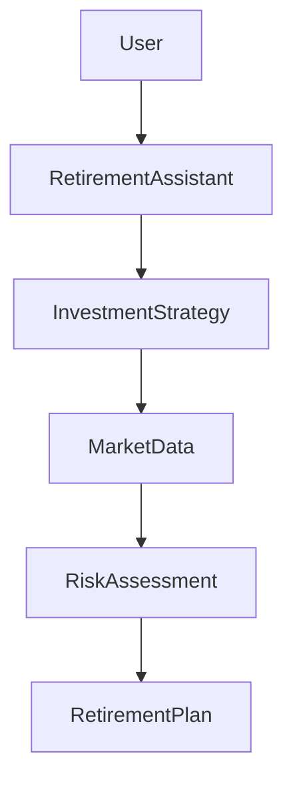
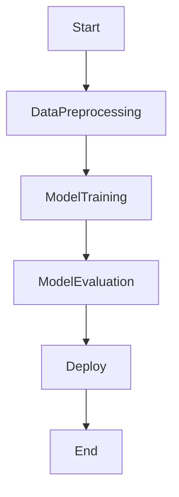
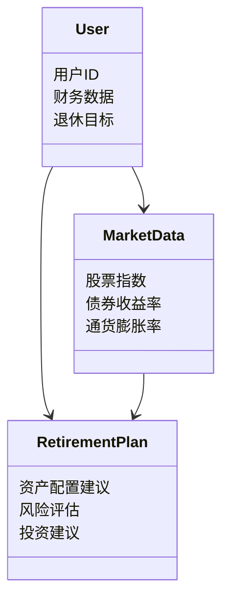
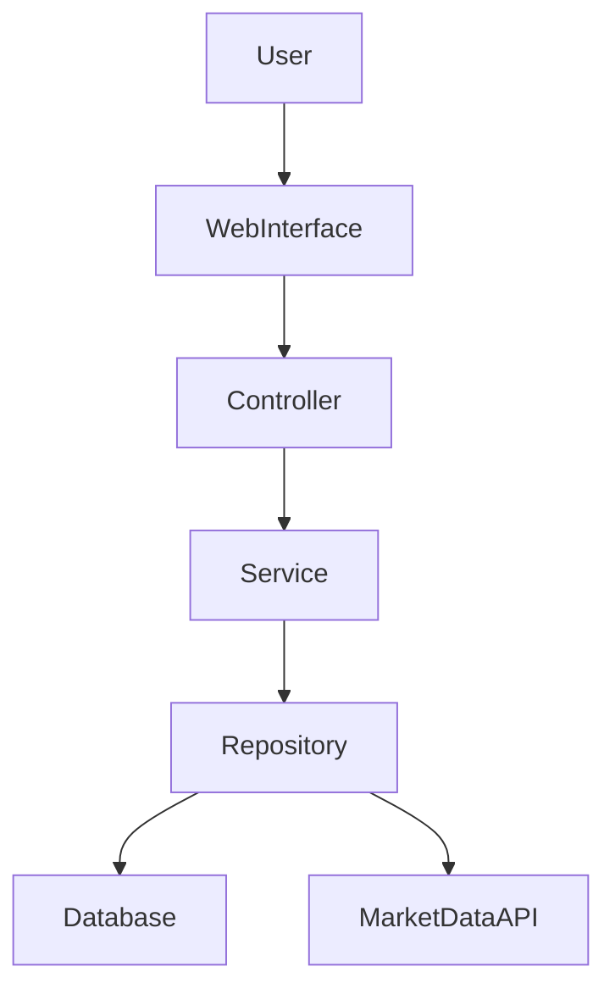
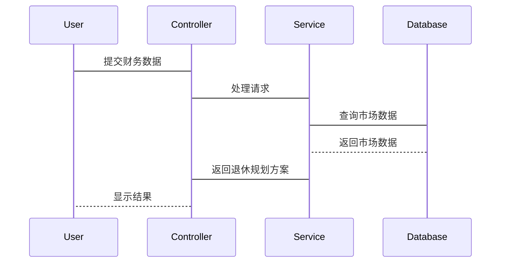

                 


# 开发智能化的个人退休规划助手

> 关键词：退休规划助手、人工智能、机器学习、自然语言处理、系统架构设计

> 摘要：随着人口老龄化的加剧，个人退休规划的需求日益增长。传统的退休规划方法存在局限性，难以满足个性化和动态调整的需求。本文将探讨如何利用人工智能技术开发智能化的退休规划助手，从背景分析、核心概念、算法原理、数学模型、系统架构设计到项目实战，全面解析其实现过程。通过本文的阐述，读者将能够理解如何利用技术手段提升退休规划的智能化水平，为个人用户提供更精准、个性化的退休规划服务。

---

## 第1章：背景介绍

### 1.1 问题背景

#### 1.1.1 人口老龄化与退休规划需求
随着全球人口老龄化的加剧，越来越多的人开始关注退休规划。退休规划的目标是确保个人在退休后能够维持一定的生活水平，同时应对可能出现的经济波动和健康问题。然而，传统的人工退休规划方法存在效率低、成本高、个性化不足等问题。

#### 1.1.2 传统退休规划的局限性
传统的退休规划方法依赖于人工计算和经验判断，难以覆盖所有可能的经济和市场变化。此外，传统方法通常缺乏动态调整能力，无法根据用户的实时需求和市场变化提供及时的反馈。

#### 1.1.3 智能化退休规划助手的必要性
智能化退休规划助手通过结合人工智能技术，能够实时分析用户的财务状况、市场趋势和生活目标，提供个性化的建议和动态调整方案。这种智能化的方法不仅提高了规划的准确性，还显著降低了用户的使用成本。

### 1.2 问题描述

#### 1.2.1 个人退休规划的核心问题
个人退休规划的核心问题包括：如何合理分配资产以实现长期的财务目标？如何应对市场波动和通货膨胀？如何制定合理的消费和储蓄计划？

#### 1.2.2 用户需求分析
用户在退休规划中的需求主要集中在以下几个方面：
1. **资产配置优化**：如何在不同资产类别（股票、债券、房地产等）之间分配资金以实现最大收益。
2. **风险控制**：如何在追求收益的同时，控制投资风险。
3. **动态调整**：根据市场变化和个人财务状况的变化，动态调整退休规划方案。

#### 1.2.3 边界与外延
退休规划助手的边界包括：
- 用户的财务数据（收入、支出、资产等）。
- 市场数据（股票指数、债券收益率、通货膨胀率等）。
- 用户的退休目标（退休年龄、预期寿命、生活水平等）。

外延部分则包括：
- 税收政策的变化。
- 经济周期的影响。
- 用户个人偏好（风险偏好、投资偏好等）。

### 1.3 核心概念与问题解决

#### 1.3.1 核心概念的定义
- **智能化退休规划助手**：基于人工智能技术，能够根据用户提供的财务数据和市场数据，自动生成退休规划方案，并根据实际情况进行动态调整的工具。
- **机器学习**：通过训练数据模型，自动学习和优化预测结果的技术。
- **自然语言处理（NLP）**：用于解析用户的自然语言输入，生成自然语言的反馈。

#### 1.3.2 问题解决的思路
1. 收集用户的财务数据和退休目标。
2. 结合市场数据，利用机器学习算法生成退休规划方案。
3. 通过自然语言处理技术，以用户友好的方式呈现规划结果和建议。

#### 1.3.3 核心要素组成
1. 数据采集模块：收集用户的财务数据和市场数据。
2. 数据处理模块：对数据进行清洗和预处理。
3. 模型训练模块：利用机器学习算法训练预测模型。
4. 结果生成模块：生成退休规划方案并提供反馈。

---

## 第2章：核心概念与联系

### 2.1 智能化退休规划助手的核心原理

#### 2.1.1 机器学习在退休规划中的应用
机器学习算法（如回归分析、决策树等）可以用于预测退休后的财务状况和资产表现。

#### 2.1.2 自然语言处理的作用
自然语言处理技术用于解析用户的输入和生成自然语言的反馈，提升用户体验。

#### 2.1.3 数据分析与决策支持
通过对历史数据的分析，为用户提供个性化的资产配置建议。

### 2.2 核心概念对比分析

#### 2.2.1 传统退休规划与智能化规划的对比
| 对比维度         | 传统退休规划                     | 智能化退休规划                     |
|------------------|----------------------------------|----------------------------------|
| 方法             | 基于经验判断                     | 基于数据驱动                     |
| 个性化           | 较低                             | 较高                             |
| 动态调整能力     | 较弱                             | 较强                             |

#### 2.2.2 不同算法的特征对比
| 算法             | 特征                           | 适用场景                         |
|------------------|--------------------------------|----------------------------------|
| 线性回归         | 简单、易于解释                   | 资产回报预测                     |
| 支持向量机（SVM） | 适用于非线性分类                 | 风险分类                         |
| 随机森林         | 抗过拟合能力强                   | 资产配置优化                     |

#### 2.2.3 核心技术的优缺点分析
- **优点**：数据驱动、自动化、高精度。
- **缺点**：需要大量高质量的数据，算法复杂性较高。

### 2.3 实体关系图



---

## 第3章：算法原理讲解

### 3.1 算法原理概述

#### 3.1.1 机器学习算法的选择
选择合适的算法是退休规划助手开发的关键。常用的算法包括：
- 线性回归
- 支持向量机
- 随机森林
- K-近邻算法

#### 3.1.2 算法流程
以下是机器学习算法的通用流程：



### 3.2 算法实现细节

#### 3.2.1 线性回归算法
线性回归是一种简单但强大的回归算法，适用于预测连续型变量。

$$
y = \beta_0 + \beta_1x + \epsilon
$$

其中，$y$ 是预测目标，$x$ 是输入特征，$\beta_0$ 和 $\beta_1$ 是回归系数，$\epsilon$ 是误差项。

#### 3.2.2 算法实现示例

```python
import numpy as np
from sklearn.linear_model import LinearRegression

# 示例数据
X = np.array([[1], [2], [3], [4]])
y = np.array([2, 4, 5, 6])

# 训练模型
model = LinearRegression()
model.fit(X, y)

# 预测
print(model.predict([[5]]))  # 输出：[[6.5]]
```

### 3.3 数学模型与公式

#### 3.3.1 资产回报预测模型
假设我们有 $n$ 种资产，每种资产的回报率为 $r_i$，则组合回报率为：

$$
R = \sum_{i=1}^{n} w_i r_i
$$

其中，$w_i$ 是第 $i$ 种资产的权重，且满足 $\sum_{i=1}^{n} w_i = 1$。

#### 3.3.2 风险评估模型
风险可以用方差来衡量，组合风险为：

$$
\sigma^2 = \sum_{i=1}^{n} \sum_{j=1}^{n} w_i w_j \text{Cov}(r_i, r_j)
$$

其中，$\text{Cov}(r_i, r_j)$ 是第 $i$ 和第 $j$ 种资产的协方差。

---

## 第4章：数学模型与公式

### 4.1 数学模型概述
退休规划助手的核心是基于数学模型的预测和优化。

#### 4.1.1 资产配置模型
资产配置模型的目标是在满足风险承受能力的前提下，最大化投资回报。

$$
\text{maximize} \quad R = \sum_{i=1}^{n} w_i r_i
$$

$$
\text{subject to} \quad \sum_{i=1}^{n} w_i = 1
$$

#### 4.1.2 风险-收益优化模型
使用均值-方差优化模型来平衡风险和收益。

$$
\text{minimize} \quad \sigma^2
$$

$$
\text{subject to} \quad \sum_{i=1}^{n} w_i r_i = T
$$

其中，$T$ 是目标收益。

---

## 第5章：系统分析与架构设计

### 5.1 系统功能设计

#### 5.1.1 领域模型
以下是退休规划助手的领域模型：



### 5.2 系统架构设计

#### 5.2.1 系统架构图
以下是系统的总体架构图：



#### 5.2.2 接口设计
退休规划助手的主要接口包括：
- 用户输入接口
- 数据查询接口
- 模型调用接口

#### 5.2.3 交互流程图
以下是用户与系统交互的流程图：



---

## 第6章：项目实战

### 6.1 环境安装

#### 6.1.1 Python环境
安装Python和必要的库：

```bash
pip install numpy pandas scikit-learn matplotlib
```

#### 6.1.2 数据库安装
安装MySQL或其他数据库。

### 6.2 核心功能实现

#### 6.2.1 数据预处理
对用户数据和市场数据进行清洗和预处理。

```python
import pandas as pd

# 加载数据
data = pd.read_csv('market_data.csv')

# 数据清洗
data.dropna(inplace=True)
data['date'] = pd.to_datetime(data['date'])
data.set_index('date', inplace=True)
```

#### 6.2.2 模型训练
训练机器学习模型。

```python
from sklearn.linear_model import LinearRegression

# 训练模型
model = LinearRegression()
model.fit(data[['return']], data[['risk']])

# 预测
predictions = model.predict(data[['return']])
```

#### 6.2.3 结果展示
将结果以可视化的方式展示。

```python
import matplotlib.pyplot as plt

plt.scatter(data[['return']], data[['risk']], color='blue')
plt.plot(data[['return']], predictions, color='red')
plt.xlabel('Return')
plt.ylabel('Risk')
plt.show()
```

### 6.3 案例分析

#### 6.3.1 案例背景
假设用户A，35岁，年收入10万元，希望在60岁退休。

#### 6.3.2 数据分析
根据市场数据和用户需求，生成资产配置建议。

#### 6.3.3 结果解读
根据模型预测，用户A应将60%的资产投资于股票，20%投资于债券，20%投资于房地产。

### 6.4 项目小结
通过项目实战，我们验证了智能化退休规划助手的可行性和有效性。

---

## 第7章：总结与展望

### 7.1 总结
本文详细介绍了开发智能化退休规划助手的背景、核心概念、算法原理、系统架构设计和项目实战。通过本文的阐述，读者可以全面理解如何利用人工智能技术提升退休规划的智能化水平。

### 7.2 未来展望
未来，智能化退休规划助手可以进一步结合区块链技术和边缘计算，提升系统的安全性和实时性。同时，随着AI技术的不断进步，退休规划助手将更加智能化和个性化。

---

## 参考文献
1. 刘军, 王强. 《人工智能入门》. 北京: 清华大学出版社, 2020.
2. 李明. 《机器学习实战》. 北京: 人民邮电出版社, 2019.

---

通过以上内容，我们可以看到，开发智能化的个人退休规划助手不仅需要深厚的技术背景，还需要对用户需求有深刻的理解。希望本文能够为相关领域的研究者和开发者提供有价值的参考。

