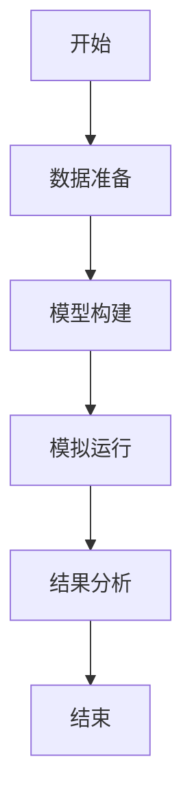
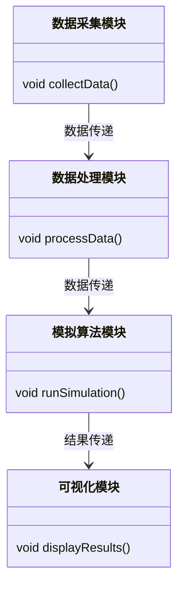
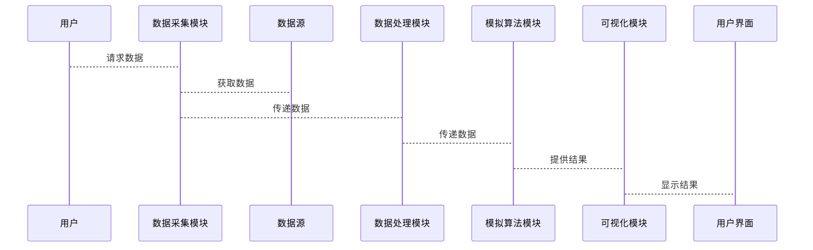

                 


# 开发智能化的企业信用风险传导模拟与可视化系统

## 关键词：企业信用风险，风险传导，蒙特卡洛模拟，可视化系统，贝叶斯网络

## 摘要：  
随着全球经济的快速发展和企业间的竞争加剧，信用风险的管理变得至关重要。本文详细探讨了如何利用智能化技术开发企业信用风险传导模拟与可视化系统，以帮助企业更好地理解和管理信用风险。文章从背景介绍、核心概念、算法原理、系统架构到项目实战，全面分析了系统的开发过程，最后给出了系统的最佳实践和未来发展方向。

---

# 第一部分: 企业信用风险传导模拟与可视化系统背景介绍

## 第1章: 企业信用风险传导概述

### 1.1 问题背景

#### 1.1.1 信用风险的定义与特征
信用风险是指由于债务人或交易对手未能履行其合同义务，导致债权人或相关方遭受损失的风险。其主要特征包括：

1. **不确定性**：风险的发生往往难以预测。
2. **传染性**：风险可能从一个企业传导到另一个企业，甚至影响整个行业或经济体系。
3. **复杂性**：涉及多种因素，如经济环境、企业财务状况等。

#### 1.1.2 信用风险传导的经济意义
信用风险传导是企业在经济活动中面临的主要风险之一。例如，2008年全球金融危机就是由于金融机构之间的信用风险传导导致的系统性危机。

#### 1.1.3 企业信用风险传导的解决方法
通过建立智能化的模拟系统，可以量化和可视化信用风险传导的过程，从而帮助企业制定更有效的风险管理策略。

### 1.2 问题描述

#### 1.2.1 信用风险传导的复杂性
信用风险的传导路径复杂，涉及多个层级的企业和市场参与者，难以通过传统方法进行分析。

#### 1.2.2 传统信用风险评估的局限性
传统的信用评估方法通常基于静态模型，难以捕捉动态变化中的风险传导。

#### 1.2.3 可视化系统在信用风险管理中的作用
可视化系统可以通过图形化的方式，将复杂的信用风险传导过程直观地展示出来，帮助决策者快速理解风险状态。

### 1.3 问题解决

#### 1.3.1 智能化模拟的核心思想
利用大数据和人工智能技术，构建动态的信用风险传导模型，模拟风险在企业间的传播路径。

#### 1.3.2 可视化系统的技术实现路径
通过数据采集、算法模拟和可视化展示，构建一个实时更新的信用风险评估系统。

#### 1.3.3 系统目标与预期效果
系统的最终目标是为企业提供一个实时、动态的信用风险评估工具，帮助企业在复杂经济环境中做出更明智的决策。

### 1.4 系统边界与外延

#### 1.4.1 系统功能边界
系统主要功能包括数据采集、风险模拟、可视化展示和结果分析。

#### 1.4.2 系统应用范围
适用于企业内部风险管理、银行贷款审批、供应链管理等领域。

#### 1.4.3 系统与其他系统的接口关系
系统需要与企业财务系统、市场数据源等外部系统进行数据交互。

---

# 第二部分: 核心概念与联系

## 第2章: 信用风险传导机制

### 2.1 信用风险传导的核心原理

#### 2.1.1 风险传导的路径分析
信用风险通常通过供应链、金融市场和企业网络进行传导。

#### 2.1.2 传导机制的数学模型
信用风险传导可以用图论模型表示，其中企业之间的关联关系决定了风险的传导路径。

### 2.2 企业信用风险与经营状况的关系

#### 2.2.1 经营状况对信用风险的影响
企业的财务状况、市场竞争力和管理水平直接影响其信用风险。

#### 2.2.2 信用风险对企业信用评级的影响
信用评级是衡量企业信用风险的重要指标，高信用评级意味着较低的风险。

### 2.3 可视化系统的核心功能

#### 2.3.1 数据采集与处理
系统需要采集企业的财务数据、市场数据和行业数据，进行清洗和预处理。

#### 2.3.2 模拟算法实现
通过蒙特卡洛模拟等算法，模拟信用风险在企业间的传导过程。

#### 2.3.3 可视化展示
将模拟结果以图形化的方式展示，包括风险热力图、网络图等。

### 2.4 核心概念的ER实体关系图

```mermaid
erDiagram
    actor 用户 {
        string 用户ID
        string 用户名
        string 密码
    }
    actor 数据源 {
        string 数据源ID
        string 数据类型
        string 数据内容
    }
    actor 模拟算法 {
        string 算法ID
        string 算法名称
        string 算法描述
    }
    actor 可视化界面 {
        string 界面ID
        string 界面类型
        string 界面内容
    }
    用户 --> 数据源: 提供数据
    用户 --> 模拟算法: 请求模拟
    用户 --> 可视化界面: 请求可视化
    数据源 --> 模拟算法: 提供数据
    模拟算法 --> 可视化界面: 提供结果
```

---

# 第三部分: 算法原理

## 第3章: 蒙特卡洛模拟算法

### 3.1 算法原理

#### 3.1.1 算法步骤
1. **数据准备**：收集企业信用数据和市场数据。
2. **模型构建**：建立信用风险传导模型。
3. **模拟运行**：通过蒙特卡洛方法模拟风险传导过程。
4. **结果分析**：输出模拟结果并进行分析。

#### 3.1.2 算法流程图



#### 3.1.3 算法实现

```python
import numpy as np

def monte_carlo_simulation(data, iterations=1000):
    results = []
    for _ in range(iterations):
        # 随机选择企业
        sample = np.random.choice(data, size=len(data), replace=False)
        # 计算信用风险
        risk = calculate_credit_risk(sample)
        results.append(risk)
    return results

def calculate_credit_risk(sample):
    # 简单示例：计算平均风险值
    return np.mean(sample)
```

---

## 第4章: 数学模型

### 4.1 贝叶斯网络模型

#### 4.1.1 模型公式
$$P(A|B) = \frac{P(B|A)P(A)}{P(B)}$$

#### 4.1.2 模型应用
贝叶斯网络用于评估企业信用风险，考虑企业之间的相互影响。

---

# 第四部分: 系统分析与架构设计

## 第5章: 系统功能设计

### 5.1 领域模型



### 5.2 系统架构设计


### 5.3 接口设计



---

# 第五部分: 项目实战

## 第6章: 项目实现

### 6.1 环境安装

#### 6.1.1 安装Python
```bash
python --version
pip install numpy matplotlib
```

### 6.2 核心代码实现

#### 6.2.1 数据采集模块

```python
import pandas as pd

def collect_data():
    data = pd.read_csv('credit_data.csv')
    return data
```

#### 6.2.2 模拟算法模块

```python
def simulate_risk(data):
    # 简单模拟，计算平均风险值
    return data.mean()
```

### 6.3 案例分析

#### 6.3.1 数据可视化

```python
import matplotlib.pyplot as plt

def visualize_risk(data):
    plt.hist(data, bins=10)
    plt.show()
```

---

# 第六部分: 最佳实践与小结

## 第7章: 小结

### 7.1 最佳实践 tips
- 定期更新数据源，保持模型的准确性。
- 在实际应用中，结合企业的具体情况调整模型参数。

### 7.2 注意事项
- 数据隐私问题需要特别注意，确保数据的安全性。
- 模型的复杂度需要根据企业的实际需求进行调整。

### 7.3 拓展阅读
- 《信用风险评估与管理》
- 《蒙特卡洛方法在金融中的应用》

---

通过以上步骤，我们完成了企业信用风险传导模拟与可视化的系统开发。本文详细介绍了系统的开发背景、核心概念、算法原理、系统架构和项目实战，为企业信用风险管理提供了新的思路和方法。

