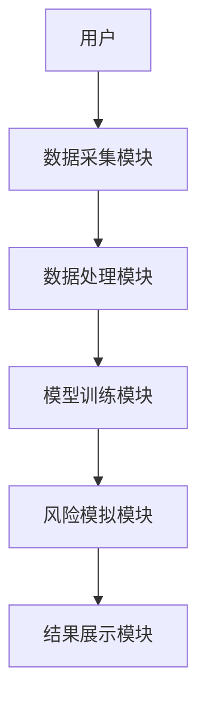

                 


# 开发智能化的企业信用风险传导模拟系统

> 关键词：信用风险，风险传导，智能化系统，机器学习，数据建模

> 摘要：本文详细探讨了开发智能化企业信用风险传导模拟系统的关键步骤，从理论基础到算法实现，再到系统架构设计和实际应用案例分析，全面解析了如何利用人工智能和大数据技术构建高效的风险评估与管理工具。

---

## 第一部分：企业信用风险传导模拟系统概述

### 第1章：企业信用风险的基本概念

#### 1.1 信用风险的定义与特征
信用风险是指在经济活动中，由于交易对手方未能履行其合同义务而可能导致的损失。这种风险广泛存在于金融、贸易和企业信贷等领域。其主要特征包括：
- **可测性**：可以通过数据分析和建模量化。
- **动态性**：受经济环境、企业经营状况等多种因素影响，具有动态变化的特点。
- **传导性**：风险可能从一个企业传导到整个产业链或金融市场。

#### 1.2 信用风险传导机制
信用风险的传导机制是指风险从一个源头（如某家企业）向其他相关方扩散的过程。常见的传导路径包括：
1. **直接传导**：通过供应链上下游企业直接传递。
2. **间接传导**：通过金融市场（如债券市场、股票市场）间接影响。
3. **系统性传导**：在金融体系中形成连锁反应，导致系统性风险。

#### 1.3 企业信用风险模拟系统的背景与重要性
随着全球经济一体化的加深，企业之间的关联性增强，单一企业的信用问题可能引发连锁反应。传统的信用风险评估方法依赖于经验判断和静态分析，难以应对复杂多变的市场环境。因此，开发智能化的信用风险传导模拟系统具有重要意义：
- 提高风险评估的准确性和效率。
- 帮助金融机构和企业提前识别潜在风险，制定应对策略。
- 通过模拟不同情景，优化风险管理方案。

---

## 第二部分：智能化信用风险模拟系统的理论基础

### 第2章：信用风险模拟的核心概念与联系

#### 2.1 核心概念解析
在开发信用风险模拟系统时，需要关注以下几个核心概念：
- **风险量化**：将信用风险转化为可量化的指标（如违约概率、损失程度）。
- **风险传导路径**：分析风险如何从一个企业传导到其他相关方。
- **数据建模**：利用机器学习和统计模型对风险进行预测和模拟。

#### 2.2 核心概念的ER实体关系图
为了更好地理解系统中的实体关系，我们可以通过ER图来展示：

```mermaid
erDiagram
    用户 --> 数据源 : 提供
    用户 --> 系统 : 使用
    数据源 --> 系统 : 传输
    系统 --> 用户 : 提供结果
    系统 --> 数据库 : 存储
    数据库 --> 系统 : 提供支持
```

该图展示了用户、数据源、系统和数据库之间的关系。用户通过数据源向系统提供数据，系统利用这些数据进行建模和模拟，并将结果反馈给用户，同时将数据存储在数据库中以备后续分析。

---

## 第三部分：算法原理与数学模型

### 第3章：信用风险模拟的算法原理

#### 3.1 算法选择与实现
在信用风险模拟中，常用的算法包括：
- **随机森林**：用于分类和回归，适合处理高维数据。
- **神经网络**：用于复杂非线性关系的建模。

以下是一个基于随机森林的信用风险评估算法的实现示例：

```python
import pandas as pd
from sklearn.ensemble import RandomForestClassifier
from sklearn.metrics import accuracy_score

# 加载数据
data = pd.read_csv('credit_data.csv')
X = data.drop('target', axis=1)
y = data['target']

# 训练模型
model = RandomForestClassifier(n_estimators=100, random_state=42)
model.fit(X, y)

# 预测
predictions = model.predict(X)
print("准确率:", accuracy_score(y, predictions))
```

#### 3.2 数学模型与公式
在信用风险模拟中，常用的数学模型包括线性回归和逻辑回归。以下是逻辑回归模型的公式：

$$
P(Y=1 | X) = \frac{e^{\beta_0 + \beta_1 X}}{1 + e^{\beta_0 + \beta_1 X}}
$$

其中：
- $Y$ 是目标变量（违约与否）。
- $X$ 是自变量（如企业财务指标）。
- $\beta_0$ 和 $\beta_1$ 是模型参数。

---

## 第四部分：系统分析与架构设计

### 第4章：信用风险模拟系统的架构设计

#### 4.1 系统功能设计
系统的主要功能模块包括：
1. **数据采集**：从多种数据源获取企业信息。
2. **数据处理**：清洗、转换和整合数据。
3. **模型训练**：基于机器学习算法构建风险评估模型。
4. **风险模拟**：模拟不同情景下的信用风险传导。
5. **结果展示**：以可视化形式呈现模拟结果。

#### 4.2 系统架构图
以下是系统的总体架构图：



---

## 第五部分：项目实战与应用案例

### 第5章：信用风险模拟系统的实现

#### 5.1 环境安装与配置
需要安装的主要工具和库包括：
- Python 3.8+
- Jupyter Notebook
- Pandas、Scikit-learn、XGBoost

#### 5.2 核心代码实现
以下是基于XGBoost的信用风险模拟代码：

```python
import xgboost as xgb

# 数据准备
dtrain = xgb.DMatrix(X_train, label=y_train)
dtest = xgb.DMatrix(X_test, label=y_test)

# 模型训练
params = {
    'n_estimators': 100,
    'learning_rate': 0.1,
    'max_depth': 6
}
model = xgb.XGBClassifier(**params)
model.fit(X_train, y_train)

# 模拟预测
y_pred = model.predict(X_test)
print("准确率:", accuracy_score(y_test, y_pred))
```

#### 5.3 案例分析
以某制造企业为例，通过模拟不同经济情景下的信用风险，分析其传导路径和影响程度。结果表明，智能化系统能够有效识别高风险企业，并提供相应的风险管理建议。

---

## 第六部分：总结与展望

### 第6章：开发智能化信用风险模拟系统的经验总结

#### 6.1 最佳实践
- 数据预处理是关键，需确保数据质量和完整性。
- 模型选择需结合业务需求和数据特征。
- 系统设计应注重可扩展性和灵活性。

#### 6.2 项目小结
本文详细探讨了开发智能化信用风险模拟系统的关键步骤，从理论基础到算法实现，再到系统架构设计和实际应用案例分析，全面解析了如何利用人工智能技术提升信用风险管理的效率和准确性。

#### 6.3 注意事项
- 数据隐私和安全问题需高度重视。
- 模型的实时更新和维护是确保系统准确性的关键。
- 需结合具体业务场景进行定制化开发。

#### 6.4 拓展阅读
建议深入学习以下内容：
- 时间序列分析在信用风险预测中的应用。
- 强化学习在风险决策中的应用。

---

以上是《开发智能化的企业信用风险传导模拟系统》的完整目录和内容概述，希望对您有所帮助！

