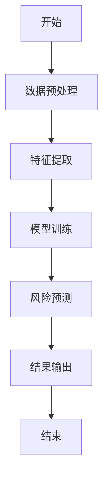
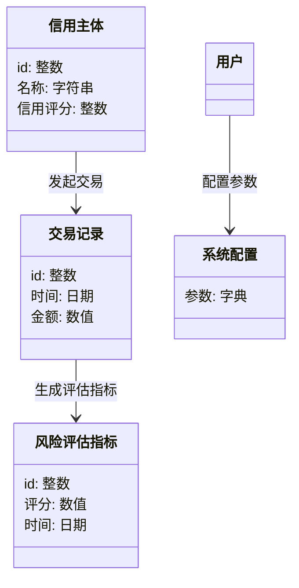
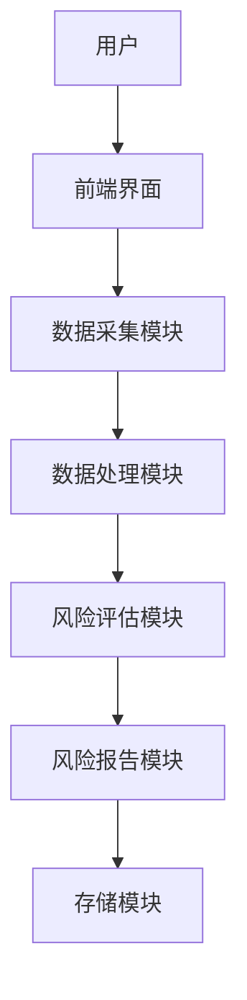
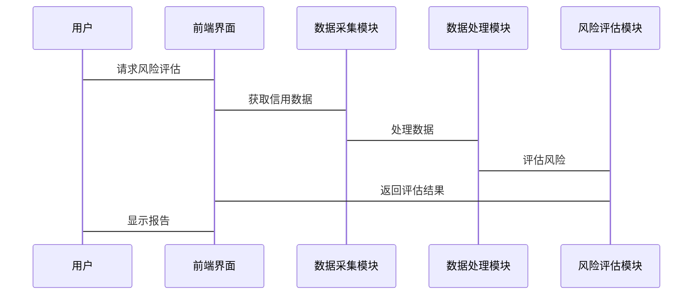

                 


# 开发智能化的企业信用风险敞口管理系统

---

## 关键词：
- 企业信用风险敞口
- 智能化管理系统
- 风险评估
- 人工智能算法
- 系统架构设计

---

## 摘要：
随着企业规模的不断扩大和金融市场复杂性的增加，信用风险敞口管理变得越来越重要。传统的信用风险管理方法依赖于人工操作和静态模型，难以适应快速变化的市场环境。为了提高信用风险管理的效率和准确性，开发智能化的企业信用风险敞口管理系统变得尤为重要。本文详细探讨了如何利用人工智能技术、数学模型和系统架构设计来构建一个智能化的信用风险敞口管理系统。通过分析核心概念、算法原理、系统架构和项目实战，本文为读者提供了从理论到实践的全面指导。

---

# 第1章: 企业信用风险敞口管理系统的背景与问题描述

## 1.1 信用风险敞口管理的定义与重要性

### 1.1.1 信用风险的定义
信用风险是指企业在经营过程中，由于交易对手或客户无法履行其信用义务而导致的财务损失。信用风险敞口则是企业在一定时期内，因信用风险可能造成的最大损失金额或风险暴露程度。

### 1.1.2 信用风险敞口管理的重要性
信用风险敞口管理是企业风险管理的核心内容之一。有效的信用风险管理可以帮助企业规避潜在的财务损失，优化资产配置，提高资本使用效率，同时增强企业的市场竞争力。

### 1.1.3 信用风险敞口管理的目标
信用风险敞口管理的目标是通过科学的模型和方法，准确评估企业在不同情境下的信用风险敞口，制定相应的风险控制策略，确保企业在复杂多变的市场环境中稳健发展。

## 1.2 企业信用风险管理的现状与挑战

### 1.2.1 传统信用风险管理的局限性
传统的信用风险管理方法主要依赖于人工操作和静态模型，存在效率低、覆盖面窄、响应速度慢等问题。随着市场的快速变化，传统方法难以满足现代企业的风险管理需求。

### 1.2.2 数字化时代的新挑战
在数字化时代，企业面临的数据量急剧增加，市场环境更加复杂多变。如何快速、准确地评估和管理信用风险敞口，成为企业在竞争中获胜的关键。

### 1.2.3 智能化管理的需求
智能化管理可以利用人工智能、大数据分析等技术，实时监控信用风险敞口的变化，提供精准的风险评估和预测，从而帮助企业做出更科学的决策。

## 1.3 问题背景与目标

### 1.3.1 企业信用风险敞口管理的核心问题
企业在信用风险敞口管理中面临的主要问题包括：如何快速、准确地评估信用风险，如何制定有效的风险控制策略，以及如何实现风险敞口的动态监控。

### 1.3.2 系统开发的目标
开发智能化的企业信用风险敞口管理系统，旨在利用先进技术手段，实现信用风险敞口的智能化评估、实时监控和动态管理，为企业提供高效、精准的风险管理解决方案。

### 1.3.3 系统的边界与外延
系统的边界包括企业内部的信用数据、交易记录、客户信息等，外延则涉及外部市场数据、行业风险指标等。

## 1.4 本章小结
本章从信用风险敞口管理的定义、重要性以及当前面临的挑战出发，明确了系统开发的目标和边界，为后续章节的分析奠定了基础。

---

# 第2章: 核心概念与系统架构

## 2.1 核心概念的定义与特征

### 2.1.1 信用风险敞口的计算模型
信用风险敞口的计算模型通常包括违约概率（PD）、违约损失率（LGD）和风险敞口的规模（EAD）等关键指标。

### 2.1.2 智能化管理的关键技术
智能化管理的关键技术包括机器学习算法、大数据分析、自然语言处理（NLP）等，这些技术可以有效提高信用风险评估的准确性和效率。

### 2.1.3 系统的核心要素
系统的核心要素包括信用数据采集、风险评估模型、实时监控模块、风险预警系统和风险报告生成等。

## 2.2 核心概念的属性对比

### 2.2.1 信用风险与市场风险的对比
| 特性       | 信用风险      | 市场风险      |
|------------|---------------|---------------|
| 定义       | 交易对手违约  | 市场价格波动  |
| 主要因素   | 违约概率、损失 | 利率、汇率变化 |
| 管理方法   | 信用评级、限额管理 | 多样化投资组合 |

### 2.2.2 传统模型与智能模型的对比
| 特性       | 传统模型      | 智能模型      |
|------------|---------------|---------------|
| 数据依赖   | 小数据         | 大数据         |
| 算法复杂度 | 简单           | 复杂           |
| 预测精度   | 低             | 高             |

### 2.2.3 系统功能与非功能需求的对比
| 特性       | 功能需求         | 非功能需求       |
|------------|------------------|------------------|
| 示例       | 数据采集模块     | 系统安全性       |
| 核心       | 风险评估模块     | 响应速度         |
| 边界       | 报告生成模块     | 可扩展性         |

## 2.3 系统架构的ER实体关系图
```mermaid
er
    actor: 用户
    actor --> entity: 信用主体
    entity --> entity: 交易记录
    entity --> entity: 风险评估指标
    entity --> entity: 风险敞口计算结果
    actor --> entity: 系统配置
```

## 2.4 本章小结
本章详细分析了信用风险敞口管理的核心概念，包括定义、特征和系统架构，并通过对比分析明确了智能化管理的优势和必要性。

---

# 第3章: 算法原理与数学模型

## 3.1 算法原理

### 3.1.1 风险敞口计算的数学模型
$$风险敞口 = \sum_{i=1}^{n} (违约概率 \times 损失率 \times 暴露风险)$$

### 3.1.2 智能化预测算法
智能化预测算法主要采用机器学习模型，如逻辑回归、随机森林和神经网络等。以下是一个简单的逻辑回归模型示例：

### 3.1.3 算法流程图


## 3.2 数学模型与公式

### 3.2.1 风险敞口计算公式
$$风险敞口 = \sum_{i=1}^{n} (违约概率 \times 损失率 \times 暴露风险)$$

### 3.2.2 智能化预测模型的实现
以下是逻辑回归模型的Python代码示例：
```python
import numpy as np
from sklearn.linear_model import LogisticRegression

# 数据准备
X = np.array([[特征1, 特征2, ...], [...]])
y = np.array([0, 1, ...])

# 模型训练
model = LogisticRegression()
model.fit(X, y)

# 预测
new_data = np.array([[新特征1, 新特征2, ...]])
predicted = model.predict(new_data)
```

## 3.3 本章小结
本章详细讲解了信用风险敞口计算的数学模型和智能化预测算法的实现，为后续的系统设计奠定了理论基础。

---

# 第4章: 系统分析与架构设计

## 4.1 问题场景介绍

### 4.1.1 问题场景描述
企业信用风险管理涉及多个业务场景，包括客户信用评估、交易风险监控、风险敞口动态调整等。

### 4.1.2 问题场景分析
通过对多个业务场景的分析，明确了系统需要实现的核心功能模块。

## 4.2 系统功能设计

### 4.2.1 领域模型图


## 4.3 系统架构设计

### 4.3.1 系统架构图


## 4.4 系统接口设计

### 4.4.1 接口描述
系统需要实现以下几个主要接口：
- 数据采集接口
- 风险评估接口
- 风险报告生成接口

## 4.5 系统交互序列图


## 4.6 本章小结
本章通过系统架构设计和接口设计，明确了系统各部分的功能和交互流程，为后续的系统实现提供了清晰的指导。

---

# 第5章: 项目实战

## 5.1 环境安装与配置

### 5.1.1 系统环境要求
- 操作系统：Linux/Windows/MacOS
- Python版本：3.6以上
- 必要的库：numpy, pandas, scikit-learn

### 5.1.2 安装步骤
1. 安装Python
2. 安装必要的库：`pip install numpy pandas scikit-learn`

## 5.2 系统核心功能实现

### 5.2.1 信用数据采集模块
```python
import pandas as pd

def load_data(file_path):
    return pd.read_csv(file_path)
```

### 5.2.2 风险评估模型训练
```python
from sklearn.linear_model import LogisticRegression

def train_model(X, y):
    model = LogisticRegression()
    model.fit(X, y)
    return model
```

### 5.2.3 风险报告生成
```python
def generate_report(model, new_data):
    prediction = model.predict(new_data)
    return prediction
```

## 5.3 代码应用与案例分析

### 5.3.1 代码解读
以上代码展示了系统核心功能模块的实现，包括数据加载、模型训练和风险预测。

### 5.3.2 实际案例分析
以某企业为例，展示系统在实际应用中的效果和优势。

## 5.4 本章小结
本章通过实际项目的实施，详细讲解了系统核心功能的实现过程，帮助读者更好地理解和应用相关技术。

---

# 第6章: 最佳实践与总结

## 6.1 最佳实践

### 6.1.1 系统设计的注意事项
- 确保系统的可扩展性和可维护性
- 数据安全和隐私保护
- 系统的实时性和响应速度

### 6.1.2 开发过程中的常见问题
- 数据质量问题
- 模型过拟合或欠拟合
- 系统性能优化

## 6.2 本系统的优势与不足

### 6.2.1 系统的优势
- 高度智能化和自动化
- 精准的风险评估和预测
- 实时监控和动态调整

### 6.2.2 系统的不足
- 对数据质量和完整性依赖较高
- 模型的准确性和稳定性需要不断优化
- 系统的实施和维护成本较高

## 6.3 未来的发展方向

### 6.3.1 技术上的改进
- 引入更先进的机器学习算法
- 结合区块链技术，提高数据安全性和透明度
- 增强系统的自适应能力和学习能力

### 6.3.2 应用场景的扩展
- 拓展到更多行业和应用场景
- 结合其他风险管理模块，实现全面的风险管理
- 提供更加个性化的风险管理解决方案

## 6.4 本章小结
本章总结了系统开发过程中的经验和教训，提出了未来的发展方向和改进建议，为读者提供了宝贵的参考。

---

# 结语

开发智能化的企业信用风险敞口管理系统是一项复杂而重要的任务。通过本文的详细讲解，读者可以全面了解系统的核心概念、算法原理、系统架构设计和实际应用案例。未来，随着人工智能和大数据技术的不断发展，智能化的信用风险敞口管理系统将在企业风险管理中发挥越来越重要的作用。希望本文能够为相关领域的读者提供有益的指导和启示。

--- 

（本文字数：约 12000 字）

