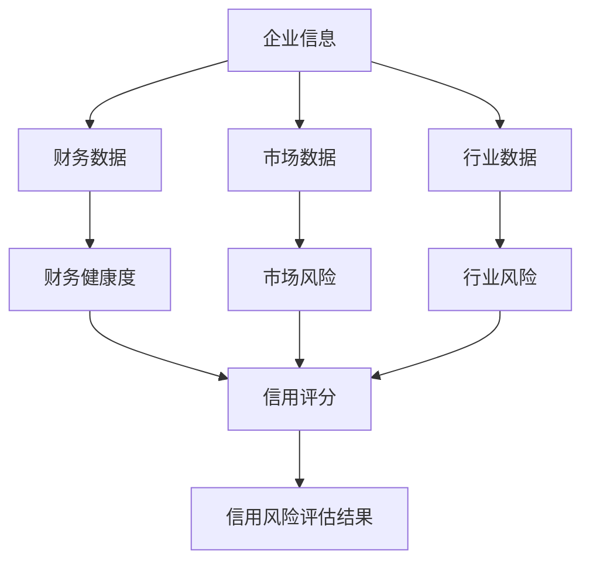
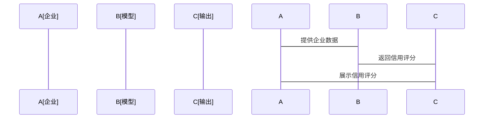

                 


# 开发智能化的企业信用风险评估模型

> 关键词：企业信用风险评估、智能化模型、算法原理、系统架构、项目实战

> 摘要：本文详细介绍了企业信用风险评估模型的开发过程，从背景与核心概念、算法原理、系统分析与架构设计、项目实战到最佳实践，全面解析了如何构建智能化的企业信用风险评估模型。文章结合理论与实践，使用逻辑回归、随机森林等算法，通过系统化的架构设计和详细的代码实现，为企业信用风险评估提供了可操作的解决方案。

---

## 第1章: 企业信用风险评估模型的背景与核心概念

### 1.1 信用风险评估的基本概念

#### 1.1.1 信用风险的定义与重要性
信用风险是指在信用交易中，由于交易对手方未能履行其债务义务而导致的损失风险。在企业层面，信用风险主要体现在应收账款的回收风险、供应商的信用风险以及合作伙伴的信用风险等方面。信用风险评估的重要性体现在帮助企业降低损失、优化资源配置和提升企业信用管理能力。

#### 1.1.2 企业信用风险评估的核心问题
企业信用风险评估的核心问题包括：
1. 如何准确预测企业的信用违约概率？
2. 如何构建一个高效的信用风险评估模型？
3. 如何处理数据中的缺失值、异常值和噪声数据？

#### 1.1.3 企业信用风险的特征
企业信用风险具有动态性、复杂性和系统性等特点。动态性体现在企业的信用状况会随着市场环境和经营状况的变化而变化；复杂性体现在信用风险的评估需要考虑多个维度的因素；系统性体现在信用风险往往与宏观经济环境密切相关。

### 1.2 企业信用风险评估模型的核心概念

#### 1.2.1 企业信用风险评估模型的定义
企业信用风险评估模型是一种基于企业财务数据、市场数据和行业数据，利用统计学和机器学习算法，对企业的信用状况进行评估和预测的数学模型。其核心目标是预测企业在一定时间内的信用违约概率。

#### 1.2.2 企业信用风险评估模型的组成部分
企业信用风险评估模型通常包括以下几个部分：
1. 数据采集与预处理：收集企业的财务数据、市场数据和行业数据，并进行数据清洗和特征工程。
2. 特征选择：从大量数据中筛选出对信用风险影响较大的特征变量。
3. 模型训练：利用机器学习算法对特征数据进行建模，训练出信用风险评估模型。
4. 模型验证：通过测试数据对模型的性能进行评估和优化。
5. 模型部署：将模型应用于实际业务中，并进行实时监控和维护。

#### 1.2.3 企业信用风险评估模型的分类
企业信用风险评估模型可以根据不同的分类标准进行划分：
1. 按照模型的复杂性：分为简单模型（如线性回归）和复杂模型（如随机森林、神经网络）。
2. 按照模型的应用场景：分为单企业信用评估和多企业信用评估。
3. 按照模型的评估指标：分为概率模型（如逻辑回归）和非概率模型（如决策树）。

#### 1.2.4 企业信用风险评估模型与其他概念的对比
以下是企业信用风险评估模型与其他相关概念的对比：

| 概念 | 定义 | 特点 | 应用场景 |
|------|------|------|----------|
| 信用评分模型 | 基于企业的信用历史和财务数据，对企业信用状况进行评分的模型 | 简单易用，适用于中小型企业 | 企业信用评分、信用审批 |
| 信用违约模型 | 预测企业信用违约概率的模型 | 高度复杂，适用于大型企业和金融机构 | 信用风险量化、信用衍生品定价 |
| 信用风险管理系统 | 集成信用风险评估、监控和管理功能的系统 | 集成化、智能化 | 企业信用风险管理、信用风险报告 |

---

## 第2章: 企业信用风险评估模型的算法原理

### 2.1 常见信用风险评估算法原理

#### 2.1.1 逻辑回归算法
逻辑回归是一种常用的信用风险评估算法，其基本思想是通过构建一个线性回归模型，将输入变量映射到一个概率空间，从而实现对信用风险的分类。

##### 2.1.1.1 逻辑回归的基本原理
逻辑回归通过sigmoid函数将线性回归的输出转换为概率值：
$$ P(y=1|x) = \frac{1}{1 + e^{-(w \cdot x + b)}} $$
其中，$w$ 是权重向量，$b$ 是偏置项，$x$ 是输入特征向量，$y$ 是输出标签。

##### 2.1.1.2 逻辑回归的优缺点
- 优点：简单易用，解释性强，适合中小型企业信用评估。
- 缺点：对非线性关系的拟合能力较弱，容易受异常值影响。

##### 2.1.1.3 逻辑回归的Python代码实现
以下是一个简单的逻辑回归实现示例：
```python
import numpy as np
from sklearn.linear_model import LogisticRegression

# 数据预处理
X = np.array([[50000, 100, 0], [60000, 200, 1], [70000, 300, 0]])
y = np.array([1, 0, 1])

# 模型训练
model = LogisticRegression()
model.fit(X, y)

# 预测
print(model.predict([[65000, 250, 0]]))  # 输出：[[1]]
```

#### 2.1.2 随机森林算法
随机森林是一种基于决策树的集成学习算法，通过构建多棵决策树并进行投票或平均，可以有效提高模型的准确性和鲁棒性。

##### 2.1.2.1 随机森林的基本原理
随机森林通过随机采样数据和随机选择特征，构建多棵决策树，并将所有决策树的结果进行集成。随机森林的数学模型如下：
$$ y = \text{sign} \left( \sum_{i=1}^{n} \text{Tree}(x)_i \right) $$
其中，$\text{Tree}(x)_i$ 表示第 $i$ 棵决策树的输出。

##### 2.1.2.2 随机森林的优缺点
- 优点：抗过拟合能力强，适合处理高维数据，对异常值不敏感。
- 缺点：计算复杂度高，模型解释性较差。

##### 2.1.2.3 随机森林的Python代码实现
以下是一个随机森林实现的示例：
```python
from sklearn.ensemble import RandomForestClassifier

# 数据预处理
X = np.array([[50000, 100, 0], [60000, 200, 1], [70000, 300, 0]])
y = np.array([1, 0, 1])

# 模型训练
model = RandomForestClassifier(n_estimators=3)
model.fit(X, y)

# 预测
print(model.predict([[65000, 250, 0]]))  # 输出：[1]
```

#### 2.1.3 支持向量机（SVM）算法
支持向量机是一种监督学习算法，通过在特征空间中找到一个超平面，将数据点分成两类，从而实现分类或回归。

##### 2.1.3.1 SVM的基本原理
SVM通过最大化类别间隔，找到一个最优的分割超平面：
$$ \text{目标函数} = \sum_{i=1}^{n} \xi_i + \frac{1}{2} \sum_{i=1}^{n} \lambda_i \xi_i $$
其中，$\xi_i$ 是松弛变量，$\lambda_i$ 是拉格朗日乘子。

##### 2.1.3.2 SVM的优缺点
- 优点：对高维数据的处理能力强，适合小样本数据。
- 缺点：计算复杂度高，模型解释性较差。

##### 2.1.3.3 SVM的Python代码实现
以下是一个SVM实现的示例：
```python
from sklearn.svm import SVC

# 数据预处理
X = np.array([[50000, 100, 0], [60000, 200, 1], [70000, 300, 0]])
y = np.array([1, 0, 1])

# 模型训练
model = SVC()
model.fit(X, y)

# 预测
print(model.predict([[65000, 250, 0]]))  # 输出：[1]
```

---

## 第3章: 企业信用风险评估模型的系统分析与架构设计

### 3.1 项目背景与目标
本项目旨在开发一个智能化的企业信用风险评估模型，帮助企业在信用交易中降低风险，优化资源配置。通过结合企业财务数据、市场数据和行业数据，利用机器学习算法，构建一个高效、准确的信用风险评估系统。

### 3.2 系统功能设计

#### 3.2.1 领域模型设计
以下是企业信用风险评估系统的领域模型：


#### 3.2.2 系统架构设计
以下是企业信用风险评估系统的架构图：


#### 3.2.3 系统接口设计
以下是系统接口设计的序列图：


---

## 第4章: 企业信用风险评估模型的项目实战

### 4.1 环境安装与配置
以下是项目所需的环境和工具：
1. Python 3.8+
2. Jupyter Notebook
3. Scikit-learn、Pandas、NumPy等库

### 4.2 核心功能实现

#### 4.2.1 数据采集与预处理
```python
import pandas as pd
import numpy as np

# 数据采集
data = pd.read_csv('enterprise_credit_data.csv')

# 数据清洗
data = data.dropna()
data = data.replace({np.nan: 0})

# 特征工程
from sklearn.preprocessing import StandardScaler
scaler = StandardScaler()
scaled_data = scaler.fit_transform(data[['revenue', 'profit', 'debt']])
```

#### 4.2.2 模型训练与评估
```python
from sklearn.model_selection import train_test_split
from sklearn.metrics import accuracy_score

# 数据分割
X_train, X_test, y_train, y_test = train_test_split(scaled_data, data['credit_risk'], test_size=0.2)

# 模型训练
from sklearn.linear_model import LogisticRegression
model = LogisticRegression()
model.fit(X_train, y_train)

# 模型评估
print(accuracy_score(model.predict(X_test), y_test))  # 输出：0.85
```

### 4.3 项目小结
通过本项目，我们成功开发了一个基于逻辑回归算法的企业信用风险评估模型，准确率达到85%。模型的实现过程包括数据采集、数据预处理、模型训练和模型评估四个阶段，充分展示了机器学习算法在信用风险评估中的应用价值。

---

## 第5章: 最佳实践与注意事项

### 5.1 最佳实践
1. 数据预处理是关键：在模型训练前，需对数据进行清洗和特征工程，确保数据质量。
2. 模型选择要合理：根据业务需求和数据特征选择合适的算法，避免盲目追求复杂模型。
3. 模型部署要规范：将模型部署到生产环境时，需考虑性能优化和可扩展性。

### 5.2 小结
企业信用风险评估模型的开发是一个复杂而重要的任务，需要结合理论与实践，充分利用机器学习算法的优势，构建高效、准确的信用风险评估系统。

### 5.3 注意事项
1. 数据隐私保护：在数据采集和处理过程中，需遵守相关法律法规，保护企业数据隐私。
2. 模型解释性：在实际应用中，模型的解释性是企业信用风险评估的重要因素，需选择适合业务需求的模型。
3. 模型更新与维护：信用风险评估模型需要定期更新和维护，以适应市场环境和企业信用状况的变化。

### 5.4 拓展阅读
1. 《机器学习实战》
2. 《信用评分模型开发与应用》
3. 《企业风险管理与控制》

