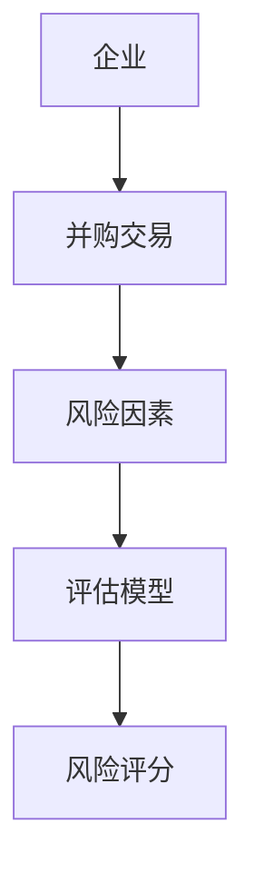
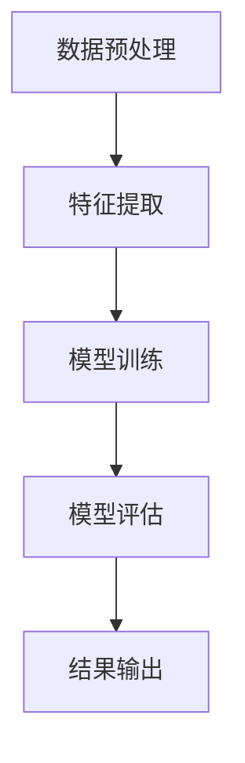
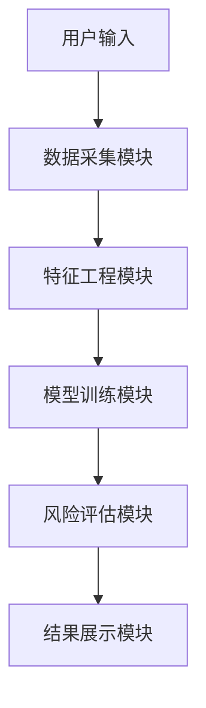
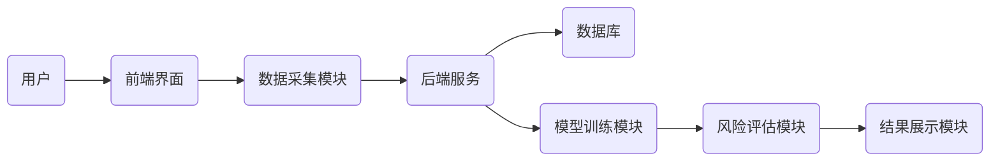

                 


# 开发智能化的企业并购风险评估模型

**关键词**: 企业并购、风险评估、人工智能、机器学习、金融分析

**摘要**: 本文系统地介绍如何开发一个智能化的企业并购风险评估模型。通过分析企业并购中的关键风险因素，结合机器学习算法，构建一个高效的预测模型，并提供实际案例和系统设计，帮助读者掌握模型的开发与应用。

---

## 第一部分: 企业并购风险评估模型的背景与核心概念

### 第1章: 企业并购风险评估模型的背景介绍

#### 1.1 问题背景

##### 1.1.1 企业并购的基本概念
企业并购是指一家企业通过购买另一家企业的股权或资产，以实现战略整合和扩张的过程。并购不仅是企业发展的关键策略，也是高风险的商业行为。

##### 1.1.2 并购风险的主要类型
- **市场风险**: 行业竞争加剧、市场需求变化等。
- **财务风险**: 负债过高、现金流断裂等。
- **整合风险**: 企业文化冲突、管理不善等。
- **法律风险**: 法律纠纷、合规性问题等。

##### 1.1.3 当前并购风险管理的痛点
- 数据分散，难以整合。
- 风险评估依赖经验，缺乏量化方法。
- 传统模型计算复杂，难以实时应用。

#### 1.2 问题定义与描述

##### 1.2.1 并购风险评估的定义
并购风险评估是通过分析并购交易中的各种风险因素，预测并购可能带来的负面影响，并制定相应的风险管理策略。

##### 1.2.2 并购风险评估的关键要素
- **交易数据**: 并购金额、交易时间等。
- **财务数据**: 被并购企业的财务状况。
- **市场数据**: 行业趋势、市场波动等。
- **法律数据**: 法律纠纷、合规性等。

##### 1.2.3 问题的边界与外延
- 仅考虑企业并购的直接风险，不包括间接风险。
- 评估模型适用于中大型企业，不适用于小微企业。

#### 1.3 问题解决的思路与目标

##### 1.3.1 智能化评估的核心目标
- 提供实时、准确的风险评估。
- 帮助企业在并购决策中降低风险。

##### 1.3.2 智能化评估的主要思路
- 数据驱动：利用机器学习算法处理海量数据。
- 模型优化：通过不断训练模型提高准确率。
- 可视化：将评估结果以直观形式展示。

##### 1.3.3 问题解决的边界
- 数据范围：仅限于公开的财务和市场数据。
- 使用场景：主要用于企业内部决策，不用于外部投资。

#### 1.4 本章小结

---

### 第2章: 并购风险评估模型的核心概念与联系

#### 2.1 核心概念原理

##### 2.1.1 并购风险的多维度分析
- **财务维度**: 利润率、资产负债率等。
- **市场维度**: 市场增长率、竞争强度等。
- **管理维度**: 高管团队稳定性、管理效率等。

##### 2.1.2 数据驱动的风险评估方法
- **数据清洗**: 去除无效数据，填补缺失值。
- **特征提取**: 从数据中提取有意义的特征。
- **模型训练**: 使用机器学习算法训练模型。

##### 2.1.3 智能化模型的构建逻辑
1. 收集数据。
2. 数据预处理。
3. 特征工程。
4. 模型训练。
5. 模型评估。
6. 模型部署。

#### 2.2 核心概念属性特征对比

##### 2.2.1 并购风险的特征分析
| 特征 | 描述 |
|------|------|
| 财务杠杆 | 负债率高，风险大 |
| 市场竞争 | 行业竞争激烈，风险高 |
| 管理稳定性 | 高管频繁变动，风险大 |

##### 2.2.2 数据特征的分类与对比
- **定量特征**: 财务指标、市场指标。
- **定性特征**: 企业文化、管理风格。

##### 2.2.3 模型性能的评估指标
- 准确率（Accuracy）。
- 召回率（Recall）。
- F1分数（F1 Score）。

#### 2.3 实体关系图



---

## 第三部分: 并购风险评估模型的算法原理

### 第3章: 并购风险评估模型的算法原理

#### 3.1 算法原理概述

##### 3.1.1 机器学习在并购风险评估中的应用
- **监督学习**: 分类问题，如随机森林、XGBoost。
- **无监督学习**: 聚类问题，如K-means。

##### 3.1.2 常见算法的适用场景
- **随机森林**: 适用于特征较多的场景。
- **XGBoost**: 适用于需要高精度的场景。

##### 3.1.3 算法选择的依据
- 数据量大小。
- 数据特征类型。
- 模型复杂度要求。

#### 3.2 算法流程图

##### 3.2.1 算法流程图


##### 3.2.2 算法实现代码
```python
import pandas as pd
from sklearn.ensemble import RandomForestClassifier
from sklearn.metrics import accuracy_score

# 数据预处理
data = pd.read_csv('并购数据.csv')
X = data.drop('风险评分', axis=1)
y = data['风险评分']

# 特征提取
features = X.columns

# 模型训练
model = RandomForestClassifier()
model.fit(X, y)

# 模型评估
y_pred = model.predict(X)
print("准确率:", accuracy_score(y, y_pred))
```

##### 3.2.3 数学模型
- 随机森林的投票机制：
  $$ \text{预测结果} = \text{多数投票} $$
- XGBoost的损失函数：
  $$ \text{损失} = \sum_{i=1}^{n} (y_i - \hat{y}_i)^2 $$

---

## 第四部分: 系统分析与架构设计方案

### 第4章: 并购风险评估系统的架构设计

#### 4.1 系统功能设计

##### 4.1.1 系统功能模块
- 数据采集模块：收集企业并购数据。
- 特征工程模块：处理数据特征。
- 模型训练模块：训练风险评估模型。
- 风险评估模块：输出风险评分。
- 结果展示模块：可视化评估结果。

##### 4.1.2 系统功能流程图


#### 4.2 系统架构设计

##### 4.2.1 系统架构图


#### 4.3 系统接口设计

##### 4.3.1 系统接口
- 数据接口：REST API，用于数据上传和查询。
- 模型接口：API，用于调用模型进行评估。

#### 4.4 系统交互流程图

##### 4.4.1 交互流程图


---

## 第五部分: 项目实战

### 第5章: 并购风险评估系统的项目实战

#### 5.1 项目环境安装

##### 5.1.1 安装Python
```bash
python --version
pip install --upgrade pip
```

##### 5.1.2 安装机器学习库
```bash
pip install scikit-learn
pip install xgboost
pip install pandas
```

#### 5.2 核心代码实现

##### 5.2.1 数据处理代码
```python
import pandas as pd

data = pd.read_csv('并购数据.csv')
data.head()
```

##### 5.2.2 特征工程代码
```python
from sklearn.preprocessing import StandardScaler

scaler = StandardScaler()
X_scaled = scaler.fit_transform(X)
```

##### 5.2.3 模型训练代码
```python
from xgboost import XGBClassifier

model = XGBClassifier()
model.fit(X_scaled, y)
```

##### 5.2.4 模型评估代码
```python
from sklearn.metrics import classification_report

y_pred = model.predict(X_scaled)
print(classification_report(y, y_pred))
```

#### 5.3 实际案例分析

##### 5.3.1 案例背景
分析某科技公司并购一家软件公司，评估其风险。

##### 5.3.2 数据特征提取
- 被并购公司：软件公司。
- 财务数据：收入增长率、利润率。
- 市场数据：行业增长率、竞争情况。

##### 5.3.3 风险评估结果
模型预测结果为中高风险，建议谨慎决策。

#### 5.4 项目小结

---

## 第六部分: 最佳实践与小结

### 第6章: 开发智能化企业并购风险评估模型的最佳实践

#### 6.1 项目经验总结

##### 6.1.1 数据质量的重要性
确保数据准确、完整，避免偏差。

##### 6.1.2 模型调优技巧
- 参数优化。
- 特征选择。
- 模型融合。

#### 6.2 项目注意事项

##### 6.2.1 数据隐私问题
遵守相关法律法规，保护数据隐私。

##### 6.2.2 模型解释性
选择可解释性较强的模型，便于分析结果。

#### 6.3 拓展阅读

##### 6.3.1 推荐书籍
- 《Python机器学习实战》。
- 《金融风险管理》。

##### 6.3.2 推荐课程
- Coursera: 《机器学习专项课程》。
- edX: 《金融数据分析》。

#### 6.4 项目小结

---

**附录: 全部代码和数据集下载链接**

