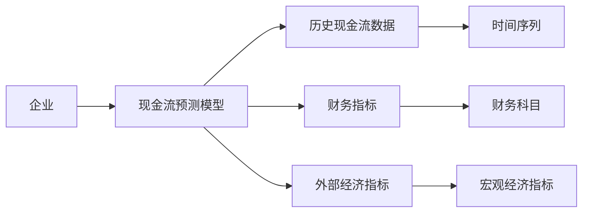
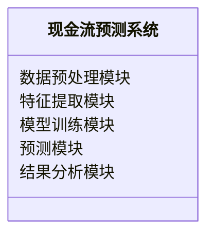
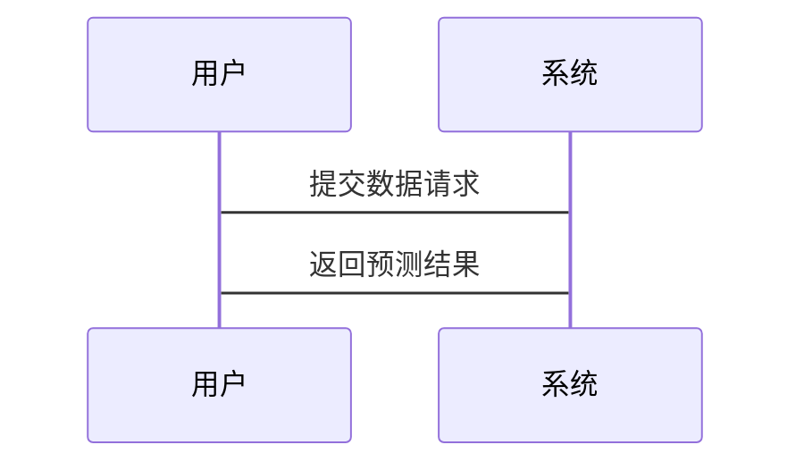

                 


# 开发智能化的企业现金流预测模型

## 关键词
企业现金流预测、人工智能、机器学习、时间序列分析、深度学习、财务预测

## 摘要
现金流预测是企业财务管理中的核心任务，智能化预测模型通过结合机器学习和时间序列分析，能够显著提高预测的准确性和效率。本文详细探讨了现金流预测模型的开发过程，从背景介绍、核心概念、算法原理、系统架构设计到项目实战，为读者提供全面的指导。通过实际案例分析和代码示例，帮助读者理解如何构建高效的现金流预测模型。

---

# 第一部分: 企业现金流预测模型的背景与核心概念

## 第1章: 企业现金流预测的背景与问题描述

### 1.1 企业现金流预测的重要性
#### 1.1.1 现金流预测的定义与作用
现金流预测是通过对历史数据和相关因素的分析，预测未来一定时期内企业的现金流状况。它是企业财务管理和投资决策的重要依据。

#### 1.1.2 现金流预测在企业经营中的地位
现金流是企业的生命线，现金流预测能够帮助企业在资金调度、投资决策等方面做出更明智的选择。

#### 1.1.3 智能化预测的优势与必要性
传统的现金流预测方法依赖于人工经验和简单统计模型，存在局限性。智能化预测通过机器学习和大数据分析，能够捕捉复杂的数据特征，提高预测的准确性和实时性。

### 1.2 现金流预测的核心问题
#### 1.2.1 现金流预测的主要挑战
现金流预测涉及多个变量，数据噪声大，且受到外部经济环境的影响，预测难度较高。

#### 1.2.2 数据驱动与模型驱动的结合
智能化预测需要结合数据驱动的方法和模型驱动的方法，充分利用数据特征和业务逻辑。

#### 1.2.3 智能化预测的边界与外延
现金流预测需要明确预测的范围和边界，避免过度预测或忽略重要因素。

### 1.3 企业现金流预测的流程与方法
#### 1.3.1 传统预测方法概述
包括简单线性回归、移动平均法等方法，这些方法在数据特征单一的情况下表现较好。

#### 1.3.2 数据驱动预测的流程
数据预处理、特征提取、模型训练、结果评估和优化。

#### 1.3.3 智能化预测的实现路径
通过机器学习和深度学习算法，构建复杂模型，实现对现金流的精准预测。

## 第2章: 企业现金流预测的核心概念与联系

### 2.1 现金流预测模型的核心要素
#### 2.1.1 数据来源与特征
包括历史现金流数据、财务指标、外部经济指标等。

#### 2.1.2 模型输入与输出
模型输入包括时间序列数据、相关特征变量，输出为预测的现金流值。

#### 2.1.3 评价指标与标准
常用的评价指标包括均方误差（MSE）、平均绝对误差（MAE）和R²系数。

### 2.2 现金流预测模型的属性特征对比
| 模型类型       | 数据类型   | 时间依赖性 | 预测精度 |
|----------------|------------|------------|----------|
| 线性回归       | 数值型     | 弱         | 一般     |
| 随机森林       | 数值型/分类型 | 中等       | 较高     |
| LSTM           | 时间序列   | 强         | 高       |
| ARIMA          | 时间序列   | 强         | 中等     |

### 2.3 企业现金流预测模型的ER实体关系图


---

# 第二部分: 现金流预测模型的算法原理

## 第3章: 现金流预测的算法原理

### 3.1 时间序列预测算法
#### 3.1.1 ARIMA模型原理
ARIMA（自回归积分滑动平均模型）适用于线性时间序列数据，通过捕捉数据的自相关性进行预测。

数学模型：
$$ ARIMA(p, d, q) $$
其中，p为自回归阶数，d为差分阶数，q为滑动平均阶数。

步骤：
1. 数据预处理：检查数据的平稳性，必要时进行差分。
2. 模型参数选择：通过AIC准则选择最佳参数。
3. 模型训练与验证。
4. 预测与误差分析。

#### 3.1.2 LSTM模型原理
LSTM（长短期记忆网络）适用于非线性时间序列数据，能够捕捉长期依赖关系。

网络结构：
$$ LSTM层 \rightarrow 全连接层 \rightarrow 输出层 $$

步骤：
1. 数据预处理：归一化处理。
2. 构建LSTM模型。
3. 模型训练与调优。
4. 预测与结果分析。

### 3.2 机器学习算法
#### 3.2.1 线性回归模型
$$ y = \beta_0 + \beta_1x + \epsilon $$
适用于线性关系的现金流预测。

#### 3.2.2 随机森林模型
通过集成多个决策树模型，提高预测的准确性和鲁棒性。

---

## 第4章: 现金流预测模型的系统架构设计

### 4.1 系统功能设计


### 4.2 系统架构设计


### 4.3 系统接口设计
API接口：
- 数据接口：接收历史数据和特征数据。
- 预测接口：返回预测结果和置信区间。

### 4.4 系统交互设计


---

## 第5章: 现金流预测模型的项目实战

### 5.1 项目环境与工具安装
- Python 3.8+
- 数据处理：Pandas、NumPy
- 模型训练：Scikit-learn、Keras
- 可视化：Matplotlib、Seaborn

### 5.2 系统核心实现源代码
```python
# ARIMA模型实现
from statsmodels.tsa.arima.model import ARIMA
import pandas as pd

# 数据加载与预处理
data = pd.read_csv('cash_flow.csv')
data.index = pd.to_datetime(data['date'])

# 模型训练
model = ARIMA(data['cash_flow'], order=(5, 1, 0))
model_fit = model.fit()

# 预测
forecast = model_fit.forecast(steps=10)
```

```python
# LSTM模型实现
from keras.models import Sequential
from keras.layers import LSTM, Dense

# 数据预处理
data_train = ... # 训练数据
data_test = ... # 测试数据

# 模型构建
model = Sequential()
model.add(LSTM(50, input_shape=(timesteps, features)))
model.add(Dense(1))
model.compile(optimizer='adam', loss='mean_squared_error')

# 训练
model.fit(data_train, epochs=50, batch_size=32)
```

### 5.3 实际案例分析
以某制造企业为例，分析如何通过模型预测未来现金流，并优化企业资金管理策略。

### 5.4 代码应用解读与分析
详细解释代码实现，分析模型的优缺点，讨论如何优化模型性能。

---

## 第6章: 总结与最佳实践

### 6.1 总结
现金流预测模型的开发需要结合业务需求和技术实现，通过不断优化模型和数据处理流程，提高预测的准确性和实用性。

### 6.2 最佳实践 tips
- 数据预处理是关键，需注意异常值和缺失值的处理。
- 选择合适的模型，结合业务场景进行调整。
- 模型部署后需持续监控和优化。

### 6.3 小结
现金流预测模型是企业财务管理的重要工具，智能化预测能够显著提升企业的经营效率和决策能力。

### 6.4 注意事项
- 数据质量和完整性直接影响模型性能。
- 模型调参需结合业务需求和数据特征。
- 持续监控模型性能，及时更新和优化。

### 6.5 拓展阅读
推荐相关书籍和论文，帮助读者深入学习现金流预测和机器学习技术。

--- 

以上是《开发智能化的企业现金流预测模型》的完整目录大纲，按照逻辑顺序详细介绍了从背景到实践的全过程，内容丰富且结构清晰。

