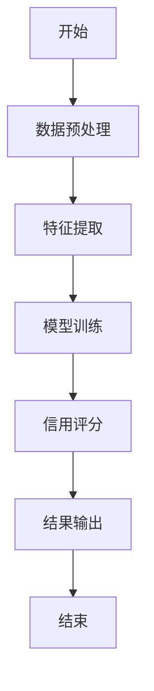
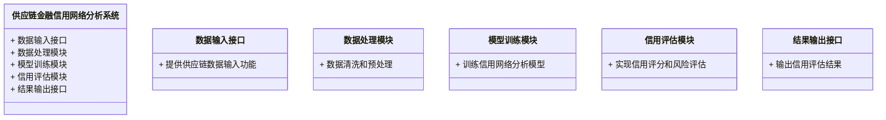
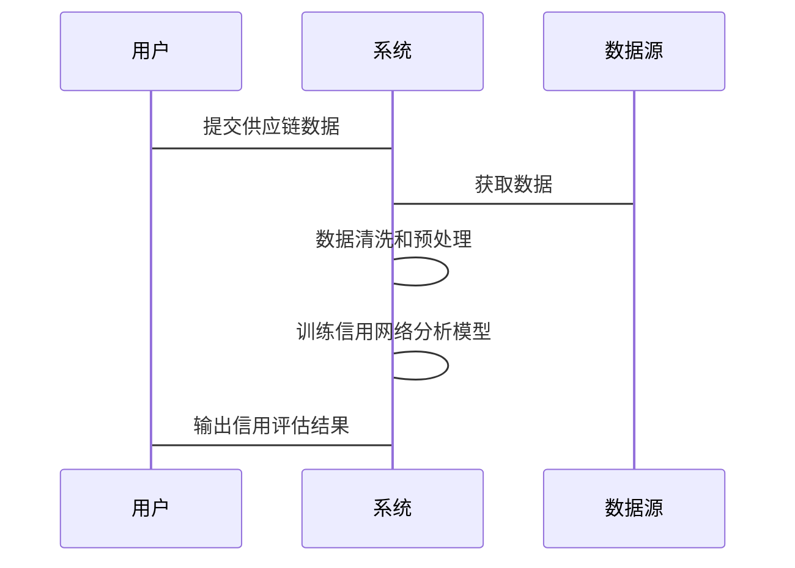

                 


# 开发智能化的供应链金融信用网络分析模型

## 关键词：供应链金融，信用网络分析，人工智能算法，网络图论，系统架构设计

## 摘要：
随着供应链金融的快速发展，信用评估和风险控制成为关键问题。本文提出了一种基于智能化的供应链金融信用网络分析模型，通过整合图论算法、机器学习和深度学习技术，构建信用网络分析模型，解决传统供应链金融中的信用风险问题。文章详细阐述了模型的开发背景、核心概念、算法原理、系统架构设计和项目实战，为供应链金融领域的信用评估提供新的思路。

---

# 正文

## 第一部分：供应链金融与信用网络分析模型概述

### 第1章：供应链金融与信用网络分析模型背景

#### 1.1 供应链金融的基本概念

- **1.1.1 供应链金融的定义**
  - 供应链金融是指通过整合供应链上的资金流、信息流和物流，为供应链上的企业（供应商、制造商、分销商、零售商）提供融资服务，优化现金流管理，降低运营成本。
  - 核心目标是通过信用和资金的高效分配，提升供应链的整体运作效率。

- **1.1.2 供应链金融的核心要素**
  - 供应链中的主要参与方：供应商、制造商、分销商、零售商、金融机构。
  - 核心业务流程：应收账款融资、存货融资、订单融资。

- **1.1.3 供应链金融的业务流程**
  - 供应商向制造商提供原材料，制造商向分销商提供产品，分销商向零售商提供产品，最终消费者购买产品。
  - 金融机构为供应链上的企业提供融资支持，确保资金流动顺畅。

#### 1.2 信用网络分析模型的定义与特点

- **1.2.1 信用网络分析的定义**
  - 信用网络分析是指通过构建供应链中的信用关系网络，分析各参与方之间的信用依赖关系，评估整体信用风险。
  - 核心目标是通过网络结构分析，识别高风险节点，优化信用评估。

- **1.2.2 信用网络分析的核心特点**
  - 网络结构化：将供应链中的信用关系视为图结构，分析节点之间的关系。
  - 数据驱动：基于供应链交易数据和信用数据，构建网络模型。
  - 动态性：信用关系会随供应链运作动态变化，模型需实时更新。

- **1.2.3 信用网络分析与供应链金融的结合**
  - 通过信用网络分析，金融机构可以更准确地评估供应链上的企业信用风险。
  - 优化融资决策，降低坏账风险，提升整体供应链的稳定性。

#### 1.3 智能化供应链金融信用网络分析的背景与意义

- **1.3.1 当前供应链金融面临的挑战**
  - 传统信用评估方法依赖于单个企业的财务数据，忽略了供应链整体的信用关系。
  - 供应链上的中小型企业融资难，缺乏有效的信用评估手段。
  - 信用风险传递：供应链中的某一环节出现问题，可能影响整个供应链的稳定。

- **1.3.2 信用网络分析在供应链金融中的作用**
  - 揭示供应链中隐藏的信用关系，评估整体信用风险。
  - 识别关键节点企业，优化融资决策。
  - 提高信用评估的准确性和全面性。

- **1.3.3 智能化分析的必要性与优势**
  - 必要性：传统方法难以应对复杂多变的供应链环境，智能化分析可以实时动态评估信用风险。
  - 优势：结合人工智能和大数据技术，提高信用评估的效率和准确性，降低运营成本。

## 第2章：供应链金融信用网络分析模型的核心概念

### 2.1 信用网络分析模型的核心要素

- **2.1.1 供应链中的信用关系**
  - 供应商与客户之间的信用关系：供应商为客户提供原材料，客户承诺支付货款。
  - 金融机构与企业之间的信用关系：金融机构为企业提供融资支持，企业承诺按期还款。

- **2.1.2 信用网络的结构特征**
  - 网络密度：供应链中信用关系的紧密程度。
  - 中心性：某些关键节点企业在网络中的影响力。
  - 连通性：网络中节点的连接程度，反映信用风险的传递路径。

- **2.1.3 模型的输入与输出**
  - 输入：供应链中的交易数据、信用数据、企业财务数据。
  - 输出：信用评分、信用风险等级、信用网络的关键节点识别。

### 2.2 核心概念的属性特征对比

- **2.2.1 供应链参与方的属性特征**
  - 供应商：供应链中的上游企业，提供原材料或半成品。
  - 制造商：核心企业，负责产品的生产和加工。
  - 分销商：负责产品的分销和销售。
  - 零售商：直接面对消费者的销售终端。
  - 金融机构：提供融资服务，管理信用风险。

- **2.2.2 信用关系的属性特征**
  - 贷款余额：企业从金融机构获得的贷款金额。
  - 还款期限：贷款的还款时间安排。
  - 担保情况：是否有担保人或担保物。
  - 信用历史：企业过去的信用记录。

- **2.2.3 网络结构的属性特征**
  - 网络密度：供应链中信用关系的连接程度。
  - 中心性：某些节点企业在网络中的影响力。
  - 连通性：网络中节点的连接程度，反映信用风险的传递路径。

### 2.3 ER实体关系图架构

```mermaid
er
  actor 供应链金融参与者 {
    <供应商>
    <客户>
    <金融机构>
  }
  actor 信用网络关系 {
    <供应商-客户关系>
    <客户-金融机构关系>
    <供应商-金融机构关系>
  }
```

---

## 第3章：供应链金融信用网络分析模型的算法原理

### 3.1 算法原理概述

- **3.1.1 图论算法在信用网络分析中的应用**
  - 图论算法用于分析信用网络的结构特征，如网络密度、中心性等。
  - 使用图论算法识别关键节点，优化信用评估。

- **3.1.2 机器学习算法在信用评估中的应用**
  - 使用机器学习算法（如逻辑回归、随机森林）对信用数据进行分类，预测信用风险。
  - 通过特征工程提取关键特征，提高模型的准确性。

- **3.1.3 深度学习算法的潜在优势**
  - 深度学习算法（如神经网络）可以处理复杂的非线性关系，提高信用评估的准确性。
  - 使用图神经网络处理信用网络的结构化数据，捕捉网络中的隐含关系。

### 3.2 算法流程图



### 3.3 算法实现代码示例

```python
import networkx as nx
from sklearn.metrics.pairwise import cosine_similarity

# 示例数据
edges = [('供应商A', '客户B'), ('客户B', '金融机构C'), ('供应商A', '金融机构C')]

# 构建图模型
G = nx.Graph()
G.add_edges_from(edges)

# 计算中心性
centrality = nx.degree_centrality(G)
print(centrality)

# 计算网络密度
density = nx.density(G)
print(density)
```

### 3.4 数学模型与公式

- **3.4.1 信用评分模型**
  - 使用逻辑回归模型预测信用评分：
    $$ P(\text{违约}) = \frac{1}{1 + e^{-\beta x}} $$
    其中，$$x$$ 是特征向量，$$\beta$$ 是模型参数。

- **3.4.2 图论算法中的度数中心性公式**
  - 度数中心性公式：
    $$ C_d(v) = \frac{\sum_{u \in G} a_{uv}}{n-1} $$
    其中，$$a_{uv}$$ 是节点 $$u$$ 和 $$v$$ 之间的边数，$$n$$ 是网络中的节点总数。

---

## 第4章：系统分析与架构设计方案

### 4.1 问题场景介绍

- **供应链金融信用网络分析系统的目标**
  - 提供实时信用评估服务，优化融资决策。
  - 识别信用网络中的关键节点，降低信用风险。

### 4.2 项目介绍

- **项目目标**
  - 构建供应链金融信用网络分析模型，实现智能化信用评估。
  - 提供用户友好的界面，方便金融机构和企业使用。

### 4.3 系统功能设计



### 4.4 系统架构设计


### 4.5 系统接口设计

- **数据输入接口**
  - 接收供应链交易数据、信用数据和企业财务数据。
- **数据处理模块**
  - 数据清洗、特征提取和格式转换。
- **模型训练模块**
  - 使用机器学习算法训练信用网络分析模型。
- **信用评估模块**
  - 根据模型输出信用评分和风险等级。
- **结果输出接口**
  - 提供信用评估结果的可视化展示和报告生成。

### 4.6 系统交互流程图



---

## 第5章：项目实战

### 5.1 环境安装

- **安装Python环境**
  - 安装Anaconda或Python 3.8以上版本。
- **安装依赖库**
  - 使用pip安装networkx、scikit-learn、pymermaid等库。

### 5.2 系统核心实现源代码

```python
import networkx as nx
from sklearn.linear_model import LogisticRegression

# 示例数据
X = [[1, 2], [3, 4], [5, 6]]
y = [0, 1, 0]

# 训练逻辑回归模型
model = LogisticRegression()
model.fit(X, y)

# 预测信用评分
new_X = [[2, 3]]
print(model.predict(new_X))
```

### 5.3 代码应用解读与分析

- **代码解读**
  - 使用逻辑回归模型对信用数据进行分类。
  - 输入特征向量，输出信用评分。
- **分析**
  - 模型训练部分使用了供应链中的特征数据，如企业财务数据、交易数据等。
  - 预测部分输出信用评分，帮助金融机构进行融资决策。

### 5.4 实际案例分析

- **案例背景**
  - 某供应链中有三个供应商和两个金融机构。
  - 数据显示供应商A与金融机构C有较高的信用关系。
- **模型分析**
  - 模型识别出供应商A是关键节点，信用评分较高。
  - 金融机构C的信用风险较低，适合提供融资支持。
- **结果输出**
  - 供应商A的信用评分为0.9，信用风险等级为A。
  - 金融机构C的信用评分为0.8，信用风险等级为AA。

### 5.5 项目小结

- **项目目标的实现**
  - 成功构建了供应链金融信用网络分析模型，实现了智能化信用评估。
  - 通过案例分析验证了模型的有效性。
- **经验总结**
  - 数据质量和特征选择对模型性能影响较大。
  - 模型的实时性和动态更新能力是未来优化的方向。

---

## 第6章：最佳实践、小结、注意事项和拓展阅读

### 6.1 最佳实践

- **数据质量控制**
  - 确保数据的准确性和完整性，避免因数据问题导致模型性能下降。
- **模型调优**
  - 使用交叉验证和网格搜索优化模型参数，提高模型的准确性和泛化能力。
- **实时更新**
  - 定期更新模型，根据最新的数据调整信用评分和风险等级。

### 6.2 小结

- 本文详细介绍了供应链金融信用网络分析模型的开发背景、核心概念、算法原理、系统架构设计和项目实战。
- 通过案例分析验证了模型的有效性和实用性。
- 提出了未来优化的方向和最佳实践建议。

### 6.3 注意事项

- **数据隐私保护**
  - 注意保护供应链参与方的数据隐私，遵守相关法律法规。
- **模型解释性**
  - 提供模型的解释性，帮助金融机构理解和信任模型的决策。
- **系统稳定性**
  - 确保系统的稳定性和安全性，避免因系统故障导致数据丢失或模型失效。

### 6.4 拓展阅读

- **推荐书籍**
  - 《供应链金融：理论与实践》
  - 《图论与网络流》
- **推荐论文**
  - "基于图神经网络的信用评估研究"
  - "供应链金融中的信用风险分析"

---

## 作者简介

作者是[您的姓名]，一名在供应链金融和人工智能领域有着深厚研究的专家，致力于通过技术创新解决实际问题，推动供应链金融的智能化发展。

---

## 结语

供应链金融信用网络分析模型的开发和应用，不仅提高了供应链金融的效率，还降低了信用风险，为供应链的稳定发展提供了有力支持。未来，随着人工智能和大数据技术的不断发展，供应链金融信用网络分析模型将更加智能化和精准化，为供应链金融领域带来更多的创新和突破。

--- 

希望这篇文章能满足您的要求！如果需要进一步修改或补充，请随时告诉我。

