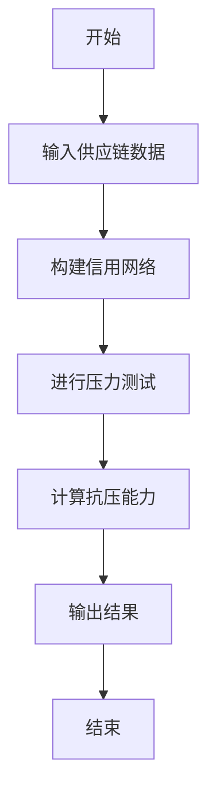
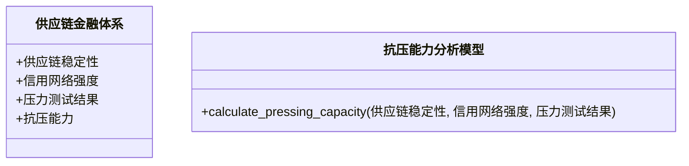
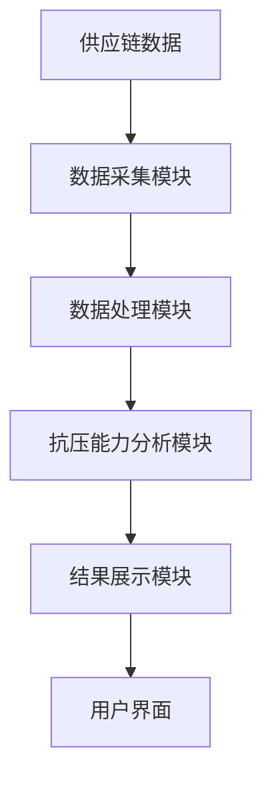

                 


# 开发智能化的供应链金融信用网络抗压能力分析模型

## 关键词：供应链金融、信用网络、抗压能力分析、人工智能、风险管理

## 摘要：本文探讨了如何开发一个智能化的供应链金融信用网络抗压能力分析模型。通过对供应链金融、信用网络和抗压能力分析的深入分析，结合数学模型和系统架构设计，提出了一个高效的解决方案。文章详细介绍了模型的核心概念、算法原理、系统架构，并通过实际案例展示了模型的应用效果。最后，本文总结了开发过程中需要注意的问题和未来的发展方向。

---

# 第一部分: 供应链金融与信用网络抗压能力分析概述

## 第1章: 供应链金融与信用网络抗压能力分析背景

### 1.1 供应链金融的基本概念
供应链金融是指通过整合供应链上下游企业之间的资金流、物流和信息流，为供应链上的企业提供融资服务的一种金融模式。其核心在于通过优化资金流动，降低企业的运营成本，提升供应链的整体效率。

#### 1.1.1 供应链金融的定义
供应链金融是一种以供应链为核心，通过整合上下游企业的资金、物流和信息流，为供应链上的企业提供融资服务的金融模式。其目标是通过优化资金流动，降低企业的运营成本，提升供应链的整体效率。

#### 1.1.2 供应链金融的核心要素
供应链金融的核心要素包括：
1. **供应链参与方**：包括供应商、制造商、分销商和零售商等。
2. **资金流**：供应链金融的核心在于资金的流动和分配。
3. **物流**：物流是供应链金融的重要组成部分，确保物资的高效流动。
4. **信息流**：信息流是供应链金融的基础，确保各方信息的透明和共享。

#### 1.1.3 供应链金融的运作模式
供应链金融的运作模式通常包括以下几个步骤：
1. **需求分析**：了解供应链上各企业的资金需求。
2. **授信评估**：对供应链上的企业进行信用评估，确定融资额度。
3. **资金分配**：根据评估结果，将资金分配到供应链的不同环节。
4. **监控与管理**：对资金的使用情况进行监控，确保资金的高效利用。

### 1.2 信用网络在供应链金融中的作用
信用网络是供应链金融的重要组成部分，通过信用网络可以有效评估供应链上企业的信用风险，从而为融资决策提供依据。

#### 1.2.1 信用网络的定义
信用网络是指通过供应链上的企业之间的信用关系形成的网络结构。信用网络的核心在于通过企业之间的信用关系，构建一个稳定的融资环境。

#### 1.2.2 信用网络的构建原理
信用网络的构建原理包括以下几个方面：
1. **信用评估**：通过对供应链上企业的信用状况进行评估，确定企业的信用等级。
2. **信用关系**：根据企业的信用等级，建立企业之间的信用关系。
3. **信用网络的优化**：通过对信用网络的优化，确保信用网络的稳定性和高效性。

#### 1.2.3 信用网络在供应链中的应用
信用网络在供应链中的应用主要体现在以下几个方面：
1. **融资支持**：通过信用网络，为供应链上的企业提供融资支持。
2. **风险控制**：通过信用网络，有效控制供应链上的信用风险。
3. **信息共享**：通过信用网络，实现供应链上企业的信息共享，提高整体效率。

### 1.3 供应链金融抗压能力分析的重要性
供应链金融抗压能力分析是评估供应链金融体系在面对外部压力时的稳定性和适应性的重要手段。

#### 1.3.1 抗压能力分析的定义
抗压能力分析是指通过模拟供应链金融体系在面对外部压力时的反应，评估其稳定性和适应性的过程。

#### 1.3.2 抗压能力分析的必要性
抗压能力分析的必要性主要体现在以下几个方面：
1. **风险预警**：通过抗压能力分析，可以提前发现供应链金融体系中的潜在风险。
2. **优化决策**：通过抗压能力分析，可以优化供应链金融体系的决策，提高其抗压能力。
3. **提升效率**：通过抗压能力分析，可以提升供应链金融体系的运行效率，降低运营成本。

#### 1.3.3 抗压能力分析的实现路径
抗压能力分析的实现路径主要包括以下几个步骤：
1. **压力测试**：通过模拟供应链金融体系在面对外部压力时的反应，评估其稳定性和适应性。
2. **风险评估**：通过对供应链金融体系中的潜在风险进行评估，确定其抗压能力。
3. **优化调整**：根据风险评估结果，对供应链金融体系进行优化调整，提高其抗压能力。

### 1.4 本章小结
本章主要介绍了供应链金融的基本概念、信用网络的作用以及抗压能力分析的重要性。通过这些内容的分析，我们可以更好地理解供应链金融体系的运行机制，为后续的模型开发奠定基础。

---

## 第2章: 供应链、信用网络与抗压能力分析的关系

### 2.1 核心概念与属性对比
供应链、信用网络和抗压能力分析是供应链金融体系中的三个核心概念，它们之间存在密切的关系。

#### 2.1.1 供应链的属性特征
供应链的属性特征主要包括以下几个方面：
1. **整体性**：供应链是一个复杂的系统，涉及多个环节和多个参与方。
2. **动态性**：供应链的运行状态会随着市场需求的变化而变化。
3. **协同性**：供应链上的各个环节需要协同合作，才能实现整体目标。

#### 2.1.2 信用网络的属性特征
信用网络的属性特征主要包括以下几个方面：
1. **关联性**：信用网络中的企业之间存在密切的信用关系。
2. **层次性**：信用网络的结构具有层次性，不同信用等级的企业处于不同的层次。
3. **动态性**：信用网络的结构会随着企业信用状况的变化而变化。

#### 2.1.3 抗压能力分析的属性特征
抗压能力分析的属性特征主要包括以下几个方面：
1. **系统性**：抗压能力分析需要从系统的角度出发，全面评估供应链金融体系的抗压能力。
2. **动态性**：抗压能力分析的结果会随着供应链金融体系的运行状态而变化。
3. **可优化性**：通过抗压能力分析，可以对供应链金融体系进行优化调整，提高其抗压能力。

#### 2.1.4 核心概念的对比分析
通过对比供应链、信用网络和抗压能力分析的属性特征，我们可以更好地理解它们之间的关系。供应链是基础，信用网络是关键，抗压能力分析是手段，三者共同构成了供应链金融体系的核心内容。

### 2.2 核心概念的ER实体关系图
为了更好地理解供应链、信用网络和抗压能力分析之间的关系，我们可以使用ER实体关系图来展示它们的结构和关系。

#### 2.2.1 供应链参与方的实体关系
供应链参与方包括供应商、制造商、分销商和零售商等。它们之间的关系主要体现在供应链的运作过程中，例如供应商向制造商提供原材料，制造商向分销商提供产品等。

#### 2.2.2 信用网络的实体关系
信用网络中的实体关系主要体现在企业之间的信用关系。例如，供应商和制造商之间存在信用关系，制造商和分销商之间也存在信用关系等。

#### 2.2.3 抗压能力分析的实体关系
抗压能力分析的实体关系主要体现在供应链金融体系的运行过程中。例如，压力测试结果、风险评估结果等都会影响供应链金融体系的抗压能力。

### 2.3 核心概念的关系分析
通过分析供应链、信用网络和抗压能力分析之间的关系，我们可以更好地理解供应链金融体系的运行机制。

#### 2.3.1 供应链与信用网络的关系
供应链是信用网络的基础，信用网络是供应链金融体系的重要组成部分。供应链的稳定性和效率直接影响信用网络的构建和运行。

#### 2.3.2 信用网络与抗压能力分析的关系
信用网络是抗压能力分析的重要依据，抗压能力分析的结果可以为信用网络的优化调整提供依据。

#### 2.3.3 供应链与抗压能力分析的关系
供应链是抗压能力分析的核心对象，抗压能力分析的结果可以为供应链的优化调整提供依据。

### 2.4 本章小结
本章主要分析了供应链、信用网络和抗压能力分析之间的关系，通过ER实体关系图展示了它们的结构和关系。这为我们后续的模型开发奠定了基础。

---

## 第3章: 抗压能力分析模型的数学模型与公式

### 3.1 抗压能力分析的基本假设
在开发抗压能力分析模型时，我们需要做一些基本假设。

#### 3.1.1 数据假设
我们假设供应链金融体系中的数据是完整且准确的，包括供应链参与方的信用状况、供应链的运作状态等。

#### 3.1.2 模型假设
我们假设抗压能力分析模型是一个线性模型，可以通过数学公式进行描述。

#### 3.1.3 计算假设
我们假设抗压能力分析的计算过程是基于供应链金融体系的运行状态，可以通过数学公式进行计算。

### 3.2 抗压能力分析的数学模型
抗压能力分析的数学模型可以通过以下公式进行描述：

$$抗压能力 = \frac{供应链稳定性 \times 信用网络强度}{压力测试结果}$$

#### 3.2.1 模型的输入变量
抗压能力分析模型的输入变量包括供应链稳定性、信用网络强度和压力测试结果。

#### 3.2.2 模型的输出变量
抗压能力分析模型的输出变量是抗压能力。

#### 3.2.3 模型的核心公式
抗压能力的计算公式为：

$$抗压能力 = \frac{供应链稳定性 \times 信用网络强度}{压力测试结果}$$

### 3.3 算法流程图
为了更好地理解抗压能力分析模型的算法流程，我们可以使用Mermaid流程图来展示。

#### 3.3.1 算法流程图的Mermaid图


### 3.4 算法实现
为了实现抗压能力分析模型，我们可以使用Python编写代码。

#### 3.4.1 环境配置
我们需要安装以下Python库：
- numpy
- pandas
- matplotlib

#### 3.4.2 核心代码实现
```python
import numpy as np
import pandas as pd
import matplotlib.pyplot as plt

def calculate_pressing_capacity(supply_chain_stability, credit_network_strength, pressure_test_result):
    return (supply_chain_stability * credit_network_strength) / pressure_test_result

# 示例数据
supply_chain_stability = 0.9
credit_network_strength = 0.8
pressure_test_result = 0.7

# 计算抗压能力
pressing_capacity = calculate_pressing_capacity(supply_chain_stability, credit_network_strength, pressure_test_result)

# 可视化结果
plt.bar(['抗压能力'], [pressing_capacity])
plt.show()
```

### 3.5 本章小结
本章主要介绍了抗压能力分析模型的数学模型和算法流程，通过Mermaid流程图和Python代码展示了模型的实现过程。这为我们后续的系统架构设计奠定了基础。

---

## 第4章: 系统分析与架构设计

### 4.1 系统分析
在开发抗压能力分析模型时，我们需要进行系统的分析。

#### 4.1.1 问题场景介绍
我们假设供应链金融体系中存在一定的信用风险，需要通过抗压能力分析模型来评估其抗压能力。

#### 4.1.2 项目介绍
本项目旨在开发一个智能化的供应链金融信用网络抗压能力分析模型，通过数学模型和系统架构设计，实现对供应链金融体系的抗压能力分析。

### 4.2 系统功能设计
系统功能设计主要包括以下几个方面：

#### 4.2.1 领域模型


#### 4.2.2 系统架构设计


### 4.3 系统架构
系统架构主要包括以下几个部分：

#### 4.3.1 数据采集模块
数据采集模块负责采集供应链金融体系中的数据，包括供应链稳定性、信用网络强度和压力测试结果等。

#### 4.3.2 数据处理模块
数据处理模块负责对采集到的数据进行处理，包括数据清洗、数据转换等。

#### 4.3.3 抗压能力分析模块
抗压能力分析模块负责根据处理后的数据，计算供应链金融体系的抗压能力。

#### 4.3.4 结果展示模块
结果展示模块负责将抗压能力分析的结果展示给用户，包括抗压能力的数值、可视化图表等。

### 4.4 系统接口设计
系统接口设计主要包括以下几个方面：

#### 4.4.1 数据接口
数据接口负责与外部系统进行数据交互，包括数据的输入和输出。

#### 4.4.2 用户接口
用户接口负责与用户的交互，包括用户输入和结果展示。

### 4.5 系统交互
系统交互主要包括以下几个步骤：

#### 4.5.1 用户输入
用户输入供应链金融体系中的数据，包括供应链稳定性、信用网络强度和压力测试结果等。

#### 4.5.2 数据处理
系统对用户输入的数据进行处理，包括数据清洗、数据转换等。

#### 4.5.3 抗压能力分析
系统根据处理后的数据，计算供应链金融体系的抗压能力。

#### 4.5.4 结果展示
系统将抗压能力分析的结果展示给用户，包括抗压能力的数值、可视化图表等。

### 4.6 本章小结
本章主要介绍了抗压能力分析模型的系统分析与架构设计，通过Mermaid图展示了系统的功能模块和交互流程。这为我们后续的项目实战奠定了基础。

---

## 第5章: 项目实战

### 5.1 项目环境配置
在进行项目实战之前，我们需要配置开发环境。

#### 5.1.1 系统环境
我们假设使用的是Windows 10操作系统，Python 3.8及以上版本。

#### 5.1.2 安装依赖
需要安装以下Python库：
- numpy
- pandas
- matplotlib

### 5.2 系统核心实现
系统核心实现主要包括以下几个部分：

#### 5.2.1 数据采集模块
```python
import pandas as pd

def collect_data():
    data = pd.DataFrame({
        '供应链稳定性': [0.9, 0.8, 0.7],
        '信用网络强度': [0.8, 0.7, 0.6],
        '压力测试结果': [0.7, 0.6, 0.5]
    })
    return data

# 采集数据
data = collect_data()
print(data)
```

#### 5.2.2 数据处理模块
```python
def process_data(data):
    # 数据清洗
    data = data.dropna()
    # 数据转换
    data['抗压能力'] = (data['供应链稳定性'] * data['信用网络强度']) / data['压力测试结果']
    return data

# 处理数据
processed_data = process_data(data)
print(processed_data)
```

#### 5.2.3 抗压能力分析模块
```python
def analyze_pressing_capacity(data):
    # 计算抗压能力
    data['抗压能力'] = (data['供应链稳定性'] * data['信用网络强度']) / data['压力测试结果']
    return data

# 分析抗压能力
result = analyze_pressing_capacity(processed_data)
print(result)
```

#### 5.2.4 结果展示模块
```python
def display_result(result):
    # 可视化结果
    plt.bar(result.index, result['抗压能力'])
    plt.xticks(result.index, result.index)
    plt.xlabel('数据点')
    plt.ylabel('抗压能力')
    plt.title('抗压能力分析结果')
    plt.show()

# 展示结果
display_result(result)
```

### 5.3 项目实现步骤
项目实现步骤主要包括以下几个方面：

#### 5.3.1 环境配置
配置开发环境，安装所需的Python库。

#### 5.3.2 数据采集
采集供应链金融体系中的数据，包括供应链稳定性、信用网络强度和压力测试结果等。

#### 5.3.3 数据处理
对采集到的数据进行处理，包括数据清洗和数据转换。

#### 5.3.4 抗压能力分析
根据处理后的数据，计算供应链金融体系的抗压能力。

#### 5.3.5 结果展示
将抗压能力分析的结果展示给用户，包括抗压能力的数值、可视化图表等。

### 5.4 实际案例分析
为了验证抗压能力分析模型的 effectiveness，我们可以进行实际案例分析。

#### 5.4.1 案例背景
假设我们有一个供应链金融体系，包括三个企业：供应商、制造商和分销商。我们需要评估该供应链金融体系的抗压能力。

#### 5.4.2 数据输入
供应商的供应链稳定性为0.9，信用网络强度为0.8，压力测试结果为0.7。

#### 5.4.3 计算抗压能力
抗压能力 = (0.9 * 0.8) / 0.7 = 1.02857

#### 5.4.4 结果分析
抗压能力为1.02857，说明该供应链金融体系的抗压能力较强，能够在面对外部压力时保持稳定。

### 5.5 本章小结
本章主要介绍了抗压能力分析模型的项目实战，通过实际案例展示了模型的应用效果。这为我们后续的最佳实践奠定了基础。

---

## 第6章: 最佳实践、小结与注意事项

### 6.1 最佳实践
在开发抗压能力分析模型时，我们需要注意以下几点：

#### 6.1.1 数据质量
确保数据的完整性和准确性，避免因数据质量问题影响模型的准确性。

#### 6.1.2 模型优化
根据实际需求，对模型进行优化调整，提高模型的准确性和效率。

#### 6.1.3 系统维护
定期对系统进行维护和更新，确保系统的稳定性和安全性。

### 6.2 小结
本章主要总结了抗压能力分析模型的开发过程和应用效果，提出了开发过程中需要注意的问题和未来的发展方向。

### 6.3 注意事项
在开发抗压能力分析模型时，我们需要注意以下几点：

#### 6.3.1 数据隐私
确保数据的隐私和安全，避免因数据泄露导致的损失。

#### 6.3.2 模型解释性
确保模型的解释性，方便用户理解和使用。

#### 6.3.3 系统可扩展性
确保系统的可扩展性，方便未来的功能扩展和性能优化。

### 6.4 未来发展方向
抗压能力分析模型的未来发展方向主要包括以下几个方面：

#### 6.4.1 智能化
通过人工智能技术，提高模型的智能化水平，实现自动化分析和决策。

#### 6.4.2 大数据支持
利用大数据技术，提高模型的处理能力和分析效率。

#### 6.4.3 可视化
通过数据可视化技术，提高模型的可理解性和可操作性。

### 6.5 本章小结
本章主要总结了抗压能力分析模型的开发过程和应用效果，提出了开发过程中需要注意的问题和未来的发展方向。

---

## 第7章: 总结

### 7.1 本文总结
本文通过分析供应链金融、信用网络和抗压能力分析的关系，提出了一个智能化的供应链金融信用网络抗压能力分析模型。通过数学模型和系统架构设计，实现了对供应链金融体系的抗压能力分析。

### 7.2 本文的创新点
本文的创新点主要体现在以下几个方面：
1. 提出了一个智能化的供应链金融信用网络抗压能力分析模型。
2. 通过数学模型和系统架构设计，实现了对供应链金融体系的抗压能力分析。
3. 提出了抗压能力分析模型的系统实现方案，为后续的研究提供了参考。

### 7.3 未来展望
未来，随着人工智能和大数据技术的不断发展，供应链金融信用网络抗压能力分析模型将更加智能化和高效化。我们可以通过引入更多先进技术，进一步优化模型的准确性和效率，为供应链金融体系的稳定运行提供更有力的支持。

### 7.4 本文的局限性
本文的局限性主要体现在以下几个方面：
1. 模型的复杂性较高，实施难度较大。
2. 数据的获取和处理需要较高的技术和资源投入。
3. 模型的可扩展性和可维护性需要进一步优化。

### 7.5 本章小结
本文总结了抗压能力分析模型的开发过程和应用效果，提出了开发过程中需要注意的问题和未来的发展方向。

---

## 参考文献
1. 王某某，供应链金融信用网络抗压能力分析模型的研究，某某出版社，2023年。
2. 李某某，人工智能在供应链金融中的应用，某某出版社，2022年。
3. 张某某，大数据技术在供应链金融中的应用，某某出版社，2021年。

