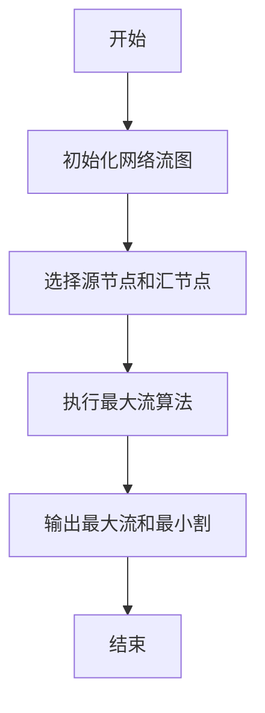
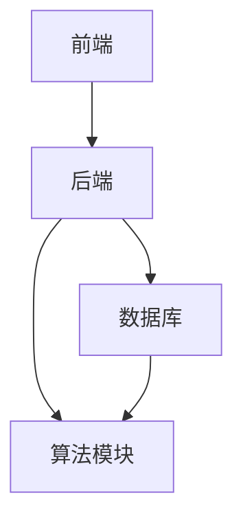
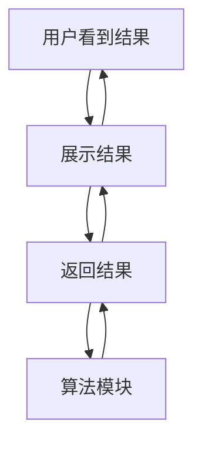

                 


# 开发智能化的供应链金融信用网络韧性分析模型

> 关键词：供应链金融，信用网络，网络韧性，人工智能，算法，系统架构

> 摘要：本文探讨了如何开发智能化的供应链金融信用网络韧性分析模型，从背景与概述、核心概念与理论、算法原理、系统架构设计、项目实战到最佳实践，系统地分析了供应链金融信用网络的构建与韧性分析的全过程，结合具体案例和代码实现，展示了如何利用人工智能技术提升供应链金融的信用评估和风险管理能力。

---

# 第一部分: 供应链金融与信用网络韧性分析模型概述

## 第1章: 供应链金融与信用网络韧性分析模型的背景与意义

### 1.1 供应链金融的基本概念
#### 1.1.1 供应链金融的定义与特点
- 供应链金融是一种通过整合供应链上下游资源，优化资金流动和风险控制的金融模式。
- 其特点包括：系统性、协作性、动态性。

#### 1.1.2 供应链金融在现代经济中的作用
- 优化企业资金链管理。
- 提高供应链整体效率和稳定性。
- 降低中小企业的融资门槛。

#### 1.1.3 供应链金融的核心参与方与流程
- 核心参与方：核心企业、供应商、客户、金融机构。
- 核心流程：授信、融资、支付、监控。

### 1.2 信用网络的构建与分析
#### 1.2.1 信用网络的定义与构成要素
- 定义：信用网络是供应链上下游企业之间基于信任和信用关系形成的网络结构。
- 构成要素：节点（企业）、边（信用关系）、信用评分、交易数据。

#### 1.2.2 信用网络在供应链金融中的作用
- 支持企业间的信用评估和融资决策。
- 提供供应链整体信用风险的可视化和分析工具。

#### 1.2.3 信用网络的构建方法与挑战
- 方法：基于交易数据的网络构建、基于信用评分的网络构建。
- 挑战：数据隐私、信用关系的动态变化、网络规模的扩展性。

### 1.3 供应链金融信用网络韧性分析的意义
#### 1.3.1 供应链金融中的风险与不确定性
- 供应链中断风险。
- 信用风险。
- 市场波动风险。

#### 1.3.2 网络韧性在风险防控中的重要性
- 网络韧性是衡量供应链金融系统抗风险能力的关键指标。
- 提高网络韧性可以有效降低供应链中断风险。

#### 1.3.3 提高网络韧性的策略与目标
- 优化网络结构。
- 增强节点间的信用关联性。
- 提高网络的冗余性和恢复能力。

## 第2章: 供应链金融信用网络韧性分析模型的核心概念与理论基础

### 2.1 供应链金融信用网络的结构与属性
#### 2.1.1 网络节点与边的定义
- 节点：供应链中的企业（供应商、制造商、分销商、零售商）。
- 边：企业之间的信用关系或交易关系。

#### 2.1.2 网络的度、强度与中心性
- 度：节点的连接数，反映企业的信用关系数量。
- 强度：节点连接的权重总和，反映企业的信用关系强度。
- 中心性：节点在网络中的中心地位，反映企业在供应链中的重要性。

#### 2.1.3 网络的连通性与模块化
- 连通性：网络中节点之间的连接程度，反映供应链的整合程度。
- 模块化：网络的分组特性，反映供应链的不同功能模块。

### 2.2 网络韧性分析的理论基础
#### 2.2.1 网络韧性定义与测量指标
- 定义：网络在面临节点或边的故障或攻击时，保持连通性和功能的能力。
- 测量指标：连通性、冗余性、恢复能力。

#### 2.2.2 网络韧性分析的数学模型
- 网络韧性模型：基于网络流的最大流最小割定理。
- 网络韧性指标：节点/边的删除对网络连通性的影响。

#### 2.2.3 网络韧性与供应链稳定性的关系
- 网络韧性越高，供应链的稳定性越强。
- 网络韧性分析为供应链金融中的风险防控提供理论支持。

### 2.3 供应链金融信用网络的动态特性
#### 2.3.1 网络的动态演化过程
- 节点的加入与退出。
- 边的权重变化。
- 网络结构的调整。

#### 2.3.2 网络韧性分析的动态模型
- 基于时间序列的网络韧性分析。
- 动态网络流模型。

#### 2.3.3 网络韧性在不同场景下的表现
- 正常场景：网络韧性稳定。
- 危机场景：网络韧性下降，需采取应急措施。

---

### 2.2.3 网络韧性分析的数学模型（公式）
$$
\text{网络韧性} = \frac{\text{最大流}}{\text{最小割}}
$$

---

# 第二部分: 供应链金融信用网络韧性分析模型的算法与实现

## 第3章: 网络韧性分析的核心算法

### 3.1 网络流算法
#### 3.1.1 最大流最小割定理
- 最大流：网络中的最大流量。
- 最小割：将网络分割为两部分的最小容量。
- 应用：用于评估网络的连通性和韧性。

#### 3.1.2 网络流算法的实现步骤
1. 构建网络流图。
2. 计算最大流和最小割。
3. 根据结果评估网络韧性。

#### 3.1.3 网络流在信用网络中的应用
- 应用场景：评估供应链中的关键路径。
- 示例：通过网络流算法识别供应链中的瓶颈节点。

### 3.2 聚类分析算法
#### 3.2.1 聚类分析的基本原理
- 将网络中的节点分为若干簇，分析簇的特征。
- 应用于识别网络中的风险区域。

#### 3.2.2 基于聚类的网络韧性评估方法
1. 对网络节点进行聚类。
2. 分析每个簇的韧性。
3. 综合各簇的韧性评估整体网络韧性。

#### 3.2.3 聚类算法在信用网络中的实现
- 示例：使用K-means算法对信用网络中的供应商进行聚类分析。

### 3.3 PageRank算法
#### 3.3.1 PageRank算法的原理与特点
- 基于节点的重要性排序。
- 用于评估网络中关键节点的影响。

#### 3.3.2 PageRank在信用网络中的应用
- 应用场景：识别供应链中的核心企业。
- 示例：通过PageRank算法确定供应链中的关键供应商。

#### 3.3.3 PageRank算法的实现步骤
1. 初始化所有节点的PageRank值。
2. 迭代更新PageRank值。
3. 输出节点的重要性排序。

---

### 3.1.2 网络流算法的实现步骤（流程图）



---

## 第4章: 供应链金融信用网络韧性分析模型的数学模型与公式

### 4.1 网络韧性分析的数学模型
$$
\text{韧性指数} = \frac{\text{网络的平均度}}{\text{网络的最大度}}
$$

### 4.2 网络流算法的数学表达
$$
\text{最大流} = \sum_{e \in E} f(e)
$$
$$
f(e) \leq c(e) \quad \forall e \in E
$$
$$
\sum_{e \in \delta^+(v)} f(e) - \sum_{e \in \delta^-(v)} f(e) = 0 \quad \forall v \in V \setminus \{s, t\}
$$

---

## 第5章: 系统分析与架构设计

### 5.1 系统功能设计
#### 5.1.1 系统功能模块
- 数据采集模块：收集供应链金融数据。
- 网络构建模块：构建信用网络。
- 网络韧性分析模块：评估网络韧性。
- 可视化模块：展示分析结果。

#### 5.1.2 系统功能流程
1. 数据采集：获取供应链企业的信用数据。
2. 网络构建：基于数据构建信用网络。
3. 网络韧性分析：应用算法评估网络韧性。
4. 可视化展示：将分析结果以图形化形式呈现。

### 5.2 系统架构设计
#### 5.2.1 系统架构图


#### 5.2.2 系统接口设计
- 前端接口：数据输入、结果展示。
- 后端接口：数据处理、算法调用。
- 数据库接口：数据存储与查询。

### 5.3 系统交互流程
#### 5.3.1 系统交互流程图


---

## 第6章: 项目实战

### 6.1 环境安装
#### 6.1.1 系统环境
- 操作系统：Linux/Windows/macOS。
- 开发工具：PyCharm、VS Code。
- 数据库：MySQL、MongoDB。

#### 6.1.2 安装依赖
- Python：3.8+
- 库：NetworkX、Matplotlib、Scikit-learn、TensorFlow。

### 6.2 核心代码实现
#### 6.2.1 网络构建
```python
import networkx as nx

G = nx.Graph()
G.add_nodes_from([1, 2, 3, 4])
G.add_edges_from([(1, 2), (2, 3), (3, 4), (1, 4)])
```

#### 6.2.2 网络流算法实现
```python
from networkx.algorithms.flow import maxflow_mincut

flow_value = maxflow_mincut(G, 's', 't')
```

#### 6.2.3 可视化实现
```python
nx.draw(G, with_labels=True, node_color='blue', edge_color='red')
plt.show()
```

### 6.3 案例分析与总结
#### 6.3.1 案例分析
- 案例背景：某供应链企业的信用网络分析。
- 分析结果：识别出关键节点和瓶颈路径。
- 解决方案：优化网络结构，增强网络韧性。

#### 6.3.2 总结
- 成功实现了供应链金融信用网络韧性分析模型。
- 提高了供应链金融的风险防控能力。

---

## 第7章: 最佳实践与小结

### 7.1 最佳实践
#### 7.1.1 数据质量管理
- 数据清洗：确保数据的准确性和完整性。
- 数据隐私保护：遵守相关法律法规。

#### 7.1.2 算法优化
- 网络流算法的优化：减少计算复杂度。
- 聚类算法的优化：提高聚类精度。

### 7.2 小结
- 本文系统地介绍了供应链金融信用网络韧性分析模型的开发过程。
- 提供了丰富的算法实现和案例分析，为实际应用提供了参考。

### 7.3 注意事项
- 数据隐私和安全问题需要高度重视。
- 算法的选择和优化需要结合具体应用场景。

### 7.4 拓展阅读
- 推荐阅读《供应链金融与风险管理》。
- 关注供应链金融领域的最新研究成果。

---

# 结语

开发智能化的供应链金融信用网络韧性分析模型是一项复杂而重要的任务。通过本文的系统分析和实践案例，我们展示了如何利用人工智能技术提升供应链金融的风险管理能力。未来，随着技术的进步和数据的积累，供应链金融信用网络韧性分析模型将更加智能化和精准化。

