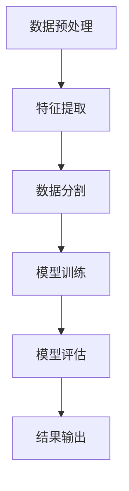
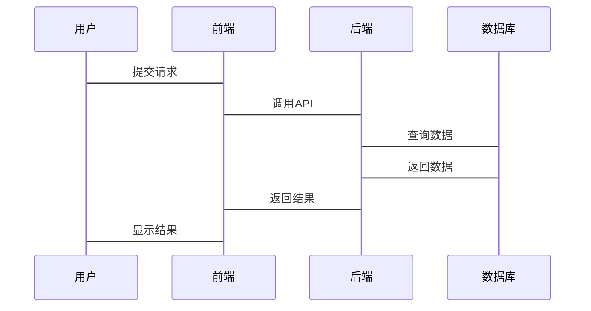

                 


# 开发智能化的供应链金融信用评级模型

> 关键词：供应链金融，信用评级模型，人工智能，机器学习，风险管理

> 摘要：本文详细探讨了开发智能化供应链金融信用评级模型的关键步骤和方法，从背景介绍、核心概念分析到算法实现、系统架构设计，再到项目实战和最佳实践，为读者提供了一套全面的解决方案。

---

## 第一部分：供应链金融与信用评级模型背景

### 第1章：供应链金融与信用评级概述

#### 1.1 供应链金融的基本概念
- **1.1.1 供应链金融的定义**
  - 供应链金融是指通过整合供应链上的资源，为企业提供融资支持，优化资金流动，降低运营成本。
  
- **1.1.2 供应链金融的核心要素**
  - 供应商、客户、银行、货物、资金流、信息流。
  
- **1.1.3 供应链金融的运作模式**
  - 以应收账款融资、存货质押融资、订单融资为主。

#### 1.2 信用评级的基本概念
- **1.2.1 信用评级的定义**
  - 信用评级是对企业或个人的信用状况进行评估，预测其偿还债务的能力。
  
- **1.2.2 信用评级的分类**
  - 主体评级、债项评级、行业评级。
  
- **1.2.3 信用评级的重要性和作用**
  - 降低金融风险，提高资金分配效率。

#### 1.3 智能化信用评级的必要性
- **1.3.1 传统信用评级的局限性**
  - 数据量有限，难以覆盖多维度信息。
  
- **1.3.2 智能化信用评级的优势**
  - 利用AI和大数据，提升评估精度和效率。
  
- **1.3.3 智能化信用评级的应用场景**
  - 供应链金融中的多主体信用评估，动态调整信用额度。

### 第2章：供应链金融信用评级模型的背景与问题

#### 2.1 供应链金融中的信用风险
- **2.1.1 供应链金融中的信用风险来源**
  - 交易对手信用风险，质押物价值波动风险，信息不对称风险。
  
- **2.1.2 信用风险对供应链的影响**
  - 导致资金链断裂，影响供应链整体运作效率。

#### 2.2 传统信用评级模型的不足
- **2.2.1 传统信用评级模型的局限性**
  - 数据维度有限，难以捕捉动态变化，模型泛化能力不足。
  
- **2.2.2 数据不足和模型复杂性问题**
  - 数据稀疏，模型难以训练，结果缺乏可解释性。

#### 2.3 智能化信用评级模型的提出
- **2.3.1 智能化信用评级模型的目标**
  - 实现供应链全链路的智能化信用评估，提高融资效率。
  
- **2.3.2 智能化信用评级模型的核心问题**
  - 数据采集与处理，模型选择与优化，结果应用与反馈。

---

## 第二部分：核心概念与联系

### 第3章：智能化供应链金融信用评级模型的核心概念与联系

#### 3.1 核心概念原理
- **3.1.1 供应链金融中的关键实体**
  - 供应商、制造商、分销商、零售商、消费者、银行、物流商。
  
- **3.1.2 信用评级模型的核心要素**
  - 数据输入、特征提取、模型训练、评分输出。

#### 3.2 核心概念属性特征对比
| 实体 | 属性 | 描述 |
|------|------|------|
| 供应商 | 财务状况 | 资产负债率、利润率 |
| 客户 | 交易记录 | 交易频率、延迟情况 |
| 银行 | 信用评分 | 分数、评级等级 |

#### 3.3 ER实体关系图架构
```mermaid
erDiagram
    actor 供应链金融参与者 {
      entity 供应商
      entity 制造商
      entity 分销商
      entity 零售商
      entity 消费者
      entity 银行
      entity 物流商
    }
    supplier ->制造商: 供应原材料
    制造商->分销商: 分配产品
    分销商->零售商: 分销商品
    零售商->消费者: 提供服务
    供应商<->银行: 融资支持
    银行<->消费者: 贷款发放
    物流商<->供应商: 物流运输
```

---

## 第三部分：算法原理讲解

### 第4章：基于机器学习的信用评级算法

#### 4.1 算法选择与原理
- **4.1.1 机器学习算法选择**
  - 使用逻辑回归和随机森林进行分类。
  
- **4.1.2 算法原理概述**
  - 逻辑回归：预测概率，用于二分类。
  - 随机森林：集成学习，提升模型鲁棒性。

#### 4.2 算法实现流程


#### 4.3 算法实现代码
```python
from sklearn.linear_model import LogisticRegression
from sklearn.ensemble import RandomForestClassifier
from sklearn.metrics import accuracy_score

# 数据预处理
X = df.drop('target', axis=1)
y = df['target']
X_train, X_test, y_train, y_test = train_test_split(X, y, test_size=0.2)

# 模型训练
model_log = LogisticRegression().fit(X_train, y_train)
model_rf = RandomForestClassifier().fit(X_train, y_train)

# 模型评估
y_pred_log = model_log.predict(X_test)
y_pred_rf = model_rf.predict(X_test)

print(f"逻辑回归准确率：{accuracy_score(y_test, y_pred_log)}")
print(f"随机森林准确率：{accuracy_score(y_test, y_pred_rf)}")
```

#### 4.4 数学公式
- 逻辑回归：
  $$ P(y=1|x) = \frac{1}{1 + e^{-\beta x}} $$
  
- 随机森林：
  $$ y = \sum_{i=1}^{n} \text{Tree}_i(x) $$

---

## 第四部分：系统分析与架构设计方案

### 第5章：智能化供应链金融信用评级系统的架构设计

#### 5.1 问题场景介绍
- 供应链金融中的信用评估需求，多主体、多数据源的复杂性。

#### 5.2 系统功能设计
- 数据采集模块、特征提取模块、模型训练模块、结果输出模块。

#### 5.3 系统架构设计


#### 5.4 系统接口设计
- API接口：`/api/v1/train-model`，用于模型训练。
- API接口：`/api/v1/predict`, 用于信用评分查询。

#### 5.5 系统交互流程


---

## 第五部分：项目实战

### 第6章：开发智能化供应链金融信用评级系统

#### 6.1 环境安装
- 安装Python、Jupyter Notebook、机器学习库（如scikit-learn、xgboost）。

#### 6.2 系统核心实现
```python
import pandas as pd
from sklearn.ensemble import RandomForestClassifier
from sklearn.metrics import accuracy_score

# 加载数据
data = pd.read_csv('supply_chain_data.csv')

# 特征工程
features = data.drop('label', axis=1)
label = data['label']

# 模型训练
model = RandomForestClassifier().fit(features, label)

# 模型预测
predictions = model.predict(features)
print(f"模型准确率：{accuracy_score(label, predictions)}")
```

#### 6.3 代码应用解读
- 数据加载：从CSV文件加载数据。
- 特征工程：提取相关特征。
- 模型训练：使用随机森林进行分类。
- 模型评估：计算准确率。

#### 6.4 案例分析
- 选取一家企业的数据，进行信用评分，分析结果并给出建议。

#### 6.5 项目小结
- 项目实现的关键步骤，遇到的问题及解决方案。

---

## 第六部分：最佳实践与总结

### 第7章：最佳实践与注意事项

#### 7.1 最佳实践
- 数据清洗：确保数据质量，处理缺失值和异常值。
- 特征工程：选择合适的特征，避免冗余特征。
- 模型选择：根据数据类型和业务需求选择合适的模型。
- 模型调优：使用网格搜索优化模型参数。

#### 7.2 小结
- 本文详细介绍了开发智能化供应链金融信用评级模型的全过程，从理论到实践，为读者提供了实用的指导。

#### 7.3 注意事项
- 数据隐私：遵守相关法律法规，保护数据安全。
- 模型解释性：选择可解释性较强的模型，便于业务人员理解。
- 模型更新：定期更新模型，确保评估结果的有效性。

#### 7.4 拓展阅读
- 《机器学习实战》
- 《供应链金融：理论与实践》
- 《Python机器学习》

---

## 附录

### 附录A：常用机器学习算法总结

| 算法名称 | 类型 | 适用场景 |
|----------|------|----------|
| 逻辑回归 | 分类 | 二分类问题 |
| 随机森林 | 分类/回归 | 多分类、回归问题 |
| XGBoost | 分类/回归 | 高维数据、复杂问题 |

### 附录B：数据预处理步骤

1. 数据清洗：处理缺失值、重复值。
2. 数据转换：标准化、归一化。
3. 特征选择：提取关键特征，去除无关特征。

---

# 结束语

通过本文的详细讲解，读者可以系统地掌握开发智能化供应链金融信用评级模型的关键技术和方法，从理论到实践，逐步实现一个高效的信用评级系统，为企业优化供应链管理提供有力支持。

