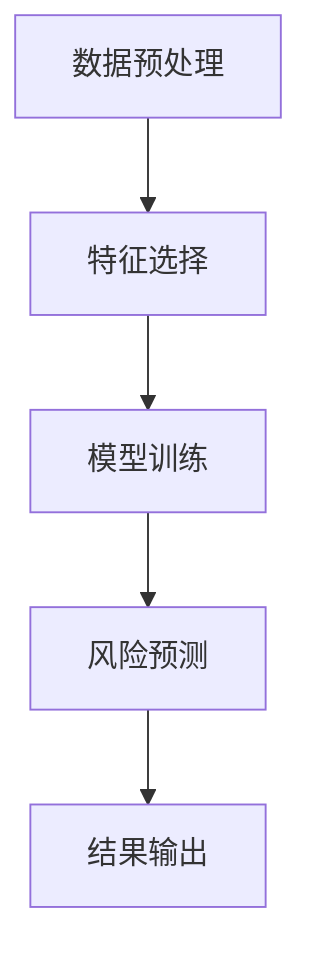
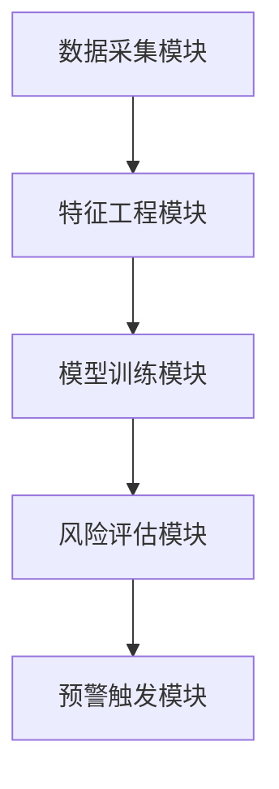
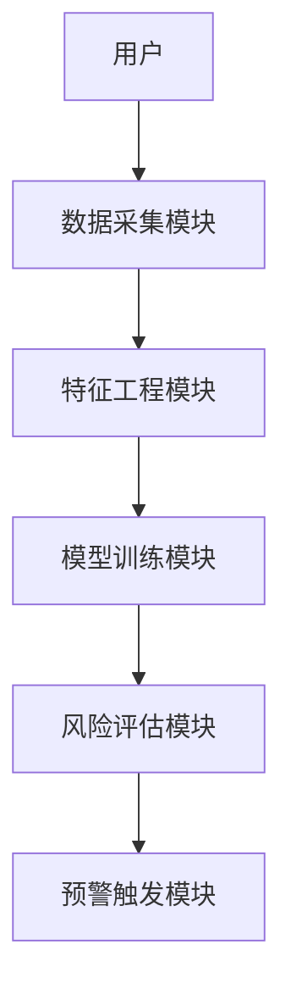

                 


# 开发智能化的供应链金融风险预警模型

**关键词**：供应链金融、风险预警、人工智能、大数据分析、机器学习、模型开发

**摘要**：供应链金融是现代商业体系中的核心环节，其风险管理对于保障资金流动安全至关重要。本文详细探讨了如何利用人工智能和大数据技术开发智能化的供应链金融风险预警模型，涵盖了从理论到实践的全过程，包括模型的核心概念、算法原理、系统架构设计以及项目实战等内容，为读者提供全面的技术指导。

---

## 第一部分: 供应链金融风险预警模型的背景与概念

### 第1章: 供应链金融与风险预警概述

#### 1.1 供应链金融的基本概念
- **1.1.1 供应链金融的定义**
  供应链金融是指通过整合供应链上下游企业之间的资金流、物流和信息流，为链条上的企业提供融资支持和风险管理服务的金融模式。其核心在于通过优化资金流动，降低企业的运营成本，提升整体供应链的效率。

- **1.1.2 供应链金融的核心特征**
  - **数据驱动**：依赖于供应链中的交易数据、物流数据和财务数据。
  - **多方参与**：涉及供应商、制造商、分销商、零售商和金融机构等多方角色。
  - **动态风险评估**：随着供应链环境的变化，实时评估和调整风险敞口。

- **1.1.3 供应链金融的参与方与流程**
  - **参与方**：包括核心企业、供应商、客户、金融机构（银行、保理公司等）。
  - **流程**：从供应商向核心企业供货，核心企业支付货款，金融机构提供融资支持，客户支付货款，最终形成闭环。

#### 1.2 供应链金融风险的形成与影响
- **1.2.1 供应链金融中的主要风险类型**
  - **信用风险**：由于交易方的信用问题导致的损失。
  - **操作风险**：由于操作失误或系统故障导致的损失。
  - **市场风险**：由于市场价格波动导致的损失。
  - **流动性风险**：由于资金不足或无法及时调配导致的流动性问题。

- **1.2.2 风险对供应链稳定性的影响**
  - 风险可能导致供应链中断，影响企业的正常运营。
  - 风险的积累可能引发连锁反应，影响整个供应链的稳定性。

- **1.2.3 风险预警的重要性与价值**
  - 提前识别潜在风险，采取预防措施，降低损失。
  - 优化资源配置，提高供应链的整体效率。

#### 1.3 智能化风险预警模型的必要性
- **1.3.1 传统风险评估方法的局限性**
  - 传统方法通常基于静态数据分析，难以捕捉实时风险变化。
  - 依赖人工经验，主观性较强，难以实现客观、精准的评估。

- **1.3.2 智能化预警模型的优势**
  - 利用大数据和人工智能技术，实时分析海量数据，快速识别潜在风险。
  - 基于动态数据和模型预测，提供实时预警和决策支持。

- **1.3.3 供应链金融智能化发展的趋势**
  - 随着技术的进步，供应链金融正逐步从传统模式向智能化、数字化方向转型。
  - 智能化风险预警模型将成为未来供应链金融的核心技术之一。

#### 1.4 本章小结
本章从供应链金融的基本概念出发，分析了供应链金融中的主要风险类型及其对供应链稳定性的影响，重点阐述了智能化风险预警模型的必要性和优势，为后续章节的深入分析奠定了基础。

---

## 第二部分: 供应链金融风险预警模型的核心概念与联系

### 第2章: 风险预警模型的核心要素与关系

#### 2.1 核心概念与原理
- **2.1.1 数据源与特征提取**
  - 数据源：交易数据（订单、合同、发票）、财务数据（应收账款、应付账款）、物流数据（运输时间、成本）、市场数据（价格波动、行业趋势）。
  - 特征提取：从原始数据中提取有助于风险评估的关键特征，例如交易频率、金额波动、供应商信用评分等。

- **2.1.2 风险评估指标体系**
  - 风险评分：基于多个特征的加权评分，反映企业的信用风险。
  - 风险等级：将风险评分分为不同的等级（低、中、高），便于预警和决策。

- **2.1.3 预警阈值与触发机制**
  - 预警阈值：设定在不同风险等级下的阈值，当评分超过阈值时触发预警。
  - 触发机制：根据预警级别，启动相应的应对措施，例如调整融资额度、暂停交易、通知相关方等。

#### 2.2 实体关系图与流程图
- **2.2.1 供应链金融实体关系图（ER图）**
  ```mermaid
  graph TD
      A[供应商] --> B[企业]
      B --> C[客户]
      B --> D[金融机构]
      C --> D
  ```

- **2.2.2 风险预警流程图**
  ```mermaid
  graph TD
      A[数据采集] --> B[特征提取]
      B --> C[模型训练]
      C --> D[风险评估]
      D --> E[预警触发]
  ```

#### 2.3 核心概念对比分析
- **2.3.1 数据特征对比表格**
  | 特征类型 | 输入特征 | 输出特征 |
  |----------|----------|----------|
  | 数据源    | 交易数据、财务数据、物流数据 | 风险评分、预警信号 |
  | 模型类型  | 时间序列模型、分类模型 | 风险预测模型 |

#### 2.4 本章小结
本章详细分析了供应链金融风险预警模型的核心要素，通过ER图和流程图展示了模型的结构和工作原理，帮助读者更好地理解模型的内在联系和实现逻辑。

---

## 第三部分: 供应链金融风险预警模型的算法原理

### 第3章: 风险预警模型的算法实现

#### 3.1 算法原理概述
- **3.1.1 时间序列分析**
  - 时间序列分析用于预测未来的风险趋势，基于历史数据的变化规律。
  - 常用模型：ARIMA（自回归积分滑动平均模型）、LSTM（长短期记忆网络）。

- **3.1.2 风险分类模型**
  - 风险分类模型用于将企业划分为不同的风险等级。
  - 常用算法：随机森林、支持向量机（SVM）、逻辑回归。

- **3.1.3 集成学习与优化**
  - 集成学习通过组合多个模型的结果，提升预测的准确性和稳定性。
  - 优化方法：网格搜索、随机搜索，用于调优模型参数。

#### 3.2 算法流程图


#### 3.3 算法实现细节
- **时间序列分析的数学模型**
  - ARIMA模型的差分方程：
    $$ y_t = \phi y_{t-1} + \theta \epsilon_{t-1} + \epsilon_t $$
  - LSTM模型的结构：
    $$ f(t) = \sigma(w_{f} \cdot [h_{t-1}, x_t] + b_f) $$
    其中，$\sigma$ 是sigmoid函数，$w_f$ 和 $b_f$ 是权重和偏置。

- **随机森林算法的实现**
  ```python
  import pandas as pd
  from sklearn.ensemble import RandomForestClassifier
  from sklearn.metrics import accuracy_score

  # 加载数据
  data = pd.read_csv('data.csv')
  X = data.drop('label', axis=1)
  y = data['label']

  # 训练模型
  clf = RandomForestClassifier(n_estimators=100, random_state=42)
  clf.fit(X, y)

  # 预测
  y_pred = clf.predict(X)

  # 评估准确率
  print("准确率:", accuracy_score(y, y_pred))
  ```

#### 3.4 本章小结
本章详细介绍了供应链金融风险预警模型的算法原理，包括时间序列分析、风险分类模型以及集成学习方法。通过流程图和代码示例，帮助读者理解算法的实现细节和应用场景。

---

## 第四部分: 供应链金融风险预警系统的架构设计与实现

### 第4章: 系统架构设计与实现

#### 4.1 系统功能设计
- **4.1.1 数据采集模块**
  - 从供应链各环节获取交易数据、财务数据、物流数据等。
- **4.1.2 特征工程模块**
  - 对数据进行清洗、特征提取和转换，为模型提供输入。
- **4.1.3 模型训练模块**
  - 使用训练好的模型进行风险预测，输出风险评分和预警信号。
- **4.1.4 预警触发模块**
  - 根据风险评分触发预警，通知相关方采取措施。

#### 4.2 系统架构设计


#### 4.3 系统接口设计
- **API接口**
  - 数据接口：用于数据的上传和获取。
  - 模型接口：用于调用模型进行风险预测。
  - 预警接口：用于触发预警并通知相关方。

#### 4.4 系统交互流程图


#### 4.5 本章小结
本章从系统架构的角度，详细设计了供应链金融风险预警系统的各个模块及其交互流程，为后续的项目实现提供了清晰的指导。

---

## 第五部分: 项目实战与案例分析

### 第5章: 项目实战与案例分析

#### 5.1 项目环境配置
- **安装依赖**
  ```bash
  pip install pandas scikit-learn matplotlib seaborn
  ```

#### 5.2 系统核心实现
- **数据预处理**
  ```python
  import pandas as pd

  # 加载数据
  data = pd.read_csv('data.csv')

  # 数据清洗
  data.dropna(inplace=True)
  ```

- **特征工程**
  ```python
  from sklearn.preprocessing import StandardScaler

  scaler = StandardScaler()
  X_scaled = scaler.fit_transform(X)
  ```

- **模型训练与评估**
  ```python
  from sklearn.model_selection import train_test_split
  from sklearn.metrics import classification_report

  X_train, X_test, y_train, y_test = train_test_split(X_scaled, y, test_size=0.2, random_state=42)
  clf.fit(X_train, y_train)
  print(classification_report(y_test, clf.predict(X_test)))
  ```

#### 5.3 案例分析
- **案例背景**
  某大型制造企业与多家供应商和客户合作，希望通过风险预警模型降低供应链中断的风险。
- **数据来源**
  - 交易数据：包括订单金额、交货时间、付款状态等。
  - 财务数据：包括应收账款、应付账款、财务报表等。
  - 物流数据：包括运输时间、运输成本、物流延误情况等。

#### 5.4 模型优化与调优
- **超参数调优**
  ```python
  from sklearn.model_selection import GridSearchCV

  param_grid = {
      'n_estimators': [100, 200],
      'max_depth': [None, 10, 20],
      'min_samples_split': [2, 5]
  }

  grid_search = GridSearchCV(clf, param_grid, cv=5)
  grid_search.fit(X_train, y_train)
  print("最优参数：", grid_search.best_params_)
  ```

#### 5.5 本章小结
本章通过实际项目的环境配置和代码实现，详细展示了供应链金融风险预警模型的开发过程，并通过案例分析验证了模型的有效性。

---

## 第六部分: 总结与展望

### 第6章: 总结与展望

#### 6.1 本项目总结
- **核心成果**
  - 开发了一个智能化的供应链金融风险预警模型，能够实时分析数据，快速识别潜在风险。
  - 提供了基于机器学习的预测模型和实时预警机制，显著提升了供应链的风险管理能力。

#### 6.2 项目小结
- **实现价值**
  - 通过智能化手段，降低供应链金融中的信用风险和操作风险。
  - 提高供应链的透明度和效率，优化企业间的合作关系。

#### 6.3 未来展望
- **技术优化**
  - 引入更先进的深度学习模型，如Transformer，提升风险预测的准确性。
  - 结合区块链技术，实现数据的不可篡改性和更高的透明度。

#### 6.4 最佳实践 tips
- **数据质量**
  - 确保数据的完整性和准确性，避免因数据问题影响模型的性能。
- **模型迭代**
  - 定期更新模型，根据新的数据和业务需求优化模型参数。
- **系统维护**
  - 定期检查系统运行状态，及时修复漏洞，确保系统的稳定性和安全性。

#### 6.5 本章小结
本章总结了项目的成果和实现价值，展望了未来的发展方向，并提供了实际应用中的注意事项和最佳实践建议。

---

**结束语**  
通过本文的详细讲解，读者可以全面了解供应链金融风险预警模型的开发过程和技术要点，从理论到实践，从算法到系统架构，为实际应用提供了有力的技术支持。未来，随着人工智能和大数据技术的不断发展，供应链金融风险预警模型将更加智能化和精准化，为企业的可持续发展保驾护航。

--- 

**（全文完）**

