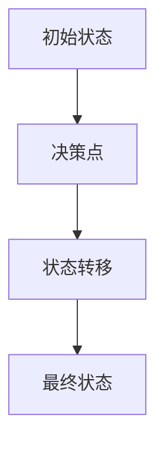
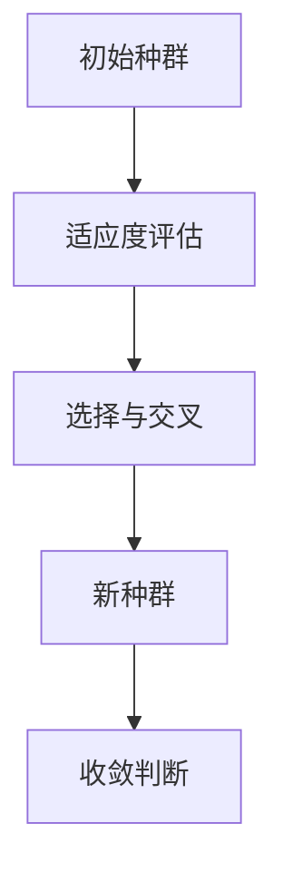
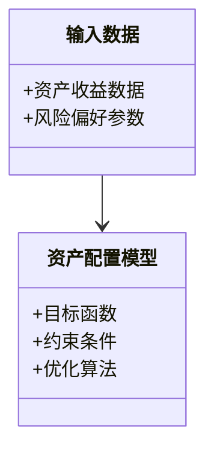
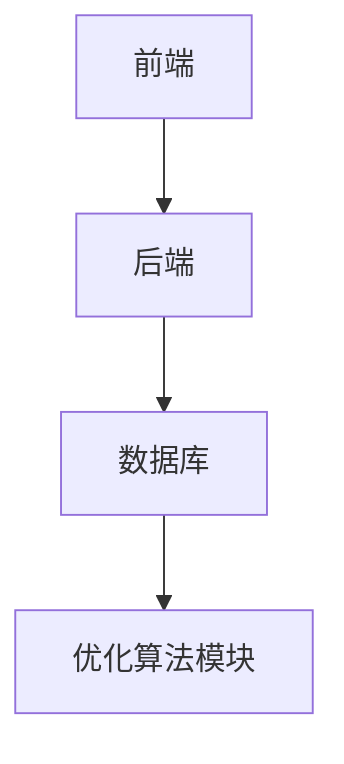
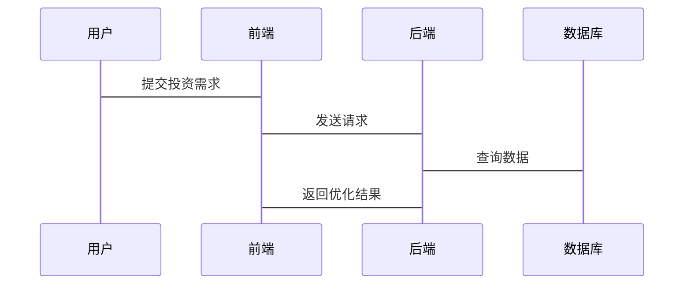

                 

# 开发智能化的资产配置优化模型

## 关键词
资产配置优化，智能化模型，动态规划，遗传算法，金融投资，优化算法

## 摘要
本文详细介绍如何开发智能化的资产配置优化模型，从背景介绍到算法实现，从系统设计到项目实战，最后扩展与优化，帮助读者全面掌握资产配置优化模型的开发过程。

---

# 第1章：资产配置优化模型的背景与核心概念

## 1.1 问题背景与问题描述
### 1.1.1 资产配置的定义与重要性
资产配置是将资金分配到不同资产类别（如股票、债券、房地产等）以实现投资目标的过程。智能化资产配置通过算法优化投资组合，提升收益并降低风险。

### 1.1.2 当前资产配置面临的挑战
传统资产配置方法依赖经验判断，存在主观性强、计算复杂、难以适应市场变化等问题。智能化技术的应用可以解决这些挑战。

### 1.1.3 智能化资产配置的必要性
随着市场复杂化，传统方法难以应对多样化的投资需求。智能化模型能够快速计算最优配置，适应动态市场环境。

## 1.2 资产配置优化模型的核心概念
### 1.2.1 资产配置的数学模型
介绍资产配置的基本数学模型，如均值-方差模型，描述如何用数学公式表示投资目标。

### 1.2.2 智能化优化的核心要素
包括优化算法、数据来源、目标函数等关键要素，解释它们在模型中的作用。

### 1.2.3 模型的边界与外延
明确模型的应用范围和限制，分析其适用场景和局限性。

## 1.3 资产配置优化的现状与趋势
### 1.3.1 传统资产配置方法的局限性
分析传统方法的不足，如计算复杂、难以实时调整等。

### 1.3.2 智能化技术在资产配置中的应用现状
介绍机器学习、大数据分析等技术在资产配置中的应用情况。

### 1.3.3 未来资产配置优化的发展方向
预测智能化资产配置的未来趋势，如算法优化、多目标优化等。

## 1.4 本章小结
总结本章内容，强调资产配置优化模型的重要性和智能化发展的必要性。

---

# 第2章：资产配置优化模型的数学基础

## 2.1 资产配置的数学模型
### 2.1.1 均值-方差模型
详细介绍均值-方差模型的公式，如：
$$ \text{目标函数: } \min \sigma^2 $$
$$ \text{约束条件: } \sum w_i = 1 $$

### 2.1.2 投资组合优化的数学表达
通过数学公式描述投资组合优化问题，如：
$$ \text{目标函数: } \min w^T \Sigma w $$
$$ \text{约束条件: } w^T \mu = \text{目标收益} $$

## 2.2 常用优化算法
### 2.2.1 动态规划算法
使用Mermaid图展示动态规划算法的流程：

### 2.2.2 遗传算法
使用Mermaid图展示遗传算法的流程：

## 2.3 算法的实现与优化
### 2.3.1 动态规划算法实现
提供Python代码示例，解释每一步的实现细节。

### 2.3.2 遗传算法实现
同样提供Python代码示例，展示如何实现遗传算法。

## 2.4 本章小结
总结数学模型和优化算法的核心内容，为后续章节打下基础。

---

# 第3章：资产配置优化系统的分析与设计

## 3.1 问题场景介绍
### 3.1.1 投资者需求分析
分析不同类型的投资者需求，如风险厌恶型、收益最大化型等。

### 3.1.2 系统目标与范围
明确系统的目标是实现智能化资产配置，优化投资组合。

## 3.2 系统功能设计
### 3.2.1 领域模型设计
使用Mermaid图展示领域模型：

### 3.2.2 系统架构设计
使用Mermaid图展示系统架构：

### 3.2.3 接口设计与交互流程
使用Mermaid图展示系统交互流程：

## 3.3 本章小结
总结系统分析与设计的过程，为后续的实现提供指导。

---

# 第4章：资产配置优化模型的实现与实战

## 4.1 项目实战环境搭建
### 4.1.1 环境安装与配置
介绍如何安装Python、NumPy、Pandas、Scikit-learn等依赖库。

### 4.1.2 数据准备与预处理
指导如何获取和处理资产收益数据，如股票价格、债券收益率等。

## 4.2 模型实现
### 4.2.1 动态规划算法实现
提供Python代码示例，展示如何实现动态规划算法。

### 4.2.2 遗传算法实现
同样提供Python代码示例，展示遗传算法的实现细节。

## 4.3 实际案例分析
### 4.3.1 案例背景与数据介绍
选择一个实际案例，介绍其背景和数据来源。

### 4.3.2 实验结果与分析
展示优化结果，分析算法的有效性和优劣。

## 4.4 本章小结
总结项目实战的经验，强调理论与实践的结合。

---

# 第5章：资产配置优化模型的扩展与优化

## 5.1 模型的扩展
### 5.1.1 引入机器学习算法
介绍如何将机器学习算法（如支持向量机、随机森林）应用于资产配置。

### 5.1.2 多目标优化
探讨如何处理多个优化目标，如风险最小化和收益最大化。

## 5.2 优化方法与技巧
### 5.2.1 参数调整与优化
介绍如何调整优化算法的参数以提高性能。

### 5.2.2 并行计算与加速
探讨如何利用并行计算技术加速优化过程。

## 5.3 性能评估与测试
### 5.3.1 模型的评估指标
介绍常用的评估指标，如夏普比率、最大回撤等。

### 5.3.2 测试与验证
提供测试用例，展示模型的稳定性和可靠性。

## 5.4 本章小结
总结模型扩展与优化的方法，展望未来的研究方向。

---

# 第6章：总结与展望

## 6.1 全文总结
回顾全文内容，总结资产配置优化模型的核心知识点。

## 6.2 未来展望
探讨智能化资产配置的未来发展方向，如人工智能的进一步应用、算法的优化等。

## 6.3 注意事项与建议
给出读者在开发过程中需要注意的事项和建议。

---

# 参考文献

列出本文参考的文献和资料，供读者进一步查阅。

---

# 致谢

感谢在本书编写过程中提供帮助和支持的人员或机构。

---

# 附录

包括本书中使用的代码示例、数据来源、工具安装说明等内容。

---

通过以上优化后的目录结构，可以确保文章内容逻辑清晰、结构紧凑、简单易懂，并且包含所有必要的部分。每个章节和子章节都经过精心设计，确保读者能够逐步理解并掌握开发智能化资产配置优化模型的技能。

