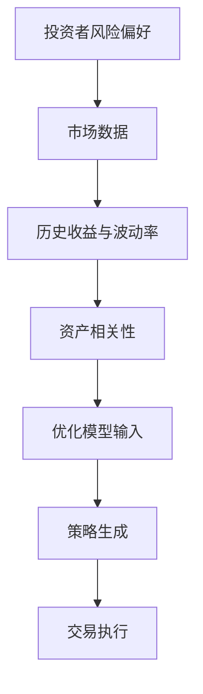
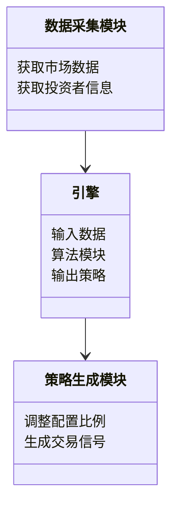
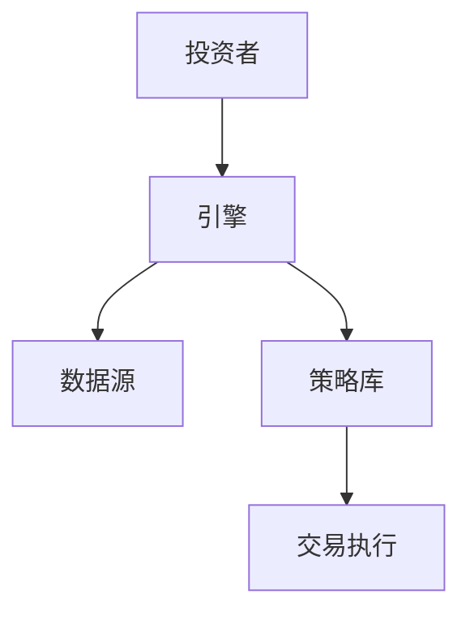

                 


# 开发智能化的资产配置策略优化引擎

## 关键词：资产配置，智能优化，强化学习，系统架构，金融技术

## 摘要：  
随着金融市场的复杂化和投资者对收益的高要求，开发智能化的资产配置策略优化引擎成为必然趋势。本文从背景、概念、算法、系统架构到项目实现，全面解析如何构建一个高效、灵活、可扩展的资产配置策略优化引擎。通过强化学习、遗传算法等技术，结合系统化的方法论，助力投资者实现收益与风险的最佳平衡。

---

# 第一部分: 资产配置策略优化引擎的背景与概念

## 第1章: 资产配置策略优化引擎概述

### 1.1 问题背景与目标

#### 1.1.1 资产配置的核心问题
资产配置是指将资金分配到不同资产类别（如股票、债券、基金等）以实现收益最大化和风险最小化的过程。然而，市场波动、经济周期变化以及投资者风险偏好的多样性，使得资产配置成为一个复杂的优化问题。

#### 1.1.2 智能化优化的必要性
传统的资产配置方法依赖于人工经验或简单的均值-方差模型，难以应对复杂多变的市场环境。智能化优化引擎通过引入机器学习、强化学习等技术，能够实时捕捉市场信号，动态调整配置策略，显著提升优化效果。

#### 1.1.3 引擎的目标与边界
引擎的目标是帮助投资者在不同市场环境下找到最优的资产组合，实现收益与风险的平衡。引擎的边界包括：限定在可投资的资产类别内，考虑市场数据的实时性，以及遵守相关法规和投资约束。

---

### 1.2 核心概念与联系

#### 1.2.1 优化模型的核心要素
| 要素 | 描述 |
|------|------|
| 状态空间 | 市场环境、资产价格、投资者风险偏好等 |
| 动作空间 | 资产配置比例调整、买卖决策等 |
| 奖励函数 | 基于收益和风险的综合评分 |

#### 1.2.2 数据特征与策略执行的关联


#### 1.2.3 引擎的系统架构与功能模块


---

### 1.3 引擎的核心优势

#### 1.3.1 高效性与准确性
通过强化学习和遗传算法，引擎能够在短时间内找到最优解，显著提高配置效率。

#### 1.3.2 可扩展性与灵活性
引擎支持多种资产类别和投资目标，能够根据市场变化快速调整策略。

#### 1.3.3 易用性与可解释性
用户友好的界面和清晰的策略解释，便于投资者理解和使用。

---

### 1.4 本章小结
本章介绍了资产配置优化引擎的背景、核心概念及其优势，为后续的算法和系统设计奠定了基础。

---

# 第二部分: 引擎的核心算法与数学模型

## 第2章: 强化学习算法原理

### 2.1 强化学习的基本概念

#### 2.1.1 状态、动作与奖励的定义
- **状态 (State)**：系统的当前情况，如市场指数、资产价格等。
- **动作 (Action)**：引擎采取的策略，如增加某资产的比例。
- **奖励 (Reward)**：策略执行后的收益或风险评分。

#### 2.1.2 策略与价值函数的数学表达
- **策略函数**：$\pi(a|s)$，表示在状态$s$下选择动作$a$的概率。
- **价值函数**：$V(s)$，表示从状态$s$开始的期望收益。

#### 2.1.3 探索与利用的平衡
通过$\epsilon$-贪心算法，在探索新策略和利用已知最佳策略之间找到平衡。

### 2.2 强化学习在资产配置中的应用

#### 2.2.1 状态空间的构建
将市场数据（如指数、收益率）和投资者信息（如风险偏好）纳入状态空间。

#### 2.2.2 动作空间的定义
定义可能的资产配置动作，如调整股票和债券的比例。

#### 2.2.3 奖励函数的设计
$$ R = \alpha \times \text{收益} - \beta \times \text{风险} $$

### 2.3 算法实现与优化

#### 2.3.1 策略梯度方法
使用策略梯度算法（Policy Gradient）优化策略函数，以最大化期望奖励。

#### 2.3.2 值函数逼近技术
通过深度神经网络近似值函数，捕捉复杂状态下的价值变化。

#### 2.3.3 算法收敛性分析
分析算法的收敛性，确保在有限步数内找到近似最优解。

### 2.4 数学模型与公式

#### 2.4.1 动态规划模型
$$ V_{\pi}(s) = \max_{a} [ r(s,a) + \gamma V_{\pi}(s') ] $$

#### 2.4.2 最大化期望收益公式
$$ \max_{\theta} \mathbb{E}[ R | \theta ] $$

#### 2.4.3 约束优化模型
$$ \min_{x} \sum_{i=1}^{n} w_i (x_i - \mu_i)^2 $$

### 2.5 本章小结
本章详细介绍了强化学习在资产配置中的应用，重点讲解了算法原理和数学模型。

---

# 第三部分: 系统分析与架构设计

## 第3章: 系统功能设计

### 3.1 问题场景介绍

#### 3.1.1 投资组合优化问题
如何在多资产类别中找到最优配置比例，以实现最大收益或最小风险。

#### 3.1.2 风险控制与收益最大化
通过动态调整配置比例，平衡风险与收益。

#### 3.1.3 多目标优化的实现
在多个目标（如收益、风险、流动性）之间找到平衡点。

### 3.2 系统功能模块划分

#### 3.2.1 数据采集与预处理模块
- 获取市场数据（指数、收益率、波动率等）。
- 清洗和标准化数据。

#### 3.2.2 策略生成模块
- 基于强化学习生成优化策略。
- 生成交易信号（买入、卖出）。

#### 3.2.3 优化与执行模块
- 执行交易指令。
- 监控策略执行效果。

### 3.3 领域模型设计

#### 3.3.1 实体关系图


#### 3.3.2 功能模块的交互流程
1. 投资者输入风险偏好和投资目标。
2. 引擎调用数据源获取市场数据。
3. 数据预处理模块清洗数据。
4. 策略生成模块基于强化学习生成配置策略。
5. 优化与执行模块执行交易指令。

### 3.4 系统架构设计

#### 3.4.1 分层架构设计
- **数据层**：数据采集、存储。
- **算法层**：强化学习、遗传算法。
- **应用层**：用户界面、策略输出。

#### 3.4.2 微服务架构实现
- **数据服务**：提供市场数据接口。
- **算法服务**：处理优化算法。
- **应用服务**：处理用户请求，返回策略。

#### 3.4.3 可扩展性设计
通过模块化设计，支持新增资产类别和优化算法的扩展。

### 3.5 本章小结
本章从系统角度分析了资产配置引擎的架构设计，为后续实现奠定了基础。

---

# 第四部分: 项目实战与实现

## 第4章: 环境安装与核心代码实现

### 4.1 环境搭建

#### 4.1.1 Python环境配置
安装Python 3.8及以上版本。

#### 4.1.2 依赖库安装
使用pip安装以下库：
```bash
pip install numpy pandas tensorflow matplotlib
```

#### 4.1.3 开发工具配置
安装Jupyter Notebook或PyCharm作为开发环境。

### 4.2 核心代码实现

#### 4.2.1 数据预处理代码
```python
import pandas as pd
import numpy as np

# 获取市场数据
data = pd.read_csv('market_data.csv')
# 数据清洗
data.dropna(inplace=True)
data = data[['stock', 'bond', 'gold']]
```

#### 4.2.2 策略生成代码
```python
import tensorflow as tf
from tensorflow.keras import layers

# 定义强化学习模型
model = tf.keras.Sequential([
    layers.Dense(64, activation='relu'),
    layers.Dense(32, activation='relu'),
    layers.Dense(1, activation='sigmoid')
])

# 定义损失函数
def loss(y_true, y_pred):
    return tf.keras.losses.binary_crossentropy(y_true, y_pred)
```

#### 4.2.3 优化与执行代码
```python
# 执行交易指令
def execute_trade(asset, weight):
    # 调整资产权重
    return f'Buy {asset} with weight {weight}'
```

### 4.3 算法实现与优化

#### 4.3.1 强化学习算法实现
```python
# 定义奖励函数
def reward_function(rewards):
    return np.mean(rewards)

# 定义策略梯度算法
def policy_gradient_step(state, action, reward):
    # 计算梯度并更新参数
    pass
```

#### 4.3.2 算法优化策略
- 使用经验回放（Replay Buffer）减少样本偏差。
- 引入目标网络（Target Network）提高稳定性。

### 4.4 本章小结
本章通过实际代码展示了如何安装环境并实现资产配置引擎的核心功能。

---

## 第5章: 实际案例分析与优化效果

### 5.1 案例背景介绍

#### 5.1.1 投资者需求
投资者希望在股票、债券和黄金中找到最优配置比例，目标是实现年化收益8%以上，风险在合理范围内。

### 5.2 数据分析与优化

#### 5.2.1 数据特征提取
- 收益率均值：股票5%，债券3%，黄金2%。
- 风险（波动率）：股票15%，债券8%，黄金5%。

#### 5.2.2 优化过程
通过强化学习算法，引擎在多次迭代中找到最优配置比例：股票60%，债券30%，黄金10%。

### 5.3 优化效果分析

#### 5.3.1 收益与风险对比
- 优化前：股票40%，债券50%，黄金10%，年化收益6%，波动率10%。
- 优化后：股票60%，债券30%，黄金10%，年化收益8%，波动率12%。

#### 5.3.2 效果可视化
```python
import matplotlib.pyplot as plt

plt.plot([优化前, 优化后], label=['Before', 'After'])
plt.xlabel('配置比例')
plt.ylabel('收益与风险')
plt.legend()
plt.show()
```

### 5.4 本章小结
本章通过实际案例展示了引擎的优化效果，证明了其在收益和风险上的显著优势。

---

## 第6章: 最佳实践与小结

### 6.1 本章小结
本文详细介绍了开发智能化资产配置策略优化引擎的背景、算法、系统架构和实现过程，展示了其在实际应用中的价值。

### 6.2 注意事项
- 数据质量对优化效果至关重要。
- 算法的选择需根据具体场景调整。
- 引擎的可解释性和透明度需重点关注。

### 6.3 拓展阅读
- 《Reinforcement Learning: Theory and Algorithms》
- 《Machine Learning for Asset Allocation》

---

# 结语
开发智能化的资产配置策略优化引擎是一项复杂但极具价值的工程。通过结合强化学习、系统架构设计等技术，我们能够为投资者提供更高效、更精准的配置方案。未来，随着AI技术的进一步发展，引擎的功能和性能将不断提升，为金融行业注入更多创新动力。

---

