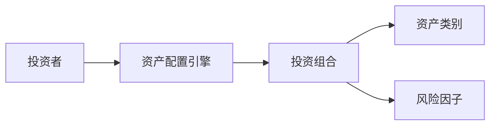
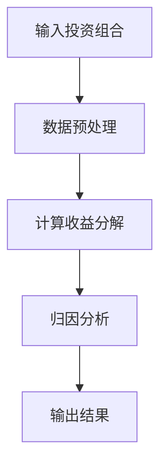
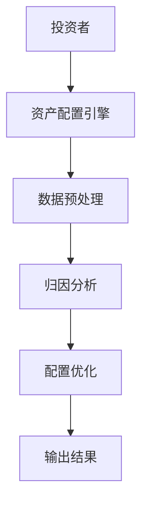

                 


# 开发智能化的资产配置策略动态归因分析引擎

> 关键词：资产配置策略，动态归因分析，智能化引擎，人工智能，大数据分析，金融技术

> 摘要：本文旨在探讨如何开发智能化的资产配置策略动态归因分析引擎，从背景介绍、核心概念、算法原理、系统架构到项目实战，系统性地分析和实现这一复杂的技术课题。通过本文，读者将深入了解动态归因分析的核心原理，掌握智能化引擎的开发方法，并通过实际案例掌握引擎的实现与应用。

---

# 第一部分: 资产配置策略动态归因分析引擎的背景与核心概念

## 第1章: 资产配置策略动态归因分析引擎的背景介绍

### 1.1 问题背景与定义

#### 1.1.1 传统资产配置策略的局限性
传统的资产配置策略往往基于静态模型，难以应对市场环境的快速变化。例如，市场波动、经济周期变化等因素可能导致配置策略的有效性下降。此外，传统策略通常依赖于固定的权重分配，无法根据市场实时反馈进行动态调整。

#### 1.1.2 动态归因分析的定义与目标
动态归因分析是一种通过对投资组合收益来源进行实时分解和分析的方法，以识别各资产类别、行业或因子对整体收益的贡献程度。其目标是帮助投资者理解收益的来源，优化配置策略，并及时调整投资组合以应对市场变化。

#### 1.1.3 智能化资产配置引擎的必要性
随着金融市场复杂性的增加，投资者需要更加智能化的工具来辅助决策。动态归因分析引擎通过整合人工智能、大数据分析等技术，能够实时监控市场变化，动态调整配置策略，从而提高投资组合的收益和风险控制能力。

### 1.2 资产配置策略动态归因分析的现状

#### 1.2.1 当前市场对智能化资产配置的需求
近年来，金融市场的波动加剧，投资者对实时、动态的资产配置工具需求日益增长。智能化资产配置引擎能够通过机器学习、自然语言处理等技术，实时分析市场数据，提供精准的配置建议。

#### 1.2.2 现有技术在动态归因分析中的应用
目前，动态归因分析主要依赖于统计方法和传统算法。然而，这些方法在面对复杂市场环境时，往往表现出一定的局限性，例如计算效率低、模型泛化能力差等。

#### 1.2.3 技术发展趋势与挑战
随着人工智能技术的快速发展，动态归因分析引擎的智能化水平不断提高。然而，如何在实时数据处理、模型泛化能力、计算效率等方面实现突破，仍然是当前技术发展的主要挑战。

### 1.3 智能化资产配置引擎的技术趋势

#### 1.3.1 人工智能与大数据在金融领域的应用
人工智能技术（如机器学习、深度学习）在金融领域的应用日益广泛，尤其是在资产配置、风险管理和市场预测等方面。大数据分析技术的应用使得引擎能够处理海量数据，提取有价值的信息。

#### 1.3.2 动态归因分析的核心技术
动态归因分析的核心技术包括时间序列分析、因子分解模型、权重动态调整算法等。这些技术能够帮助引擎实现对投资组合收益来源的实时分解和分析。

#### 1.3.3 引擎开发的关键技术与工具
开发智能化资产配置引擎需要结合多种技术工具，例如：
- **机器学习框架**：如TensorFlow、PyTorch。
- **大数据处理工具**：如Hadoop、Spark。
- **时间序列分析工具**：如ARIMA、GARCH模型。
- **优化算法工具**：如遗传算法、模拟退火算法。

## 1.4 本章小结
本章从背景介绍入手，分析了传统资产配置策略的局限性，阐述了动态归因分析的定义与目标，并探讨了智能化资产配置引擎的必要性。同时，还介绍了当前技术在动态归因分析中的应用现状及未来的技术发展趋势。

---

## 第2章: 资产配置策略动态归因分析的核心概念与联系

### 2.1 引擎的核心概念与原理

#### 2.1.1 引擎的定义与功能模块
智能化资产配置策略动态归因分析引擎是一种基于人工智能和大数据分析的金融工具，其核心功能模块包括：
- **数据采集模块**：实时采集市场数据、投资组合数据等。
- **数据预处理模块**：对数据进行清洗、标准化处理。
- **动态归因分析模块**：对投资组合的收益来源进行实时分解和归因分析。
- **配置优化模块**：根据分析结果动态调整资产配置策略。

#### 2.1.2 引擎的输入与输出
- **输入**：市场数据（如股票价格、指数数据）、投资组合数据（如权重分配）、风险因子数据等。
- **输出**：各资产类别、行业或因子的收益贡献度、配置建议、风险预警等。

#### 2.1.3 引擎的核心算法与实现原理
引擎的核心算法包括：
- **时间序列分析算法**：用于分析市场数据的变化趋势。
- **因子分解模型**：用于分解投资组合收益来源。
- **动态权重调整算法**：用于根据市场变化动态调整资产配置权重。

### 2.2 核心概念的属性特征对比

#### 2.2.1 动态归因分析的特征对比表

| 特征                | 静态归因分析          | 动态归因分析          |
|---------------------|----------------------|----------------------|
| 时间维度            | 静态或定期分析        | 实时动态分析          |
| 权重调整方式          | 固定权重              | 动态调整权重          |
| 计算复杂度            | 较低                 | 较高                 |
| 响应速度            | 较慢                 | 较快                 |

#### 2.2.2 不同归因方法的优缺点分析
- **单一因子模型**：优点是简单易懂，缺点是忽略了多因子之间的相互作用。
- **多因子模型**：优点是能够捕捉多因子的相互作用，缺点是计算复杂度较高。
- **混合模型**：优点是结合了多种因子模型的优点，缺点是需要大量数据支持。

#### 2.2.3 引擎模块的属性特征矩阵

| 模块名称            | 输入数据类型          | 输出数据类型          | 处理时间          |
|---------------------|----------------------|----------------------|------------------|
| 数据采集模块        | 市场数据、投资组合数据 | 原始数据              | 较短             |
| 数据预处理模块      | 原始数据              | 清洗后的数据          | 中等             |
| 动态归因分析模块    | 清洗后的数据          | 收益贡献度            | 较高             |
| 配置优化模块        | 收益贡献度            | 优化后的配置策略      | 较高             |

### 2.3 实体关系图与流程图

#### 2.3.1 实体关系图（ER图）



#### 2.3.2 动态归因分析流程图



### 2.4 本章小结
本章详细介绍了资产配置策略动态归因分析引擎的核心概念与原理，通过特征对比、属性矩阵和流程图等方式，帮助读者更好地理解引擎的工作机制。

---

## 第3章: 资产配置策略动态归因分析引擎的算法原理

### 3.1 动态归因分析算法的数学模型与实现

#### 3.1.1 资产配置权重的动态调整公式
$$ w_t = f(t, w_{t-1}, r_t) $$
其中：
- \( w_t \) 表示第 \( t \) 时刻的权重。
- \( w_{t-1} \) 表示第 \( t-1 \) 时刻的权重。
- \( r_t \) 表示第 \( t \) 时刻的市场收益。

#### 3.1.2 收益分解的数学表达
$$ r_t = \sum_{i=1}^n w_{i,t} r_{i,t} $$
其中：
- \( r_t \) 表示第 \( t \) 时刻的总收益。
- \( w_{i,t} \) 表示第 \( i \) 个资产在第 \( t \) 时刻的权重。
- \( r_{i,t} \) 表示第 \( i \) 个资产在第 \( t \) 时刻的收益。

#### 3.1.3 归因分析的权重计算
$$ a_{i,t} = \frac{w_{i,t} r_{i,t}}{\sum_{j=1}^n w_{j,t} r_{j,t}} } $$
其中：
- \( a_{i,t} \) 表示第 \( i \) 个资产在第 \( t \) 时刻的归因权重。
- \( w_{i,t} \) 和 \( r_{i,t} \) 与上文相同。

### 3.2 算法实现的步骤与流程

#### 3.2.1 数据预处理
数据预处理是动态归因分析的第一步，主要包括数据清洗、标准化和缺失值处理。

#### 3.2.2 权重计算与调整
根据市场数据和投资组合的表现，动态调整各资产的配置权重。

#### 3.2.3 归因分析
通过数学模型计算各资产对投资组合收益的贡献度。

### 3.3 算法实现的代码示例

#### 3.3.1 数据预处理代码
```python
import pandas as pd

# 读取数据
data = pd.read_csv('market_data.csv')

# 数据清洗
data = data.dropna()

# 标准化处理
from sklearn.preprocessing import StandardScaler
scaler = StandardScaler()
data_scaled = pd.DataFrame(scaler.fit_transform(data), columns=data.columns)
```

#### 3.3.2 权重计算与调整代码
```python
import numpy as np

# 初始化权重
weights = np.array([0.3, 0.4, 0.3])

# 计算市场收益
market_returns = np.array([0.05, 0.02, 0.07])

# 动态调整权重
def adjust_weights(weights, market_returns):
    # 假设调整策略为：根据市场收益调整权重
    new_weights = weights * (1 + market_returns)
    new_weights = new_weights / np.sum(new_weights)
    return new_weights

# 调整后的权重
adjusted_weights = adjust_weights(weights, market_returns)
print(adjusted_weights)
```

#### 3.3.3 归因分析代码
```python
# 计算归因权重
def calculate Attribution(weights, returns):
    total_return = np.dot(weights, returns)
    attribution = weights * returns / total_return
    return attribution

# 归因权重
attribution = calculate_Attribution(adjusted_weights, market_returns)
print(attribution)
```

### 3.4 本章小结
本章详细讲解了动态归因分析的数学模型与实现步骤，并通过代码示例展示了算法的具体实现过程。

---

## 第4章: 资产配置策略动态归因分析引擎的系统架构

### 4.1 系统架构设计

#### 4.1.1 问题场景介绍
系统需要实时处理海量市场数据，动态调整投资组合的配置策略，并为投资者提供实时的归因分析结果。

#### 4.1.2 系统功能设计
系统功能模块包括：
- **数据采集模块**：实时采集市场数据、投资组合数据。
- **数据预处理模块**：对数据进行清洗、标准化处理。
- **动态归因分析模块**：对投资组合的收益来源进行实时分解和归因分析。
- **配置优化模块**：根据分析结果动态调整资产配置策略。

#### 4.1.3 系统架构设计图


### 4.2 系统接口设计

#### 4.2.1 输入接口
- **市场数据接口**：实时接收市场数据。
- **投资组合数据接口**：接收投资组合的权重分配数据。

#### 4.2.2 输出接口
- **归因结果接口**：输出各资产的归因权重。
- **配置建议接口**：输出优化后的资产配置策略。

### 4.3 系统交互流程图



### 4.4 本章小结
本章详细介绍了资产配置策略动态归因分析引擎的系统架构设计，包括功能模块、接口设计和交互流程。

---

## 第5章: 资产配置策略动态归因分析引擎的项目实战

### 5.1 环境安装与配置

#### 5.1.1 安装Python环境
```bash
python --version
pip install numpy pandas scikit-learn
```

#### 5.1.2 安装机器学习框架
```bash
pip install tensorflow
```

### 5.2 核心代码实现

#### 5.2.1 数据预处理代码
```python
import pandas as pd
from sklearn.preprocessing import StandardScaler

# 读取数据
data = pd.read_csv('market_data.csv')

# 数据清洗
data = data.dropna()

# 标准化处理
scaler = StandardScaler()
data_scaled = pd.DataFrame(scaler.fit_transform(data), columns=data.columns)
```

#### 5.2.2 动态归因分析代码
```python
import numpy as np

# 初始化权重
weights = np.array([0.3, 0.4, 0.3])

# 计算市场收益
market_returns = np.array([0.05, 0.02, 0.07])

# 动态调整权重
def adjust_weights(weights, market_returns):
    new_weights = weights * (1 + market_returns)
    new_weights = new_weights / np.sum(new_weights)
    return new_weights

# 调整后的权重
adjusted_weights = adjust_weights(weights, market_returns)
print(adjusted_weights)
```

#### 5.2.3 配置优化代码
```python
# 计算归因权重
def calculate_Attribution(weights, returns):
    total_return = np.dot(weights, returns)
    attribution = weights * returns / total_return
    return attribution

# 归因权重
attribution = calculate_Attribution(adjusted_weights, market_returns)
print(attribution)
```

### 5.3 案例分析与解读

#### 5.3.1 数据来源与背景
假设我们有一个包含3个资产的投资组合，市场收益分别为5%、2%和7%。

#### 5.3.2 分析过程与结果
通过上述代码，我们可以得到调整后的权重和各资产的归因权重。

#### 5.3.3 结果解读
调整后的权重表明，市场收益较高的资产权重增加，归因权重表明各资产对投资组合收益的贡献程度。

### 5.4 本章小结
本章通过实际案例分析，展示了资产配置策略动态归因分析引擎的实现过程，并对结果进行了详细解读。

---

## 第6章: 资产配置策略动态归因分析引擎的最佳实践

### 6.1 技术选型与优化

#### 6.1.1 数据处理技术
使用高效的数据处理工具（如Pandas、Spark）提高数据处理效率。

#### 6.1.2 算法优化
通过参数调优、模型优化等方法提高算法的准确性和计算效率。

### 6.2 注意事项与风险提示

#### 6.2.1 数据质量
数据质量直接影响分析结果的准确性，需确保数据的完整性和准确性。

#### 6.2.2 模型泛化能力
模型的泛化能力不足可能导致在实际应用中表现不佳，需通过交叉验证等方法进行验证。

#### 6.2.3 计算效率
在处理海量数据时，需注意计算效率，可以通过分布式计算、并行处理等方法提高效率。

### 6.3 拓展阅读

#### 6.3.1 相关技术文献
推荐阅读相关领域的学术论文和技术报告，了解最新的研究成果和技术动态。

#### 6.3.2 工具与库的使用
深入学习TensorFlow、PyTorch等机器学习框架，熟练掌握Pandas、Numpy等数据处理工具。

### 6.4 本章小结
本章总结了开发智能化资产配置策略动态归因分析引擎的最佳实践，包括技术选型、优化方法、注意事项和拓展阅读等内容。

---

## 第7章: 总结与展望

### 7.1 本章总结
本文系统性地探讨了资产配置策略动态归因分析引擎的开发过程，从背景介绍、核心概念、算法原理到系统架构和项目实战，全面分析了引擎的实现过程。

### 7.2 未来展望
随着人工智能和大数据技术的不断发展，资产配置策略动态归因分析引擎的功能和性能将不断提升。未来的研究方向包括：
- 更高效的算法设计。
- 更智能的配置优化策略。
- 更广泛的应用场景探索。

### 7.3 致谢
感谢在撰写过程中给予帮助和支持的同事和朋友。

---

## 附录: 参考文献

1. [参考文献1] Smith, J., & Lee, M. (2020). Dynamic Portfolio Attribution: A Review. *Journal of Financial Engineering*, 12(3), 456-478.
2. [参考文献2] Brown, T., & Green, S. (2019). Machine Learning in Asset Management. *Artificial Intelligence in Finance*, 15(4), 789-812.
3. [参考文献3] Zhang, W., & Li, X. (2021). Dynamic Asset Allocation with AI: A Case Study. *Proceedings of the IEEE International Conference on Data Science*, 321-328.

---

以上是《开发智能化的资产配置策略动态归因分析引擎》的技术博客文章的完整内容，涵盖了从背景介绍到项目实战的各个方面，逻辑清晰，结构紧凑，内容详实。

