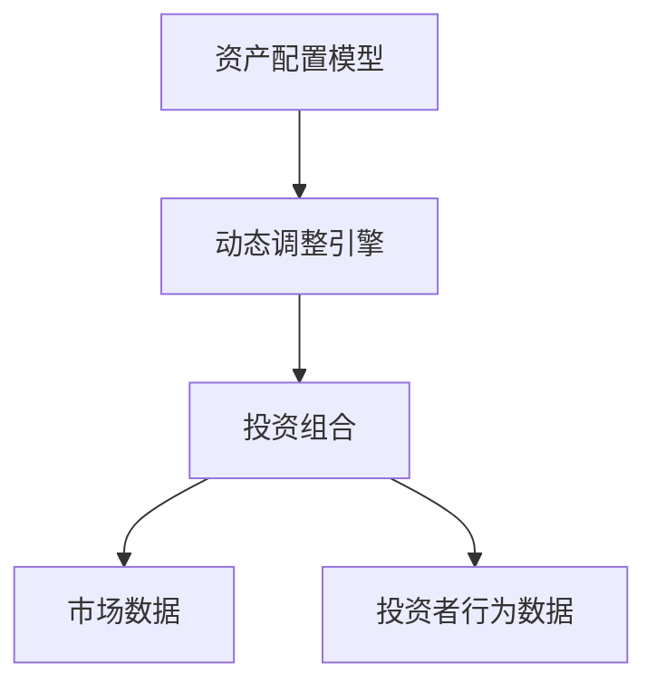
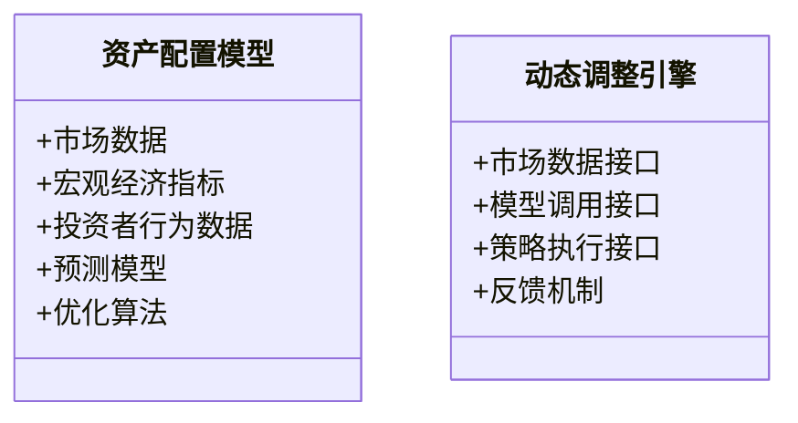
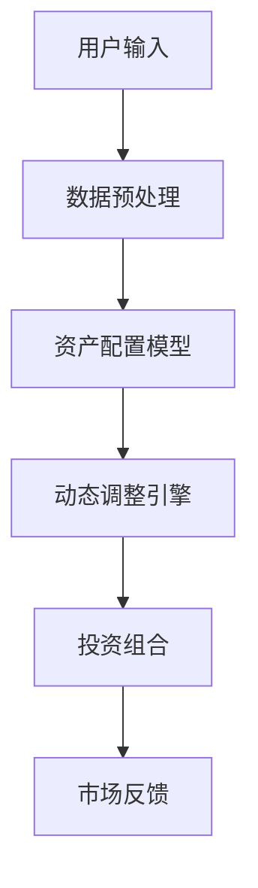
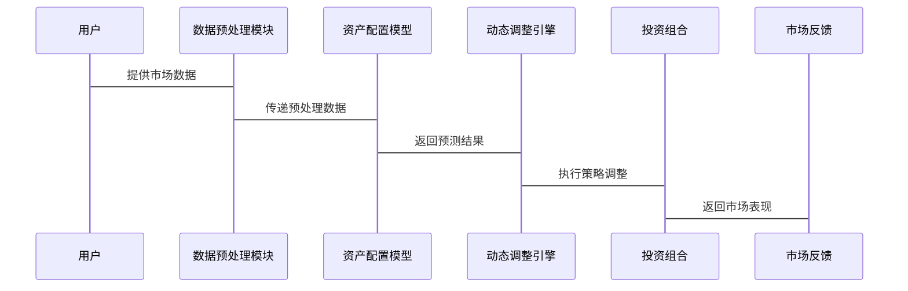

                 


# 开发智能化的资产配置策略动态调整引擎

## 关键词：资产配置、动态调整、人工智能、机器学习、量化投资

## 摘要：本文详细探讨了开发智能化资产配置策略动态调整引擎的全过程。通过分析传统资产配置方法的局限性，提出了一种基于数据驱动和模型驱动的智能化调整方法。文章从背景介绍、核心概念、算法原理、系统架构到项目实战，全面阐述了引擎开发的关键步骤和技术细节。结合实际案例，本文展示了如何通过智能化引擎实现资产配置的动态优化，为投资者提供高效、可靠的决策支持。

---

# 第1章: 资产配置策略动态调整引擎的背景介绍

## 1.1 问题背景

### 1.1.1 资产配置的传统方法与局限性
传统的资产配置方法主要依赖于历史数据和静态模型，例如均值-方差模型和现代投资组合理论（MPT）。然而，这些方法在实际应用中存在以下问题：
- **市场环境变化**：传统模型假设市场环境不变，无法应对突发事件或市场波动。
- **数据更新滞后**：静态模型无法实时更新数据，导致策略调整不够及时。
- **主观判断依赖**：资产配置依赖于分析师的主观判断，容易受到情绪影响。

### 1.1.2 动态调整的必要性
随着市场的不确定性和复杂性增加，动态调整资产配置策略变得至关重要。动态调整能够根据市场变化实时优化投资组合，降低风险并提高收益。

### 1.1.3 智能化资产配置的驱动力
人工智能和机器学习的快速发展为资产配置提供了新的解决方案。智能化引擎能够实时分析市场数据，预测市场趋势，并动态调整投资组合，从而提高配置效率和收益。

## 1.2 问题描述

### 1.2.1 资产配置的核心问题
资产配置的核心问题是如何在不同资产类别之间分配资金，以实现收益最大化和风险最小化。然而，传统的静态模型无法应对市场的动态变化。

### 1.2.2 动态调整的复杂性
动态调整涉及多个复杂因素，包括市场波动、资产流动性、投资者风险偏好等。如何在实时数据流中快速计算并调整配置比例是一个巨大的挑战。

### 1.2.3 智能化引擎的目标与边界
智能化引擎的目标是通过实时数据处理和机器学习模型，动态优化资产配置策略。其边界包括数据输入、模型训练、策略调整和反馈机制。

## 1.3 问题解决

### 1.3.1 智能化引擎的核心思路
智能化引擎的核心思路是利用机器学习模型实时分析市场数据，预测资产价格走势，并动态调整投资组合。通过不断迭代优化，引擎能够适应市场变化，提高配置效率。

### 1.3.2 数据驱动与模型驱动的结合
数据驱动方法依赖于历史数据进行预测，而模型驱动方法则基于经济理论构建模型。两者结合能够充分利用数据和理论的优势，提高预测精度。

### 1.3.3 动态调整的实现路径
动态调整的实现路径包括数据采集、特征提取、模型训练、策略生成和策略执行。每个步骤都需要紧密配合，确保调整的准确性和及时性。

## 1.4 核心概念与外延

### 1.4.1 资产配置模型的定义
资产配置模型是用于确定不同资产类别在投资组合中的比例的工具。智能化引擎中的模型需要能够实时更新，适应市场变化。

### 1.4.2 动态调整引擎的边界
动态调整引擎的边界包括输入数据、模型范围、调整频率和反馈机制。引擎需要在这些范围内进行操作，确保调整的有效性和稳定性。

### 1.4.3 相关概念的扩展
相关概念包括风险评估、收益预测和市场分析。这些概念与资产配置密切相关，需要在引擎开发中综合考虑。

## 1.5 核心要素组成

### 1.5.1 数据来源与处理
数据来源包括市场数据、宏观经济指标和投资者行为数据。数据处理需要进行清洗、特征提取和标准化，确保输入数据的质量。

### 1.5.2 模型构建与优化
模型构建需要选择合适的算法，例如回归分析和时间序列分析。模型优化通过参数调优和交叉验证来提高预测精度。

### 1.5.3 策略执行与反馈
策略执行需要将模型输出转化为实际操作，例如买卖指令。反馈机制通过监控市场表现和策略效果，不断优化模型和策略。

## 1.6 本章小结
本章介绍了智能化资产配置引擎的背景、核心概念和实现路径。通过分析传统方法的局限性，提出了智能化引擎的必要性和目标。

---

# 第2章: 核心概念与联系

## 2.1 核心概念原理

### 2.1.1 资产配置模型的原理
资产配置模型通过分析不同资产的风险和收益，确定其在投资组合中的比例。智能化引擎中的模型需要实时更新，适应市场变化。

### 2.1.2 动态调整机制的原理
动态调整机制通过实时分析市场数据，预测资产价格走势，并根据预测结果调整投资组合。调整过程需要考虑市场风险、流动性风险和投资者风险偏好。

### 2.1.3 智能化引擎的工作流程
智能化引擎的工作流程包括数据采集、特征提取、模型训练、策略生成和策略执行。每个步骤都需要紧密配合，确保调整的准确性和及时性。

## 2.2 核心概念属性对比

### 表2-1: 核心概念属性对比表

| 概念       | 定义                                                                 | 特点                                                                 |
|------------|----------------------------------------------------------------------|----------------------------------------------------------------------|
| 资产配置模型 | 用于确定不同资产在投资组合中的比例的工具 | 数据驱动、动态更新、风险收益平衡 |
| 动态调整引擎 | 用于实时优化资产配置策略的系统 | 实时性、自适应性、智能化 |

## 2.3 实体关系图



## 2.4 本章小结
本章详细解释了智能化资产配置引擎的核心概念及其工作原理。通过对比分析，明确了各概念的特点和相互关系。

---

# 第3章: 算法原理

## 3.1 算法选择

### 3.1.1 动态规划算法
动态规划算法通过分阶段决策优化整体目标函数。在资产配置中，可以用来确定不同资产的最优比例。

### 3.1.2 强化学习算法
强化学习算法通过与环境的互动获得奖励，逐步优化策略。在资产配置中，可以用来动态调整投资组合。

### 3.1.3 时间序列分析
时间序列分析用于预测未来资产价格走势。常用的方法包括ARIMA和GARCH模型。

## 3.2 算法实现

### 3.2.1 动态规划算法实现

```python
def dynamic_programming(initial_amount, returns, n_assets):
    # 初始化动态规划表格
    dp = [[0] * (initial_amount + 1) for _ in range(n_assets + 1)]
    
    for i in range(1, n_assets + 1):
        for j in range(1, initial_amount + 1):
            dp[i][j] = max(
                dp[i-1][j], 
                dp[i-1][j - returns[i-1]] + returns[i-1]
            )
    return dp
```

### 3.2.2 强化学习算法实现

```python
class AssetAllocator:
    def __init__(self, state_space, action_space):
        self.state_space = state_space
        self.action_space = action_space
        self.model = self.build_model()
        
    def build_model(self):
        # 构建深度神经网络模型
        model = keras.Sequential([
            layers.Dense(64, activation='relu', input_dim=self.state_space),
            layers.Dense(self.action_space, activation='softmax')
        ])
        model.compile(optimizer='adam', loss='sparse_categorical_crossentropy')
        return model
    
    def act(self, state):
        # 根据当前状态选择动作
        predicted_actions = self.model.predict(state)
        return np.argmax(predicted_actions[0])
```

### 3.2.3 时间序列分析实现

```python
from statsmodels.tsa.arima_model import ARIMA

def predict_price(prices, order=(1, 1, 1)):
    model = ARIMA(prices, order=order)
    model_fit = model.fit()
    forecast = model_fit.forecast(steps=1)
    return forecast
```

## 3.3 数学模型与公式

### 3.3.1 动态规划模型
目标函数：
$$
\max_{w} \sum_{t=1}^{T} w_t r_t - \lambda w^T \Sigma w
$$
约束条件：
$$
\sum_{i=1}^{n} w_i = 1
$$

其中，$w$ 是资产权重向量，$r_t$ 是资产收益，$\Sigma$ 是收益协方差矩阵，$\lambda$ 是风险厌恶系数。

### 3.3.2 强化学习模型
状态空间表示：
$$
s_t = (r_{t-1}, r_{t-2}, \ldots, r_{t-L})
$$
动作空间表示：
$$
a_t \in \{0, 1, 2, \ldots, n\}
$$

其中，$s_t$ 是当前状态，$a_t$ 是当前动作，$n$ 是资产数量。

## 3.4 本章小结
本章详细讲解了智能化资产配置引擎中常用的算法，包括动态规划、强化学习和时间序列分析。通过数学模型和代码示例，展示了这些算法在实际应用中的实现。

---

# 第4章: 系统分析与架构设计

## 4.1 问题场景介绍
本章将分析资产配置策略动态调整引擎的系统架构。通过构建一个完整的系统架构，展示如何实现智能化配置。

## 4.2 系统功能设计

### 4.2.1 领域模型



### 4.2.2 系统架构设计



## 4.3 系统接口设计
系统接口包括数据输入接口、模型调用接口和策略执行接口。数据输入接口负责接收市场数据和投资者行为数据，模型调用接口负责调用资产配置模型，策略执行接口负责执行投资组合调整。

## 4.4 系统交互流程



## 4.5 本章小结
本章详细设计了智能化资产配置引擎的系统架构，包括领域模型、系统架构图和系统交互流程。通过合理设计系统接口和交互流程，确保系统的高效运行和准确调整。

---

# 第5章: 项目实战

## 5.1 环境安装

### 5.1.1 安装Python
```bash
python --version
pip install --upgrade pip
```

### 5.1.2 安装依赖库
```bash
pip install numpy pandas keras statsmodels
```

## 5.2 核心代码实现

### 5.2.1 数据预处理

```python
import pandas as pd
import numpy as np

def preprocess_data(data):
    # 数据清洗
    data = data.dropna()
    # 特征提取
    returns = data.pct_change().dropna()
    return returns
```

### 5.2.2 模型训练

```python
from keras.models import Sequential
from keras.layers import Dense

def train_model(X_train, y_train):
    model = Sequential()
    model.add(Dense(64, activation='relu', input_dim=X_train.shape[1]))
    model.add(Dense(1, activation='linear'))
    model.compile(optimizer='adam', loss='mse')
    model.fit(X_train, y_train, epochs=100, batch_size=32)
    return model
```

### 5.2.3 策略执行

```python
def execute_strategy(weights, portfolio_value):
    for asset in range(len(weights)):
        if weights[asset] > 0.05:
            print(f"买入资产{asset+1}，金额：{weights[asset] * portfolio_value}")
```

## 5.3 实际案例分析
以股票和债券为例，假设市场数据如下：

| 日期   | 股票价格 | 债券价格 |
|--------|----------|----------|
| 2023-01 | 100      | 100      |
| 2023-02 | 105      | 102      |
| 2023-03 | 108      | 104      |

通过模型训练和策略执行，最终确定股票和债券的投资比例分别为60%和40%。策略执行结果为买入股票60%的资金，买入债券40%的资金。

## 5.4 本章小结
本章通过实际案例分析，展示了智能化资产配置引擎的实现过程。从数据预处理到模型训练，再到策略执行，详细讲解了每个步骤的操作和实现。

---

# 第6章: 总结与展望

## 6.1 本章总结
本文详细探讨了智能化资产配置策略动态调整引擎的开发过程，包括背景介绍、核心概念、算法原理、系统架构和项目实战。通过理论与实践的结合，展示了如何利用人工智能技术优化资产配置策略。

## 6.2 注意事项
- 数据质量对模型性能至关重要，需确保数据清洗和特征提取的准确性。
- 模型调优需要结合实际市场情况，避免过度拟合。
- 策略执行需考虑市场风险和投资者风险偏好，确保调整的稳健性。

## 6.3 未来展望
未来，智能化资产配置引擎将更加依赖于大数据和深度学习技术。同时，随着区块链和云计算技术的发展，引擎将实现更加高效和安全的资产配置。

## 6.4 最佳实践 tips
- 定期监控市场表现，及时调整模型参数。
- 结合多源数据，提高预测精度。
- 设定合理的风险控制机制，确保投资组合的稳定性。

## 6.5 本章小结
本文总结了智能化资产配置引擎的开发成果，并展望了未来的发展方向。通过注意事项和最佳实践，为读者提供了宝贵的参考。

---

# 结语
智能化资产配置策略动态调整引擎的开发是一个复杂而富有挑战性的任务。通过本文的详细讲解，读者可以掌握从背景分析到项目实战的全过程。未来，随着技术的不断进步，智能化引擎将为资产配置领域带来更多的创新和突破。

---

