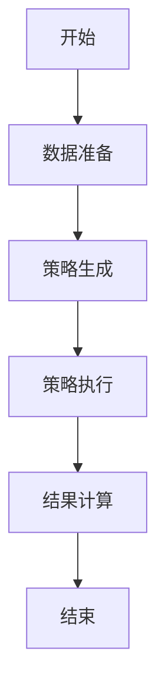
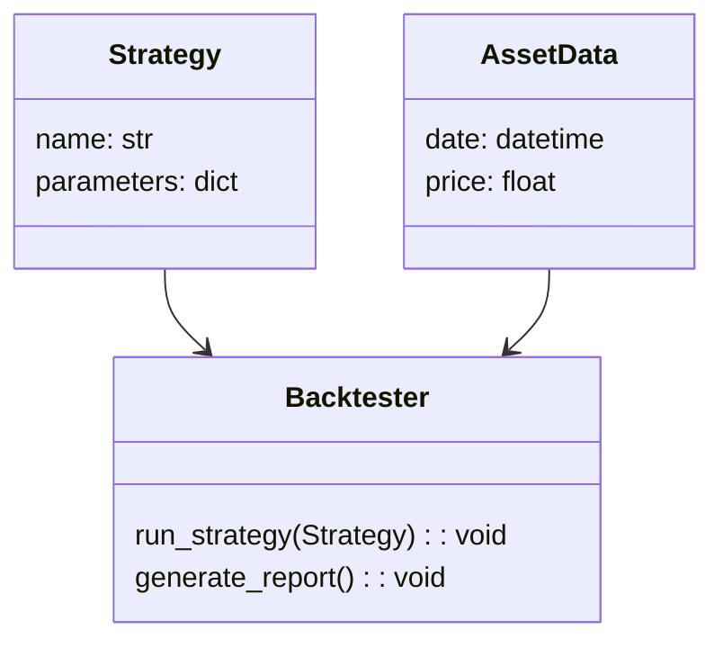
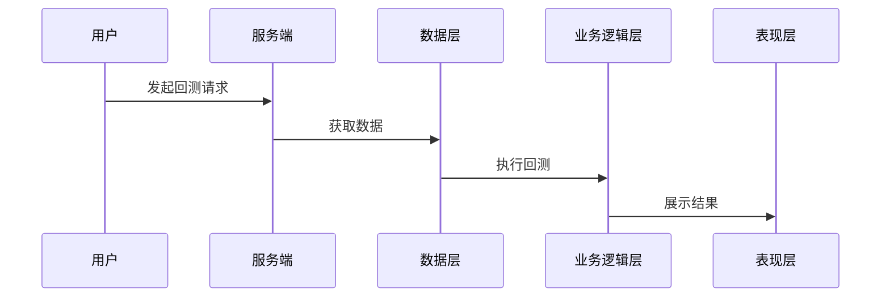

                 


# 开发智能化的资产配置策略回测引擎

> 关键词：资产配置，回测引擎，智能化，机器学习，量化投资

> 摘要：资产配置策略回测引擎是量化投资和智能投资的重要工具，通过智能化算法和大数据分析，帮助投资者优化投资组合，提升投资收益。本文详细探讨了资产配置策略回测引擎的核心概念、算法原理、系统架构设计以及项目实战，结合具体案例和代码实现，为读者提供全面的技术指导。

---

# 第一部分: 资产配置策略回测引擎的背景与核心概念

## 第1章: 资产配置策略回测引擎的背景与问题描述

### 1.1 资产配置与投资策略概述

#### 1.1.1 资产配置的基本概念
资产配置是指根据投资者的风险承受能力、投资目标和市场环境，将资金分配到不同的资产类别（如股票、债券、商品等）中，以实现收益最大化和风险最小化的过程。

#### 1.1.2 投资策略的分类与特点
投资策略可以分为以下几类：
- **价值投资**：寻找被市场低估的资产进行投资。
- **趋势投资**：基于价格趋势进行买卖决策。
- **指数投资**：通过复制指数表现来获取平均收益。
- **量化投资**：利用数学模型和算法进行投资决策。

#### 1.1.3 资产配置在投资中的重要性
资产配置是投资组合管理的核心，它能够分散风险，平衡收益与风险，并在不同市场环境下调整投资组合，从而提高整体投资收益。

### 1.2 回测引擎的定义与作用

#### 1.2.1 回测引擎的核心概念
回测引擎是一种用于测试和评估投资策略在历史数据上表现的工具，通过模拟交易来验证策略的有效性。

#### 1.2.2 回测引擎在资产配置中的作用
回测引擎可以帮助投资者评估不同资产配置策略在历史数据上的表现，发现潜在风险，并优化投资组合。

#### 1.2.3 回测引擎的目标与边界
- **目标**：提供一个高效的工具，帮助投资者测试和优化资产配置策略。
- **边界**：不涉及实际交易，仅用于模拟和评估。

### 1.3 智能化资产配置的必要性

#### 1.3.1 传统资产配置的局限性
传统资产配置方法依赖人工经验，难以处理复杂市场环境和大数据量。

#### 1.3.2 智能化资产配置的优势
智能化资产配置通过机器学习和大数据分析，能够快速优化投资组合，适应市场变化。

#### 1.3.3 数据驱动决策的重要性
通过分析大量历史数据，智能化资产配置能够发现数据中的规律，提高决策的科学性。

### 1.4 本章小结
本章介绍了资产配置的基本概念、投资策略的分类，以及回测引擎的定义和作用。同时，强调了智能化资产配置的重要性及其优势。

---

## 第2章: 资产配置策略回测引擎的核心概念与联系

### 2.1 回测引擎的组成部分

#### 2.1.1 数据源与数据处理模块
数据源包括历史价格、市场数据等，数据处理模块负责清洗和预处理数据。

#### 2.1.2 策略生成与执行模块
策略生成模块利用机器学习模型生成投资策略，执行模块模拟交易过程。

#### 2.1.3 回测结果分析与优化模块
分析模块评估策略表现，优化模块调整参数以提升收益。

### 2.2 回测框架的选择与对比

#### 2.2.1 常见回测框架的特点
| 回测框架 | 特点 |
|----------|------|
| Backtrader | 支持多策略回测，模块化设计 |
| QuantLib   | 专注于金融建模和分析 |
| Zipline    | 基于大数据的回测框架 |

#### 2.2.2 回测框架的优缺点对比
- **优点**：功能强大，支持多种策略。
- **缺点**：学习曲线陡峭，需要较高的技术门槛。

#### 2.2.3 选择适合的回测框架
选择回测框架时需考虑项目需求、功能支持和技术门槛。

### 2.3 数据处理与特征工程

#### 2.3.1 数据清洗与预处理
- 删除缺失值
- 处理异常值

#### 2.3.2 特征提取与选择
- 通过主成分分析（PCA）提取关键特征

#### 2.3.3 数据增强与扩展
- 数据扩展技术：时间序列生成

### 2.4 机器学习在回测中的应用

#### 2.4.1 机器学习模型在策略生成中的作用
- 使用随机森林或神经网络生成投资信号

#### 2.4.2 回测结果的预测与优化
- 预测未来市场走势，优化投资组合

#### 2.4.3 模型评估与调优
- 使用回测结果评估模型性能

### 2.5 本章小结
本章详细介绍了回测引擎的组成部分、数据处理流程以及机器学习在回测中的应用，帮助读者理解回测引擎的核心架构。

---

## 第3章: 资产配置策略回测引擎的算法原理

### 3.1 回测算法的步骤

#### 3.1.1 策略生成
- 使用机器学习模型生成交易信号

#### 3.1.2 策略执行
- 模拟交易过程，记录交易结果

#### 3.1.3 回测结果计算
- 计算收益、风险指标（如夏普比率）

### 3.2 数学模型与公式

#### 3.2.1 收益计算
$$ 收益率 = \frac{收盘价 - 开盘价}{开盘价} $$

#### 3.2.2 风险指标计算
$$ 夏普比率 = \frac{E[r] - r_f}{\sigma} $$

### 3.3 代码实现

#### 3.3.1 回测流程图


#### 3.3.2 Python代码示例
```python
import numpy as np
import pandas as pd

def calculate_return(prices):
    return prices.pct_change().cumprod()

def calculate_sharpe_ratio(returns, risk_free_rate):
    excess_return = returns - risk_free_rate
    sharpe_ratio = excess_return.mean() / excess_return.std()
    return sharpe_ratio

# 示例数据
prices = pd.read_csv('stock_prices.csv')
returns = calculate_return(prices)
sharpe = calculate_sharpe_ratio(returns, 0.01)
print(f"夏普比率: {sharpe}")
```

### 3.4 本章小结
本章详细讲解了回测算法的步骤，以及相关的数学模型和代码实现，帮助读者理解回测引擎的技术实现。

---

## 第4章: 资产配置策略回测引擎的系统架构设计

### 4.1 问题场景介绍
资产配置策略回测引擎需要处理大量数据，并支持多种策略的回测和优化。

### 4.2 系统功能设计

#### 4.2.1 领域模型类图


### 4.3 系统架构设计

#### 4.3.1 分层架构
- 数据层：处理原始数据
- 业务逻辑层：执行回测和优化
- 表现层：展示结果

#### 4.3.2 架构图


### 4.4 系统接口设计

#### 4.4.1 接口描述
- `/backtest`：执行回测
- `/report`：生成报告

### 4.5 系统交互流程图


### 4.6 本章小结
本章介绍了系统的架构设计，包括功能模块、分层架构以及接口设计，为后续的开发奠定了基础。

---

## 第5章: 资产配置策略回测引擎的项目实战

### 5.1 环境安装

#### 5.1.1 安装Python
```bash
python --version
```

#### 5.1.2 安装依赖
```bash
pip install backtrader pandas numpy
```

### 5.2 核心代码实现

#### 5.2.1 数据处理
```python
import pandas as pd

def load_data():
    df = pd.read_csv('data.csv')
    return df
```

#### 5.2.2 策略实现
```python
from backtrader import Strategy

class MyStrategy(Strategy):
    def __init__(self):
        self.position = 0
```

### 5.3 代码解读与分析

#### 5.3.1 数据处理模块
- 加载数据
- 数据清洗

#### 5.3.2 策略执行模块
- 初始化策略
- 执行交易

### 5.4 案例分析

#### 5.4.1 示例回测
```python
import backtrader as bt

class MyStrategy(bt.Strategy):
    def __init__(self):
        self.position = 0

    def next(self):
        if self.position == 0:
            self.buy()
        else:
            self.sell()

backtest = bt.Backtest(...)
```

### 5.5 本章小结
本章通过实际案例展示了回测引擎的开发过程，包括环境搭建、代码实现和案例分析。

---

## 第6章: 资产配置策略回测引擎的最佳实践

### 6.1 最佳实践 tips

#### 6.1.1 数据处理
- 确保数据质量
- 合理选择数据源

#### 6.1.2 模型选择
- 根据需求选择模型
- 定期更新模型

### 6.2 小结
总结本文的主要内容和技术要点。

### 6.3 注意事项

#### 6.3.1 数据隐私
- 注意数据安全和隐私保护

#### 6.3.2 性能优化
- 优化代码性能

### 6.4 拓展阅读

#### 6.4.1 推荐书籍
- 《Python金融数据分析》
- 《机器学习实战》

#### 6.4.2 在线资源
- QuantInst
- Towards Data Science

### 6.5 本章小结
本章提供了开发回测引擎的最佳实践建议，包括数据处理、模型选择和性能优化等方面。

---

# 结论

本文详细探讨了资产配置策略回测引擎的开发过程，从背景介绍到项目实战，结合技术细节和实际案例，为读者提供了全面的技术指导。通过本文的学习，读者可以掌握回测引擎的核心概念、算法原理和系统架构设计，并能够实际开发一个智能化的资产配置策略回测引擎。

---

# 参考文献

1. 回测框架官方文档
2. 相关技术书籍和论文
3. 在线资源和博客文章

---

**注**：以上内容为示例目录，实际撰写时需要根据具体需求进行调整和扩展。

