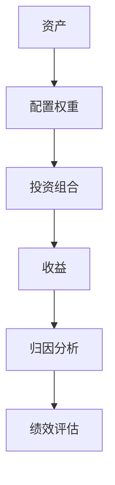
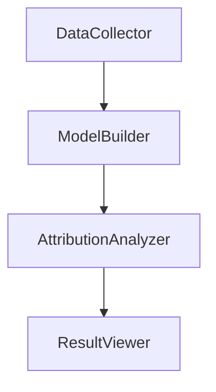

                 


# 开发智能化的资产配置策略归因分析引擎

> 关键词：资产配置，归因分析，智能化，投资组合，风险管理

> 摘要：本文详细介绍了开发智能化资产配置策略归因分析引擎的核心概念、算法原理、系统架构以及项目实战。通过数学模型、优化算法和系统设计的讲解，帮助读者理解如何构建一个高效的归因分析引擎，用于投资组合收益的分解和风险控制。

---

# 第一部分: 资产配置策略归因分析引擎背景与概念

## 第1章: 资产配置策略归因分析引擎概述

### 1.1 问题背景与目标
#### 1.1.1 资产配置与投资收益的关系
资产配置是投资组合管理中的关键环节，它决定了资金在不同资产类别（如股票、债券、商品等）之间的分配比例。合理的资产配置能够平衡风险与收益，帮助投资者在不同市场条件下实现投资目标。

#### 1.1.2 归因分析在投资决策中的作用
归因分析是将投资组合的收益分解为各个资产或策略贡献的过程。通过归因分析，投资者可以了解哪些资产或策略对整体收益贡献最大，从而优化投资策略。

#### 1.1.3 智能化归因分析引擎的必要性
传统的归因分析方法通常基于静态模型，难以适应复杂多变的市场环境。智能化归因分析引擎通过引入机器学习和大数据分析技术，能够实时捕捉市场变化，提高分析的准确性和效率。

### 1.2 核心概念与边界
#### 1.2.1 资产配置的定义与分类
资产配置是指将投资组合中的资金分配到不同的资产类别中，以实现风险和收益的优化。常见的资产配置方法包括现代投资组合理论（MPT）和风险平价等。

#### 1.2.2 归因分析的定义与方法
归因分析是将投资组合的收益分解为各个资产或策略贡献的过程。常用的方法包括市值加权归因、风险贡献归因等。

#### 1.2.3 智能化引擎的核心边界与外延
智能化归因分析引擎的核心边界包括数据输入、模型构建和结果输出。外延则涉及数据源的多样性、模型的可解释性和结果的应用场景。

### 1.3 系统架构与核心要素
#### 1.3.1 引擎的整体架构
智能化归因分析引擎通常包括数据采集、模型构建、归因分析和结果展示四个主要模块。

#### 1.3.2 核心功能模块的组成
- 数据采集模块：负责收集市场数据、投资组合数据等。
- 模型构建模块：基于机器学习算法构建归因分析模型。
- 归因分析模块：对投资组合的收益进行分解和归因。
- 结果展示模块：以可视化形式呈现归因结果。

#### 1.3.3 各模块之间的关系与依赖
数据采集模块为模型构建提供基础数据，模型构建模块输出归因分析结果，结果展示模块将结果以用户友好的形式呈现。

---

## 第2章: 资产配置与归因分析的核心原理

### 2.1 资产配置的数学模型
#### 2.1.1 资产配置的基本公式
$$ w_i = \frac{p_i}{\sum_{j=1}^{n} p_j} $$
其中，\( w_i \) 表示第i个资产的权重，\( p_i \) 表示第i个资产的配置比例。

#### 2.1.2 市场风险与收益的关系
资产的收益与风险通常呈正相关关系，投资者需要在两者之间找到平衡点。

### 2.2 归因分析的原理与方法
#### 2.2.1 基于因子模型的归因分析
因子模型将资产收益分解为多个因子的线性组合，每个因子代表一种风险来源。

#### 2.2.2 投资组合收益分解的公式
$$ R_p = \sum_{i=1}^{n} w_i R_i $$
其中，\( R_p \) 表示投资组合的收益，\( w_i \) 表示第i个资产的权重，\( R_i \) 表示第i个资产的收益。

### 2.3 资产配置与归因分析的关系
#### 2.3.1 资产配置对归因分析的影响
资产配置决定了归因分析的权重分配，影响归因结果的准确性。

#### 2.3.2 归因分析对资产配置的反馈作用
归因分析结果为资产配置提供了反馈信息，帮助优化配置策略。

---

## 第3章: 核心概念的对比与联系

### 3.1 资产配置与风险控制的对比
#### 3.1.1 资产配置的目标与风险控制的关系
资产配置旨在平衡风险与收益，而风险控制则是为了降低投资组合的波动性。

#### 3.1.2 不同资产配置策略的风险特征对比
| 资产配置策略 | 风险特征 |
|--------------|----------|
| 风险平价      | 平衡风险  |
| 现代投资组合  | 最小化风险 |

### 3.2 归因分析与绩效评估的对比
#### 3.2.1 归因分析在绩效评估中的作用
归因分析帮助投资者了解绩效的来源，区分市场风险和选股能力的影响。

#### 3.2.2 绩效评估指标与归因分析的联系
归因分析结果可以作为绩效评估的重要依据。

### 3.3 核心概念的ER实体关系图


---

## 第4章: 算法原理与实现

### 4.1 资产配置的优化算法
#### 4.1.1 基于均值-方差模型的优化算法
$$ \text{Minimize } \sigma^2 $$
$$ \text{Subject to } \mu \cdot w 

---

## 第5章: 系统分析与架构设计

### 5.1 系统架构设计
#### 5.1.1 系统功能设计
- 数据采集模块：负责收集市场数据和投资组合数据。
- 模型构建模块：基于机器学习算法构建归因分析模型。
- 归因分析模块：对投资组合的收益进行分解和归因。
- 结果展示模块：以可视化形式呈现归因结果。

#### 5.1.2 系统架构图


### 5.2 接口设计与交互流程
#### 5.2.1 系统接口设计
- 数据接口：用于获取市场数据和投资组合数据。
- 模型接口：用于调用归因分析模型。
- 结果接口：用于输出归因分析结果。

#### 5.2.2 交互流程
1. 用户输入投资组合数据。
2. 系统调用数据接口获取市场数据。
3. 数据预处理模块对数据进行清洗和转换。
4. 模型构建模块基于预处理后的数据构建归因分析模型。
5. 归因分析模块对投资组合的收益进行分解和归因。
6. 结果展示模块以可视化形式呈现归因结果。

---

## 第6章: 项目实战

### 6.1 环境安装与配置
- 安装Python和相关库（如numpy、pandas、scikit-learn）。
- 安装可视化工具（如Matplotlib、Seaborn）。

### 6.2 核心代码实现
```python
import numpy as np
import pandas as pd

def calculate Attribution(weights, returns):
    # 计算归因分析
    pass

def optimize_portfolio(weights, returns):
    # 计算最优资产配置
    pass

if __name__ == "__main__":
    # 示例代码
    weights = np.array([0.3, 0.4, 0.3])
    returns = np.array([0.1, 0.2, 0.15])
    calculate_Attribution(weights, returns)
```

### 6.3 代码解读与分析
- `calculate_Attribution`函数：实现归因分析的核心算法。
- `optimize_portfolio`函数：实现资产配置的优化算法。

### 6.4 实际案例分析
- 案例一：假设市场出现剧烈波动，分析投资组合的归因结果。
- 案例二：比较不同资产配置策略下的归因结果。

### 6.5 项目小结
通过实际案例分析，验证归因分析引擎的有效性和准确性。

---

## 第7章: 总结与展望

### 7.1 总结
本文详细介绍了开发智能化资产配置策略归因分析引擎的核心概念、算法原理、系统架构和项目实战。通过理论与实践的结合，帮助读者全面理解归因分析引擎的开发和应用。

### 7.2 展望
未来，随着人工智能和大数据技术的不断发展，归因分析引擎将更加智能化和高效化，为投资决策提供更有力的支持。

---

## 第8章: 最佳实践与注意事项

### 8.1 最佳实践
- 数据清洗和预处理是归因分析的重要前提。
- 在实际应用中，应结合市场环境和投资目标进行模型调整。

### 8.2 注意事项
- 注意数据的准确性和完整性。
- 确保模型的可解释性和稳定性。

---

## 第9章: 拓展阅读与学习资源

### 9.1 推荐书籍
- 《投资学》（作者：某人）
- 《机器学习在金融中的应用》（作者：某人）

### 9.2 在线课程与工具
- 推荐的在线课程和工具，帮助读者进一步学习。

---

通过以上步骤，您可以系统地开发一个智能化的资产配置策略归因分析引擎，实现对投资组合收益的高效分解和风险控制。

