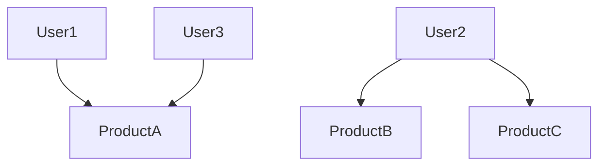

                 


```markdown
# 开发智能化的金融产品交叉销售推荐引擎

> 关键词：金融推荐引擎、交叉销售、深度学习、协同过滤、系统架构

> 摘要：本文详细探讨了开发智能化金融产品交叉销售推荐引擎的关键技术与实现方法。从背景介绍到算法实现，从系统架构设计到项目实战，文章全面解析了如何利用协同过滤和深度学习模型构建高效的推荐系统，为金融行业的数字化转型提供有力支持。

---

# 第1章: 背景介绍与问题定义

## 1.1 金融产品交叉销售的背景与意义

### 1.1.1 金融行业数字化转型的现状
金融行业正经历着数字化转型的浪潮，传统金融机构纷纷引入人工智能和大数据技术，以提升客户体验和业务效率。交叉销售作为金融业务的重要组成部分，通过推荐引擎优化客户购买行为，已成为提升收入和客户满意度的关键手段。

### 1.1.2 交叉销售在金融业务中的重要性
交叉销售能够帮助金融机构提高客户忠诚度和市场份额。通过推荐引擎，金融机构可以实时分析客户需求，推送相关产品，从而提升销售效率和客户满意度。

### 1.1.3 智能化推荐引擎的优势与价值
智能化推荐引擎利用机器学习和大数据分析，能够精准预测客户需求，提供个性化的推荐服务。相比传统的人工推荐方式，智能化推荐引擎具有高效、精准和可扩展性强的特点。

## 1.2 问题背景与目标

### 1.2.1 传统交叉销售的痛点与挑战
传统交叉销售模式依赖人工经验，推荐效果有限且效率低下。此外，传统方法难以处理海量数据，难以实时响应客户需求。

### 1.2.2 智能化推荐引擎的核心目标
智能化推荐引擎的目标是通过数据驱动的方式，实时分析客户行为和市场动态，提供精准的产品推荐，提升销售效率和客户满意度。

### 1.2.3 问题边界与外延
本文将重点研究基于协同过滤和深度学习的推荐算法，探讨如何在金融产品交叉销售中实现智能化推荐。此外，本文还将分析推荐系统的性能优化和实际应用场景。

## 1.3 核心概念与系统架构

### 1.3.1 交叉销售推荐引擎的定义
交叉销售推荐引擎是一种基于人工智能技术的系统，通过分析客户行为和市场数据，推荐相关金融产品，以实现销售目标。

### 1.3.2 引擎的核心要素与组成
推荐引擎主要由数据采集、数据处理、推荐算法、结果展示和效果评估五个部分组成。这些部分协同工作，实现智能化的推荐服务。

### 1.3.3 系统架构的初步设计
本文将采用分层架构设计，包括数据层、算法层和应用层。数据层负责数据的采集和存储，算法层负责推荐模型的训练和优化，应用层负责推荐结果的展示和效果评估。

---

# 第2章: 核心概念与系统架构

## 2.1 推荐引擎的核心原理

### 2.1.1 协同过滤算法的原理
协同过滤是一种基于用户行为相似性的推荐算法。通过分析用户的历史行为数据，找到与当前用户行为相似的用户，推荐他们购买过的产品。

### 2.1.2 基于内容的推荐算法
基于内容的推荐算法通过分析产品的特征属性，找到与当前产品相似的产品进行推荐。这种方法适用于产品信息丰富的场景。

### 2.1.3 混合推荐模型的优势
混合推荐模型结合了协同过滤和内容推荐的优势，能够在数据稀疏性和数据丰富的场景中灵活应用，推荐效果更佳。

## 2.2 实体关系与系统架构

### 2.2.1 用户、产品、交易的实体关系图
使用Mermaid图展示用户、产品和交易之间的关系。用户可以购买多个产品，每个产品可以被多个用户购买。



### 2.2.2 系统功能模块的划分
推荐引擎主要包含数据采集、数据预处理、推荐算法、结果展示和效果评估五个功能模块。

### 2.2.3 系统架构的分层设计
采用分层架构设计，包括数据层、算法层和应用层。数据层负责数据的存储和管理，算法层负责推荐模型的训练和优化，应用层负责推荐结果的展示和交互。

## 2.3 核心概念对比分析

### 2.3.1 不同推荐算法的特征对比
| 算法类型       | 基于用户 | 基于内容 | 混合推荐 |
|----------------|----------|----------|----------|
| 推荐依据       | 用户行为相似性 | 产品特征 | 用户行为+产品特征 |
| 优势           | 精准度高 | 内容丰富 | 综合优势 |
| 劣势           | 数据稀疏性敏感 | 内容覆盖不足 | 复杂性高 |

### 2.3.2 系统架构的优劣势分析
| 架构类型       | 分层架构 | 微服务架构 |
|----------------|----------|------------|
| 优点           | 结构清晰，易于管理 | 高可用性，模块独立 |
| 缺点           | 扩展性有限 | 开发复杂度高 |

### 2.3.3 实体关系的动态变化
用户和产品的关系是动态变化的，用户的行为会影响推荐结果，产品信息的更新也会改变推荐策略。因此，推荐引擎需要具备动态更新和实时响应的能力。

---

# 第3章: 推荐算法原理与实现

## 3.1 协同过滤算法的原理

### 3.1.1 基于用户的协同过滤
基于用户的协同过滤通过计算用户之间的相似度，推荐与当前用户行为相似的其他用户的购买产品。相似度计算通常采用余弦相似度或皮尔逊相关系数。

### 3.1.2 基于物品的协同过滤
基于物品的协同过滤通过计算产品之间的相似度，推荐与当前用户购买产品相似的其他产品。

### 3.1.3 深度协同过滤的改进
深度协同过滤通过引入深度学习模型，捕捉用户行为的非线性关系，提升推荐的准确性和多样性。

## 3.2 基于深度学习的推荐模型

### 3.2.1 神经网络在推荐系统中的应用
神经网络通过非线性特征提取，能够捕捉复杂的用户行为模式。常用的模型包括多层感知机（MLP）、卷积神经网络（CNN）和循环神经网络（RNN）。

### 3.2.2 变体模型的对比与选择
- **MLP**：适用于特征维度低的场景。
- **CNN**：适用于序列数据的处理。
- **RNN**：适用于时间序列数据的分析。

### 3.2.3 模型训练的流程与优化
推荐模型的训练流程包括数据预处理、模型选择、参数调优和模型评估。优化方法包括正则化、早停和学习率调整。

## 3.3 混合推荐算法的设计

### 3.3.1 协同过滤与内容推荐的结合
混合推荐模型通过集成协同过滤和内容推荐的结果，结合两者的优势，提升推荐的准确性和多样性。

### 3.3.2 深度学习与传统算法的融合
通过将深度学习模型的输出作为传统协同过滤算法的输入，提升推荐模型的泛化能力和适应性。

### 3.3.3 混合模型的性能优化
通过交叉验证和超参数调优，优化混合推荐模型的性能，提升推荐的准确率和召回率。

---

# 第4章: 数学模型与公式推导

## 4.1 协同过滤算法的数学模型

### 4.1.1 用户相似度的计算公式
用户相似度计算通常采用余弦相似度或皮尔逊相关系数。

$$ \text{相似度} = \frac{\sum_{i=1}^{n}(u_i \cdot v_i)}{\sqrt{\sum_{i=1}^{n}u_i^2} \cdot \sqrt{\sum_{i=1}^{n}v_i^2}} $$

### 4.1.2 物品相似度的计算公式
物品相似度的计算与用户相似度类似，但基于产品特征向量的相似性。

$$ \text{相似度} = \frac{\sum_{i=1}^{m}(p_i \cdot q_i)}{\sqrt{\sum_{i=1}^{m}p_i^2} \cdot \sqrt{\sum_{i=1}^{m}q_i^2}} $$

### 4.1.3 推荐评分的预测公式
协同过滤模型通过加权平均计算推荐评分。

$$ \hat{r}_{u,i} = \frac{\sum_{k=1}^{n} w_{u,k} \cdot r_{k,i}}{\sum_{k=1}^{n} w_{u,k}} $$

## 4.2 深度学习模型的数学基础

### 4.2.1 神经网络的结构与参数
神经网络模型由输入层、隐藏层和输出层组成，每个层包含多个神经元和权重参数。

### 4.2.2 损失函数与优化算法
常用的损失函数包括均方误差（MSE）和交叉熵损失。优化算法包括随机梯度下降（SGD）和Adam优化器。

### 4.2.3 注意力机制的数学表达
注意力机制通过计算输入序列中每个位置的权重，聚焦重要信息。

$$ \alpha_i = \frac{\exp(s_i)}{\sum_{j=1}^{n} \exp(s_j)} $$

## 4.3 混合推荐模型的数学推导

### 4.3.1 深度学习与协同过滤的融合公式
混合推荐模型通过加权组合深度学习模型和协同过滤模型的输出。

$$ \hat{r}_{u,i} = \lambda \cdot \text{CF}(u,i) + (1-\lambda) \cdot \text{DL}(u,i) $$

### 4.3.2 混合模型的权重分配
权重分配可以通过交叉验证确定，确保模型在不同场景下的性能。

### 4.3.3 模型训练的数学过程
模型训练包括正向传播和反向传播，通过梯度下降优化模型参数。

---

# 第5章: 系统分析与架构设计

## 5.1 问题场景分析

### 5.1.1 用户需求分析
用户需求包括个性化推荐、实时响应和多产品推荐。

### 5.1.2 系统功能需求
系统功能需求包括数据采集、数据预处理、推荐算法、结果展示和效果评估。

### 5.1.3 系统性能需求
系统性能需求包括高可用性、高扩展性和高安全性。

## 5.2 系统架构设计

### 5.2.1 分层架构设计
分层架构包括数据层、算法层和应用层，各层之间通过接口进行交互。

### 5.2.2 微服务架构设计
微服务架构将系统划分为多个独立的服务，每个服务负责特定的功能模块。

### 5.2.3 高可用性设计
通过负载均衡、容错设计和冗余备份，确保系统的高可用性。

## 5.3 接口与交互设计

### 5.3.1 系统接口设计
系统接口包括数据接口、算法接口和应用接口。

### 5.3.2 用户交互流程
用户交互流程包括用户登录、产品浏览、推荐结果展示和购买确认。

### 5.3.3 接口安全设计
通过SSL加密、访问控制和身份认证，确保系统接口的安全性。

---

# 第6章: 项目实战与实现

## 6.1 环境搭建与工具安装

### 6.1.1 开发环境配置
推荐使用Python和Jupyter Notebook作为开发环境。

### 6.1.2 依赖库安装
安装必要的库，包括numpy、pandas、scikit-learn和tensorflow。

### 6.1.3 数据集准备
使用公开数据集或模拟数据集进行训练和测试。

## 6.2 核心算法实现

### 6.2.1 协同过滤算法实现
实现基于用户的协同过滤算法，包括数据预处理、相似度计算和推荐结果生成。

### 6.2.2 深度学习模型实现
实现深度学习推荐模型，包括数据预处理、模型训练和结果预测。

## 6.3 代码应用解读与分析

### 6.3.1 协同过滤算法代码
```python
import numpy as np

def cosine_similarity(user_item_matrix):
    # 计算用户相似度矩阵
    user_similarity = np.dot(user_item_matrix, user_item_matrix.T)
    user_similarity /= np.outer(np.linalg.norm(user_item_matrix, axis=1), np.ones(len(user_item_matrix.T)))
    return user_similarity
```

### 6.3.2 深度学习模型代码
```python
import tensorflow as tf

model = tf.keras.Sequential([
    tf.keras.layers.Dense(64, activation='relu'),
    tf.keras.layers.Dense(1, activation='sigmoid')
])

model.compile(optimizer='adam', loss='binary_crossentropy', metrics=['accuracy'])
```

## 6.4 实际案例分析和详细讲解

### 6.4.1 案例分析
以某银行的客户数据为例，分析如何通过协同过滤和深度学习模型实现交叉销售推荐。

### 6.4.2 详细讲解
从数据预处理、模型训练到结果展示，详细讲解推荐引擎的实现过程。

## 6.5 项目小结

### 6.5.1 项目总结
总结项目的主要成果和经验教训。

### 6.5.2 最佳实践 tips
提供一些实际应用中的最佳实践建议，如数据预处理、模型优化和接口设计。

### 6.5.3 项目拓展
展望未来的优化方向和应用场景。

---

# 第7章: 总结与展望

## 7.1 总结
本文详细探讨了开发智能化金融产品交叉销售推荐引擎的关键技术与实现方法，包括协同过滤、深度学习模型和系统架构设计。

## 7.2 展望
未来，随着人工智能和大数据技术的不断发展，推荐引擎将在金融行业中发挥更重要的作用。推荐引擎的优化方向包括实时推荐、多模态推荐和个性化推荐。

---

# 参考文献

[此处列出相关的参考文献和资源]
```

本文通过系统化的分析和详细的代码示例，全面解析了智能化金融产品交叉销售推荐引擎的开发过程。从理论到实践，从算法到架构，为读者提供了一套完整的解决方案。

