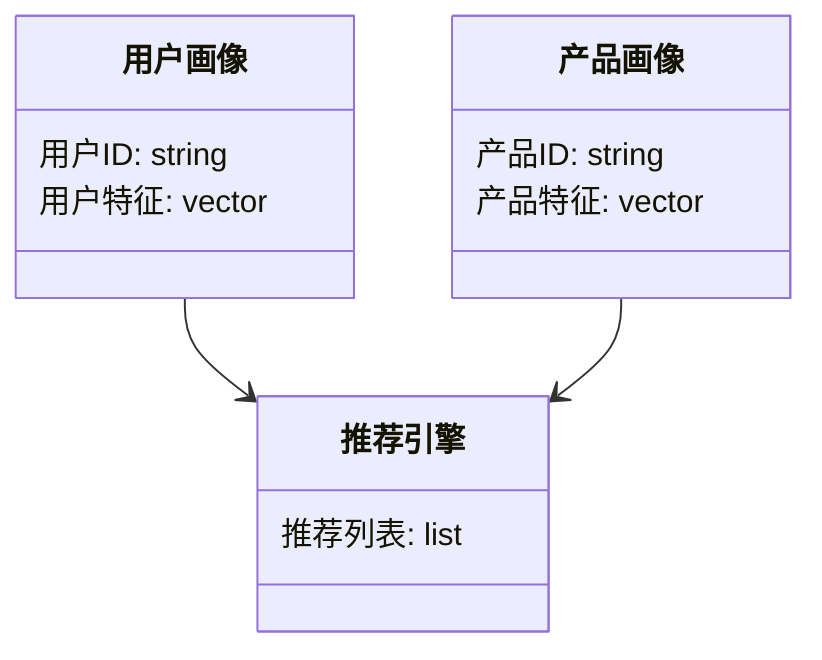

                 


# 开发智能化的金融产品推荐引擎

> 关键词：金融产品推荐引擎, AI大模型, 智能化推荐, 推荐系统, 金融数据分析

> 摘要：本文将详细探讨如何开发一个智能化的金融产品推荐引擎。通过结合AI大模型和推荐系统的核心原理，我们逐步分析其算法原理、系统架构设计和项目实现。从理论到实践，本文将提供一个全面的指南，帮助读者理解和实现一个高效、精准的金融产品推荐系统。

---

# 第1章: 背景介绍与核心概念

## 1.1 问题背景与描述

### 1.1.1 传统金融推荐系统的局限性
传统的金融产品推荐系统通常依赖简单的规则或基于历史数据分析的方法，存在以下问题：
- 数据稀疏性：用户数据不足，导致推荐准确性差。
- 个性化不足：无法根据用户的实时行为和偏好进行动态调整。
- 知识盲点：无法结合市场动态和用户意图进行深度分析。

### 1.1.2 智能化推荐引擎的必要性
智能化推荐引擎通过引入AI技术，可以解决传统推荐系统的局限性：
- 实时分析：基于用户行为和市场数据，实时调整推荐策略。
- 深度学习：通过大模型捕捉数据中的复杂模式，提升推荐精准度。
- 个性化体验：为每个用户提供量身定制的推荐。

### 1.1.3 金融产品推荐的核心问题
金融产品推荐的核心问题包括：
- 如何有效处理金融数据的复杂性和多样性。
- 如何利用AI技术实现精准的个性化推荐。
- 如何保证推荐的实时性和可解释性。

## 1.2 核心概念与联系

### 1.2.1 推荐系统的基本原理
推荐系统通过分析用户行为和产品特征，生成个性化的产品推荐。常见的推荐方法包括：
- 协同过滤：基于用户相似性或产品相似性进行推荐。
- 基于内容的推荐：利用产品本身的特征进行推荐。
- 混合推荐：结合协同过滤和内容推荐的优点。

### 1.2.2 AI大模型在推荐系统中的应用
AI大模型通过以下方式提升推荐系统的性能：
- 特征提取：利用大模型提取用户和产品的深层特征。
- 个性化推荐：基于大模型生成的特征，进行精准推荐。
- 动态调整：根据实时数据动态优化推荐策略。

### 1.2.3 金融产品推荐的特殊性与挑战
金融产品推荐的特殊性在于：
- 数据敏感性：金融数据通常涉及用户隐私和市场机密。
- 风险控制：推荐必须考虑用户的风险承受能力。
- 法规合规：推荐系统需符合金融监管要求。

## 1.3 问题解决与边界

### 1.3.1 智能化推荐引擎的解决方案
智能化推荐引擎通过以下方式解决问题：
- 数据驱动：利用大数据分析技术提取用户和产品的特征。
- AI驱动：引入深度学习模型进行推荐。
- 实时驱动：结合流数据处理技术实现动态推荐。

### 1.3.2 系统边界与功能范围
智能化推荐引擎的功能范围包括：
- 用户画像：构建用户特征模型。
- 产品画像：构建产品特征模型。
- 推荐生成：基于用户和产品特征生成推荐列表。
- 实时更新：根据用户行为和市场变化动态调整推荐。

### 1.3.3 核心要素与组成结构
智能化推荐引擎的核心要素包括：
- 数据采集：从多渠道采集用户行为和产品数据。
- 数据处理：对数据进行清洗、转换和特征提取。
- 模型训练：训练深度学习模型进行推荐。
- 推荐生成：根据模型输出生成推荐结果。

## 1.4 核心概念属性对比

### 1.4.1 推荐算法的分类与对比
| 推荐算法 | 协同过滤 | 基于内容的推荐 | 混合推荐 |
|----------|----------|----------------|----------|
| 原理     | 用户相似性或产品相似性 | 产品特征匹配 | 结合协同过滤和内容推荐 |
| 优缺点   | 优点：简单易实现；缺点：数据稀疏性问题 | 优点：个性化强；缺点：特征提取困难 | 优点：综合两种方法的优点；缺点：计算复杂度高 |

### 1.4.2 金融产品的特征分析
金融产品的特征包括：
- 产品类型：股票、基金、债券等。
- 风险等级：低风险、中风险、高风险。
- 收益预期：短期收益、长期收益。
- 市场热度：市场关注度。

### 1.4.3 用户行为与偏好分析
用户行为包括：
- 用户登录：记录用户的基本信息。
- 用户浏览：记录用户浏览的产品和页面。
- 用户点击：记录用户点击的产品和功能。
- 用户购买：记录用户的购买行为。

## 1.5 本章小结

---

# 第2章: 推荐系统与AI大模型的核心原理

## 2.1 推荐系统的基本原理

### 2.1.1 协同过滤算法
协同过滤是一种基于用户相似性或产品相似性的推荐方法。其基本流程如下：

1. 数据采集：采集用户对产品的评分数据。
2. 相似性计算：计算用户或产品的相似性。
3. 推荐生成：基于相似性生成推荐列表。

### 2.1.2 基于内容的推荐
基于内容的推荐方法利用产品本身的特征进行推荐。其基本流程如下：

1. 特征提取：提取产品的特征。
2. 特征匹配：根据用户偏好匹配产品特征。
3. 推荐生成：基于匹配结果生成推荐列表。

### 2.1.3 混合推荐模型
混合推荐模型结合协同过滤和基于内容的推荐方法，其基本流程如下：

1. 协同过滤推荐：生成基于用户相似性的推荐列表。
2. 基于内容的推荐：生成基于产品特征的推荐列表。
3. 综合推荐：将两个推荐列表进行加权融合。

## 2.2 AI大模型在推荐系统中的应用

### 2.2.1 基于大模型的特征提取
大模型通过深度学习技术提取用户和产品的特征，其基本流程如下：

1. 数据预处理：对原始数据进行清洗和转换。
2. 特征提取：利用大模型提取用户和产品的特征。
3. 特征存储：将提取的特征存储到数据库中。

### 2.2.2 大模型驱动的个性化推荐
大模型通过分析用户行为和市场动态，生成个性化推荐。其基本流程如下：

1. 用户画像：构建用户特征模型。
2. 产品画像：构建产品特征模型。
3. 个性化推荐：基于用户和产品特征生成推荐列表。

### 2.2.3 大模型与推荐系统的结合方式
大模型与推荐系统的结合方式包括：
- 特征提取：利用大模型提取用户和产品的特征。
- 个性化推荐：基于大模型生成的特征，进行精准推荐。
- 动态调整：根据实时数据动态优化推荐策略。

## 2.3 核心算法与数学模型

### 2.3.1 矩阵分解模型
矩阵分解模型通过分解用户-产品评分矩阵，生成用户和产品的隐含特征。其数学模型如下：

$$ P \times Q = R $$

其中，$P$ 是用户隐含特征矩阵，$Q$ 是产品隐含特征矩阵，$R$ 是用户-产品评分矩阵。

### 2.3.2 基于神经网络的推荐模型
基于神经网络的推荐模型通过深度学习技术，提取用户和产品的特征。其数学模型如下：

$$ f(x) = W_1 x + b_1 \rightarrow ReLU \rightarrow W_2 f(x) + b_2 $$

其中，$W_1$ 和 $W_2$ 是权重矩阵，$b_1$ 和 $b_2$ 是偏置项。

### 2.3.3 深度学习在推荐系统中的应用
深度学习在推荐系统中的应用包括：
- 用户特征提取：利用深度学习模型提取用户特征。
- 产品特征提取：利用深度学习模型提取产品特征。
- 动态推荐：利用深度学习模型进行实时推荐。

## 2.4 本章小结

---

# 第3章: 推荐系统与AI大模型的数学模型与公式

## 3.1 协同过滤算法的数学模型

### 3.1.1 基于用户的协同过滤公式
基于用户的协同过滤公式如下：

$$ sim(u, v) = \frac{\sum_{i} (r_{u,i} - \bar{r}_u)(r_{v,i} - \bar{r}_v)}{\sqrt{\sum_{i} (r_{u,i} - \bar{r}_u)^2} \sqrt{\sum_{i} (r_{v,i} - \bar{r}_v)^2}} $$

其中，$sim(u, v)$ 是用户$u$和$v$的相似性，$r_{u,i}$ 是用户$u$对产品$i$的评分，$\bar{r}_u$ 是用户$u$的平均评分。

### 3.1.2 基于物品的协同过滤公式
基于物品的协同过滤公式如下：

$$ sim(i, j) = \frac{\sum_{u} (r_{u,i} - \bar{r}_u)(r_{u,j} - \bar{r}_u)}{\sqrt{\sum_{u} (r_{u,i} - \bar{r}_u)^2} \sqrt{\sum_{u} (r_{u,j} - \bar{r}_u)^2}} $$

其中，$sim(i, j)$ 是产品$i$和$j$的相似性，$r_{u,i}$ 是用户$u$对产品$i$的评分，$\bar{r}_u$ 是用户$u$的平均评分。

## 3.2 矩阵分解模型

### 3.2.1 矩阵分解的基本公式
矩阵分解的基本公式如下：

$$ P \times Q = R $$

其中，$P$ 是用户隐含特征矩阵，$Q$ 是产品隐含特征矩阵，$R$ 是用户-产品评分矩阵。

### 3.2.2 交替最小二乘法公式
交替最小二乘法公式如下：

$$ P^* = arg\ min\ ||R - Q^T P||^2 $$
$$ Q^* = arg\ min\ ||R - P^T Q||^2 $$

其中，$P^*$ 和 $Q^*$ 分别是矩阵分解的最优解。

## 3.3 基于神经网络的推荐模型

### 3.3.1 前向传播公式
前向传播公式如下：

$$ f(x) = W_1 x + b_1 \rightarrow ReLU \rightarrow W_2 f(x) + b_2 $$

其中，$W_1$ 和 $W_2$ 是权重矩阵，$b_1$ 和 $b_2$ 是偏置项，$ReLU$ 是激活函数。

### 3.3.2 损失函数公式
损失函数公式如下：

$$ L = \frac{1}{2N}\sum_{i=1}^{N} (y_i - \hat{y}_i)^2 $$

其中，$y_i$ 是真实值，$\hat{y}_i$ 是预测值，$N$ 是样本数量。

## 3.4 本章小结

---

# 第4章: 系统分析与架构设计

## 4.1 问题场景介绍
本章将从问题场景出发，分析智能化金融产品推荐引擎的系统架构设计。

## 4.2 项目介绍
### 4.2.1 项目背景
本项目旨在开发一个智能化的金融产品推荐引擎，结合AI大模型和推荐系统的核心原理，实现精准的金融产品推荐。

### 4.2.2 项目目标
项目目标包括：
- 实现用户画像构建。
- 实现产品画像构建。
- 实现个性化推荐生成。
- 实现实时数据处理。

## 4.3 系统功能设计

### 4.3.1 领域模型类图
以下是领域模型类图：



### 4.3.2 系统架构图
以下是系统架构图：


## 4.4 系统接口设计

### 4.4.1 接口描述
以下是系统接口描述：

| 接口名称 | 接口描述 | 输入 | 输出 |
|----------|----------|------|------|
| 获取推荐 | 获取用户的推荐列表 | 用户ID | 推荐列表 |

### 4.4.2 交互流程图
以下是交互流程图：


## 4.5 本章小结

---

# 第5章: 项目实战

## 5.1 环境安装

### 5.1.1 安装Python
安装Python：

```bash
sudo apt-get install python3
```

### 5.1.2 安装依赖库
安装依赖库：

```bash
pip install numpy pandas scikit-learn
```

## 5.2 核心代码实现

### 5.2.1 数据预处理
数据预处理代码：

```python
import pandas as pd
import numpy as np

# 读取数据
data = pd.read_csv('data.csv')

# 数据清洗
data = data.dropna()

# 数据转换
data['评分'] = data['评分'].astype(int)
```

### 5.2.2 模型训练
模型训练代码：

```python
from sklearn.model_selection import train_test_split
from sklearn.metrics import mean_squared_error

# 划分数据集
train_data, test_data = train_test_split(data, test_size=0.2)

# 训练模型
model = SomeModel()
model.fit(train_data)

# 模型评估
y_pred = model.predict(test_data)
print(mean_squared_error(test_data['评分'], y_pred))
```

## 5.3 代码应用解读与分析

### 5.3.1 代码解读
以下是代码解读：

```python
# 读取数据
data = pd.read_csv('data.csv')

# 数据清洗
data = data.dropna()

# 数据转换
data['评分'] = data['评分'].astype(int)
```

### 5.3.2 代码分析
代码分析如下：
- 数据预处理：读取数据、清洗数据、转换数据类型。
- 模型训练：训练推荐模型。
- 模型评估：评估模型性能。

## 5.4 实际案例分析

### 5.4.1 案例描述
以下是案例描述：

| 用户ID | 产品ID | 评分 |
|-------|--------|------|
| 1     | A      | 5    |
| 2     | B      | 4    |
| 3     | C      | 3    |

### 5.4.2 案例分析
案例分析如下：
- 用户1对产品A的评分为5，属于高评分。
- 用户2对产品B的评分为4，属于中高评分。
- 用户3对产品C的评分为3，属于中等评分。

## 5.5 本章小结

---

# 第6章: 最佳实践与总结

## 6.1 最佳实践

### 6.1.1 数据预处理
数据预处理建议：
- 清洗数据：删除无效数据。
- 转换数据：统一数据格式。
- 特征提取：提取有用的特征。

### 6.1.2 模型调优
模型调优建议：
- 参数调整：优化模型参数。
- 模型选择：选择合适的模型。
- 模型评估：评估模型性能。

### 6.1.3 系统部署与监控
系统部署与监控建议：
- 部署环境：选择合适的部署环境。
- 系统监控：监控系统运行状态。
- 日志管理：管理系统日志。

## 6.2 总结

### 6.2.1 核心总结
智能化金融产品推荐引擎的核心总结：
- 数据驱动：利用大数据分析技术。
- AI驱动：引入深度学习模型。
- 实时驱动：结合流数据处理技术。

### 6.2.2 未来研究方向
未来研究方向包括：
- 更复杂的模型：如图神经网络。
- 更高效的数据处理方法：如分布式计算。
- 更精准的推荐策略：如多目标优化。

## 6.3 拓展阅读

### 6.3.1 推荐系统领域
推荐系统领域的拓展阅读：
- 《推荐系统实战》。
- 《深度学习在推荐系统中的应用》。

### 6.3.2 AI大模型领域
AI大模型领域的拓展阅读：
- 《大模型：从原理到实践》。
- 《AI大模型在金融领域的应用》。

## 6.4 本章小结

---

# 第7章: 总结与展望

## 7.1 总结
智能化金融产品推荐引擎的开发总结：
- 核心概念：推荐系统、AI大模型。
- 核心原理：矩阵分解、深度学习。
- 实现步骤：数据预处理、模型训练、推荐生成。

## 7.2 展望
未来展望：
- 更智能的推荐系统：结合更多AI技术。
- 更高效的推荐引擎：优化算法和架构。
- 更广泛的应用场景：扩展到更多金融领域。

## 7.3 本章小结

---

# 附录

## 附录A: 简单的推荐系统实现

```python
import pandas as pd
import numpy as np

# 读取数据
data = pd.read_csv('data.csv')

# 数据清洗
data = data.dropna()

# 数据转换
data['评分'] = data['评分'].astype(int)

# 划分数据集
train_data, test_data = train_test_split(data, test_size=0.2)

# 训练模型
model = SomeModel()
model.fit(train_data)

# 模型评估
y_pred = model.predict(test_data)
print(mean_squared_error(test_data['评分'], y_pred))
```

## 附录B: 术语表

| 术语 | 定义 |
|------|------|
| 推荐系统 | 基于用户行为和产品特征，生成个性化推荐的系统。 |
| AI大模型 | 具备强大AI能力的模型，能够处理复杂任务。 |
| 金融产品推荐引擎 | 专门用于金融产品的推荐系统。 |

---

# 参考文献

1. 《推荐系统实战》
2. 《深度学习在推荐系统中的应用》
3. 《大模型：从原理到实践》
4. 《AI大模型在金融领域的应用》

---

# 结束语

感谢您的阅读！希望本文能够为您提供开发智能化金融产品推荐引擎的详细指导。

