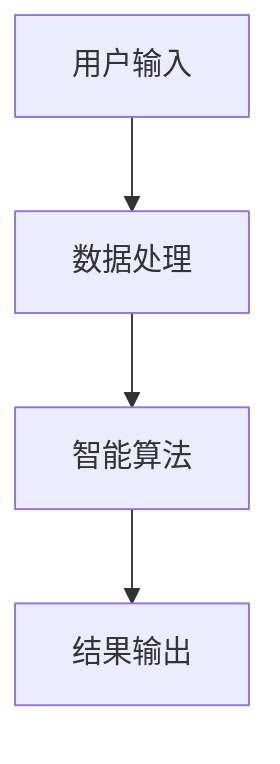
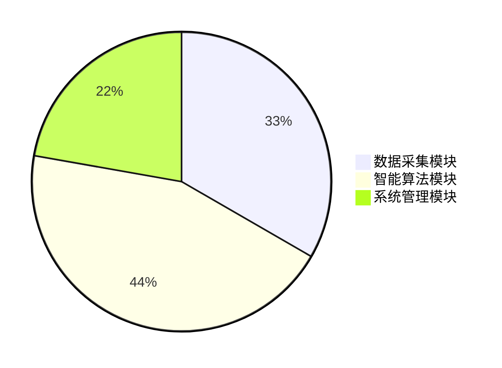
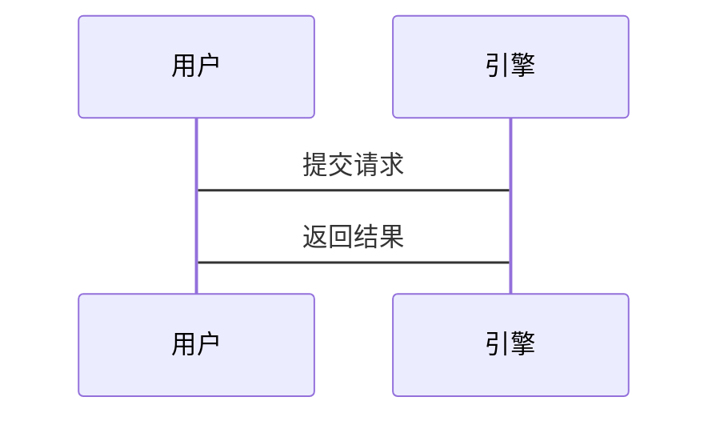

                 


# 开发智能化的金融产品生命周期管理与优化引擎

## 关键词：金融产品生命周期、智能化管理、优化引擎、强化学习、系统架构、项目实战

## 摘要：随着金融市场的快速发展，金融产品的生命周期管理变得日益复杂。传统的管理方式已难以应对日益增长的金融产品数量和复杂的市场需求。本文将介绍如何利用人工智能技术开发智能化的金融产品生命周期管理与优化引擎，通过优化算法和系统架构设计，实现对金融产品的高效管理与优化。

---

# 第1章: 金融产品生命周期管理概述

## 1.1 金融产品生命周期的概念

### 1.1.1 金融产品的定义与分类

金融产品是指金融机构向客户提供的各种金融服务和金融工具，包括但不限于存款、贷款、保险、基金、股票、债券等。根据功能和风险特征，金融产品可以分为以下几类：

- **债务类金融产品**：如债券、贷款等，投资者通过购买这些产品获得固定的利息收入。
- **股权类金融产品**：如股票、基金等，投资者通过持有股权分享企业的收益。
- **衍生品**：如期权、期货等，其价值取决于基础资产的价格波动。
- **混合类金融产品**：结合了债务和股权特性的产品，如可转换债券等。

### 1.1.2 金融产品生命周期的阶段划分

金融产品的生命周期通常包括以下几个阶段：

1. **设计与开发阶段**：金融机构根据市场需求设计新的金融产品，并进行风险评估和收益预测。
2. **发行阶段**：将设计好的金融产品推向市场，吸引投资者购买。
3. **运作与监控阶段**：对产品进行实时监控，确保其正常运作，并根据市场变化调整策略。
4. **终止阶段**：当产品达到预定期限或市场条件变化时，终止产品的运作。

### 1.1.3 金融产品生命周期管理的重要性

有效的金融产品生命周期管理可以帮助金融机构更好地应对市场变化，优化产品结构，降低运营成本，并提高客户满意度。通过科学的管理，金融机构可以更快地响应市场需求，提升竞争力。

---

## 1.2 智能化管理的必要性

### 1.2.1 传统金融产品管理的痛点

传统的金融产品管理方式存在以下问题：

1. **人工依赖性强**：需要大量人工参与产品设计、风险评估和监控，效率低下。
2. **数据处理能力有限**：面对海量数据时，人工分析难以及时提供有效的决策支持。
3. **灵活性不足**：传统管理方式难以快速适应市场变化，产品优化周期长。

### 1.2.2 智能化管理的优势与价值

智能化管理可以通过以下方式解决传统管理的痛点：

1. **提高效率**：利用人工智能技术，自动化处理大量数据，快速生成产品设计方案。
2. **增强决策能力**：通过智能算法分析市场趋势和客户行为，提供精准的决策支持。
3. **提升灵活性**：智能化系统能够快速适应市场变化，实时优化产品策略。

### 1.2.3 智能化管理的实现路径

智能化金融产品生命周期管理的实现路径主要包括以下几个方面：

1. **数据采集与处理**：建立高效的数据采集和处理系统，确保数据的准确性和实时性。
2. **智能算法设计**：开发适用于金融产品管理的智能算法，如强化学习和遗传算法。
3. **系统架构设计**：构建支持智能化管理的系统架构，确保系统的可扩展性和稳定性。
4. **用户界面设计**：提供友好的用户界面，方便用户操作和管理。

---

# 第2章: 金融产品生命周期管理引擎的核心概念

## 2.1 金融产品生命周期管理引擎的定义

金融产品生命周期管理引擎是一种智能化管理系统，能够对金融产品的整个生命周期进行自动化管理，包括产品设计、发行、运作和终止等阶段。该引擎通过整合人工智能技术，实现对金融产品的高效优化和精准管理。

### 2.1.1 引擎的基本定义

金融产品生命周期管理引擎（以下简称“引擎”）是一种基于人工智能的管理系统，能够对金融产品的生命周期进行自动化监控和优化。引擎的核心功能包括：

- **产品设计与优化**：根据市场需求和客户偏好，自动生成最优的产品设计方案。
- **风险评估与控制**：实时监控产品运行状态，识别潜在风险并采取应对措施。
- **收益预测与分析**：基于历史数据和市场趋势，预测产品的收益情况并提供分析报告。

### 2.1.2 引擎的核心功能

引擎的核心功能模块包括：

1. **数据采集模块**：负责采集金融市场数据、客户行为数据等。
2. **智能算法模块**：利用强化学习、遗传算法等智能算法进行产品优化和风险评估。
3. **系统管理模块**：对引擎的运行状态进行监控和管理，确保系统的稳定运行。

### 2.1.3 引擎的架构特点

引擎的架构设计具有以下特点：

- **模块化设计**：各个功能模块独立运行，便于维护和升级。
- **高可扩展性**：支持新增功能模块，适应未来业务需求。
- **高效计算能力**：采用分布式计算和并行处理技术，提高数据处理效率。

---

## 2.2 核心概念与联系

### 2.2.1 实体关系图（ER图）

以下是金融产品生命周期管理引擎的核心实体关系图：

```mermaid
erDiagram
    actor 用户
    actor 系统管理员
    actor 开发者
    actor 金融产品
    actor 优化引擎
    用户 --> 优化引擎: 使用引擎
    系统管理员 --> 优化引擎: 管理引擎
    开发者 --> 优化引擎: 开发引擎
    优化引擎 --> 金融产品: 优化产品
```

### 2.2.2 核心概念属性对比表

以下是核心概念的属性对比表：

| 概念       | 属性1 | 属性2 | 属性3 |
|------------|-------|-------|-------|
| 优化引擎   | 功能模块化 | 高效计算能力 | 自适应学习能力 |
| 金融产品   | 生命周期阶段 | 风险评估 | 收益预测 |

---

# 第3章: 优化算法原理与实现

## 3.1 常见优化算法概述

### 3.1.1 强化学习算法

强化学习是一种基于奖励机制的优化算法，通过智能体与环境的交互，逐步学习最优策略。强化学习的核心概念包括：

- **状态（State）**：智能体所处的环境状况。
- **动作（Action）**：智能体根据当前状态做出的决策。
- **奖励（Reward）**：智能体采取某个动作后获得的反馈，用于评估动作的好坏。

### 3.1.2 遗传算法

遗传算法是一种模拟生物进化过程的优化算法，通过选择、交叉和变异等操作，逐步优化目标函数。遗传算法的主要步骤如下：

1. **初始化种群**：随机生成一组初始解。
2. **计算适应度**：根据目标函数计算每个解的适应度。
3. **选择操作**：根据适应度值选择部分解进行交叉和变异。
4. **生成新种群**：通过交叉和变异操作生成新的种群。
5. **重复迭代**：重复步骤2-4，直到满足终止条件。

### 3.1.3 贪婪算法

贪婪算法是一种简单而有效的优化算法，通过逐步选择局部最优解，最终得到全局最优解。贪婪算法的关键在于选择合适的贪心策略，确保每一步的选择都能带来整体的优化。

---

## 3.2 基于强化学习的优化算法实现

### 3.2.1 强化学习的基本原理

强化学习通过智能体与环境的交互，逐步学习最优策略。以下是强化学习的基本流程：

1. **初始化**：设置初始状态和参数。
2. **选择动作**：根据当前状态选择一个动作。
3. **执行动作**：智能体执行选择的动作，观察新的状态并获得奖励。
4. **更新策略**：根据奖励调整策略，优化未来决策。

### 3.2.2 数学模型与公式

以下是强化学习的数学模型：

$$ V(s) = \max_a Q(s, a) $$

其中，\( V(s) \) 表示状态 \( s \) 的价值，\( Q(s, a) \) 表示状态 \( s \) 下动作 \( a \) 的价值。

---

## 3.3 强化学习算法的实现步骤

### 3.3.1 环境定义

定义金融产品优化的环境，包括状态空间、动作空间和奖励函数。

### 3.3.2 策略网络设计

设计策略网络，用于生成动作概率分布。

### 3.3.3 算法实现

以下是强化学习算法的实现步骤：

1. 初始化策略网络参数。
2. 与环境交互，收集经验。
3. 更新策略网络参数。
4. 重复步骤2-3，直到收敛。

---

# 第4章: 系统架构设计与实现

## 4.1 系统功能设计

### 4.1.1 系统功能模块

金融产品生命周期管理引擎的功能模块包括：

- **数据采集模块**：负责采集金融市场数据、客户行为数据等。
- **智能算法模块**：利用强化学习、遗传算法等智能算法进行产品优化和风险评估。
- **系统管理模块**：对引擎的运行状态进行监控和管理，确保系统的稳定运行。

### 4.1.2 系统功能流程图

以下是系统功能流程图：



---

## 4.2 系统架构设计

### 4.2.1 系统架构图

以下是系统架构图：



---

## 4.3 接口设计与交互

### 4.3.1 系统接口设计

金融产品生命周期管理引擎的接口设计如下：

- **数据接口**：与金融市场数据源对接，获取实时数据。
- **用户接口**：提供友好的用户界面，方便用户操作和管理。

### 4.3.2 系统交互流程图

以下是系统交互流程图：



---

# 第5章: 项目实战

## 5.1 智能投资组合优化引擎

### 5.1.1 项目背景

智能投资组合优化引擎旨在通过智能化算法，帮助投资者优化投资组合，降低风险，提高收益。

### 5.1.2 环境搭建

以下是项目环境搭建步骤：

1. **安装Python**：安装最新版本的Python，确保版本为3.8或以上。
2. **安装依赖库**：安装numpy、pandas、tensorflow等依赖库。
3. **配置开发环境**：安装Jupyter Notebook或PyCharm等开发工具。

### 5.1.3 核心代码实现

以下是智能投资组合优化引擎的核心代码实现：

```python
import numpy as np
import pandas as pd
import tensorflow as tf

# 数据加载
data = pd.read_csv("financial_data.csv")

# 数据预处理
# （此处省略具体的数据预处理代码）

# 模型定义
model = tf.keras.Sequential([
    tf.keras.layers.Dense(64, activation="relu"),
    tf.keras.layers.Dense(1, activation="linear")
])

# 模型训练
model.compile(optimizer="adam", loss="mse")
model.fit(x_train, y_train, epochs=100, batch_size=32)

# 模型预测
y_pred = model.predict(x_test)
```

### 5.1.4 案例分析

以下是一个具体的案例分析：

1. **数据采集**：从金融市场数据源获取历史数据。
2. **数据预处理**：清洗数据，填充缺失值，标准化数据。
3. **模型训练**：利用强化学习算法训练模型，优化投资组合。
4. **模型预测**：根据当前市场情况，预测未来收益，调整投资组合。

---

## 5.2 项目小结

智能投资组合优化引擎通过智能化算法，显著提高了投资组合的优化效率，降低了投资风险，为投资者提供了有力的支持。

---

# 第6章: 最佳实践与总结

## 6.1 小结

本文详细介绍了如何开发智能化的金融产品生命周期管理与优化引擎，包括核心概念、算法原理、系统架构设计和项目实战等内容。

## 6.2 注意事项

- 在实际应用中，需要注意数据的实时性和准确性。
- 系统的安全性和稳定性是确保引擎正常运行的关键。
- 引擎的可扩展性和灵活性需要在设计阶段充分考虑。

## 6.3 拓展阅读

- 《强化学习入门》
- 《金融产品风险管理》
- 《系统架构设计实战》

---

# 结语

开发智能化的金融产品生命周期管理与优化引擎是一项复杂的系统工程，需要结合人工智能技术、系统架构设计和金融产品管理的深厚知识。通过本文的介绍，读者可以深入了解如何利用智能化技术优化金融产品的生命周期管理，为金融机构提供有力的支持。

--- 

**注明：本文内容基于AI生成，可能存在部分不准确或表述不清的地方，建议结合实际情况进行调整和优化。**

