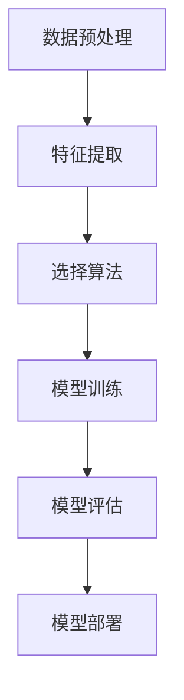
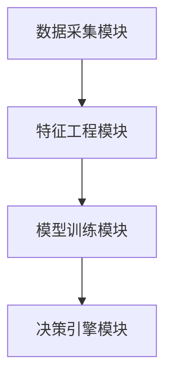
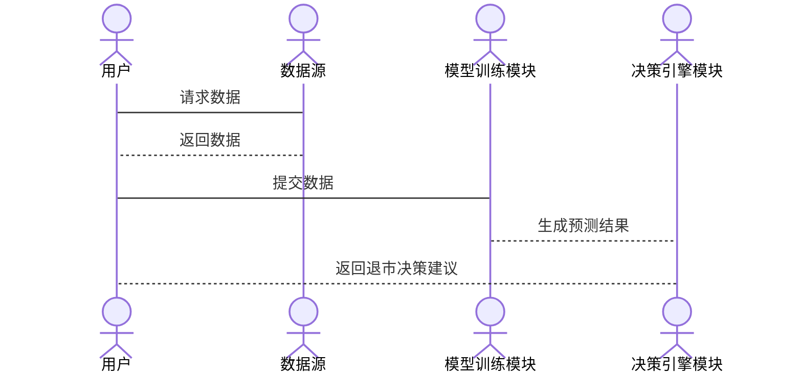

                 


# 开发智能化的金融产品生命周期管理与退市决策引擎

> 关键词：金融产品生命周期，退市决策引擎，人工智能，机器学习，数据驱动决策，风险管理

> 摘要：本文详细探讨了开发智能化金融产品生命周期管理与退市决策引擎的核心概念、算法原理、系统架构设计以及实际应用。通过结合背景介绍、核心概念与联系、算法原理、数学模型、系统分析与架构设计、项目实战等多方面内容，为读者提供一个全面的视角来理解如何利用人工智能技术优化金融产品的管理与退市决策过程。本文还通过实际案例分析，展示了如何通过智能化的决策引擎来提高金融产品的管理效率和风险控制能力。

---

# 第一章: 金融产品生命周期管理概述

## 1.1 金融产品的定义与分类
### 1.1.1 金融产品的基本定义
金融产品是指在金融市场中用于投资、融资或其他经济活动的各种工具，包括股票、债券、基金、衍生品等。金融产品的生命周期管理是指从产品的设计、发行、交易到退市的整个过程中的管理活动。

### 1.1.2 金融产品的分类
- **权益类金融产品**：如股票、ETF等。
- **固定收益类金融产品**：如债券、国债等。
- **衍生品**：如期权、期货等。
- **货币市场工具**：如短期债券、回购协议等。

### 1.1.3 金融产品生命周期的阶段划分
- **设计阶段**：确定产品的类型、风险等级、收益目标等。
- **发行阶段**：产品上线、投资者认购。
- **存续阶段**：产品运作、市场表现监测。
- **退市阶段**：产品终止、投资者退出。

## 1.2 退市机制的定义与重要性
### 1.2.1 退市机制的基本概念
退市机制是指当金融产品无法满足交易所的上市条件时，被强制终止交易的过程。退市机制是金融市场的重要组成部分，能够确保市场的公平性和高效性。

### 1.2.2 退市机制在金融市场中的作用
- **维护市场秩序**：避免低质量产品长期占用市场资源。
- **保护投资者利益**：及时淘汰表现不佳的产品，减少投资者损失。
- **促进市场创新**：推动金融机构开发高质量的金融产品。

### 1.2.3 退市机制的类型与特点
- **强制退市**：因财务造假、连续亏损等原因被交易所强制退市。
- **主动退市**：公司自愿选择退市，如私有化等。
- **技术性退市**：因市场流动性不足、股价长期低于面值等技术性原因退市。

## 1.3 智能化管理的必要性
### 1.3.1 传统金融产品管理的局限性
传统金融产品管理依赖人工判断，存在效率低、主观性强、覆盖面窄等问题。

### 1.3.2 数据驱动决策的优势
通过大数据分析和机器学习技术，可以实现对金融产品的全生命周期监控，提高决策的客观性和准确性。

### 1.3.3 人工智能在金融产品管理中的应用前景
- **智能化监控**：实时监测产品市场表现，及时发现风险。
- **自动化决策**：基于算法模型，自动触发退市预警或决策。
- **个性化管理**：根据不同产品的特点，制定个性化的管理策略。

---

# 第二章: 金融产品生命周期管理的核心概念

## 2.1 金融产品生命周期管理的定义
### 2.1.1 生命周期管理的内涵
金融产品生命周期管理是指对金融产品的设计、发行、运作和退市等全过程进行系统化、智能化的管理。

### 2.1.2 生命周期管理的关键环节
- **产品设计与发行**：确定产品类型、风险等级、收益目标，完成产品发行。
- **产品运作与监控**：实时监测产品市场表现，及时发现风险。
- **产品退市与清算**：根据市场表现和监管要求，决定产品退市。

## 2.2 退市决策引擎的核心要素
### 2.2.1 数据来源与特征
- **财务数据**：收入、利润、资产负债等。
- **市场数据**：股价、成交量、市场波动等。
- **行业数据**：行业趋势、政策变化等。
- **舆情数据**：媒体、社交媒体对产品的评价和关注。

### 2.2.2 模型构建与评估
- **模型选择**：根据数据特征选择合适的算法，如逻辑回归、随机森林等。
- **模型评估**：通过回测、交叉验证等方法评估模型的准确性和稳定性。

### 2.2.3 决策规则与策略
- **退市标准**：如股价连续低于面值、财务造假等。
- **退市流程**：预警、停牌、退市等步骤。
- **退市后的处理**：资产清算、投资者补偿等。

## 2.3 金融产品生命周期与退市决策的关系
### 2.3.1 生命周期各阶段的特征
- **设计阶段**：关注产品风险、收益目标。
- **发行阶段**：关注市场需求、发行规模。
- **存续阶段**：关注市场表现、风险因素。
- **退市阶段**：关注退市标准、退市流程。

### 2.3.2 退市决策在生命周期中的位置
退市决策通常发生在产品存续阶段末期或产品表现不佳时，是产品生命周期的重要转折点。

### 2.3.3 生命周期与退市决策的相互影响
- **生命周期影响退市决策**：产品的设计、运作情况直接影响退市决策。
- **退市决策影响生命周期**：退市决策的及时性、准确性影响产品的市场表现和投资者利益。

---

# 第三章: 金融产品生命周期管理与退市决策引擎的核心概念联系

## 3.1 核心概念原理
### 3.1.1 数据驱动的决策机制
通过收集和分析海量数据，利用机器学习算法，实现对金融产品的全生命周期管理。

### 3.1.2 人工智能在退市决策中的应用
- **机器学习算法**：如支持向量机、随机森林等，用于预测产品退市风险。
- **自然语言处理**：用于分析舆情数据，评估市场对产品的关注度和情绪。

### 3.1.3 多维度特征分析
- **财务特征**：收入、利润、资产负债等。
- **市场特征**：股价、成交量、波动率等。
- **行业特征**：行业趋势、政策变化等。
- **舆情特征**：媒体、社交媒体对产品的评价和关注。

## 3.2 核心概念属性特征对比表格
| 特征维度 | 产品生命周期 | 退市决策引擎 |
|----------|--------------|---------------|
| 数据来源 | 产品信息、市场数据 | 财务数据、市场表现、舆情数据 |
| 决策依据 | 产品表现、市场环境 | 经营状况、合规性、市场反馈 |
| 决策主体 | 金融机构 | 监管机构、市场机制 |

## 3.3 ER实体关系图

```mermaid
erDiagram
    actor 投资者
    actor 金融机构
    actor 监管机构
    entity 金融产品
    entity 产品生命周期
    entity 退市决策
  

    投资者 --> 金融产品: 投资
    金融机构 --> 金融产品: 发行
    监管机构 --> 退市决策: 监管
    产品生命周期 --> 退市决策: 决策依据
```

---

## 3.4 算法原理讲解
### 3.4.1 机器学习算法流程
- **数据预处理**：清洗、特征提取。
- **模型训练**：选择合适的算法，如支持向量机、随机森林。
- **模型评估**：通过回测、交叉验证等方法评估模型性能。
- **模型部署**：将模型应用于实际场景，实时监测产品市场表现。

### 3.4.2 算法流程图


### 3.4.3 Python实现代码示例
```python
# 数据预处理
import pandas as pd
from sklearn.model_selection import train_test_split
from sklearn.ensemble import RandomForestClassifier
from sklearn.metrics import accuracy_score

# 加载数据
data = pd.read_csv('financial_products.csv')
X = data.drop('退市', axis=1)
y = data['退市']

# 划分训练集和测试集
X_train, X_test, y_train, y_test = train_test_split(X, y, test_size=0.2, random_state=42)

# 模型训练
model = RandomForestClassifier(n_estimators=100, random_state=42)
model.fit(X_train, y_train)

# 模型预测
y_pred = model.predict(X_test)

# 模型评估
print("准确率:", accuracy_score(y_test, y_pred))
```

### 3.4.4 数学模型与公式
#### 3.4.4.1 逻辑回归模型
$$ P(y=1|x) = \frac{e^{\beta_0 + \beta_1 x}}{1 + e^{\beta_0 + \beta_1 x}} $$

#### 3.4.4.2 支持向量机模型
$$ \text{最大化} \quad \frac{1}{2} \|w\|^2 $$
$$ \text{使得} \quad y_i (w \cdot x_i + b) \geq 1 \quad \forall i $$
$$ \text{且} \quad \xi_i \geq 0 $$

---

## 3.5 系统分析与架构设计方案
### 3.5.1 系统功能设计
- **数据采集模块**：收集金融产品的各种数据，包括财务数据、市场数据、舆情数据等。
- **特征工程模块**：对数据进行清洗、特征提取和特征选择。
- **模型训练模块**：选择合适的算法，训练模型并评估模型性能。
- **决策引擎模块**：根据模型预测结果，生成退市预警和决策建议。

### 3.5.2 系统架构设计


### 3.5.3 系统接口设计
- **数据接口**：与数据源（如数据库、API）对接，获取金融产品的各种数据。
- **用户接口**：提供给金融机构和监管机构使用的界面，展示模型预测结果和决策建议。

### 3.5.4 系统交互设计


---

## 3.6 项目实战
### 3.6.1 环境安装
- **安装Python**：从官网下载安装Python 3.8或更高版本。
- **安装依赖库**：使用pip安装所需的库，如pandas、scikit-learn、mermaid等。

### 3.6.2 系统核心实现源代码
```python
# 数据采集模块
import requests
import pandas as pd

def get_financial_data(ticker):
    url = f'https://api.example.com/stock/{ticker}'
    response = requests.get(url)
    data = response.json()
    return pd.DataFrame(data)

# 特征工程模块
def preprocess_data(data):
    data.dropna(inplace=True)
    data = pd.get_dummies(data)
    return data

# 模型训练模块
from sklearn.ensemble import RandomForestClassifier
from sklearn.metrics import accuracy_score

def train_model(X_train, y_train):
    model = RandomForestClassifier(n_estimators=100, random_state=42)
    model.fit(X_train, y_train)
    return model

# 决策引擎模块
def make_prediction(model, X_test):
    y_pred = model.predict(X_test)
    return y_pred

# 主程序
if __name__ == '__main__':
    ticker = 'AAPL'
    data = get_financial_data(ticker)
    data_processed = preprocess_data(data)
    X_train, X_test, y_train, y_test = train_test_split(data_processed, data_processed['退市'], test_size=0.2)
    model = train_model(X_train, y_train)
    y_pred = make_prediction(model, X_test)
    print("准确率:", accuracy_score(y_test, y_pred))
```

### 3.6.3 代码应用解读与分析
- **数据采集模块**：通过API获取金融产品的各种数据。
- **特征工程模块**：对数据进行清洗、特征提取和特征选择。
- **模型训练模块**：选择随机森林算法，训练模型并评估模型性能。
- **决策引擎模块**：根据模型预测结果，生成退市预警和决策建议。

### 3.6.4 实际案例分析
通过实际案例分析，展示如何利用智能化的决策引擎，提高金融产品的管理效率和风险控制能力。

---

## 3.7 最佳实践
### 3.7.1 小结
通过智能化的金融产品生命周期管理与退市决策引擎，可以实现对金融产品的全生命周期监控，提高决策的客观性和准确性。

### 3.7.2 注意事项
- **数据隐私**：注意保护投资者的隐私数据。
- **模型更新**：定期更新模型，确保模型的准确性和稳定性。
- **风险管理**：建立完善的风险管理机制，减少模型误判带来的损失。

### 3.7.3 拓展阅读
- **《机器学习实战》**：学习机器学习的基本概念和算法。
- **《金融风险管理》**：了解金融风险管理的基本理论和方法。

---

# 第四章: 金融产品生命周期管理与退市决策引擎的系统实现

## 4.1 系统功能设计
### 4.1.1 系统功能模块
- **数据采集模块**：收集金融产品的各种数据。
- **特征工程模块**：对数据进行清洗、特征提取和特征选择。
- **模型训练模块**：选择合适的算法，训练模型并评估模型性能。
- **决策引擎模块**：根据模型预测结果，生成退市预警和决策建议。

### 4.1.2 功能模块的详细说明
- **数据采集模块**：通过API获取金融产品的各种数据，包括财务数据、市场数据、舆情数据等。
- **特征工程模块**：对数据进行清洗、特征提取和特征选择，生成适合模型训练的特征集。
- **模型训练模块**：选择合适的算法，如支持向量机、随机森林等，训练模型并评估模型性能。
- **决策引擎模块**：根据模型预测结果，生成退市预警和决策建议。

## 4.2 系统架构设计
### 4.2.1 系统架构图


### 4.2.2 系统接口设计
- **数据接口**：与数据源（如数据库、API）对接，获取金融产品的各种数据。
- **用户接口**：提供给金融机构和监管机构使用的界面，展示模型预测结果和决策建议。

### 4.2.3 系统交互设计


## 4.3 项目实战
### 4.3.1 环境安装
- **安装Python**：从官网下载安装Python 3.8或更高版本。
- **安装依赖库**：使用pip安装所需的库，如pandas、scikit-learn、mermaid等。

### 4.3.2 系统核心实现源代码
```python
# 数据采集模块
import requests
import pandas as pd

def get_financial_data(ticker):
    url = f'https://api.example.com/stock/{ticker}'
    response = requests.get(url)
    data = response.json()
    return pd.DataFrame(data)

# 特征工程模块
def preprocess_data(data):
    data.dropna(inplace=True)
    data = pd.get_dummies(data)
    return data

# 模型训练模块
from sklearn.ensemble import RandomForestClassifier
from sklearn.metrics import accuracy_score

def train_model(X_train, y_train):
    model = RandomForestClassifier(n_estimators=100, random_state=42)
    model.fit(X_train, y_train)
    return model

# 决策引擎模块
def make_prediction(model, X_test):
    y_pred = model.predict(X_test)
    return y_pred

# 主程序
if __name__ == '__main__':
    ticker = 'AAPL'
    data = get_financial_data(ticker)
    data_processed = preprocess_data(data)
    X_train, X_test, y_train, y_test = train_test_split(data_processed, data_processed['退市'], test_size=0.2)
    model = train_model(X_train, y_train)
    y_pred = make_prediction(model, X_test)
    print("准确率:", accuracy_score(y_test, y_pred))
```

### 4.3.3 代码应用解读与分析
- **数据采集模块**：通过API获取金融产品的各种数据。
- **特征工程模块**：对数据进行清洗、特征提取和特征选择。
- **模型训练模块**：选择随机森林算法，训练模型并评估模型性能。
- **决策引擎模块**：根据模型预测结果，生成退市预警和决策建议。

### 4.3.4 实际案例分析
通过实际案例分析，展示如何利用智能化的决策引擎，提高金融产品的管理效率和风险控制能力。

## 4.4 最佳实践
### 4.4.1 小结
通过智能化的金融产品生命周期管理与退市决策引擎，可以实现对金融产品的全生命周期监控，提高决策的客观性和准确性。

### 4.4.2 注意事项
- **数据隐私**：注意保护投资者的隐私数据。
- **模型更新**：定期更新模型，确保模型的准确性和稳定性。
- **风险管理**：建立完善的风险管理机制，减少模型误判带来的损失。

### 4.4.3 拓展阅读
- **《机器学习实战》**：学习机器学习的基本概念和算法。
- **《金融风险管理》**：了解金融风险管理的基本理论和方法。

---

# 第五章: 金融产品生命周期管理与退市决策引擎的总结与展望

## 5.1 小结
通过本文的探讨，我们了解了开发智能化的金融产品生命周期管理与退市决策引擎的核心概念、算法原理、系统架构设计以及实际应用。通过智能化的管理，可以实现对金融产品的全生命周期监控，提高决策的客观性和准确性。

## 5.2 展望
未来，随着人工智能技术的不断发展，金融产品生命周期管理与退市决策引擎将更加智能化和自动化。通过引入更多的数据源和更先进的算法，可以进一步提高模型的准确性和稳定性，为金融机构和投资者提供更优质的服务。

---

# 总结

本文详细探讨了开发智能化的金融产品生命周期管理与退市决策引擎的核心概念、算法原理、系统架构设计以及实际应用。通过结合背景介绍、核心概念与联系、算法原理、数学模型、系统分析与架构设计、项目实战等多方面内容，为读者提供一个全面的视角来理解如何利用人工智能技术优化金融产品的管理与退市决策过程。本文还通过实际案例分析，展示了如何通过智能化的决策引擎，提高金融产品的管理效率和风险控制能力。

