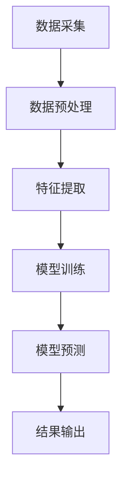
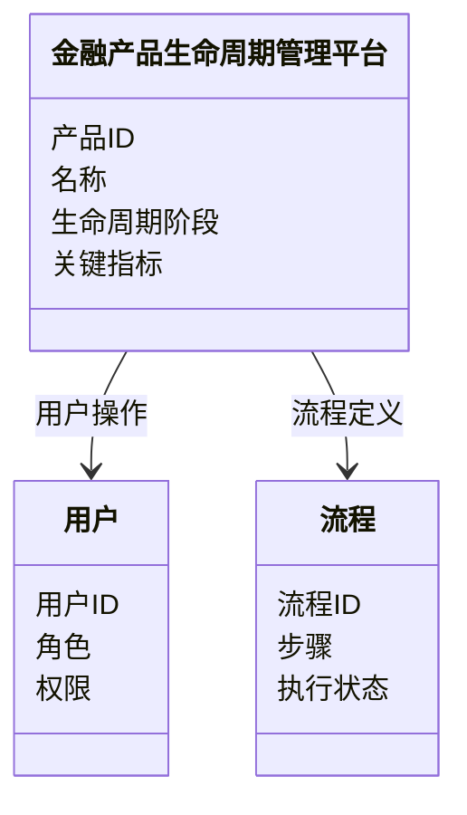
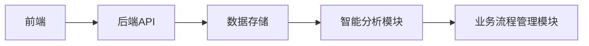
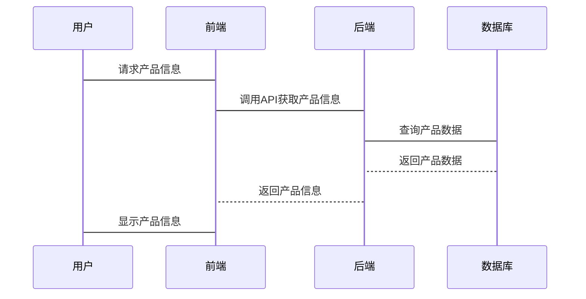

                 


# 开发智能化的金融产品生命周期管理平台

> 关键词：金融产品生命周期、智能化管理平台、人工智能、大数据、系统架构设计

> 摘要：本文详细探讨了开发智能化金融产品生命周期管理平台的核心思路，从背景分析、核心概念、算法原理、系统架构到项目实战，全面解析了平台的构建过程。通过案例分析和代码实现，展示了如何利用人工智能和大数据技术，实现金融产品的智能化管理。

---

# 第1章: 金融产品生命周期管理平台的背景与意义

## 1.1 问题背景

### 1.1.1 传统金融产品管理的痛点
在传统的金融产品管理中，企业面临以下痛点：
- **数据孤岛**：各部门之间数据分散，难以形成统一的决策依据。
- **效率低下**：人工操作占主导，流程繁琐且耗时。
- **风险难以控制**：缺乏实时监控和预警机制，容易错过潜在风险。
- **个性化需求不足**：难以根据不同客户的需求定制产品和服务。

### 1.1.2 数字化转型的必要性
随着科技的发展，金融行业正经历着数字化转型。传统的人工管理模式已无法满足现代金融行业的高效需求。数字化转型不仅是技术上的升级，更是对业务模式的根本性变革。

### 1.1.3 智能化管理的行业趋势
智能化管理正在成为金融行业的趋势。通过人工智能、大数据等技术，企业可以实现对金融产品的全生命周期管理，提升效率、降低风险，并提供更优质的客户体验。

## 1.2 问题描述

### 1.2.1 金融产品生命周期的复杂性
金融产品的生命周期包括设计、发行、运营和终止等多个阶段。每个阶段都需要大量的人力和时间，且需要实时监控和调整。

### 1.2.2 现有管理系统的局限性
现有系统多为单一功能模块，缺乏整体协同。数据分散在不同系统中，难以形成统一的视图，导致决策滞后。

### 1.2.3 数据孤岛与信息不对称问题
不同部门之间的数据孤岛导致信息不对称，影响整体决策的准确性和及时性。

## 1.3 问题解决

### 1.3.1 智能化平台的核心目标
智能化平台的目标是实现金融产品的全生命周期智能化管理，包括：
- **自动化数据采集与处理**：实时采集和处理多源数据。
- **智能分析与预测**：利用机器学习算法进行风险评估和预测。
- **自动化流程管理**：实现业务流程的自动化和智能化。

### 1.3.2 数据驱动的决策支持
通过大数据分析，提供实时的决策支持，帮助企业在复杂市场环境中做出最优决策。

### 1.3.3 全生命周期管理的实现路径
- **数据采集与整合**：建立统一的数据平台，整合各渠道数据。
- **智能化分析**：利用AI技术进行预测和优化。
- **流程自动化**：通过工作流引擎实现业务流程的自动化。

## 1.4 边界与外延

### 1.4.1 平台的功能边界
平台的核心功能包括：
- 数据采集与处理
- 智能分析与预测
- 业务流程管理
- 用户界面与交互设计

### 1.4.2 与相关系统的接口关系
平台需要与以下系统进行接口对接：
- **CRM系统**：客户信息管理
- **财务系统**：财务数据对接
- **风险管理系统**：风险预警与控制

### 1.4.3 平台的扩展性与可维护性
平台设计应具备良好的扩展性和可维护性，支持未来的功能扩展和技术升级。

## 1.5 核心要素组成

### 1.5.1 数据采集与处理
- 数据来源：结构化数据（如数据库）和非结构化数据（如文本、图像）。
- 处理方法：数据清洗、特征提取、数据建模。

### 1.5.2 智能分析模块
- 技术选型：机器学习、深度学习。
- 应用场景：风险评估、产品推荐、市场预测。

### 1.5.3 业务流程管理
- 工具选型：工作流引擎、规则引擎。
- 实现路径：定义流程、配置规则、监控执行。

### 1.5.4 用户界面与交互设计
- 设计原则：用户友好、功能直观。
- 实现方法：前端框架（如React）、后端API设计。

## 1.6 本章小结
本章从背景、问题、解决思路等方面，详细分析了开发智能化金融产品生命周期管理平台的必要性。后续章节将从技术实现、系统架构到项目实战，全面展开平台的构建过程。

---

# 第2章: 核心概念与联系

## 2.1 核心概念原理

### 2.1.1 数据驱动的业务逻辑
数据是平台的核心，通过数据采集、处理和分析，为业务决策提供支持。

### 2.1.2 人工智能在金融产品管理中的应用
- **机器学习**：用于风险评估、产品推荐。
- **自然语言处理**：用于文本分析和情感计算。

### 2.1.3 智能化决策的数学模型
- **线性回归**：用于预测和趋势分析。
- **决策树**：用于分类和规则提取。

## 2.2 概念属性特征对比

| 概念       | 属性               | 特征                           |
|------------|--------------------|--------------------------------|
| 数据采集   | 来源               | 结构化数据、非结构化数据       |
| 智能分析   | 方法               | 机器学习、深度学习             |
| 业务流程管理 | 工具               | 工作流引擎、规则引擎           |

## 2.3 ER实体关系图

```mermaid
erd
    entity 金融产品生命周期管理平台 {
        属性 产品ID, 名称, 生命周期阶段, 关键指标
        外键 关联用户ID, 关联流程ID
    }
    entity 用户 {
        属性 用户ID, 角色, 权限
    }
    entity 流程 {
        属性 流程ID, 步骤, 执行状态
    }
    金融产品生命周期管理平台 -- 用户: 用户操作
    金融产品生命周期管理平台 -- 流程: 流程定义
```

## 2.4 本章小结
本章通过核心概念和实体关系图，展示了智能化金融产品生命周期管理平台的逻辑结构和数据关系。后续章节将从算法和系统架构方面深入探讨平台的实现细节。

---

# 第3章: 算法原理与数学模型

## 3.1 算法原理

### 3.1.1 机器学习在金融产品管理中的应用
- **监督学习**：用于分类和回归问题。
- **无监督学习**：用于聚类和异常检测。

### 3.1.2 算法实现步骤



### 3.1.3 代码实现

```python
# 机器学习模型训练
import pandas as pd
from sklearn.model import LinearRegression

# 数据加载
data = pd.read_csv('product_data.csv')

# 特征与标签分离
X = data[['feature1', 'feature2']]
y = data['target']

# 模型训练
model = LinearRegression()
model.fit(X, y)

# 预测
new_data = pd.DataFrame({'feature1': [value1], 'feature2': [value2]})
prediction = model.predict(new_data)
```

## 3.2 数学模型

### 3.2.1 线性回归模型
$$ y = \beta_0 + \beta_1 x_1 + \beta_2 x_2 + ... + \beta_n x_n $$

### 3.2.2 逻辑回归模型
$$ P(y=1|x) = \frac{e^{\beta_0 + \beta_1 x_1 + ... + \beta_n x_n}}{1 + e^{\beta_0 + \beta_1 x_1 + ... + \beta_n x_n}} $$

## 3.3 本章小结
本章详细讲解了机器学习算法在金融产品管理中的应用，并通过代码示例展示了算法的实现过程。后续章节将从系统架构角度进一步探讨平台的构建。

---

# 第4章: 系统分析与架构设计

## 4.1 问题场景介绍

### 4.1.1 项目背景
本项目旨在开发一个智能化的金融产品生命周期管理平台，实现对金融产品的全生命周期管理。

### 4.1.2 项目介绍
- **目标**：实现金融产品的智能化管理。
- **范围**：覆盖产品设计、发行、运营和终止四个阶段。
- **关键成功因素**：数据整合、智能分析、流程自动化。

## 4.2 系统功能设计

### 4.2.1 领域模型类图



## 4.3 系统架构设计

### 4.3.1 系统架构图



## 4.4 系统接口设计

### 4.4.1 接口定义
- **API 1**：获取产品信息 `/api/product/info`
- **API 2**：更新产品状态 `/api/product/update`

## 4.5 系统交互序列图



## 4.6 本章小结
本章从系统架构和接口设计角度，详细分析了智能化金融产品生命周期管理平台的构建过程。后续章节将从项目实战角度进一步探讨平台的实现细节。

---

# 第5章: 项目实战

## 5.1 环境安装

### 5.1.1 开发环境
- **操作系统**：Linux/Mac/Windows
- **开发工具**：PyCharm、VS Code
- **依赖管理**：Python、Pandas、Scikit-learn

## 5.2 核心代码实现

### 5.2.1 数据采集与处理

```python
import pandas as pd

# 数据加载
data = pd.read_csv('product_data.csv')

# 数据清洗
data.dropna(inplace=True)

# 特征提取
features = data[['feature1', 'feature2']]
labels = data['target']

# 数据存储
data.to_csv('processed_data.csv', index=False)
```

### 5.2.2 智能分析模块

```python
from sklearn.model import LinearRegression

# 模型训练
model = LinearRegression()
model.fit(features, labels)

# 预测
new_features = pd.DataFrame({'feature1': [new_value1], 'feature2': [new_value2]})
predictions = model.predict(new_features)
```

## 5.3 代码解读与分析
- **数据采集与处理**：从CSV文件中读取数据，清洗数据并提取特征。
- **智能分析模块**：利用机器学习模型进行预测和分析。

## 5.4 实际案例分析
- **案例背景**：某金融产品在运营阶段出现风险预警。
- **平台应用**：平台通过智能分析模块快速识别风险并触发预警机制。

## 5.5 项目小结
本章通过实际案例展示了智能化金融产品生命周期管理平台的实现过程，验证了平台的有效性和实用性。

---

# 第6章: 最佳实践与总结

## 6.1 最佳实践

### 6.1.1 数据质量管理
- 确保数据的准确性和完整性。
- 定期进行数据清洗和去重。

### 6.1.2 模型优化
- 定期更新模型参数，提升预测精度。
- 引入多种算法进行对比测试。

## 6.2 小结
通过本文的详细讲解，我们了解了开发智能化金融产品生命周期管理平台的核心思路和技术实现。平台的构建需要结合先进的技术手段和合理的系统架构设计。

## 6.3 注意事项
- **数据安全**：确保数据的保密性和安全性。
- **系统稳定性**：保证系统的高可用性和容错能力。

## 6.4 拓展阅读
- 《机器学习实战》
- 《金融风险管理》
- 《系统架构设计》

---

# 第7章: 结语

开发智能化的金融产品生命周期管理平台是一项复杂的系统工程，需要结合先进的技术手段和合理的系统架构设计。通过本文的详细讲解，我们希望能够为读者提供一个清晰的开发思路，并在实际项目中提供参考和借鉴。未来，随着技术的不断发展，智能化管理平台将更加高效和智能，为金融行业的发展注入新的活力。

--- 

*完*

