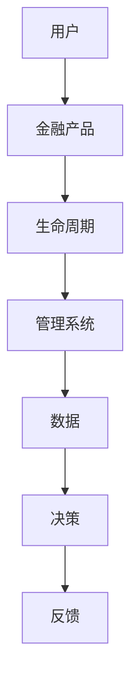
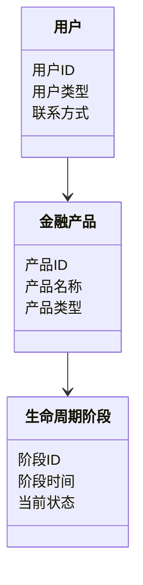
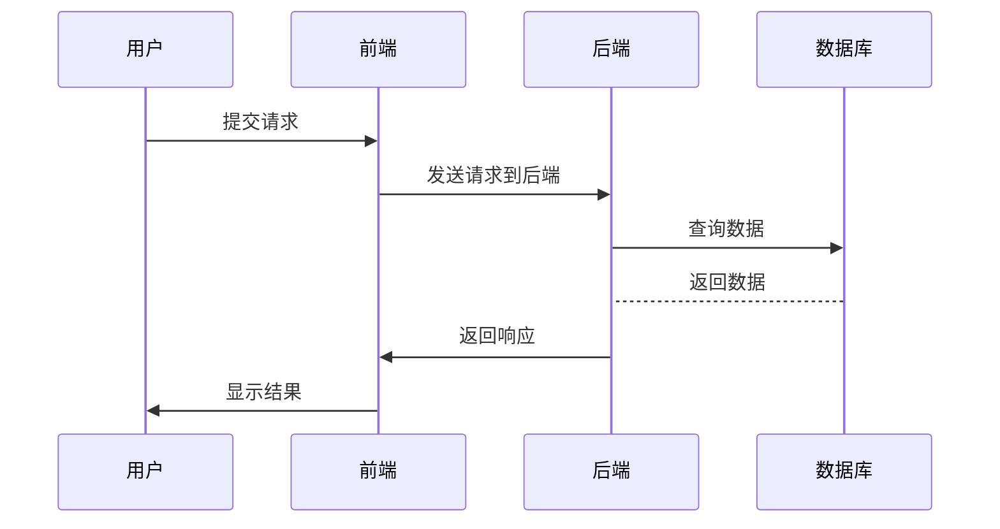

                 


# 开发智能化的金融产品生命周期管理平台

> 关键词：智能化、金融产品、生命周期管理、人工智能、系统架构、机器学习

> 摘要：本文详细探讨了开发智能化金融产品生命周期管理平台的背景、核心概念、算法原理、系统架构、项目实战以及最佳实践。通过结合人工智能技术，优化金融产品的开发和管理流程，提升效率和准确性。

---

## 第一部分: 智能化金融产品生命周期管理平台的背景与核心概念

### 第1章: 金融产品生命周期管理的现状与挑战

#### 1.1 传统金融产品管理的痛点
##### 1.1.1 传统金融产品管理的流程与问题
传统的金融产品管理流程通常依赖人工操作，存在以下问题：
- **流程复杂**：从产品设计、审批、发行到终止，涉及多个部门和环节，效率低下。
- **人工干预多**：依赖手动录入和审批，容易出错且耗时。
- **数据孤岛**：各部门之间数据不共享，导致信息不一致，难以快速响应市场变化。

##### 1.1.2 人工管理的低效性与误差
- **低效性**：人工处理大量数据和流程，效率低，容易延误。
- **误差**：人为错误可能导致严重的经济损失，尤其是在高风险的金融领域。

##### 1.1.3 传统系统的技术局限性
- **系统孤立**：传统系统往往无法与其他系统集成，导致数据孤岛。
- **规则固定**：传统系统依赖固定的规则，难以适应市场变化和个性化需求。

#### 1.2 智能化管理的必要性
##### 1.2.1 人工智能在金融领域的应用潜力
人工智能（AI）技术在金融领域的应用日益广泛，包括：
- **风险评估**：利用机器学习模型预测市场风险。
- **智能投顾**：为投资者提供个性化投资建议。
- **欺诈检测**：通过异常检测技术识别 fraudulent transactions。

##### 1.2.2 智能化管理对金融机构的竞争力提升
- **提升效率**：AI能够自动化处理大量数据和流程，显著提高效率。
- **增强准确性**：通过算法优化，减少人为错误，提高决策的准确性。
- **快速响应**：智能化系统能够实时处理数据，快速响应市场变化。

##### 1.2.3 用户需求的智能化升级
- **用户体验**：用户希望获得更智能、更便捷的服务。
- **个性化需求**：用户需要个性化的金融产品和服务。

### 第2章: 智能化金融产品生命周期管理平台的核心概念

#### 2.1 核心概念的定义与属性
##### 2.1.1 金融产品生命周期的定义
金融产品生命周期包括从产品设计、审批、发行、监控到终止的全过程。

##### 2.1.2 智能化管理的定义
智能化管理是指利用人工智能技术，自动化处理金融产品生命周期中的各个环节，提升效率和准确性。

##### 2.1.3 平台的核心功能与属性对比表

| 核心功能       | 传统管理 | 智能化管理 |
|----------------|----------|------------|
| 数据处理       | 手动录入 | AI自动处理 |
| 风险评估       | 人工评估 | AI模型评估 |
| 流程审批       | 逐级审批 | AI辅助审批 |
| 监控与反馈     | 定期报告 | 实时监控    |

#### 2.2 核心要素的实体关系分析
##### 2.2.1 用户与金融产品的关系
- 用户需求驱动产品设计。
- 用户行为影响产品生命周期。

##### 2.2.2 产品生命周期与管理系统的交互
- 系统根据产品状态自动调整管理流程。
- 系统实时反馈产品表现。

##### 2.2.3 数据流与决策链的实体关系图



---

## 第二部分: 平台的算法原理与数学模型

### 第3章: 机器学习在金融产品管理中的应用

#### 3.1 机器学习算法的选择与优化
##### 3.1.1 监督学习在风险评估中的应用
- **线性回归**：用于预测金融产品的市场表现。
- **随机森林**：用于分类问题，如欺诈检测。

##### 3.1.2 非监督学习在异常检测中的应用
- **聚类分析**：用于发现潜在的市场趋势或异常行为。

##### 3.1.3 深度学习在复杂场景中的优势
- **神经网络**：用于处理非结构化数据，如自然语言处理。

#### 3.2 算法原理的数学模型与实现

##### 3.2.1 风险评估模型的数学公式
- **线性回归模型**：
  $$ y = \beta_0 + \beta_1x_1 + \beta_2x_2 + \ldots + \beta_nx_n $$
  其中，$y$ 是预测的市场风险，$x_i$ 是自变量。

- **随机森林算法**：
  随机森林通过构建多个决策树，并对结果进行投票或平均，提高模型的准确性和鲁棒性。

##### 3.2.2 时间序列分析的数学模型
- **ARIMA模型**：
  $$ ARIMA(p, d, q) $$
  用于预测金融产品的价格走势。

---

## 第三部分: 系统架构与设计

### 第4章: 系统架构设计与实现

#### 4.1 问题场景介绍
- 金融产品生命周期管理平台需要处理大量的数据，包括产品信息、市场数据、用户行为等。

#### 4.2 系统功能设计
##### 4.2.1 领域模型设计


#### 4.3 系统架构设计
##### 4.3.1 分层架构
- **前端**：用户界面，接收用户输入并展示结果。
- **后端**：业务逻辑处理，与数据库交互。
- **数据库**：存储金融产品和用户数据。

##### 4.3.2 微服务架构
- **服务1**：负责产品设计。
- **服务2**：负责审批流程。
- **服务3**：负责监控和反馈。

#### 4.4 系统接口设计
- **API接口**：提供RESTful API，供前端或其他系统调用。

#### 4.5 系统交互设计


---

## 第四部分: 项目实战

### 第5章: 项目实施与代码实现

#### 5.1 环境配置
- **Python版本**：3.8以上。
- **依赖库**：numpy、pandas、scikit-learn、flask。

#### 5.2 核心实现代码

##### 数据预处理
```python
import pandas as pd
import numpy as np

# 加载数据
data = pd.read_csv('financial_data.csv')

# 删除缺失值
data = data.dropna()

# 标准化处理
from sklearn.preprocessing import StandardScaler
scaler = StandardScaler()
data_scaled = scaler.fit_transform(data)
```

##### 模型训练
```python
from sklearn.ensemble import RandomForestClassifier
model = RandomForestClassifier(n_estimators=100, random_state=42)
model.fit(X_train, y_train)
```

##### 系统部署
```python
from flask import Flask, request, jsonify

app = Flask(__name__)

@app.route('/api/predict', methods=['POST'])
def predict():
    data = request.json
    # 处理数据
    return jsonify(result)

if __name__ == '__main__':
    app.run(debug=True)
```

---

## 第五部分: 最佳实践与未来展望

### 第6章: 开发经验与注意事项

#### 6.1 数据质量的重要性
- 数据清洗和预处理是模型准确性的关键。

#### 6.2 模型迭代的必要性
- 定期更新模型，适应市场变化。

#### 6.3 系统可扩展性和安全性
- 设计模块化的系统架构，便于扩展。
- 采用安全措施，保护用户数据。

#### 6.4 持续学习与优化
- 关注最新的AI技术和行业动态，不断优化系统。

---

## 结语

开发智能化的金融产品生命周期管理平台是一项复杂的系统工程，需要结合人工智能技术、系统架构设计和项目实施经验。通过本文的详细讲解，读者可以全面理解开发过程中的关键点，并在实际项目中应用这些知识，提升金融产品的管理效率和准确性。未来，随着AI技术的不断发展，智能化金融管理平台将发挥更大的作用，为金融机构和用户提供更优质的服务。

