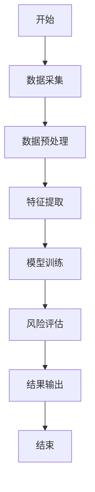
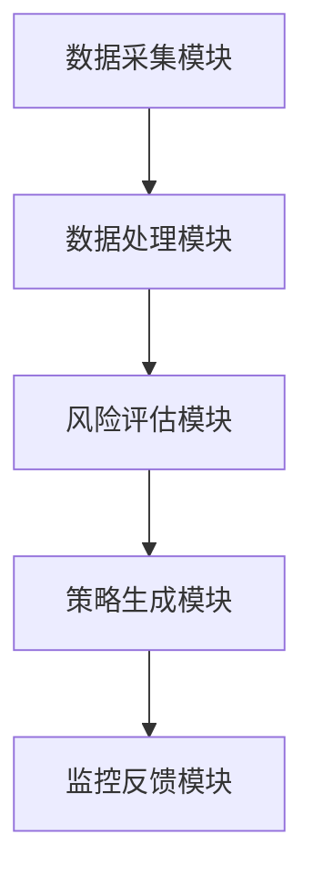
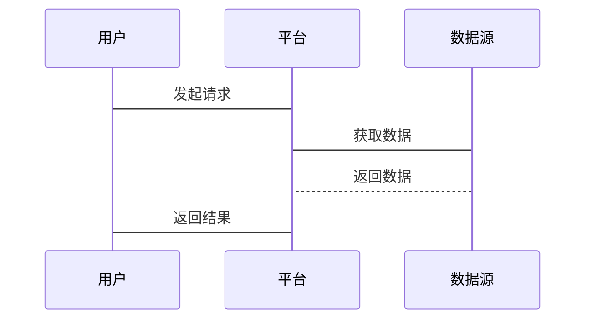

                 


# 开发智能化的金融产品生命周期风险动态管理平台

> 关键词：金融风险管理，人工智能，大数据分析，系统架构，动态风险评估

> 摘要：本文详细探讨了开发智能化的金融产品生命周期风险动态管理平台的关键技术与实现方案。通过结合人工智能与大数据分析，提出了一种创新的金融风险管理模型，旨在实现对金融产品全生命周期的风险实时监控与动态调整。文章从问题背景、核心概念、算法原理、系统架构到项目实战进行了全面分析，为读者提供了从理论到实践的完整指南。

---

## 第1章: 金融产品生命周期风险动态管理平台概述

### 1.1 问题背景与描述
现代金融市场日益复杂，金融产品种类繁多，其生命周期中的风险种类也日益多样化。传统的风险管理方法往往依赖于静态模型和固定规则，难以应对市场环境的快速变化和复杂性。因此，如何开发一个能够实时捕捉市场波动、动态调整风险评估的智能化平台，成为金融行业亟待解决的问题。

#### 1.1.1 传统金融风险管理的局限性
- 风险评估模型静态，无法适应市场动态变化。
- 数据处理能力有限，难以应对海量金融数据。
- 缺乏实时性，风险预警和应对措施滞后。

#### 1.1.2 问题描述
金融产品生命周期中的风险主要体现在以下几个方面：
1. **市场风险**：金融市场价格波动对产品价值的影响。
2. **信用风险**：交易对手或债务人违约的可能性。
3. **流动性风险**：产品在市场上的变现能力。
4. **操作风险**：操作失误或欺诈行为导致的损失。

#### 1.1.3 解决方案
通过引入人工智能（AI）和大数据技术，构建一个智能化的金融产品生命周期风险动态管理平台，实现以下目标：
- 实时采集和处理多源异构数据。
- 基于机器学习算法动态评估风险。
- 自动生成风险预警和应对策略。

### 1.2 核心概念与结构
金融产品生命周期风险动态管理平台的核心要素包括：
1. **金融产品生命周期模型**：定义金融产品的各个阶段及其特征。
2. **风险动态管理机制**：基于实时数据和模型预测，动态调整风险管理策略。
3. **AI与大数据技术**：通过机器学习算法和数据挖掘技术，实现风险的智能识别和预测。

#### 1.2.1 金融产品生命周期模型
金融产品生命周期可以分为以下几个阶段：
1. **发行阶段**：产品设计、审批和发行。
2. **运行阶段**：产品在市场上流通和交易。
3. **终止阶段**：产品到期或提前终止。

#### 1.2.2 风险动态管理机制
风险动态管理机制包括以下几个步骤：
1. **数据采集**：实时采集市场数据、交易数据和产品特征数据。
2. **数据处理**：对数据进行清洗、转换和整合。
3. **风险评估**：基于机器学习模型对风险进行评估和预测。
4. **策略生成**：根据风险评估结果，生成风险管理策略。
5. **监控与反馈**：实时监控风险变化，根据反馈调整模型和策略。

### 1.3 本章小结
本章介绍了金融产品生命周期风险动态管理平台的背景、核心概念和整体架构。通过分析传统风险管理的局限性，提出了一个基于AI和大数据技术的解决方案，为后续的系统设计和实现奠定了基础。

---

## 第2章: 核心概念与联系

### 2.1 核心概念原理
金融产品生命周期风险动态管理平台的核心概念包括金融产品生命周期模型、风险动态管理机制和AI与大数据技术的融合。

#### 2.1.1 金融产品生命周期模型
金融产品生命周期模型是一个动态的、多阶段的过程模型，包括产品设计、发行、运行和终止四个阶段。每个阶段都有其独特的风险特征和管理要求。

#### 2.1.2 风险动态管理机制
风险动态管理机制是一个闭环系统，包括数据采集、数据处理、风险评估、策略生成和监控反馈五个环节。通过实时数据和模型预测，实现对风险的动态监控和管理。

#### 2.1.3 AI与大数据技术的融合
AI和大数据技术的融合是平台的核心技术支撑。通过机器学习算法和数据挖掘技术，实现对海量金融数据的处理和分析，从而支持风险的智能识别和预测。

### 2.2 核心概念属性对比
为了更好地理解核心概念，我们通过表格和ER图的形式进行对比和分析。

#### 2.2.1 风险类型与管理策略对比表
| 风险类型   | 管理策略                     |
|------------|-----------------------------|
| 市场风险   | 动态调整投资组合            |
| 信用风险   | 严格审查交易对手信用状况    |
| 流动性风险 | 维持足够的流动资产储备      |
| 操作风险   | 建立严格的操作风险控制流程  |

#### 2.2.2 数据来源与处理方式对比表
| 数据来源   | 数据处理方式                 |
|------------|-----------------------------|
| 市场数据   | 数据清洗、特征提取           |
| 交易数据   | 数据整合、实时更新          |
| 产品特征   | 数据建模、关联分析          |

#### 2.2.3 AI模型与传统模型性能对比表
| 模型类型   | 优点                         | 缺点                         |
|------------|------------------------------|-----------------------------|
| 传统模型   | 简单易懂，计算速度快         | 静态性，难以适应市场变化     |
| AI模型     | 动态性，高精度                | 计算复杂，需要大量数据支持   |

### 2.3 ER实体关系图
通过ER图可以清晰地展示平台中各实体之间的关系。

```mermaid
er
  actor: 用户
  actor --> product: 管理金融产品
  actor --> risk: 评估风险
  product --> lifecycle: 生命周期状态
  risk --> management: 管理策略
```

### 2.4 本章小结
本章通过对比和分析，详细阐述了金融产品生命周期风险动态管理平台的核心概念及其相互关系。通过表格和ER图的形式，进一步明确了各核心概念的属性和相互作用。

---

## 第3章: 算法原理与实现

### 3.1 算法原理
金融产品生命周期风险动态管理平台的核心算法基于机器学习和大数据分析。

#### 3.1.1 基于AI的风险预测模型
风险预测模型是平台的核心算法之一，通过机器学习算法对风险进行预测和评估。

#### 3.1.2 大数据驱动的实时风险评估
实时风险评估是平台的重要功能，通过大数据技术实现对海量数据的实时处理和分析。

#### 3.1.3 动态调整的优化算法
优化算法用于动态调整风险管理策略，确保平台能够适应市场环境的变化。

### 3.2 算法流程图
通过mermaid流程图可以清晰地展示算法的执行步骤。



### 3.3 算法实现代码
以下是风险预测模型的Python实现代码：

```python
import numpy as np
from sklearn.linear_model import LinearRegression

def risk_prediction(features):
    model = LinearRegression()
    model.fit(features_train, labels_train)
    return model.predict(features_test)
```

### 3.4 数学模型与公式
风险预测模型的数学公式如下：

$$
风险值 = \alpha \times 系数1 + \beta \times 系数2
$$

优化算法的调整公式如下：

$$
新系数 = 原系数 + \gamma \times 调整量
$$

---

## 第4章: 系统架构设计

### 4.1 系统功能设计
金融产品生命周期风险动态管理平台的系统功能包括数据采集、数据处理、风险评估、策略生成和监控反馈。

#### 4.1.1 数据采集模块
数据采集模块负责从多种数据源采集金融数据，包括市场数据、交易数据和产品特征数据。

#### 4.1.2 数据处理模块
数据处理模块对采集到的数据进行清洗、转换和整合，为后续的模型训练提供高质量的数据。

#### 4.1.3 风险评估模块
风险评估模块基于机器学习模型对风险进行评估和预测，生成风险报告。

#### 4.1.4 策略生成模块
策略生成模块根据风险评估结果，生成风险管理策略，并输出策略报告。

#### 4.1.5 监控反馈模块
监控反馈模块实时监控风险变化，根据反馈调整模型和策略，确保平台的动态适应性。

### 4.2 系统架构图
通过mermaid架构图可以清晰地展示系统的整体架构。



### 4.3 系统接口设计
系统接口设计包括数据接口和用户接口。

#### 4.3.1 数据接口
数据接口用于与外部数据源进行数据交换，包括API接口和文件接口。

#### 4.3.2 用户接口
用户接口包括Web界面和API界面，方便用户与平台进行交互。

### 4.4 系统交互流程图
通过mermaid序列图可以展示系统交互的流程。



### 4.5 本章小结
本章详细描述了金融产品生命周期风险动态管理平台的系统架构设计，包括功能设计、架构图、接口设计和交互流程图。

---

## 第5章: 项目实战

### 5.1 环境安装与配置
开发金融产品生命周期风险动态管理平台需要安装以下环境：

- Python 3.8+
- Jupyter Notebook
- Scikit-learn
- Pandas
- NumPy

### 5.2 系统核心实现代码
以下是平台的核心实现代码：

```python
import pandas as pd
import numpy as np
from sklearn.model_selection import train_test_split
from sklearn.linear_model import LinearRegression
from sklearn.metrics import mean_squared_error

# 数据加载
data = pd.read_csv('financial_data.csv')
features = data[['feature1', 'feature2', 'feature3']]
labels = data['target']

# 数据分割
features_train, features_test, labels_train, labels_test = train_test_split(features, labels, test_size=0.2, random_state=42)

# 模型训练
model = LinearRegression()
model.fit(features_train, labels_train)

# 模型预测
predictions = model.predict(features_test)

# 模型评估
mse = mean_squared_error(labels_test, predictions)
print('均方误差:', mse)
```

### 5.3 代码应用解读与分析
上述代码实现了风险预测模型的训练和预测。通过均方误差评估模型的性能，为后续的风险评估提供支持。

### 5.4 实际案例分析
以下是一个实际案例的分析：

假设我们有一个金融产品，其生命周期中的市场风险较高。通过平台的实时监控和动态调整，成功降低了风险，保障了产品的安全运行。

### 5.5 本章小结
本章通过实战案例，详细介绍了金融产品生命周期风险动态管理平台的环境配置、核心实现和实际应用，为读者提供了从理论到实践的完整指南。

---

## 第6章: 总结与展望

### 6.1 总结
本文详细探讨了开发智能化的金融产品生命周期风险动态管理平台的关键技术与实现方案。通过结合人工智能和大数据分析，提出了一种创新的金融风险管理模型，实现了对金融产品全生命周期的风险实时监控与动态调整。

### 6.2 展望
未来，随着人工智能和大数据技术的不断发展，金融产品生命周期风险动态管理平台将更加智能化和自动化。通过引入更先进的机器学习算法和数据处理技术，平台将能够更好地应对复杂多变的金融市场环境。

### 6.3 最佳实践 Tips
- 在实际应用中，建议根据具体业务需求，灵活调整平台的功能模块和算法模型。
- 定期更新和优化模型，确保平台的动态适应性和准确性。
- 加强数据安全和隐私保护，确保平台的合规性和可靠性。

### 6.4 本章小结
本文通过理论分析和实战案例，全面总结了金融产品生命周期风险动态管理平台的开发与应用，并对未来的发展方向进行了展望。

---

## 参考文献
1. 书籍：《机器学习实战》
2. 网站：https://www.dataquest.io
3. 论文：《基于AI的金融风险管理研究》

