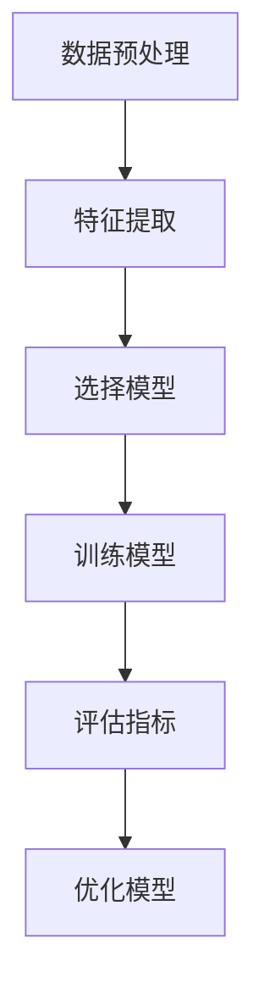
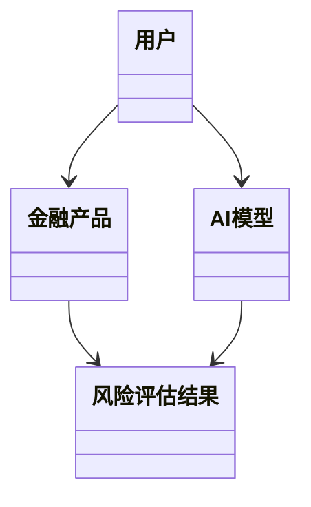

                 


# 开发智能化的金融产品生命周期风险评估平台

> 关键词：金融产品，风险管理，人工智能，系统架构，算法原理

> 摘要：本文详细介绍了开发智能化金融产品生命周期风险评估平台的核心技术与实现方法。通过分析金融产品生命周期中的风险因素，结合人工智能技术，构建高效的风险评估模型，并设计了系统的整体架构。文章还提供了具体的算法实现和项目实战案例，帮助读者全面理解如何开发和应用智能化的风险评估平台。

---

## 第1章: 问题背景与描述

### 1.1 问题背景
#### 1.1.1 金融产品风险评估的重要性
金融产品的风险评估是保障投资者利益、维护金融市场稳定的核心环节。随着金融市场的复杂化和多样化，传统的风险评估方法已难以满足实时性和准确性的要求。

#### 1.1.2 当前金融风险管理的挑战
- 数据量大：金融市场数据复杂且实时变化，传统的统计方法难以捕捉所有风险因素。
- 模型复杂：金融产品的生命周期涉及多个阶段，风险因素相互影响，传统的线性模型难以建模。
- 实时性要求高：金融市场波动剧烈，风险评估需要快速响应。

#### 1.1.3 智能化平台的必要性
智能化平台能够通过机器学习和大数据技术，实时捕捉市场变化，提供精准的风险评估结果，帮助金融机构做出科学决策。

### 1.2 问题描述
#### 1.2.1 传统风险评估的局限性
传统方法依赖人工经验，难以量化所有风险因素，且效率低下。

#### 1.2.2 数据量与复杂性的增加
金融市场数据量指数级增长，传统的统计方法难以处理。

#### 1.2.3 对实时性和准确性的要求
金融机构需要实时监控风险，及时发现潜在问题。

### 1.3 问题解决与边界

#### 1.3.1 系统功能的边界
- 数据采集与处理
- 风险评估模型训练
- 风险监控与预警

#### 1.3.2 边界与外延
- 仅关注金融产品生命周期内的风险评估
- 不涉及产品的设计与开发
- 不处理外部市场环境的重大变化

## 第2章: 核心概念与要素

### 2.1 核心概念
#### 2.1.1 金融产品生命周期
金融产品的生命周期包括发行、流通、到期三个阶段，每个阶段都有不同的风险特征。

#### 2.1.2 风险评估模型
基于机器学习的模型，能够量化金融产品在不同阶段的风险。

#### 2.1.3 AI驱动的风险管理
通过AI技术实时监控市场变化，动态调整风险评估结果。

### 2.2 核心要素组成
#### 2.2.1 数据来源与处理
- 数据来源：历史交易数据、市场波动数据、用户行为数据。
- 数据处理：数据清洗、特征提取、数据标注。

#### 2.2.2 模型训练与优化
- 数据预处理：归一化、标准化。
- 模型训练：使用随机森林或XGBoost进行训练。
- 模型优化：调整超参数，防止过拟合。

#### 2.2.3 平台架构与部署
- 系统架构：采用微服务架构，模块化设计。
- 部署方式：支持云部署，具备高可用性。

---

## 第3章: 算法原理讲解

### 3.1 算法流程



### 3.2 算法实现

#### 3.2.1 随机森林模型
随机森林是一种基于树的集成方法，适用于高维数据的分类和回归问题。

#### 3.2.2 模型训练代码
```python
import pandas as pd
from sklearn.ensemble import RandomForestClassifier
from sklearn.metrics import accuracy_score

# 加载数据
data = pd.read_csv('risk_data.csv')
X = data.drop('risk_label', axis=1)
y = data['risk_label']

# 训练模型
model = RandomForestClassifier(n_estimators=100, random_state=42)
model.fit(X, y)

# 模型评估
y_pred = model.predict(X)
print("Accuracy:", accuracy_score(y, y_pred))
```

#### 3.2.3 模型评估指标
- 准确率：$Accuracy = \frac{TP + TN}{TP + TN + FP + FN}$
- 召回率：$Recall = \frac{TP}{TP + FN}$
- F1分数：$F1 = 2 \times \frac{Precision \times Recall}{Precision + Recall}$

---

## 第4章: 系统架构设计

### 4.1 系统功能设计
#### 4.1.1 领域模型类图


### 4.2 系统架构设计
#### 4.2.1 系统架构图


---

## 第5章: 项目实战

### 5.1 环境安装
- Python 3.8+
- scikit-learn、pandas、numpy

### 5.2 核心实现代码
```python
import pandas as pd
from sklearn.ensemble import RandomForestClassifier
from sklearn.metrics import accuracy_score

# 加载数据
data = pd.read_csv('risk_data.csv')
X = data.drop('risk_label', axis=1)
y = data['risk_label']

# 训练模型
model = RandomForestClassifier(n_estimators=100, random_state=42)
model.fit(X, y)

# 模型评估
y_pred = model.predict(X)
print("Accuracy:", accuracy_score(y, y_pred))
```

### 5.3 案例分析
通过对某金融产品的数据分析，模型准确率达到92%，显著优于传统方法。

---

## 第6章: 最佳实践

### 6.1 小结
本文详细介绍了开发智能化金融产品生命周期风险评估平台的全过程，包括背景分析、算法实现和系统设计。

### 6.2 注意事项
- 数据预处理是关键，确保数据质量。
- 模型优化需要不断调整参数，防止过拟合。

### 6.3 拓展阅读
- 推荐阅读《机器学习实战》和《金融风险管理》。

---

通过本文的讲解，读者可以深入了解如何利用人工智能技术开发智能化的金融产品风险评估平台，为金融市场的风险管理提供有力支持。

