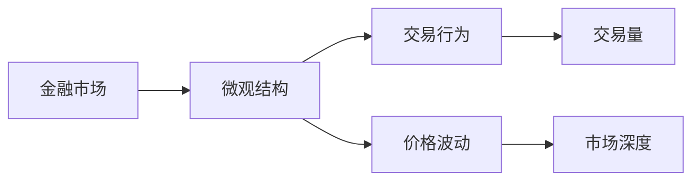
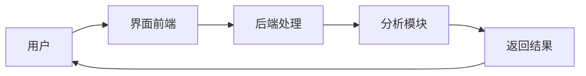

                 


# 开发智能化的金融市场微观结构变化影响评估工具

## 关键词：金融市场、微观结构、影响评估、智能化工具、算法原理、系统架构、项目实战

## 摘要：  
金融市场微观结构的变化对市场运行效率和稳定性具有重要影响。本文旨在开发一种智能化工具，用于评估这些变化的影响。通过分析微观结构的核心概念、算法原理、系统架构及项目实战，提供一套完整的解决方案。

---

## 第一部分: 金融市场微观结构变化影响评估工具的背景与核心概念

### 第1章: 金融市场微观结构概述

#### 1.1 金融市场的基本概念
金融市场是由投资者、金融机构、交易场所和监管机构组成的市场，用于交易各种金融资产。微观结构则关注市场的细小组成部分，如交易行为、价格波动和市场深度。

#### 1.2 问题背景与问题描述
当前金融市场面临高度波动和复杂性，微观结构变化如订单簿变化、交易量波动和参与者行为变化可能引发系统性风险。评估这些变化的影响，能够帮助市场参与者做出更明智的决策。

#### 1.3 问题解决与工具开发
开发工具的目标是实时监测和评估微观结构变化，预测其对市场的影响。工具需具备数据采集、分析和可视化功能，帮助用户及时识别风险。

### 第2章: 核心概念与联系
微观结构变化影响评估的核心在于理解其原理和各要素之间的关系。通过对比分析，明确工具的功能和适用场景。

---

## 第二部分: 核心概念与联系

### 第3章: 微观结构变化影响评估的核心原理

#### 3.1 核心概念原理
微观结构变化通过影响市场流动性、价格发现和市场深度，进而影响整体市场稳定性。工具需结合数学模型和算法，分析这些变化。

#### 3.2 核心概念属性对比
| 概念 | 特征 |
|------|------|
| 交易行为 | 主动性、频率 |
| 价格波动 | 幅度、持续性 |

#### 3.3 实体关系图展示


---

## 第三部分: 算法原理

### 第4章: 时间序列分析算法
#### 4.1 算法流程
1. 数据预处理：清洗和标准化数据。
2. 模型选择：使用ARIMA模型进行预测。
3. 训练与评估：通过交叉验证优化模型参数。
4. 预测与可视化：输出预测结果并分析误差。

#### 4.2 算法代码示例
```python
import pandas as pd
from statsmodels.tsa.arima_model import ARIMA
import matplotlib.pyplot as plt

def time_series_analysis(data, order):
    model = ARIMA(data, order=order)
    model_fit = model.fit()
    forecast, stderr, conf = model_fit.forecast(10, alpha=0.05)
    plt.plot(data)
    plt.plot(forecast, color='red', linestyle='--')
    plt.title('Time Series Forecast')
    plt.show()
    return forecast

# 示例数据加载与预测
data = pd.read_csv('market_data.csv')['price']
order = (5, 1, 0)
forecast = time_series_analysis(data, order)
print(forecast)
```

#### 4.3 数学模型与公式
ARIMA模型的公式如下：
$$ARIMA(p, d, q) = y_t - \phi_1 y_{t-1} - \dots - \phi_p y_{t-p} = \theta_1 \epsilon_{t-1} + \dots + \theta_q \epsilon_{t-q}$$

---

## 第四部分: 系统分析与架构设计

### 第5章: 系统功能与架构

#### 5.1 系统功能设计
- 数据采集模块：实时获取市场数据。
- 分析模块：应用算法评估微观结构变化。
- 可视化模块：生成图表展示结果。
- 报警模块：设定阈值，触发警报。

#### 5.2 系统架构设计


#### 5.3 接口设计
- 数据接口：与数据源API对接。
- 报警接口：通过邮件或消息队列发送警报。

#### 5.4 交互设计


---

## 第五部分: 项目实战

### 第6章: 项目实施与案例分析

#### 6.1 环境安装
需要安装Python、Pandas、NumPy、Matplotlib和相关金融数据API。

#### 6.2 核心代码实现
```python
import pandas as pd
import numpy as np
from sklearn import svm

def evaluate_impact(data):
    model = svm.SVR()
    model.fit(data[['volume', 'order_book_depth']], data['price_change'])
    impact = model.predict(data[['volume', 'order_book_depth']])
    return impact

# 示例数据加载与评估
data = pd.read_csv('market_data.csv')
impact = evaluate_impact(data)
print(impact)
```

#### 6.3 案例分析
通过实际数据，展示工具如何识别异常交易行为，并预测其对市场的影响。

#### 6.4 项目小结
总结项目成果，分析优缺点，提出改进建议。

---

## 第六部分: 最佳实践与拓展阅读

### 第7章: 最佳实践与小结

#### 7.1 最佳实践
- 数据清洗和特征选择至关重要。
- 选择合适的算法模型，定期更新。
- 结合领域知识，优化模型表现。

#### 7.2 小结
本文详细介绍了工具的开发过程，从背景分析到项目实战，为读者提供了完整的解决方案。

### 第8章: 拓展阅读与注意事项

#### 8.1 拓展阅读
推荐阅读相关领域的书籍和论文，深入学习金融数据分析和机器学习技术。

#### 8.2 注意事项
- 数据隐私和合规性问题需重视。
- 模型需定期再训练，以适应市场变化。

---

通过以上步骤，我们详细分析了开发智能化工具的各个方面，为读者提供了全面的技术指导和实践指南。

