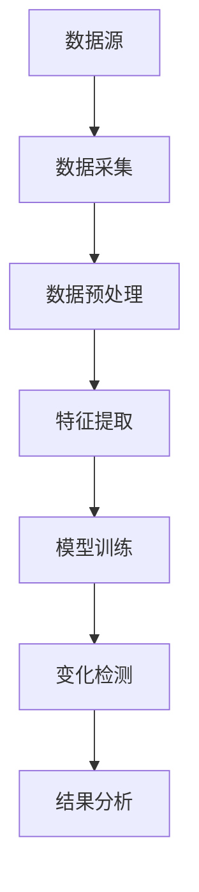
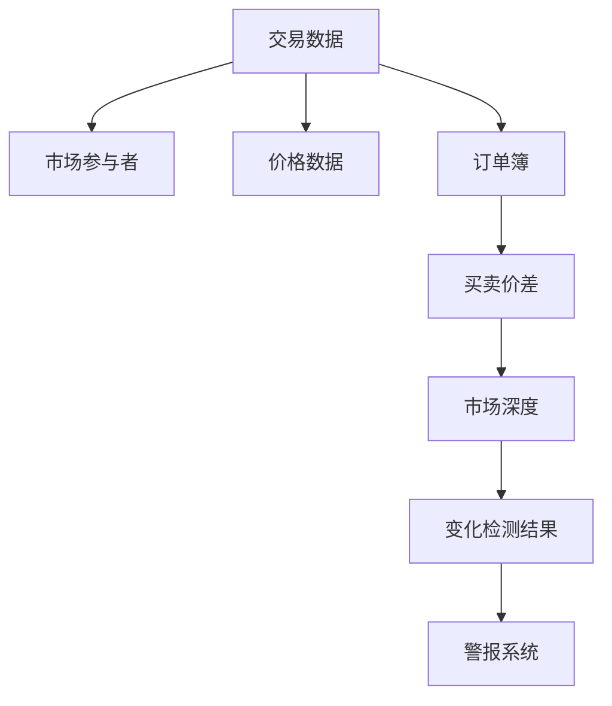
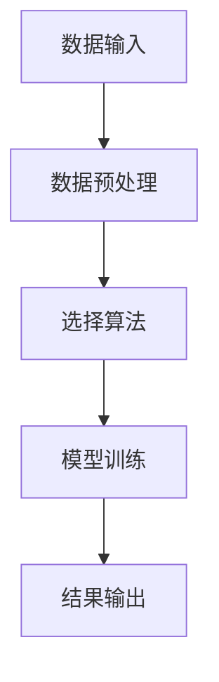
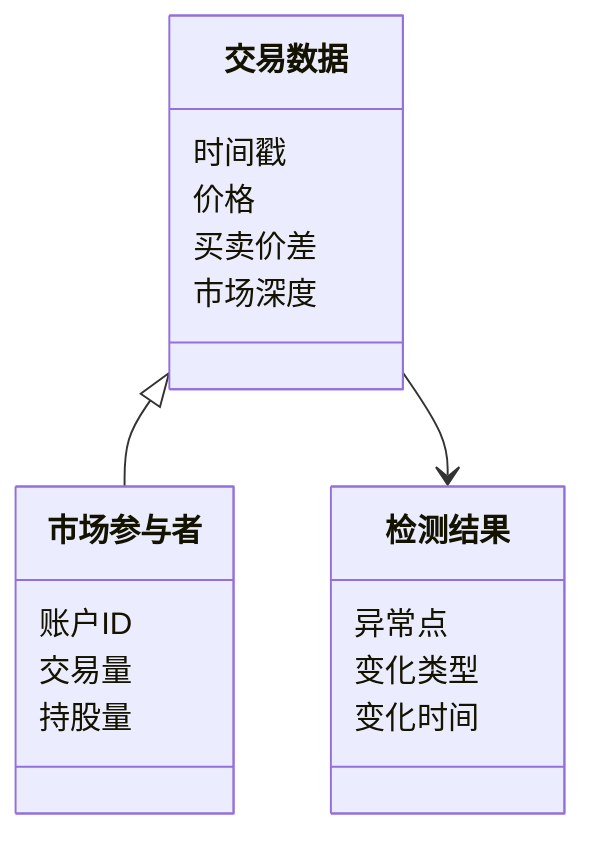
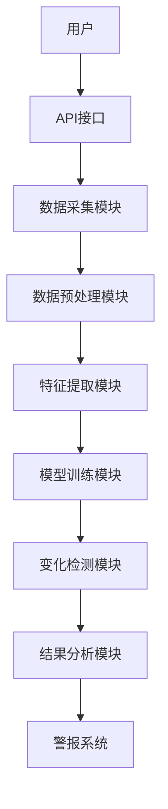
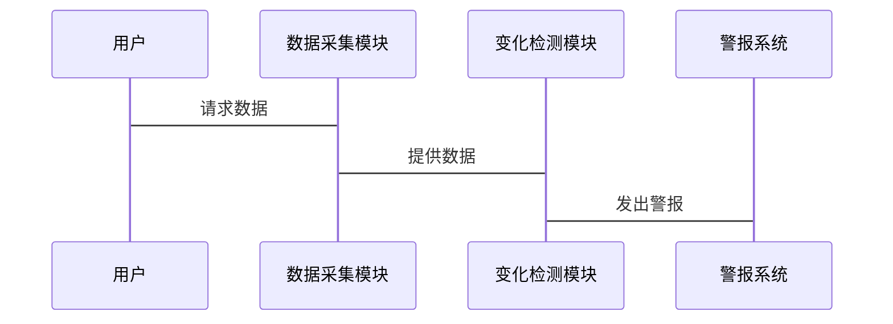

                 


# 开发智能化的金融市场微观结构变化检测工具

> 关键词：金融市场，微观结构变化，异常检测，时间序列分析，机器学习，智能化工具

> 摘要：本文深入探讨了开发智能化的金融市场微观结构变化检测工具的背景、核心概念、算法原理、系统架构及实现方案。通过分析市场数据的时间序列特性，结合机器学习算法，提出了一种高效、准确的检测方法，并通过实际案例展示了工具的应用价值。

---

# 第一部分: 金融市场微观结构变化检测工具开发背景

# 第1章: 金融市场微观结构变化检测概述

## 1.1 问题背景与重要性

### 1.1.1 金融市场微观结构的基本概念

金融市场微观结构是指市场的组织形式、交易机制、参与者行为及其相互作用的总和。它涵盖了订单簿、交易量、价格波动、市场深度、买卖价差等多个维度。理解这些微观结构有助于揭示市场的运行规律，发现潜在的风险和机会。

### 1.1.2 微观结构变化对市场的影响

微观结构的变化可能反映市场参与者的策略调整、市场情绪的变化或外部事件的影响。例如，突然增加的买卖价差可能表明市场流动性下降，或某些参与者在操纵市场。及时检测这些变化可以帮助投资者做出更明智的决策。

### 1.1.3 检测工具的必要性与应用价值

金融市场微观结构变化的检测工具可以帮助机构投资者、监管机构和市场参与者及时发现异常情况，优化交易策略，提高市场透明度和稳定性。例如，高频交易中的异常检测工具可以快速识别潜在的市场操纵行为。

## 1.2 问题描述与目标

### 1.2.1 微观结构变化的定义与分类

微观结构变化可以分为局部变化和全局变化。局部变化是指短时间内某些指标的异常波动，如突然增加的订单量；全局变化则是指长期趋势的变化，如市场深度的持续下降。根据变化的来源，还可以分为内生性变化（由市场参与者行为引起）和外生性变化（由外部事件引起）。

### 1.2.2 检测工具的功能需求

检测工具需要具备以下功能：
- 数据采集：实时采集金融市场数据，包括订单簿、交易量、价格等。
- 数据预处理：清洗数据，消除噪声，提取特征。
- 变化检测：通过算法识别数据中的异常或趋势变化。
- 结果分析：对检测到的变化进行分类，生成报告或触发警报。

### 1.2.3 开发目标与预期成果

开发目标包括：
1. 实现一个能够实时检测金融市场微观结构变化的工具。
2. 提供高精度的检测算法，减少误报和漏报。
3. 支持多种数据源和多种检测场景。

预期成果是：一个高效、准确的检测工具，能够在金融市场中快速识别潜在风险，帮助用户做出及时决策。

## 1.3 问题解决与边界

### 1.3.1 解决方案的总体思路

解决方案的总体思路包括以下几个步骤：
1. 数据采集与预处理：获取金融市场数据，并进行清洗和特征提取。
2. 特征选择：根据问题需求，选择合适的特征进行分析。
3. 模型训练：使用时间序列分析、机器学习等方法训练检测模型。
4. 变化检测：将实时数据输入模型，识别异常或趋势变化。
5. 结果分析与反馈：对检测结果进行分类，生成报告或触发警报。

### 1.3.2 边界与外延

边界包括：
- 数据范围：仅限于金融市场微观结构相关数据。
- 时间范围：仅关注短期或长期变化，不涉及宏观经济因素。
- 检测范围：仅针对特定的市场参与者或交易行为。

外延包括：
- 数据来源的扩展：支持更多的数据源，如社交媒体情绪数据。
- 检测方法的扩展：引入更多的算法，如图神经网络。
- 应用场景的扩展：从金融领域扩展到其他市场，如能源市场。

### 1.3.3 核心要素与组成结构

核心要素包括：
1. 数据采集模块：负责数据的获取和预处理。
2. 特征提取模块：提取有助于检测变化的特征。
3. 模型训练模块：训练检测模型，优化模型性能。
4. 变化检测模块：实时检测数据中的异常或趋势变化。
5. 结果分析模块：对检测结果进行分类，生成报告或触发警报。

组成结构可以用ER图表示：



---

# 第2章: 核心概念与原理

## 2.1 微观结构变化的核心概念

### 2.1.1 时间序列分析

时间序列分析是研究数据随时间变化的模式和趋势的重要方法。常用的模型包括ARIMA（自回归积分滑动平均模型）和LSTM（长短期记忆网络）。这些模型可以帮助我们捕捉数据中的趋势、周期性和随机性。

### 2.1.2 异常检测算法

异常检测算法用于识别数据中的异常点，常用的算法包括基于统计的方法（如Z-score）、基于距离的方法（如KNN）和基于深度学习的方法（如AE-CNN）。这些算法可以帮助我们识别数据中的异常行为，如突然的买卖量激增。

### 2.1.3 机器学习模型

机器学习模型（如支持向量机、随机森林和神经网络）可以用于分类、回归和聚类任务。在金融市场微观结构变化检测中，可以使用这些模型来分类不同的市场状态（正常、异常）。

## 2.2 核心概念对比分析

### 2.2.1 时间序列与静态数据的特征对比

| 特征             | 时间序列数据               | 静态数据               |
|------------------|----------------------------|------------------------|
| 时间依赖性       | 强时间依赖性               | 无时间依赖性           |
| 趋势和周期性       | 明显的 trends 和 seasonality | 无明显的 trends 和 seasonality |
| 变化模式          | 可能有突变或渐进的变化       | 变化模式较为固定       |
| 数据量            | 数据量大，实时性要求高       | 数据量较小             |

### 2.2.2 异常检测与模式识别的差异

| 对比项            | 异常检测               | 模式识别               |
|-------------------|------------------------|------------------------|
| 目标              | 发现异常点             | 发现数据中的模式       |
| 方法              | 基于统计或深度学习      | 基于特征提取和分类器   |
| 应用场景          | 监控系统、 fraud detection | 市场分析、客户分类     |
| 输出形式          | 异常点位置或概率       | 分类标签或模式描述     |

### 2.2.3 机器学习模型的分类与适用场景

| 模型类型          | 适用场景                   |
|-------------------|----------------------------|
| 支持向量机（SVM）   | 分类任务，如正常与异常分类   |
| 随机森林          | 回归和分类任务，如预测价格、分类市场状态 |
| 神经网络模型       | 复杂模式识别，如时间序列预测 |

## 2.3 实体关系与架构设计

### 2.3.1 ER图实体关系图

金融市场微观结构变化检测系统涉及多个实体，包括交易数据、市场参与者、检测结果等。以下是主要实体及其关系：



---

# 第3章: 算法原理与实现

## 3.1 时间序列分析算法

### 3.1.1 ARIMA模型原理

ARIMA（Autoregressive Integrated Moving Average）模型由三个部分组成：
- 自回归部分（AR）：使用过去的价格来预测当前价格。
- 积分部分（I）：对数据进行差分，以消除趋势和季节性。
- 移动平均部分（MA）：使用过去的误差项来预测当前价格。

ARIMA模型的数学表达式为：
$$
ARIMA(p, d, q) = y_t = \phi_1 y_{t-1} + \dots + \phi_p y_{t-p} + \theta_1 \epsilon_{t-1} + \dots + \theta_q \epsilon_{t-q} + \epsilon_t
$$

### 3.1.2 LSTM网络的应用

LSTM（长短期记忆网络）是一种特殊的RNN（循环神经网络），适用于处理时间序列数据。LSTM通过使用细胞状态和门控机制来捕捉长期依赖关系。

LSTM的三个门控机制：
1. 输入门：控制新信息的输入。
2. 遗忘门：决定哪些信息需要遗忘。
3. 输出门：决定输出哪些信息。

### 3.1.3 GARCH模型的优缺点

GARCH（广义自回归条件异方差）模型用于预测时间序列的波动性。GARCH模型假设波动性与过去误差的平方有关。

GARCH模型的数学表达式为：
$$
\sigma_t^2 = \alpha_0 + \alpha_1 r_{t-1}^2 + \alpha_2 r_{t-2}^2 + \dots + \alpha_n r_{t-n}^2
$$

优点：
- 能够捕捉到波动性的集群现象。
- 计算相对简单。

缺点：
- 无法捕捉到非对称性波动。
- 对参数的敏感性较高。

## 3.2 异常检测算法

### 3.2.1 基于统计的方法

基于统计的方法通过计算数据的均值和标准差来识别异常点。例如，设置一个阈值，当数据点与均值的偏差超过一定倍数的标准差时，标记为异常。

### 3.2.2 基于距离的方法

基于距离的方法通过计算数据点之间的距离来识别异常点。例如，使用KNN（K-近邻算法）找到离当前点最近的K个点，计算其密度，密度低于阈值的点标记为异常。

### 3.2.3 基于深度学习的方法

基于深度学习的方法（如AE-CNN）通过构建自编码器来学习正常数据的表示，然后通过解码器重建输入数据，计算重建误差来识别异常点。

### 3.2.4 异常检测算法的实现

以下是一个基于统计的异常检测算法的Python代码示例：

```python
import numpy as np

def detect_anomaly(data, threshold=3):
    mean = np.mean(data)
    std = np.std(data)
    anomalies = []
    for x in data:
        if abs(x - mean) > threshold * std:
            anomalies.append(x)
    return anomalies
```

---

## 3.3 机器学习模型

### 3.3.1 支持向量机（SVM）原理

SVM是一种监督学习算法，适用于分类和回归任务。SVM通过构建一个超平面，将数据分为两类。对于非线性可分的数据，可以使用核函数（如RBF核）将数据映射到高维空间。

### 3.3.2 随机森林的应用

随机森林是一种基于决策树的集成学习算法，适用于分类、回归和聚类任务。随机森林通过构建多个决策树，并将它们的结果进行投票或平均，来提高模型的准确性和鲁棒性。

### 3.3.3 神经网络模型的实现

神经网络模型（如LSTM）可以通过训练来预测时间序列数据，并识别数据中的异常点。以下是使用LSTM进行异常检测的Python代码示例：

```python
import tensorflow as tf
from tensorflow.keras.layers import LSTM, Dense
from tensorflow.keras.models import Sequential

model = Sequential()
model.add(LSTM(64, input_shape=(None, 1)))
model.add(Dense(1))
model.compile(loss='mean_squared_error', optimizer='adam')

# 假设X为输入数据
X = np.array([...]).reshape(-1, 1)
model.fit(X, y, epochs=10, batch_size=32)
```

---

## 3.4 算法实现与代码示例

### 3.4.1 时间序列分析的Python代码

```python
from statsmodels.tsa.arima_model import ARIMA
import numpy as np

data = np.array([1, 2, 3, 4, 5])
model = ARIMA(data, order=(1, 1, 0))
model_fit = model.fit()
```

### 3.4.2 异常检测算法的实现

```python
def detect_anomaly(data):
    mean = np.mean(data)
    std = np.std(data)
    threshold = mean + 3 * std
    anomalies = []
    for x in data:
        if x > threshold:
            anomalies.append(x)
    return anomalies
```

### 3.4.3 机器学习模型的实现

```python
from sklearn.svm import SVC
from sklearn.ensemble import RandomForestClassifier

# 假设X为输入特征，y为标签
model_svm = SVC()
model_svm.fit(X, y)

model_rf = RandomForestClassifier()
model_rf.fit(X, y)
```

---

## 3.5 算法流程图



---

# 第4章: 系统分析与架构设计

## 4.1 问题场景介绍

金融市场微观结构变化检测系统需要实时监测市场数据，识别异常情况，并及时发出警报。系统需要处理大量高频数据，要求高实时性和高准确性。

## 4.2 系统功能设计

### 4.2.1 领域模型



### 4.2.2 系统架构设计



### 4.2.3 系统接口设计

系统接口包括：
- 数据采集接口：从数据源获取实时数据。
- 模型训练接口：接收训练数据，返回训练好的模型。
- 变化检测接口：接收实时数据，返回检测结果。

### 4.2.4 系统交互设计



---

# 第5章: 项目实战

## 5.1 环境安装与配置

### 5.1.1 Python环境配置

安装必要的Python库：
```bash
pip install numpy pandas statsmodels scikit-learn tensorflow keras
```

### 5.1.2 数据源获取

使用Yahoo Finance API获取股票数据：
```python
import pandas_datareader as pdr

data = pdr.get_data_yahoo('AAPL', start='2023-01-01', end='2023-12-31')
```

## 5.2 系统核心实现

### 5.2.1 数据预处理

对数据进行清洗和特征提取：
```python
import pandas as pd
import numpy as np

# 假设data为获取的股票数据
data['Log Returns'] = np.log(data['Adj Close'] / data['Adj Close'].shift(1))
data['VWAP'] = (data['Close'] * data['Volume']).cumsum() / data['Volume'].cumsum()
```

### 5.2.2 模型训练与优化

使用时间序列模型进行训练：
```python
from statsmodels.tsa.arima_model import ARIMA

# 假设data为股票数据，'Log Returns'为目标变量
model = ARIMA(data['Log Returns'], order=(5, 1, 0))
model_fit = model.fit()
```

### 5.2.3 变化检测与分析

对实时数据进行变化检测：
```python
def detect_change(data, model):
    predicted = model_fit.forecast(steps=len(data))
    threshold = np.mean(predicted) + 3 * np.std(predicted)
    anomalies = []
    for i in range(len(data)):
        if data[i] > threshold[i]:
            anomalies.append(i)
    return anomalies
```

## 5.3 实际案例分析

### 5.3.1 数据分析与可视化

使用 matplotlib 对数据进行可视化：
```python
import matplotlib.pyplot as plt

data['Adj Close'].plot()
plt.title('Stock Price Analysis')
plt.xlabel('Date')
plt.ylabel('Price')
plt.show()
```

### 5.3.2 检测结果与解读

对检测结果进行分析和解读，识别潜在的市场操纵行为或异常交易。

## 5.4 项目小结

总结项目实施过程中的经验教训，提出改进建议。

---

# 第6章: 最佳实践与注意事项

## 6.1 最佳实践

- 定期更新模型，避免过时。
- 结合多种算法，提高检测精度。
- 优化数据预处理步骤，减少计算量。

## 6.2 小结

简要总结全文内容，强调开发智能化的金融市场微观结构变化检测工具的重要性和实现方法。

## 6.3 注意事项

- 确保数据来源的可靠性和实时性。
- 避免过度拟合，选择合适的模型参数。
- 及时处理异常情况，减少误报和漏报。

## 6.4 拓展阅读

推荐相关领域的书籍和论文，供读者进一步学习和研究。

---

# 结语

开发智能化的金融市场微观结构变化检测工具是一项复杂但极具价值的任务。通过结合时间序列分析、机器学习和深度学习等技术，我们可以有效地识别市场中的异常情况，帮助投资者做出更明智的决策。未来，随着技术的不断进步，检测工具将更加智能化和高效化。

--- 

（完）

