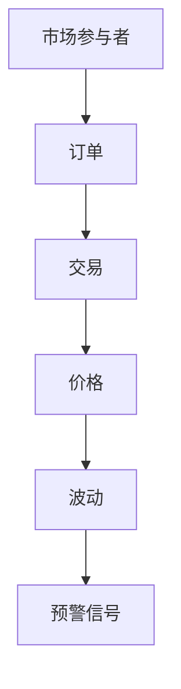
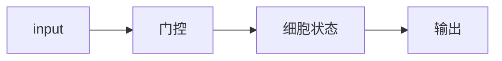
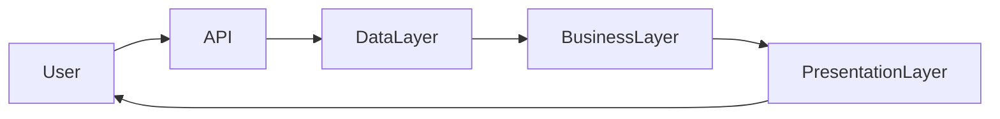

                 


# 开发智能化的金融市场微观结构变化预警与影响模拟模型

## 关键词：金融市场，微观结构，预警模型，影响模拟，人工智能，机器学习，深度学习

## 摘要：金融市场微观结构的变化是影响市场运行的重要因素。本文通过分析金融市场微观结构变化的特征，结合人工智能和机器学习技术，提出了一种智能化的预警与影响模拟模型。该模型能够实时监测市场变化，预警潜在风险，并模拟其对市场的影响，为投资者和监管机构提供科学决策依据。

---

## 第一部分：金融市场微观结构变化概述

### 第1章：金融市场微观结构的基本概念

#### 1.1 金融市场的定义与分类
金融市场的定义：金融市场是指资金的融通市场，包括股票、债券、外汇、衍生品等交易场所。  
金融市场的分类：根据交易对象可分为货币市场、资本市场、外汇市场等。

#### 1.2 微观结构在金融市场中的作用
微观结构是指市场的组织形式和参与者的互动机制，包括交易规则、市场深度、流动性等。微观结构的变化直接影响市场的效率和稳定性。

#### 1.3 微观结构变化的定义与特征
微观结构变化：指市场参与者的行为、交易规则或市场环境的变化，可能导致市场价格波动、流动性变化等。  
特征：突发性、隐蔽性、累积性。

### 第2章：金融市场微观结构变化的预警意义

#### 2.1 微观结构变化对市场的影响
微观结构变化可能导致市场波动加剧、流动性风险增加，甚至引发系统性风险。

#### 2.2 预警机制的重要性
提前预警微观结构变化，可以帮助投资者和监管机构及时采取措施，降低风险。

#### 2.3 预警与宏观调控的关系
微观结构变化的预警为宏观调控提供数据支持，有助于政策制定者更好地理解市场运行机制。

### 第3章：模型开发的背景与目标

#### 3.1 当前金融市场面临的挑战
随着金融创新的加剧，市场的复杂性增加，传统的方法难以捕捉微观结构变化的信号。

#### 3.2 开发智能化预警模型的目标
通过人工智能技术，实时监测市场微观结构变化，提供预警信号。

#### 3.3 模型的应用场景与预期效果
应用于高频交易监控、风险管理、政策制定等领域，预期能够提高市场的透明度和稳定性。

---

## 第二部分：智能化预警模型的核心概念与联系

### 第4章：智能化预警模型的原理

#### 4.1 数据驱动与模型构建
通过收集和分析市场数据，构建机器学习模型，捕捉微观结构变化的特征。

#### 4.2 机器学习在预警中的应用
使用监督学习、无监督学习等方法，识别异常交易模式。

#### 4.3 深度学习的优势与挑战
深度学习能够处理复杂的数据模式，但需要大量数据和计算资源。

### 第5章：核心概念对比分析

#### 5.1 微观结构变化的特征对比
| 特征 | 定义 | 对模型的影响 |
|------|------|--------------|
| 流动性 | 市场参与者买卖资产的能力 | 流动性下降可能导致价格波动加剧 |
| 市场深度 | 市场上买卖订单的数量 | 深度不足可能导致价格执行偏差 |
| 交易频率 | 交易发生的速度 | 高频交易可能导致市场波动 |

#### 5.2 不同预警模型的优劣势对比
| 模型类型 | 优点 | 缺点 |
|----------|------|------|
| 线性回归 | 简单易懂 | 无法捕捉非线性关系 |
| 支持向量机 | 高维数据表现好 | 参数敏感 |
| LSTM | 捕捉时间序列特征 | 计算资源需求高 |

#### 5.3 实体关系图分析


---

## 第三部分：智能化预警模型的算法原理

### 第6章：时间序列分析与LSTM算法

#### 6.1 时间序列分析的基本原理
时间序列分析：通过对历史数据的分析，预测未来趋势。

#### 6.2 LSTM算法的工作机制
LSTM（长短期记忆网络）：通过门控机制，有效捕捉时间依赖关系。

#### 6.3 LSTM在金融时间序列中的应用


#### 6.4 算法实现与优化
代码示例：
```python
import numpy as np
from tensorflow.keras.layers import LSTM, Dense
from tensorflow.keras.models import Sequential

model = Sequential()
model.add(LSTM(64, input_shape=(timesteps, features)))
model.add(Dense(1))
model.compile(optimizer='adam', loss='mean_squared_error')
```

#### 6.5 数学模型与公式解析
LSTM的输入门控公式：
$$i_t = \sigma(g(x_t, h_{t-1}))$$
其中，$\sigma$为sigmoid函数，$g$为门控函数。

---

## 第四部分：系统分析与架构设计方案

### 第7章：系统功能设计

#### 7.1 数据采集模块
功能：实时采集市场数据，包括订单簿、交易数据等。

#### 7.2 数据处理模块
功能：清洗、转换和特征提取，为模型提供输入数据。

#### 7.3 模型训练与预测模块
功能：训练LSTM模型，预测微观结构变化。

#### 7.4 结果展示与预警模块
功能：可视化预测结果，生成预警信号。

### 第8章：系统架构设计

#### 8.1 分层架构设计
分层架构：数据层、业务逻辑层、表示层。

#### 8.2 模块之间的交互关系


#### 8.3 系统接口设计
API接口：提供数据接口、模型接口和预警接口。

#### 8.4 系统交互流程图


---

## 第五部分：项目实战

### 第9章：环境安装与代码实现

#### 9.1 环境安装
安装Python、TensorFlow、Keras等依赖库。

#### 9.2 核心代码实现
```python
import pandas as pd
import numpy as np
from tensorflow.keras.models import Sequential
from tensorflow.keras.layers import LSTM, Dense

# 数据预处理
data = pd.read_csv('market_data.csv')
train_data = data.iloc[:1000]
test_data = data.iloc[1000:]

# 模型训练
model = Sequential()
model.add(LSTM(64, input_shape=(timesteps, features)))
model.add(Dense(1))
model.compile(optimizer='adam', loss='mean_squared_error')
model.fit(train_data, epochs=10, batch_size=32)

# 模型预测
predictions = model.predict(test_data)
```

#### 9.3 代码解读与分析
解读：模型通过LSTM捕捉时间序列特征，预测市场变化。

### 第10章：实际案例分析

#### 10.1 案例背景
假设某股票的交易数据出现异常波动。

#### 10.2 数据分析
分析订单簿、交易频率等微观结构指标。

#### 10.3 模型预测
模型预测未来24小时的市场变化。

#### 10.4 预警与应对
生成预警信号，建议投资者调整策略。

---

## 第六部分：总结与展望

### 第11章：总结

#### 11.1 本章小结
本文提出了一个智能化的金融市场微观结构变化预警模型，结合了人工智能和机器学习技术，能够有效预测和预警市场风险。

### 第12章：最佳实践与注意事项

#### 12.1 最佳实践
- 数据质量是模型性能的关键，需确保数据清洗和特征提取的准确性。
- 模型的实时性和可解释性是实际应用中的重要考量。

#### 12.2 注意事项
- 模型的预测结果仅供参考，需结合市场实际情况进行判断。
- 需定期更新模型，以适应市场环境的变化。

### 第13章：拓展阅读

#### 13.1 相关技术
- 高频交易算法
- 量子计算在金融中的应用
- 区块链技术在金融监管中的应用

#### 13.2 相关书籍
- 《机器学习实战》
- 《金融风险管理》
- 《深度学习》

---

通过本文的分析和实践，我们能够开发出一个智能化的金融市场微观结构变化预警与影响模拟模型，为金融市场风险管理和决策提供有力支持。

