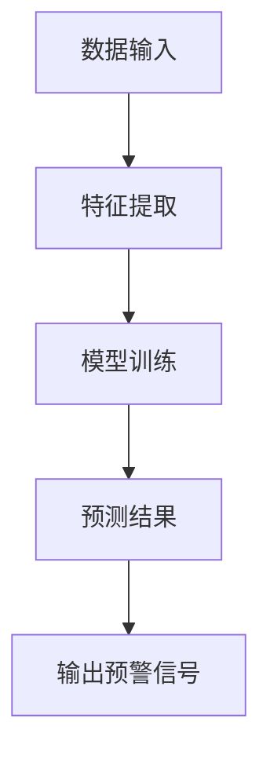
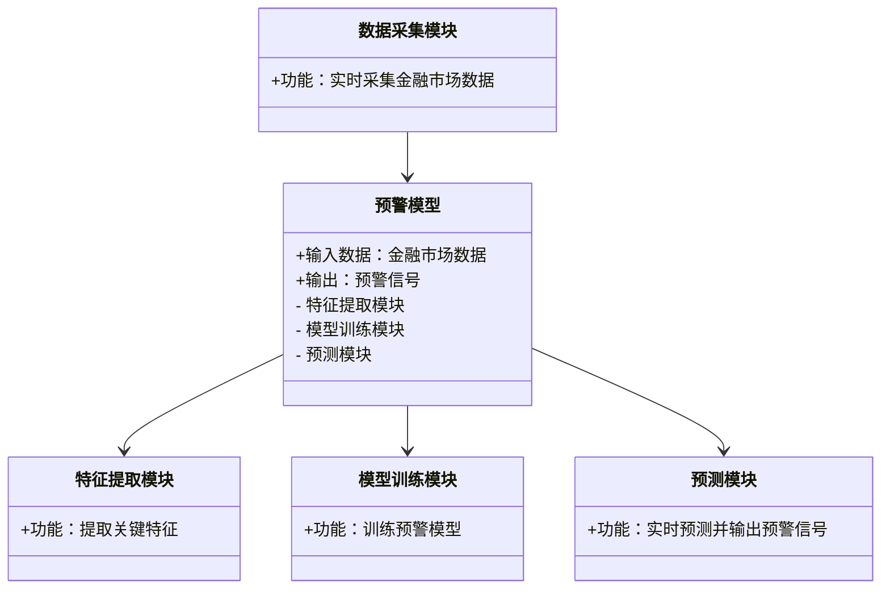
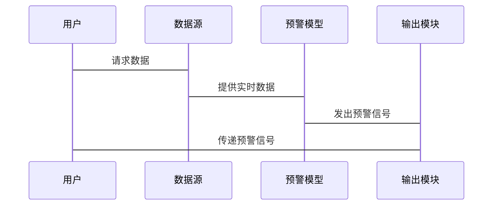

                 


# 开发智能化的金融市场微观结构变化预警模型

## 关键词：金融市场、微观结构、预警模型、人工智能、算法

## 摘要：  
金融市场微观结构的变化是影响市场健康和交易行为的关键因素。随着人工智能技术的快速发展，开发智能化的微观结构变化预警模型变得尤为重要。本文将从问题背景、核心概念、算法原理、系统架构到项目实战，逐步分析和构建这一模型，为金融从业者和数据科学家提供理论和实践指导。

---

# 第一部分: 金融市场微观结构变化预警模型的背景与核心概念

## 第1章: 问题背景与描述

### 1.1 问题背景

#### 1.1.1 金融市场微观结构的基本概念
金融市场微观结构指的是市场中买卖双方的互动机制，包括订单簿、交易量、价格波动等要素。这些因素共同影响市场的流动性和稳定性。

#### 1.1.2 微观结构变化对金融市场的影响
微观结构的变化可能导致市场的剧烈波动，如闪崩事件。及时预警这些变化，有助于投资者和监管机构采取措施，减少风险。

#### 1.1.3 现有预警模型的局限性
传统预警模型通常基于简单的统计指标，难以捕捉复杂的市场行为和非线性关系。

### 1.2 问题描述

#### 1.2.1 微观结构变化的具体表现形式
- 订单簿的深度变化
- 交易量的突然增加或减少
- 市场微观结构的异常波动

#### 1.2.2 预警模型的目标与关键指标
- 目标：提前发现并预警微观结构的异常变化
- 关键指标：订单簿深度、买卖价差、交易量、市场情绪等

#### 1.2.3 预警模型的适用场景与边界
- 适用场景：高频交易监控、市场风险预警
- 边界：不考虑宏观经济因素，专注于微观层面

## 第2章: 核心概念与联系

### 2.1 核心概念原理

#### 2.1.1 微观结构变化的核心要素
- 订单深度：买方和卖方的订单量
- 买卖价差：最优买价和最优卖价之间的差值
- 交易量：一定时间内的成交数量

#### 2.1.2 预警模型的关键特征
- 高实时性：需要快速处理数据
- 高准确性：预警的准确性直接影响决策效果
- 鲁棒性：模型应能适应不同市场环境

#### 2.1.3 智能化预警的核心算法
- 使用机器学习算法，如LSTM、XGBoost等，捕捉时间序列数据中的异常模式。

### 2.2 核心概念对比表

| 比较维度 | 微观结构指标 | 传统统计模型 | 智能化预警模型 |
|----------|--------------|--------------|----------------|
| 效率     | 较低          | 较低          | 高              |
| 精度     | 一般          | 一般          | 高              |
| 适应性   | 有限          | 有限          | 强              |

### 2.3 ER实体关系图

```mermaid
er
actor(微观结构变化, "影响市场行为的关键因素")
actor(订单簿数据, "提供买卖双方的实时订单信息")
actor(交易行为, "反映市场参与者的交易决策")
```

---

# 第二部分: 智能化预警模型的算法原理

## 第3章: 算法原理与实现

### 3.1 算法流程



### 3.2 算法实现代码

```python
import numpy as np
import pandas

# 示例数据
data = {
    'order_depth': [100, 150, 200, 250, 300],
    'bid_ask_spread': [5, 7, 3, 8, 2],
    'volume': [1000, 1200, 900, 1100, 1300]
}

df = pandas.DataFrame(data)

# 特征提取
features = df[['order_depth', 'bid_ask_spread', 'volume']]
labels = df['order_depth'] > 200

# 使用机器学习模型训练
from sklearn.ensemble import RandomForestClassifier
model = RandomForestClassifier()
model.fit(features, labels)

# 预测
new_data = {
    'order_depth': [220],
    'bid_ask_spread': [4],
    'volume': [1200]
}
new_df = pandas.DataFrame(new_data)
predicted = model.predict(new_df[['order_depth', 'bid_ask_spread', 'volume']])
print(predicted)
```

### 3.3 算法的数学模型

#### 3.3.1 LSTM模型的数学公式
$$
\text{LSTM}(t) = \text{sigmoid}(W_{c} \cdot [\text{h}(t-1), \text{c}(t-1)] + b_{c})
$$
其中，$W_{c}$ 是连接权重矩阵，$b_{c}$ 是偏置向量。

---

# 第三部分: 系统分析与架构设计方案

## 第4章: 系统分析与架构设计

### 4.1 系统功能设计



### 4.2 系统架构设计


### 4.3 系统交互设计



---

# 第四部分: 项目实战

## 第5章: 项目实战与分析

### 5.1 环境安装与配置

```bash
pip install numpy pandas sklearn mermaid4jupyter
```

### 5.2 核心代码实现

```python
from sklearn.ensemble import RandomForestClassifier
import pandas as pd
import numpy as np

# 数据预处理
data = pd.read_csv('market_data.csv')
X = data[['order_depth', 'bid_ask_spread', 'volume']]
y = data['is_anomaly']

# 训练模型
model = RandomForestClassifier()
model.fit(X, y)

# 预测
new_data = pd.read_csv('new_market_data.csv')
predicted = model.predict(new_data[['order_depth', 'bid_ask_spread', 'volume']])
print(predicted)
```

### 5.3 案例分析与解读

#### 5.3.1 数据分析
- 输入数据：实时市场微观结构数据
- 特征：订单深度、买卖价差、交易量
- 标签：是否为异常情况（is_anomaly）

#### 5.3.2 模型分析
- 训练结果：模型准确率、召回率、F1分数
- 模型调优：参数优化、特征选择

---

# 第五部分: 总结与展望

## 第6章: 总结与展望

### 6.1 最佳实践 tips

- 数据清洗与特征工程是关键
- 选择合适的算法和模型参数
- 实时性和准确性之间的平衡

### 6.2 小结

本文详细介绍了开发智能化的金融市场微观结构变化预警模型的全过程，从理论到实践，帮助读者理解如何利用人工智能技术解决实际问题。

### 6.3 注意事项

- 数据质量和实时性直接影响模型效果
- 模型需要不断更新和优化
- 注意数据隐私和合规性

### 6.4 拓展阅读

- 《机器学习实战》
- 《深度学习》
- 《金融市场中的大数据分析》

---

# 结语

通过系统地分析和实践，我们可以开发出高效的金融市场微观结构变化预警模型，为金融市场的稳定和投资者的决策提供有力支持。未来，随着技术的进步，预警模型将更加智能化和精准化。

