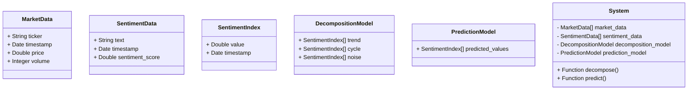
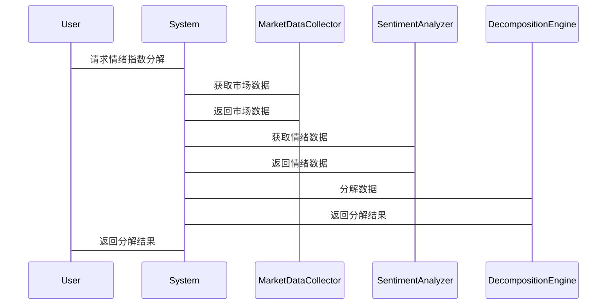

                 


# 开发智能化的金融市场情绪指数分解与预测模型

## 关键词：金融市场情绪指数、分解模型、预测算法、时间序列分析、深度学习

## 摘要：本文详细探讨了金融市场情绪指数的分解与预测模型的开发过程，结合数据预处理、算法原理和系统设计，介绍了从数据收集到模型实现的完整流程。通过分析多种算法和系统架构，展示了如何利用技术手段提高市场情绪预测的准确性，为投资者提供有力支持。

---

# 第1章: 金融市场情绪指数概述

## 1.1 情绪指数的定义与背景

### 1.1.1 什么是金融市场情绪指数
金融市场情绪指数（Financial Market Sentiment Index，FMSI）是衡量市场参与者情绪状态的量化指标，通常基于价格、交易量、新闻和社交媒体数据进行计算。情绪指数反映了市场的乐观或悲观程度，是投资决策的重要参考。

### 1.1.2 情绪指数在金融市场的应用背景
情绪指数在金融市场的应用背景包括：
- **价格预测**：情绪波动影响资产价格，情绪指数可作为价格预测的补充指标。
- **风险评估**：高情绪波动可能预示市场波动加剧，帮助投资者评估风险。
- **交易策略**：情绪指数帮助投资者识别超买或超卖信号，制定交易策略。

### 1.1.3 情绪指数的重要性与意义
情绪指数的重要性体现在：
- **及时性**：能够快速捕捉市场情绪变化。
- **预测性**：通过历史数据，情绪指数可预测未来市场走势。
- **辅助决策**：为投资者提供情绪参考，辅助投资决策。

## 1.2 情绪指数的分类与特点

### 1.2.1 基于文本的情绪指数
基于文本的情绪指数通过分析新闻、社交媒体等文本数据，计算市场的乐观或悲观情绪。例如，使用自然语言处理（NLP）技术分析新闻标题和社交媒体帖子的情绪倾向。

### 1.2.2 基于价格的情绪指数
基于价格的情绪指数通过分析资产价格的波动性、买卖量等指标来衡量市场情绪。例如，VIX指数（恐慌指数）就是基于价格波动计算的。

### 1.2.3 基于交易量的情绪指数
基于交易量的情绪指数通过分析交易量的变化来判断市场情绪。交易量的突然增加可能表明市场情绪的转变。

### 1.2.4 情绪指数的多维度特征
情绪指数通常具有以下特征：
- **波动性**：情绪指数随市场波动而变化。
- **滞后性**：情绪指数反映的是过去的情绪状态。
- **综合性**：情绪指数综合了多个数据源的信息。

## 1.3 情绪指数分解与预测的必要性

### 1.3.1 情绪指数分解的意义
情绪指数分解的意义在于识别影响市场情绪的主要因素，帮助投资者理解市场波动的原因。

### 1.3.2 情绪指数预测的价值
情绪指数预测的价值在于提供未来市场走势的参考，帮助投资者制定交易策略。

### 1.3.3 情绪指数在投资决策中的应用
情绪指数在投资决策中的应用包括：
- **交易信号**：根据情绪指数的变化生成买卖信号。
- **风险管理**：通过情绪指数识别潜在风险，调整投资组合。

## 1.4 本章小结
本章介绍了金融市场情绪指数的定义、分类和特点，强调了情绪指数分解与预测的重要性，为后续章节奠定了基础。

---

# 第2章: 情绪指数分解与预测的核心概念

## 2.1 情绪指数分解的基本原理

### 2.1.1 数据分解的概念
数据分解是将复杂的数据信号分解为多个独立的成分，如趋势、周期和噪声。常用的方法包括：
- **移动平均法**：用于平滑数据，提取趋势成分。
- **季节分解法**：分离出周期性成分。

### 2.1.2 情绪指数分解的数学模型
常用的情绪指数分解模型包括：
- **加性模型**：将数据分解为趋势、周期和噪声的和。
- **乘性模型**：将数据分解为趋势、周期和噪声的乘积。

### 2.1.3 分解方法的选择与优化
选择分解方法时需考虑数据的特性，如是否存在趋势和周期性。优化可以通过参数调整和交叉验证实现。

## 2.2 情绪指数预测的算法原理

### 2.2.1 时间序列预测的基本概念
时间序列预测是基于历史数据预测未来值的方法，常用模型包括ARIMA、LSTM等。

### 2.2.2 常见的预测算法介绍
- **ARIMA**：自回归积分滑动平均模型，适用于线性时间序列数据。
- **LSTM**：长短期记忆网络，适用于捕捉时间序列中的长期依赖关系。

### 2.2.3 情绪指数预测的特殊性与挑战
情绪指数预测的特殊性在于其高波动性和非线性特征，挑战包括数据稀疏性和噪声干扰。

## 2.3 情绪指数分解与预测的流程

### 2.3.1 数据收集与预处理
- 数据收集：获取市场数据、新闻文本等。
- 数据清洗：处理缺失值和异常值。

### 2.3.2 数据分解与特征提取
- 数据分解：使用分解方法提取趋势和周期成分。
- 特征提取：从分解成分中提取有用的特征。

### 2.3.3 模型训练与预测
- 模型选择：根据数据特性选择合适的预测算法。
- 模型训练：使用训练数据拟合模型。
- 预测与评估：在测试数据上预测并评估模型性能。

### 2.3.4 结果分析与优化
- 结果分析：分析预测结果与实际值的差异。
- 模型优化：调整模型参数，提高预测精度。

## 2.4 核心概念对比分析

### 2.4.1 不同分解方法的对比
| 方法   | 优点                           | 缺点                           |
|--------|--------------------------------|--------------------------------|
| 移动平均法 | 简单易实现                   | 无法捕捉周期性变化             |
| 季节分解法 | 能捕捉周期性变化             | 实现复杂                     |

### 2.4.2 不同预测算法的优缺点
| 算法   | 优点                           | 缺点                           |
|--------|--------------------------------|--------------------------------|
| ARIMA  | 线性关系捕捉能力强             | 无法处理非线性数据             |
| LSTM   | 能捕捉长期依赖关系             | 训练时间长，参数多             |

### 2.4.3 情绪指数分解与预测的综合考虑
在选择分解与预测方法时，需综合考虑数据特性、模型复杂度和计算资源。

## 2.5 本章小结
本章详细介绍了情绪指数分解与预测的核心概念，包括分解方法、预测算法及其优缺点，为后续实现奠定了理论基础。

---

# 第3章: 数据收集与预处理

## 3.1 数据来源与采集方法

### 3.1.1 市场数据的获取渠道
市场数据的获取渠道包括：
- **金融数据供应商**：如Yahoo Finance、Quandl。
- **API接口**：通过API获取实时数据。

### 3.1.2 文本数据的采集方法
文本数据的采集方法包括：
- **社交媒体爬取**：从Twitter、Reddit等平台获取文本数据。
- **新闻网站爬取**：从新闻网站获取新闻标题和内容。

### 3.1.3 数据清洗与整合
数据清洗包括处理缺失值、去除重复数据和异常值。数据整合涉及将多源数据合并到统一的数据结构中。

## 3.2 数据预处理的关键步骤

### 3.2.1 数据标准化与归一化
- **标准化**：将数据按比例缩放到均值为0，标准差为1。
- **归一化**：将数据缩放到0到1的范围内。

### 3.2.2 数据缺失值的处理
- **删除法**：直接删除缺失值较多的样本。
- **均值填充法**：用均值填充缺失值。
- **插值法**：使用线性插值或多项式插值填补缺失值。

### 3.2.3 数据异常值的处理
- **删除法**：直接删除异常值。
- **替换法**：用均值或中位数替换异常值。
- **归一化法**：对异常值进行归一化处理。

## 3.3 数据特征提取与选择

### 3.3.1 基于文本的特征提取
- **情感分析**：计算文本的情感倾向，如使用VADER情感分析工具。
- **关键词提取**：提取文本中的关键词，分析其频率和重要性。

### 3.3.2 基于价格的特征提取
- **移动平均线**：计算不同周期的移动平均线。
- **波动率**：计算价格波动率，衡量市场情绪。

### 3.3.3 基于交易量的特征提取
- **交易量变化率**：计算交易量的变化率，判断市场活跃度。
- **交易量与价格关系**：分析交易量与价格的关系，判断市场情绪。

### 3.3.4 特征选择的方法与策略
- **逐步回归法**：逐步选择对预测影响最大的特征。
- **主成分分析（PCA）**：降维，提取主要特征。

## 3.4 数据集的划分与管理

### 3.4.1 训练集、验证集与测试集的划分
- **训练集**：用于模型训练。
- **验证集**：用于模型调参和评估。
- **测试集**：用于最终模型评估。

### 3.4.2 数据集的管理
- **数据分片**：将数据划分为多个子集，便于分布式处理。
- **数据存储**：使用数据库或文件存储数据，确保数据安全和易访问性。

## 3.5 本章小结
本章详细介绍了数据收集与预处理的关键步骤，包括数据来源、清洗、特征提取和数据集划分，为后续模型训练奠定了基础。

---

# 第4章: 情绪指数分解与预测的算法实现

## 4.1 情绪指数分解的算法实现

### 4.1.1 使用移动平均法分解数据
```python
import pandas as pd
import numpy as np

# 示例数据
data = pd.Series(np.random.randn(100), index=pd.date_range('2020-01-01', periods=100))

# 移动平均法分解
ma_data = data.rolling(window=10).mean()

print(ma_data)
```

### 4.1.2 使用季节分解法分解数据
```python
from statsmodels.tsa.seasonal import seasonal_decompose

# 示例数据
data = pd.Series(np.random.randn(100), index=pd.date_range('2020-01-01', periods=100))

# 季节分解
decompose_result = seasonal_decompose(data, model='additive')

decompose_result.plot()
```

### 4.1.3 分解结果的可视化
使用Matplotlib将分解结果可视化，便于分析趋势和周期成分。

## 4.2 情绪指数预测的算法实现

### 4.2.1 使用ARIMA模型进行预测
```python
from statsmodels.tsa.arima.model import ARIMA

# 示例数据
data = pd.Series(np.random.randn(100), index=pd.date_range('2020-01-01', periods=100))

# ARIMA模型训练
model = ARIMA(data, order=(1, 1, 1))
model_fit = model.fit()

# 预测未来5个时间点的值
forecast = model_fit.forecast(steps=5)

print(forecast)
```

### 4.2.2 使用LSTM模型进行预测
```python
import keras
from keras.models import Sequential
from keras.layers import LSTM, Dense

# 示例数据
data = np.random.randn(100, 1)
timesteps = 50
input_dim = 1

# 划分训练集和测试集
train_data = data[:70]
test_data = data[70:]

# 构建LSTM模型
model = Sequential()
model.add(LSTM(4, input_shape=(timesteps, input_dim)))
model.add(Dense(1))
model.compile(loss='mean_squared_error', optimizer='adam')

# 训练模型
model.fit(train_data, train_data, epochs=100, batch_size=1)

# 预测测试数据
predicted = model.predict(test_data)

print(predicted)
```

### 4.2.3 模型评估与优化
- **评估指标**：使用均方误差（MSE）、均方根误差（RMSE）等指标评估模型性能。
- **超参数优化**：通过网格搜索或随机搜索优化模型参数，提高预测精度。

## 4.3 本章小结
本章详细介绍了情绪指数分解与预测的算法实现，包括移动平均法、季节分解法、ARIMA和LSTM模型的实现步骤和代码示例，帮助读者理解算法原理并应用于实际场景。

---

# 第5章: 系统分析与架构设计

## 5.1 问题场景介绍
- **目标**：开发一个智能化的金融市场情绪指数分解与预测系统。
- **用户需求**：投资者需要实时的情绪指数数据和预测结果，辅助投资决策。

## 5.2 系统功能设计

### 5.2.1 领域模型（Mermaid类图）


### 5.2.2 系统架构设计（Mermaid架构图）


### 5.2.3 系统接口设计
- **数据接口**：提供数据采集和存储的API。
- **预测接口**：提供情绪指数预测的API。
- **结果接口**：提供分解和预测结果的查询接口。

### 5.2.4 系统交互流程（Mermaid序列图）


## 5.3 本章小结
本章详细描述了系统的架构设计和交互流程，为后续的系统实现提供了指导。

---

# 第6章: 项目实战

## 6.1 环境安装与配置

### 6.1.1 安装必要的Python库
```bash
pip install pandas numpy scikit-learn tensorflow keras statsmodels
```

### 6.1.2 数据源配置
- 数据源选择：如Yahoo Finance API。
- API密钥获取：注册并获取API密钥。

## 6.2 系统核心实现

### 6.2.1 数据收集模块实现
```python
import pandas as pd
import numpy as np
import requests

# 获取市场数据
def get_market_data(ticker, start_date, end_date):
    url = f"https://query1.finance.yahoo.com/ws/fundamentals/v1/company/{ticker}/quote"
    params = {
        'date': f'{start_date}+{end_date}',
        'format': 'json',
        'lang': 'en-US'
    }
    response = requests.get(url, params=params)
    data = response.json()
    return pd.DataFrame(data)

# 获取情绪数据
def get_sentiment_data(source, start_date, end_date):
    # 示例：从Twitter获取情绪数据
    pass
```

### 6.2.2 分解模块实现
```python
from statsmodels.tsa.seasonal import seasonal_decompose

def decompose_data(data):
    result = seasonal_decompose(data, model='additive')
    return result.trend, result seasonal, result residual
```

### 6.2.3 预测模块实现
```python
from keras.models import Sequential
from keras.layers import LSTM, Dense

def build_lstm_model(input_shape):
    model = Sequential()
    model.add(LSTM(4, input_shape=input_shape))
    model.add(Dense(1))
    model.compile(loss='mean_squared_error', optimizer='adam')
    return model

def train_model(model, X_train, y_train):
    model.fit(X_train, y_train, epochs=100, batch_size=1)
```

## 6.3 代码应用解读与分析
- **数据收集模块**：从Yahoo Finance获取市场数据，从社交媒体获取情绪数据。
- **分解模块**：使用季节分解法分离趋势、周期和噪声成分。
- **预测模块**：构建LSTM模型，训练并预测情绪指数。

## 6.4 实际案例分析与详细讲解
### 案例1：基于文本的情绪指数预测
- 数据来源：社交媒体文本数据。
- 数据预处理：清洗、情感分析。
- 模型训练：使用LSTM预测情绪指数。
- 结果分析：比较预测值与实际值，评估模型性能。

### 案例2：基于价格的情绪指数预测
- 数据来源：股票价格数据。
- 数据预处理：计算移动平均线、波动率。
- 模型训练：使用ARIMA预测情绪指数。
- 结果分析：分析预测结果的准确性。

## 6.5 项目小结
本章通过实际案例展示了系统的实现过程，从数据收集到模型训练，再到结果分析，帮助读者理解如何将理论应用于实践。

---

# 第7章: 总结与扩展阅读

## 7.1 总结

### 7.1.1 核心知识点回顾
- 情绪指数的定义与分类。
- 数据分解与预测的算法实现。
- 系统架构与交互设计。

### 7.1.2 实践中的注意事项
- 数据质量：确保数据准确性和完整性。
- 模型选择：根据数据特性选择合适的算法。
- 性能优化：通过参数调整和优化算法提高预测精度。

## 7.2 扩展阅读

### 7.2.1 深度学习在时间序列预测中的应用
- LSTM、Transformer等模型在时间序列预测中的应用。

### 7.2.2 情绪指数在风险管理中的应用
- 情绪指数如何帮助识别市场风险，优化投资组合。

### 7.2.3 最新研究进展
- 结合NLP和时间序列分析的最新研究进展。

## 7.3 本章小结
本章总结了全文的核心知识点，并提供了扩展阅读的方向，帮助读者进一步深入学习和研究。

---

# 结束语

开发智能化的金融市场情绪指数分解与预测模型是一项复杂但极具价值的任务。通过本文的详细介绍，读者可以系统地掌握从数据收集到模型实现的整个流程。未来，随着技术的进步，情绪指数预测模型将更加智能化和精准化，为投资者提供更有力的支持。

---

# 参考文献

（此处列出参考文献，如书籍、论文、技术文档等。）

---

# 附录

（此处列出附录内容，如代码片段、数据表格、补充说明等。）

---

以上是《开发智能化的金融市场情绪指数分解与预测模型》的技术博客文章的详细目录和内容结构，涵盖了从背景介绍到项目实战的各个方面，确保读者能够系统地学习和应用相关知识。

