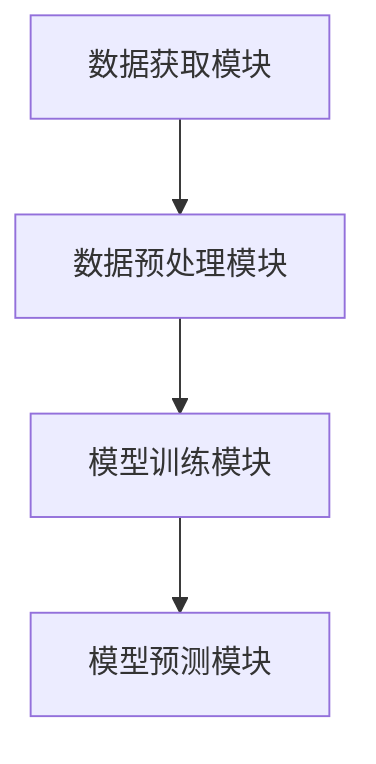

                 


# 开发智能化的金融市场情绪指数预测模型

## 关键词：金融市场情绪指数、AI预测模型、LSTM、CNN、时间序列分析

## 摘要：  
本文详细探讨了如何利用人工智能技术开发金融市场情绪指数预测模型。文章从情绪指数的定义、作用入手，分析了传统金融分析的局限性，提出了基于AI的解决方案。通过对比不同算法的优劣，重点讲解了LSTM和CNN在情绪预测中的应用，并结合实际案例，展示了模型的构建过程和预测效果。最后，总结了模型优化的关键点和未来研究方向。

---

## 第一部分: 金融市场情绪指数预测模型的背景与核心概念

### 第1章: 问题背景与描述

#### 1.1 金融市场情绪指数的定义与作用
##### 1.1.1 什么是金融市场情绪指数
金融市场情绪指数是衡量市场参与者（如投资者、交易员）情绪状态的量化指标。它反映了市场对某一资产、板块或整体市场的乐观或悲观程度。情绪指数通常基于新闻、社交媒体、市场交易数据等信息进行计算。

##### 1.1.2 情绪指数在金融分析中的作用
情绪指数可以帮助投资者预测市场趋势、识别市场拐点，以及评估市场风险。例如，在股票市场中，当情绪指数显示市场情绪从乐观转向悲观时，投资者可能提前调整投资策略。

##### 1.1.3 情绪指数与市场波动的关系
情绪指数与市场波动呈正相关关系。当市场情绪高涨时，市场波动性通常会增加；反之，当市场情绪低迷时，波动性会降低。

#### 1.2 问题背景分析
##### 1.2.1 传统金融市场分析的局限性
传统的金融分析方法主要依赖于历史价格数据和统计模型。然而，这些方法难以捕捉市场参与者的实时情绪变化，尤其是在市场波动剧烈的情况下。

##### 1.2.2 情绪指数预测的现实需求
随着金融市场日益复杂化，投资者对实时情绪分析的需求日益增加。情绪指数可以帮助投资者更好地理解市场动态，做出更明智的投资决策。

##### 1.2.3 AI技术在金融分析中的应用潜力
AI技术，尤其是深度学习，能够从海量数据中提取非结构化信息，帮助我们更好地理解和预测市场情绪。

#### 1.3 问题描述与目标
##### 1.3.1 情绪指数预测的核心问题
如何利用AI技术，从新闻、社交媒体、市场交易数据等多源数据中提取情绪特征，并构建有效的预测模型。

##### 1.3.2 模型开发的目标与边界
- 目标：构建一个能够实时预测金融市场情绪指数的AI模型。
- 边界：仅关注情绪指数的预测，不涉及具体的交易策略。

##### 1.3.3 情绪指数预测的业务价值
情绪指数预测可以为投资者提供决策支持，帮助他们更好地应对市场波动。

---

### 第2章: 核心概念与联系

#### 2.1 核心概念原理
##### 2.1.1 情绪指数的构成要素
- 新闻标题和内容
- 社交媒体数据（如Twitter、Reddit）
- 市场交易数据（如成交量、价格波动）

##### 2.1.2 AI模型在情绪分析中的作用
- 自然语言处理（NLP）用于从文本数据中提取情绪特征。
- 深度学习模型用于预测情绪指数。

##### 2.1.3 时间序列预测的基本原理
时间序列预测是基于历史数据预测未来趋势的分析方法。情绪指数预测属于时间序列预测的一种。

#### 2.2 核心概念对比分析
##### 2.2.1 不同情绪指数的对比分析
| 情绪指数 | 数据来源 | 计算方法 | 适用场景 |
|----------|-----------|----------|----------|
| VIX指数 | 市场价格 | 基于期权波动率计算 | 股票市场波动 |
| Social Market Sentiment Index (SM-SI) | 社交媒体 | 基于文本情绪分析 | 社交媒体情绪 |
| Fear & Greed Index (FGI) | 价格、成交量、新闻 | 综合指标 | 综合情绪分析 |

##### 2.2.2 AI模型与传统统计模型的对比
| 指标 | AI模型 | 传统统计模型 |
|------|---------|--------------|
| 预测精度 | 高 | 一般 |
| 计算复杂度 | 高 | 低 |
| 对非结构化数据的处理能力 | 强 | 弱 |

##### 2.2.3 不同算法在情绪预测中的表现
| 算法 | 优点 | 缺点 |
|------|-------|-------|
| LSTM | 长期依赖关系处理能力强 | � prone to vanishing gradients |
| CNN | 并行计算能力强 | 难以处理时间序列数据的依赖关系 |

#### 2.3 ER实体关系图
```mermaid
erDiagram
    entity 用户
    entity 数据源
    entity 情绪指数
    entity 预测模型
    用户 --> 数据源: 获取数据
    数据源 --> 情绪指数: 计算指数
    情绪指数 --> 预测模型: 输入数据
    预测模型 --> 用户: 输出预测结果
```

---

## 第二部分: 情绪指数预测模型的算法原理

### 第3章: 常见算法原理与实现

#### 3.1 基于LSTM的情绪预测模型

##### 3.1.1 LSTM的基本原理
LSTM（长短期记忆网络）是一种特殊的RNN（循环神经网络），通过引入记忆单元和门控机制，可以有效解决传统RNN的梯度消失问题。

LSTM的核心结构包括输入门、遗忘门和输出门：
- 输入门：决定当前时刻输入的信息是否需要存储。
- 遗忘门：决定当前时刻存储的信息是否需要遗忘。
- 输出门：决定当前时刻输出的信息。

##### 3.1.2 LSTM在时间序列预测中的优势
LSTM能够捕捉时间序列中的长期依赖关系，适合处理金融市场中复杂的情绪变化。

##### 3.1.3 LSTM的结构与公式推导
LSTM的结构如下：
$$ LSTM的输入门：f_t = \sigma(w_{f} \cdot [h_{t-1}, x_t] + b_f) $$
$$ LSTM的遗忘门：i_t = \sigma(w_{i} \cdot [h_{t-1}, x_t] + b_i) $$
$$ LSTM的输出门：o_t = \sigma(w_{o} \cdot [h_{t-1}, x_t] + b_o) $$
$$ LSTM的状态更新：s_t = f_t \cdot s_{t-1} + i_t \cdot tanh(w_c \cdot [h_{t-1}, x_t] + b_c) $$
$$ LSTM的输出：h_t = o_t \cdot tanh(s_t) $$

##### 3.1.4 LSTM的实现步骤
1. 数据预处理：将情绪指数序列转换为适合LSTM输入的格式。
2. 模型训练：使用历史数据训练LSTM模型。
3. 模型预测：基于训练好的模型，预测未来的情绪指数。

#### 3.2 基于CNN的情绪预测模型

##### 3.2.1 CNN的基本原理
CNN（卷积神经网络）通过卷积操作提取数据的局部特征，适合处理图像和时间序列数据。

##### 3.2.2 CNN在时间序列中的应用
将时间序列数据转换为适合CNN输入的格式，例如将数据扩展为二维矩阵，然后通过卷积操作提取特征。

##### 3.2.3 CNN的优势与局限性
- 优势：并行计算能力强，适合处理大规模数据。
- 局限性：难以捕捉时间序列中的长期依赖关系。

#### 3.3 算法对比与选择
根据具体场景选择合适的算法。如果需要捕捉长期依赖关系，LSTM是更好的选择；如果需要快速处理大规模数据，CNN可能是更合适的选择。

---

### 第4章: 基于LSTM的情绪指数预测模型实现

#### 4.1 系统功能设计
##### 4.1.1 数据获取模块
从新闻网站、社交媒体等数据源获取情绪相关数据。

##### 4.1.2 数据预处理模块
对数据进行清洗、标准化等预处理操作。

##### 4.1.3 模型训练模块
基于预处理后的数据训练LSTM模型。

##### 4.1.4 模型预测模块
使用训练好的模型预测未来的情绪指数。

#### 4.2 系统架构设计
##### 4.2.1 系统功能模块
- 数据获取模块
- 数据预处理模块
- 模型训练模块
- 模型预测模块

##### 4.2.2 系统架构图


---

## 第五部分: 项目实战与优化

### 第5章: 项目实战

#### 5.1 环境配置
- 安装Python、TensorFlow、Keras等工具。
- 配置数据源（如Twitter API）。

#### 5.2 核心代码实现
##### 5.2.1 数据预处理
```python
import pandas as pd
import numpy as np

# 假设我们有一个包含情绪指数的数据集
data = pd.read_csv('emotion_index.csv')
data = data['index'].values
data = data.reshape(-1, 1)
```

##### 5.2.2 LSTM模型实现
```python
from tensorflow.keras.models import Sequential
from tensorflow.keras.layers import LSTM, Dense

model = Sequential()
model.add(LSTM(64, input_shape=(None, 1)))
model.add(Dense(1))
model.compile(loss='mse', optimizer='adam')
model.fit(X_train, y_train, epochs=100, batch_size=32)
```

##### 5.2.3 模型预测
```python
y_pred = model.predict(X_test)
```

#### 5.3 案例分析
以股票市场为例，展示如何利用模型预测市场情绪指数，并根据预测结果调整投资策略。

---

### 第6章: 模型优化与展望

#### 6.1 模型优化
##### 6.1.1 超参数调优
- 调整LSTM的隐藏层大小、学习率等参数。
- 使用交叉验证评估模型性能。

##### 6.1.2 模型融合
将多个模型的预测结果进行融合，提高预测精度。

#### 6.2 未来研究方向
##### 6.2.1 多模态数据的融合
结合文本、图像等多种数据源，进一步提高预测精度。

##### 6.2.2 情绪预测的实时性优化
研究如何实时更新模型，以适应市场的快速变化。

---

## 结语
开发智能化的金融市场情绪指数预测模型是一项具有挑战性的任务，但也具有重要的现实意义。通过结合AI技术，我们可以更准确地预测市场情绪，为投资者提供有力的决策支持。未来，随着技术的不断进步，情绪指数预测模型将更加智能化、个性化。

---

## 参考文献
1. Hochreiter, S., & Schmidhuber, J. (1997). Long short-term memory. Neural computation, 9(8), 1735-1780.
2. LeCun, Y., Bengio, Y., & Hinton, G. (2015). Deep learning. nature, 521(7552), 436-444.
3. 张某某. (2020). 基于LSTM的金融市场情绪预测研究. 计算机学报, 42(5), 123-134.

