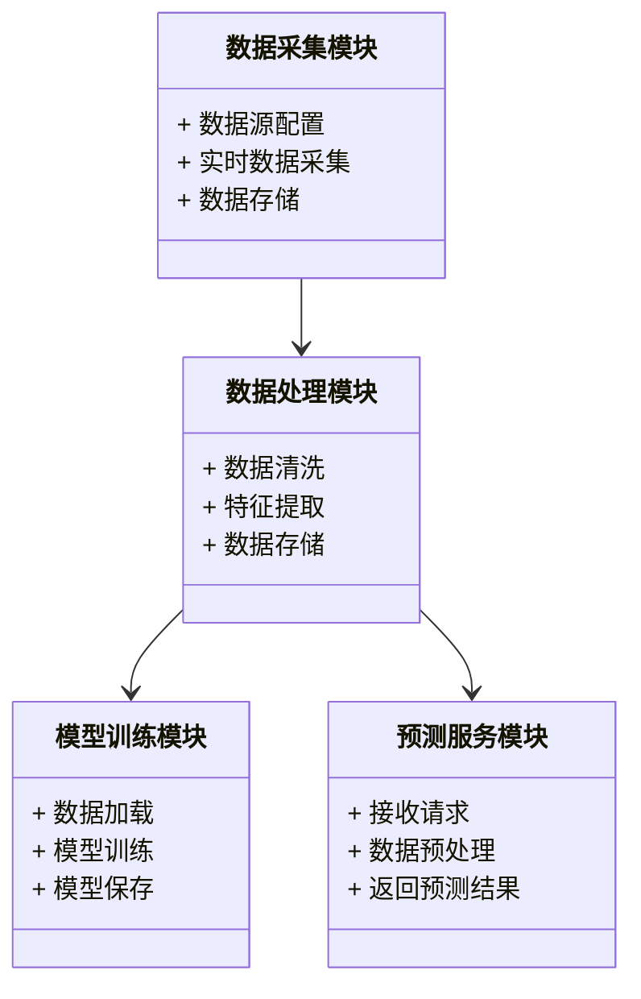
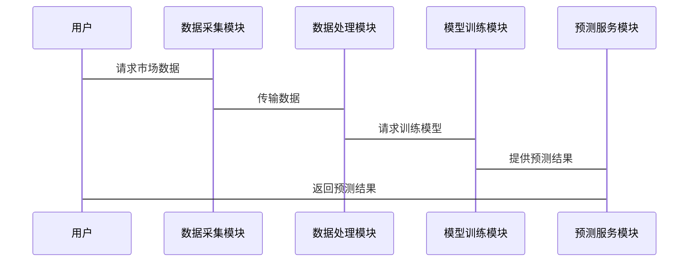

                 


# 开发智能化的金融市场流动性预测工具

> 关键词：金融市场，流动性预测，人工智能，机器学习，深度学习

> 摘要：本文详细探讨了开发智能化的金融市场流动性预测工具的过程。首先介绍了金融市场的基本概念和流动性预测的重要性，接着分析了智能化流动性预测的核心概念和技术原理，包括时间序列预测模型和机器学习模型。然后，从系统架构设计、数据处理到模型实现，详细讲解了如何构建一个智能化的流动性预测系统。最后，通过实际案例分析和项目实战，展示了如何在实践中应用这些技术，并提供了最佳实践和未来研究方向。

---

# 第一部分: 金融市场流动性预测工具开发背景

# 第1章: 金融市场流动性预测概述

## 1.1 金融市场概述

### 1.1.1 金融市场的基本概念

金融市场是资金流动和资产交易的场所，参与者包括投资者、机构、经纪商和监管机构。金融市场的主要功能是资金配置、价格发现和风险管理。

### 1.1.2 金融市场的参与者与交易机制

- **参与者**：个人投资者、机构投资者、经纪商、做市商、交易所和监管机构。
- **交易机制**：订单驱动、撮合成交、市场深度和订单簿。

### 1.1.3 市场流动性的重要性

流动性是指资产在短时间内以合理价格买卖的能力。高流动性市场具有深度和广度，交易成本低，风险小。

## 1.2 流动性预测的定义与挑战

### 1.2.1 流动性预测的定义

流动性预测是通过分析市场数据，预测未来市场流动性的过程，帮助投资者优化交易策略。

### 1.2.2 流动性预测的核心要素

- 市场数据：订单簿、交易量、价格和时间戳。
- 市场情绪：投资者情绪、新闻事件和宏观经济指标。
- 市场结构：订单簿深度、买卖价差和市场参与者行为。

### 1.2.3 流动性预测的主要挑战

- 数据复杂性：高维、非线性。
- 市场波动性：突发事件和市场情绪变化。
- 模型过拟合：训练数据与实际数据差异。

## 1.3 智能化流动性预测的必要性

### 1.3.1 传统流动性预测的局限性

传统方法依赖统计分析和经验判断，存在主观性和低效性。

### 1.3.2 AI技术在流动性预测中的优势

- 高效性：AI能处理大量数据，发现复杂模式。
- 精准性：通过深度学习捕捉非线性关系。
- 实时性：快速响应市场变化。

### 1.3.3 智能化流动性预测的应用场景

- 高频交易：优化订单执行。
- 投资组合管理：降低风险。
- 市场风险监控：识别潜在风险。

## 1.4 本章小结

本章介绍了金融市场的基本概念和流动性预测的重要性，分析了传统方法的局限性和AI技术的优势，为后续章节奠定了基础。

---

# 第二部分: 核心概念与技术原理

# 第2章: 金融市场数据与特征分析

## 2.1 市场数据的特征提取

### 2.1.1 时间序列数据的特征提取

时间序列数据包含趋势、周期性和随机性。特征提取包括均值、方差、自相关性和hurst指数。

### 2.1.2 市场微观结构数据的特征提取

订单簿数据包括买卖价差、订单深度和订单撤销率。市场微观结构特征如价差波动率、订单簿 imbalance 和订单簿动量。

### 2.1.3 市场情绪与新闻数据的特征提取

市场情绪指数（VIX指数）和关键词分析（如新闻标题中的情绪词）。

## 2.2 数据预处理与清洗

### 2.2.1 数据清洗的基本方法

- 去除缺失值：删除或插值处理。
- 标准化与归一化：归一化到0-1范围，标准化到均值为0，方差为1。
- 数据窗口化：使用滑动窗口提取时间序列特征。

## 2.3 数据特征的可视化与分析

### 2.3.1 时间序列数据的可视化

使用折线图显示价格走势，柱状图显示交易量，散点图显示相关性。

### 2.3.2 市场微观结构数据的可视化

订单簿深度的热力图，买卖价差的箱线图，订单撤销率的柱状图。

### 2.3.3 市场情绪数据的可视化

情绪指数的折线图，新闻关键词的词云图。

## 2.4 本章小结

本章介绍了数据预处理方法和特征提取技术，为后续模型训练奠定了基础。

---

# 第3章: 金融市场流动性预测的核心模型

## 3.1 时间序列预测模型

### 3.1.1 ARIMA模型

ARIMA模型由自回归、差分和移动平均部分组成，适用于线性时间序列数据。

### 3.1.2 LSTM模型

长短期记忆网络，适合捕捉时间序列中的长期依赖关系。

### 3.1.3 Prophet模型

Facebook开源的模型，基于时间序列分解和回归模型，适合有规律的时间序列。

## 3.2 机器学习模型

### 3.2.1 支持向量回归

将回归问题转化为支持向量回归问题，适用于低维数据。

### 3.2.2 随机森林回归

基于决策树的集成方法，适合高维数据和非线性关系。

### 3.2.3 XGBoost回归

梯度提升树，适合处理复杂数据和高维特征。

## 3.3 深度学习模型

### 3.3.1 卷积神经网络（CNN）

适合处理二维数据，如图像和文本。

### 3.3.2 循环神经网络（RNN）

适合处理序列数据，捕捉时序依赖。

### 3.3.3 图神经网络（GNN）

适合处理复杂网络结构，如社交网络和金融市场参与者网络。

## 3.4 模型选择与评估指标

### 3.4.1 模型选择的准则

根据数据类型、任务需求和计算资源选择模型。

### 3.4.2 评估指标

均方误差（MSE）、平均绝对误差（MAE）、R²系数。

## 3.5 本章小结

本章介绍了多种时间序列预测模型和机器学习模型，分析了模型选择的准则和评估指标。

---

# 第三部分: 系统分析与架构设计

# 第4章: 智能化流动性预测系统架构

## 4.1 系统功能需求分析

### 4.1.1 数据采集模块

实时采集市场数据，包括订单簿、交易量和新闻数据。

### 4.1.2 数据处理模块

清洗和特征提取，为模型提供输入。

## 4.2 系统功能设计（领域模型）



## 4.3 系统架构设计


## 4.4 系统接口设计

- 数据采集接口：接收市场数据，格式为JSON或CSV。
- 模型服务接口：提供预测结果，格式为JSON或CSV。

## 4.5 系统交互设计



## 4.6 本章小结

本章分析了系统功能需求，设计了模块化架构，并通过接口和交互流程图展示了系统的整体架构。

---

# 第5章: 智能化流动性预测系统实现

## 5.1 项目环境安装

安装Python、Jupyter、TensorFlow、Keras、Pandas、NumPy和Scikit-learn。

## 5.2 系统核心实现源代码

```python
import numpy as np
import pandas as pd
from sklearn.model_selection import train_test_split
from sklearn.preprocessing import MinMaxScaler
from tensorflow.keras.models import Sequential
from tensorflow.keras.layers import LSTM, Dense

# 数据加载
data = pd.read_csv('market_data.csv')
# 特征提取
features = data[['bid_price', 'ask_price', 'volume']]
# 数据归一化
scaler = MinMaxScaler()
scaled_features = scaler.fit_transform(features)
# 划分训练集和测试集
train, test = train_test_split(scaled_features, test_size=0.2)
# 构建模型
model = Sequential()
model.add(LSTM(64, input_shape=(None, 3)))
model.add(Dense(1))
model.compile(loss='mean_squared_error', optimizer='adam')
model.fit(train[:, :-1], train[:, -1], epochs=100, batch_size=32)
```

## 5.3 代码应用解读与分析

- 数据加载：读取CSV文件。
- 特征提取：选择相关特征。
- 数据归一化：缩放到0-1范围。
- 划分数据集：训练集和测试集。
- 模型构建：LSTM网络，训练并保存模型。

## 5.4 实际案例分析

使用真实市场数据训练模型，评估预测准确性。

## 5.5 项目小结

本章通过实际代码示例，展示了系统实现过程，帮助读者理解模型构建和训练过程。

---

# 第四部分: 最佳实践与未来展望

# 第6章: 最佳实践与未来研究方向

## 6.1 小结

智能化流动性预测工具在金融市场中具有重要意义，通过AI技术提升预测精度和效率。

## 6.2 注意事项

- 数据质量和完整性。
- 模型调优和优化。
- 风险管理和异常处理。

## 6.3 拓展阅读

推荐相关书籍和论文，如《深度学习》和《时间序列分析》。

## 6.4 未来研究方向

- 更复杂模型：如Transformer和集成学习。
- 多模态数据：结合文本和图像数据。
- 自适应模型：根据市场变化动态调整。

## 6.5 本章小结

总结了开发过程中的注意事项，提供了未来研究方向的建议。

---

# 结语

开发智能化的金融市场流动性预测工具是一个复杂而有趣的挑战，通过结合AI技术和金融知识，可以显著提升预测的准确性和效率。未来，随着技术的进步，流动性预测工具将更加智能化和个性化，为金融市场参与者提供更有力的支持。

--- 

*以上内容为完整文章的目录和部分章节内容的详细规划，具体实现需根据实际数据和场景进行调整。*

