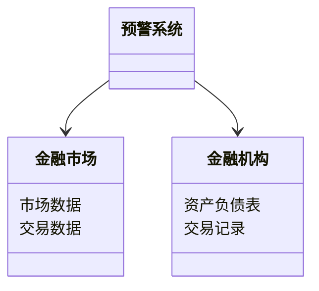
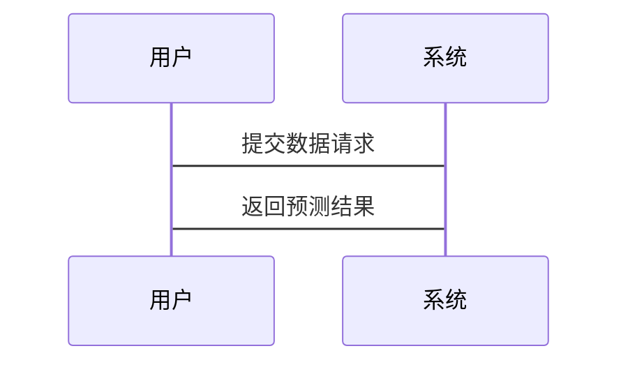

                 


# 开发智能化的金融市场流动性风险传导预警模型

---

## 关键词：金融市场流动性风险，风险传导，预警模型，人工智能，机器学习，时间序列分析

---

## 摘要：本文详细探讨了开发智能化的金融市场流动性风险传导预警模型的全过程。从问题背景和核心概念的分析，到算法原理的数学建模，再到系统的架构设计和项目实战，最后总结了最佳实践和注意事项。文章旨在为金融从业者、数据科学家和技术人员提供一套完整的解决方案，帮助他们在复杂多变的金融市场中提前识别和预警流动性风险，降低潜在的经济损失。

---

# 第1章: 金融市场流动性风险概述

## 1.1 问题背景

### 1.1.1 金融市场流动性风险的定义
流动性风险是指金融资产在短时间内无法以合理价格变现而导致的损失风险。在金融市场中，流动性风险通常与市场的波动性、交易量以及市场参与者的信心密切相关。

### 1.1.2 流动性风险的来源与影响
流动性风险的来源主要包括市场波动、金融机构的资产负债 mismatch、投资者行为变化等。其影响可能引发连锁反应，导致系统性风险，甚至引发金融危机。

### 1.1.3 流动性风险传导的机制
流动性风险的传导机制通常涉及市场参与者的相互影响，例如，一家金融机构的流动性问题可能传导至整个金融体系，引发连锁反应。

## 1.2 问题描述

### 1.2.1 流动性风险传导的关键环节
流动性风险的传导通常涉及以下几个关键环节：信息不对称、市场参与者的行为变化、资产价格波动等。

### 1.2.2 金融市场中的主要风险类型
金融市场中的主要风险类型包括市场风险、信用风险、流动性风险和操作风险等。流动性风险与其他风险类型密切相关，尤其是在市场波动加剧的情况下。

### 1.2.3 流动性风险传导的复杂性
流动性风险的传导过程复杂，涉及多个市场参与者和资产类别，需要综合考虑宏观经济环境、市场结构和参与者行为等多个因素。

## 1.3 问题解决思路

### 1.3.1 数据驱动的流动性风险预警方法
通过收集和分析金融市场数据，利用统计学和机器学习方法，构建流动性风险预警模型。

### 1.3.2 智能化模型在风险预警中的作用
智能化模型能够实时监测市场变化，快速识别潜在风险，并提供预警信号。

### 1.3.3 多维度数据融合的预警策略
通过融合市场数据、新闻数据、社交媒体数据等多种数据源，构建全面的风险预警系统。

## 1.4 边界与外延

### 1.4.1 模型的适用范围与限制
流动性风险预警模型适用于金融市场中的主要资产类别，但其效果可能受到数据质量和模型假设的限制。

### 1.4.2 相关概念的对比与区分
流动性风险与市场风险、信用风险等其他风险类型存在差异，但也相互关联。需要明确区分不同风险类型的影响机制。

### 1.4.3 模型的可扩展性与灵活性
流动性风险预警模型需要具备较强的可扩展性，能够适应市场环境的变化和新的数据源的引入。

## 1.5 概念结构与核心要素

### 1.5.1 核心概念的层次结构
流动性风险预警模型的层次结构包括数据采集、特征提取、模型构建、预警信号生成和风险应对策略制定等环节。

### 1.5.2 核心要素的属性与关系
核心要素包括金融市场数据、参与者行为数据、模型参数、预警阈值等。这些要素之间存在相互作用和依赖关系。

### 1.5.3 模型的输入输出关系
模型的输入包括市场数据、交易数据等，输出包括风险预警信号和风险评估报告。

---

# 第2章: 核心概念与联系

## 2.1 核心概念原理

### 2.1.1 流动性风险的度量方法
常用的流动性风险度量方法包括流动性比率分析、缺口分析和压力测试等。

### 2.1.2 风险传导的网络模型
通过构建金融市场参与者的网络模型，分析流动性风险在市场中的传导路径。

### 2.1.3 预警系统的构建逻辑
预警系统的构建逻辑包括数据采集、特征提取、模型训练、实时监测和预警信号生成等步骤。

## 2.2 概念属性对比

### 2.2.1 不同风险类型对比表

| 风险类型   | 定义                                      | 主要影响因素                     | 度量方法         |
|------------|------------------------------------------|----------------------------------|-----------------|
| 市场风险    | 资产价格波动导致的损失风险               | 市场波动、投资者情绪             | Value at Risk (VaR) |
| 信用风险    | 债务人违约导致的损失风险                 | 债务人的信用状况                 | 信用评分模型     |
| 流动性风险  | 资产变现能力不足导致的损失风险           | 市场深度、交易量、投资者行为     | 流动性比率分析   |
| 操作风险    | 操作失误或系统故障导致的损失风险         | 内部控制、员工行为               | 操作风险评估模型 |

### 2.2.2 流动性风险与市场风险的对比
流动性风险与市场风险在定义、影响因素和度量方法上存在差异。流动性风险更关注资产的变现能力，而市场风险关注资产价格的波动。

### 2.2.3 预警模型的性能指标对比
不同的预警模型在准确性、及时性和稳定性方面存在差异，需要根据具体应用场景选择合适的模型。

## 2.3 ER实体关系图


---

# 第3章: 算法原理与数学模型

## 3.1 算法原理

### 3.1.1 时间序列分析
时间序列分析用于预测市场流动性变化，常用的模型包括ARIMA和GARCH模型。

### 3.1.2 机器学习模型
机器学习模型如随机森林和XGBoost可用于分类和回归任务，帮助识别潜在的流动性风险。

### 3.1.3 数学模型
通过构建多元回归模型，分析多个因素对流动性风险的影响。

## 3.2 数学公式

### 3.2.1 ARIMA模型
ARIMA模型用于时间序列预测，其一般形式为：
$$ ARIMA(p, d, q) $$
其中，p为自回归阶数，d为差分阶数，q为移动平均阶数。

### 3.2.2 GARCH模型
GARCH模型用于估计波动性，其公式为：
$$ \sigma_t^2 = \alpha_0 + \alpha_1 r_{t-1}^2 + \beta_1 \sigma_{t-1}^2 $$

### 3.2.3 随机森林模型
随机森林模型通过集成学习提高预测准确性，其预测公式为：
$$ y = \sum_{i=1}^{n} \frac{1}{n} \sum_{j=1}^{m} tree_j(x_i) $$

## 3.3 Python代码实现

```python
import pandas as pd
import numpy as np
from sklearn.ensemble import RandomForestClassifier
from sklearn.metrics import accuracy_score

# 数据加载与预处理
data = pd.read_csv('market_data.csv')
X = data.drop('target', axis=1)
y = data['target']

# 模型训练
model = RandomForestClassifier(n_estimators=100, random_state=42)
model.fit(X, y)

# 模型预测
y_pred = model.predict(X)
print("Accuracy:", accuracy_score(y, y_pred))
```

## 3.4 实例分析
通过分析实际市场数据，验证模型的预测准确性，并根据预测结果调整预警策略。

---

# 第4章: 系统分析与架构设计

## 4.1 问题场景介绍
本文旨在开发一个智能化的流动性风险预警系统，帮助金融机构实时监测市场风险。

## 4.2 项目介绍
本项目通过构建智能化模型，实现对金融市场流动性风险的实时监测和预警。

## 4.3 系统功能设计

### 4.3.1 领域模型


### 4.3.2 系统架构设计


### 4.3.3 接口和交互


---

# 第5章: 项目实战

## 5.1 环境安装
安装必要的Python库，如Pandas、NumPy、Scikit-learn等。

## 5.2 核心代码实现

```python
import pandas as pd
import numpy as np
from sklearn.ensemble import RandomForestClassifier

# 数据加载
data = pd.read_csv('market_data.csv')

# 数据预处理
X = data.drop('target', axis=1)
y = data['target']

# 模型训练
model = RandomForestClassifier(n_estimators=100)
model.fit(X, y)

# 预测
y_pred = model.predict(X)
print("预测结果:", y_pred)
```

## 5.3 案例分析
通过具体案例分析，验证模型的预测能力和预警效果。

---

# 第6章: 最佳实践

## 6.1 小结
本文详细介绍了开发智能化的流动性风险预警模型的全过程，从理论到实践，为金融从业者提供了实用的指导。

## 6.2 注意事项
在实际应用中，需要注意数据质量和模型的可解释性，避免模型的过度拟合。

## 6.3 拓展阅读
建议进一步研究复杂网络分析和强化学习在风险预警中的应用。

---

# 附录

## 附录A: 术语表
解释本文中涉及的专业术语。

## 附录B: 数据来源
说明数据来源和获取方法。

---

以上是《开发智能化的金融市场流动性风险传导预警模型》的完整内容，希望对读者有所帮助！

