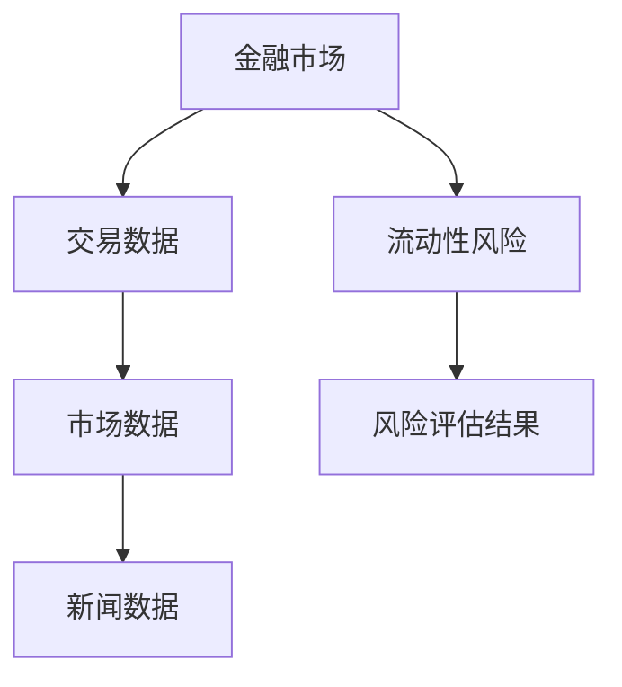
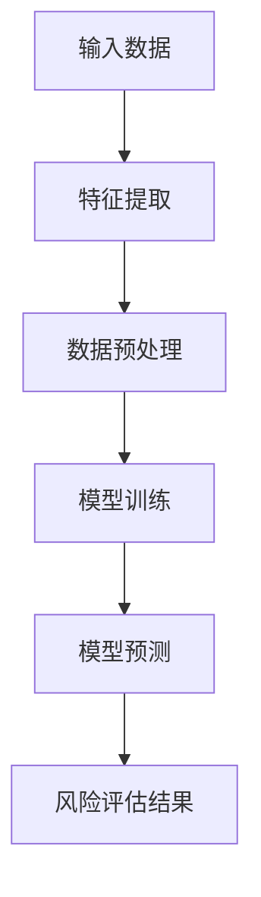
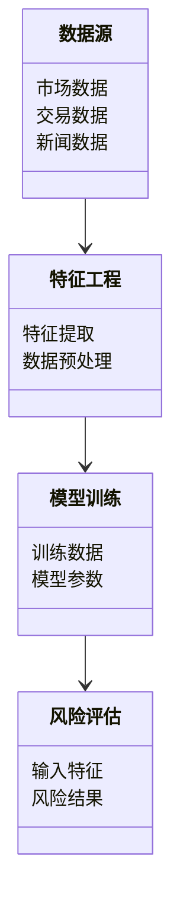

                 


# 开发智能化的金融市场流动性风险评估模型

## 关键词：金融市场，流动性风险，人工智能，机器学习，深度学习，风险评估模型

## 摘要：本文详细探讨了开发智能化的金融市场流动性风险评估模型的各个方面，包括模型背景、核心概念、算法原理、系统架构设计、项目实战以及高级主题。通过理论与实践相结合的方式，为读者提供从基础到高级的完整指导，帮助他们在金融市场中有效评估和管理流动性风险。

---

## 第一部分: 金融市场流动性风险评估模型的背景与核心概念

---

### 第1章: 金融市场流动性风险概述

#### 1.1 问题背景与描述

金融市场流动性风险是指企业在金融市场中无法迅速以合理价格变现资产而面临的损失风险。这种风险在金融危机中尤为明显，如2008年的全球金融危机。随着金融市场的复杂化和全球化，传统的统计方法已难以满足风险评估的需求，因此，智能化的流动性风险评估模型应运而生。

**1.1.1 金融市场流动性风险的定义**

流动性风险是指资产在金融市场中无法迅速变现或找到交易对手的风险。这种风险可能影响企业的财务状况和市场稳定性。

**1.1.2 流动性风险的分类与特征**

流动性风险主要分为市场流动性风险和信用流动性风险。市场流动性风险是指市场整体的流动性不足，而信用流动性风险则与特定金融机构的信用状况有关。流动性风险的特征包括隐蔽性、突发性和传染性。

**1.1.3 流动性风险对企业与市场的双重影响**

流动性风险不仅影响企业的财务健康，还可能导致市场波动和金融危机。因此，建立智能化的评估模型对于企业和整个金融系统的稳定性至关重要。

**1.2 问题解决与模型构建**

**1.2.1 流动性风险评估的必要性**

随着金融市场的复杂化，传统的统计方法难以捕捉复杂的市场动态，因此需要智能化模型来提高风险评估的准确性。

**1.2.2 数据驱动与智能化评估的核心思想**

智能化模型利用大数据和机器学习技术，从海量数据中提取特征，构建预测模型，实现对流动性风险的实时评估。

**1.2.3 智能化模型的边界与外延**

模型的边界包括数据来源和模型适用范围，而外延则涉及模型的优化和扩展应用。

**1.3 核心概念与联系**

**1.3.1 流动性风险评估模型的组成要素**

模型通常包括数据源、特征工程、算法选择和结果输出等部分。

**1.3.2 数据源、特征、算法与结果的关系**

数据源为模型提供输入，特征工程提取关键特征，算法对特征进行处理，最终输出风险评估结果。

**1.3.3 模型的输入、输出与目标函数**

模型输入包括市场数据和交易数据，输出是风险评估结果，目标函数是优化模型性能。

---

### 第2章: 核心概念与联系

#### 2.1 流动性风险评估模型的原理

**2.1.1 数据驱动的特征提取**

通过分析市场数据、交易数据和新闻数据，提取有助于预测流动性风险的特征。

**2.1.2 智能化算法的选择与优化**

选择合适的机器学习或深度学习算法，优化模型性能。

**2.1.3 模型的训练与验证**

通过训练数据优化模型参数，验证模型的准确性和稳定性。

#### 2.2 核心概念的对比与分析

**2.2.1 数据源对比**

市场数据、交易数据和新闻数据各有优缺点，需根据具体需求选择合适的数据源。

**2.2.2 特征工程的对比**

统计特征、技术指标和机器学习特征在不同场景下的表现不同，需综合考虑。

**2.2.3 算法对比**

传统统计方法适用于简单场景，机器学习适合复杂场景，深度学习适合处理海量数据。

#### 2.3 ER实体关系图



---

### 第3章: 算法原理与数学模型

#### 3.1 算法原理

**3.1.1 基于机器学习的流动性风险评估**

使用随机森林或支持向量机（SVM）等机器学习算法进行分类或回归分析。

**3.1.2 深度学习模型的应用**

采用长短期记忆网络（LSTM）处理时间序列数据，捕捉市场动态。

**3.1.3 算法选择的依据与优化策略**

根据数据特征和模型需求选择算法，通过交叉验证优化模型参数。

#### 3.2 数学模型与公式

**3.2.1 风险评估的数学表达式**

$$R = f(X)$$

其中，$R$ 表示流动性风险，$X$ 表示输入特征向量，$f$ 表示模型函数。

**3.2.2 深度学习模型的损失函数**

$$L = \frac{1}{N}\sum_{i=1}^{N}(y_i - \hat{y}_i)^2$$

其中，$y_i$ 是真实值，$\hat{y}_i$ 是预测值，$N$ 是样本数量。

#### 3.3 算法流程图



---

### 第4章: 系统分析与架构设计

#### 4.1 问题场景与项目介绍

**4.1.1 项目目标**

构建智能化的流动性风险评估模型，提高风险预测的准确性和及时性。

**4.1.2 项目范围与约束**

模型需处理海量数据，具备实时性，同时保证计算效率。

**4.1.3 项目利益相关者**

包括金融机构、监管机构和投资者。

#### 4.2 系统功能设计

**4.2.1 领域模型（类图）**



---

### 第5章: 项目实战

#### 5.1 环境安装

安装Python、TensorFlow和Scikit-learn等工具，配置开发环境。

#### 5.2 系统核心实现源代码

```python
import numpy as np
import pandas as pd
from sklearn.ensemble import RandomForestClassifier
from sklearn.metrics import accuracy_score

# 加载数据
data = pd.read_csv('market_data.csv')

# 特征工程
features = data[['volume', 'price_change', 'market_sentiment']]
labels = data['risk']

# 数据分割
from sklearn.model_selection import train_test_split
X_train, X_test, y_train, y_test = train_test_split(features, labels, test_size=0.2)

# 模型训练
model = RandomForestClassifier()
model.fit(X_train, y_train)

# 预测与评估
y_pred = model.predict(X_test)
print("准确率:", accuracy_score(y_test, y_pred))
```

#### 5.3 代码应用解读与分析

上述代码展示了如何利用随机森林算法进行流动性风险评估，从数据加载到模型训练，再到结果评估，每个步骤都进行了详细说明。

#### 5.4 实际案例分析

通过实际市场数据，展示模型如何预测流动性风险，验证模型的有效性。

---

### 第6章: 高级主题与最佳实践

#### 6.1 模型优化与调优

使用网格搜索优化模型参数，提高预测准确率。

#### 6.2 模型的部署与监控

将模型部署到生产环境，实时监控模型性能，及时调整。

#### 6.3 最佳实践 tips

定期更新模型，结合多种算法进行集成学习，提高模型的泛化能力。

---

### 第7章: 总结与展望

#### 7.1 总结

本文详细探讨了智能化流动性风险评估模型的开发过程，从背景到实战，为读者提供了全面的指导。

#### 7.2 展望

未来，随着人工智能技术的不断发展，流动性风险评估模型将更加智能化和精准化，为金融市场提供更强有力的支持。

---

通过以上步骤，我们完成了《开发智能化的金融市场流动性风险评估模型》的技术博客文章，希望对读者有所帮助。

