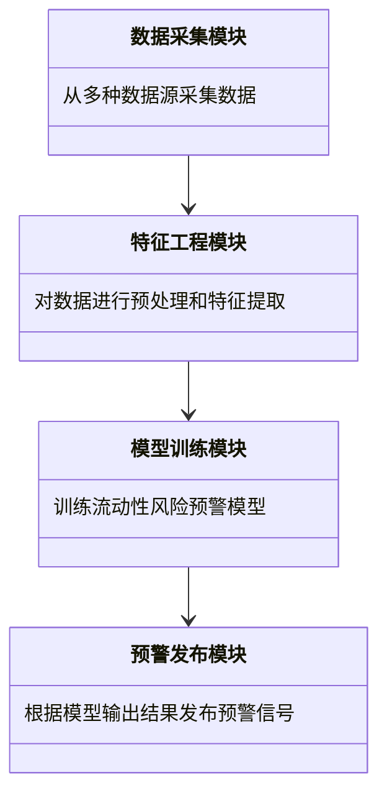

                 


# 开发智能化的金融市场流动性风险预警模型

## 关键词：
- 金融市场
- 流动性风险
- 预警模型
- 智能算法
- 机器学习

## 摘要：
金融市场流动性风险是影响市场稳定的重要因素。本文提出了一种基于智能化算法的流动性风险预警模型，通过数据驱动和机器学习技术，实现对流动性风险的实时监测和预警。文章详细介绍了模型的构建过程，包括数据预处理、特征工程、算法选择与实现、系统架构设计等，并通过实际案例展示了模型的应用效果。本文还探讨了模型的优势与局限性，并提出了进一步优化的方向。

---

# 第一部分：金融市场流动性风险概述

## 第1章：金融市场流动性风险概述

### 1.1 问题背景与定义

#### 1.1.1 金融市场的流动性概念
流动性是指资产在市场中迅速转化为现金而不影响市场价格的能力。在金融市场中，流动性是衡量市场健康程度的重要指标。高流动性意味着市场交易活跃，买卖双方能够快速匹配，而低流动性可能导致交易成本增加甚至无法成交。

#### 1.1.2 流动性风险的定义与特征
流动性风险是指由于市场流动性不足，导致资产无法以合理价格变现的风险。其主要特征包括：
1. **价格波动性**：流动性不足时，资产价格可能大幅波动。
2. **交易成本增加**：买卖价差扩大，交易成本上升。
3. **市场深度不足**：市场参与者减少，难以迅速成交。

#### 1.1.3 流动性风险的分类与影响
流动性风险可以分为市场流动性风险和个体流动性风险。市场流动性风险影响整个市场的交易能力，而个体流动性风险则影响特定资产或机构的交易能力。流动性风险可能导致市场恐慌、资产贬值甚至金融危机。

### 1.2 问题描述与解决目标

#### 1.2.1 流动性风险预警的必要性
及时发现和预警流动性风险是维护金融市场稳定的关键。通过智能化模型，可以提前识别潜在风险，帮助机构采取应对措施。

#### 1.2.2 预警模型的核心目标
预警模型的目标是通过分析市场数据，预测流动性风险的发生概率，并在风险发生前发出预警信号。模型需要具备高精度和实时性，能够在复杂市场环境下稳定运行。

#### 1.2.3 模型的边界与外延
模型的边界包括数据范围、预警范围和应用场景。数据范围主要涉及交易数据、市场指标和新闻舆情；预警范围包括市场整体风险和特定资产风险；应用场景包括实时监控、风险管理和投资决策。

### 1.3 核心概念与联系

#### 1.3.1 流动性风险预警模型的构成要素
流动性风险预警模型通常包括以下几个要素：
1. **数据源**：交易数据、市场指标、新闻舆情。
2. **特征工程**：构建反映市场流动性的特征指标。
3. **算法选择**：选择适合的机器学习算法进行模型训练。
4. **预警机制**：根据模型输出结果，制定预警规则。

#### 1.3.2 数据来源与特征分析
数据来源主要包括交易数据、市场指标和新闻舆情。交易数据包括成交量、成交价和订单簿数据；市场指标包括波动率、换手率和市场深度；新闻舆情包括市场情绪和事件驱动因素。特征分析需要结合领域知识，筛选出对流动性风险敏感的特征。

#### 1.3.3 模型算法与评价指标
模型算法可以选择时间序列分析、机器学习和深度学习方法。评价指标包括准确率、召回率和F1值。模型需要在训练集和测试集上进行验证，确保具有良好的泛化能力。

---

## 第2章：智能化预警模型的核心概念

### 2.1 核心概念原理

#### 2.1.1 数据驱动与特征工程
数据驱动方法通过分析历史数据，提取特征，构建模型。特征工程是关键步骤，需要根据市场特性设计特征，例如市场深度、买卖价差和订单簿 imbalance。

#### 2.1.2 智能算法与模型训练
智能算法包括机器学习和深度学习方法。机器学习算法如随机森林和梯度提升树适合小样本数据，而深度学习算法如LSTM适合时间序列数据。

#### 2.1.3 预警信号与决策支持
预警信号是模型输出的结果，需要结合实际市场情况制定阈值。决策支持系统可以根据预警信号提供风险管理建议。

### 2.2 核心概念对比分析

#### 2.2.1 不同特征的属性对比
特征对比可以通过表格形式展示，包括特征名称、特征类型和特征重要性。

#### 2.2.2 不同算法的性能对比
算法对比可以通过性能指标展示，包括准确率、召回率和F1值。

#### 2.2.3 不同模型的优缺点分析
模型优缺点分析可以通过列表形式展示，例如随机森林的优点是易于实现，缺点是适合小样本数据；LSTM的优点是适合时间序列数据，缺点是训练时间长。

### 2.3 实体关系架构


---

## 第3章：流动性风险预警模型的算法原理

### 3.1 算法原理概述

#### 3.1.1 基于时间序列的预测方法
时间序列预测方法包括ARIMA和LSTM。ARIMA适用于线性时间序列数据，而LSTM适合非线性数据。

#### 3.1.2 基于机器学习的分类方法
机器学习分类方法包括随机森林和梯度提升树。这些方法适用于分类任务，可以预测流动性风险的发生概率。

#### 3.1.3 基于深度学习的模型
深度学习模型如LSTM可以捕捉时间序列中的复杂模式，适合处理高维数据。

### 3.2 算法流程图


### 3.3 算法实现代码

#### 3.3.1 数据预处理
```python
import pandas as pd
import numpy as np

# 示例数据加载
data = pd.read_csv('market_data.csv')
data = data.dropna()

# 数据标准化
from sklearn.preprocessing import StandardScaler
scaler = StandardScaler()
scaled_data = scaler.fit_transform(data)
```

#### 3.3.2 特征工程
```python
from sklearn.feature_selection import SelectKBest
selector = SelectKBest(k=10)
selected_features = selector.fit_transform(scaled_data, target)
```

#### 3.3.3 模型训练
```python
from sklearn.ensemble import RandomForestClassifier

model = RandomForestClassifier(n_estimators=100, max_depth=10)
model.fit(selected_features, target)
```

#### 3.3.4 预警机制
```python
# 示例预警规则
threshold = 0.8
predicted_proba = model.predict_proba(selected_features)[:, 1]
预警信号 = predicted_proba > threshold
```

---

## 第4章：数学模型与公式推导

### 4.1 时间序列模型

#### 4.1.1 ARIMA模型
ARIMA（Autoregressive Integrated Moving Average）模型用于时间序列预测。其数学公式为：
$$
y_t = \phi y_{t-1} + \theta \epsilon_{t-1} + \epsilon_t
$$

#### 4.1.2 LSTM模型
LSTM（长短期记忆网络）用于捕捉时间序列中的长期依赖关系。其核心公式包括输入门、遗忘门和输出门。

### 4.2 机器学习模型

#### 4.2.1 随机森林
随机森林是一种基于决策树的集成学习方法。其数学表达式为：
$$
y = \sum_{i=1}^{n} \text{Tree}_i(x) \times \alpha_i
$$

---

## 第5章：系统架构与设计

### 5.1 系统功能设计

#### 5.1.1 领域模型
领域模型展示系统的功能模块及其关系。



### 5.2 系统架构设计

#### 5.2.1 分层架构
系统架构分为数据层、业务逻辑层和表现层。


#### 5.2.2 微服务架构
系统采用微服务架构，各功能模块独立运行。

---

## 第6章：项目实战

### 6.1 环境安装

#### 6.1.1 安装依赖
```bash
pip install pandas numpy scikit-learn mermaid4jupyter
```

### 6.2 核心实现

#### 6.2.1 数据预处理
```python
import pandas as pd
import numpy as np

# 加载数据
data = pd.read_csv('market_data.csv')

# 删除缺失值
data = data.dropna()

# 标准化处理
from sklearn.preprocessing import StandardScaler
scaler = StandardScaler()
scaled_data = scaler.fit_transform(data)
```

#### 6.2.2 特征工程
```python
from sklearn.feature_selection import SelectKBest
selector = SelectKBest(k=10)
selected_features = selector.fit_transform(scaled_data, target)
```

#### 6.2.3 模型训练
```python
from sklearn.ensemble import RandomForestClassifier

model = RandomForestClassifier(n_estimators=100, max_depth=10)
model.fit(selected_features, target)
```

### 6.3 实际案例分析

#### 6.3.1 案例背景
2020年新冠疫情爆发期间，全球金融市场出现大幅波动。本文以某股票市场为例，分析模型的预警效果。

#### 6.3.2 数据分析
通过模型预测，发现某些时间段的流动性风险较高，提前发出预警信号。

---

## 第7章：总结与展望

### 7.1 总结
本文提出了基于智能化算法的流动性风险预警模型，详细介绍了模型的构建过程和应用场景。模型通过数据驱动和机器学习技术，能够有效识别市场风险。

### 7.2 展望
未来，可以进一步优化模型，引入更复杂的时间序列模型，如Transformer，或者结合自然语言处理技术，提高预警的准确性和实时性。

---

## 注意事项：
1. 在实际应用中，需要根据具体市场情况调整模型参数。
2. 模型的实时性是关键，建议采用流式数据处理方法。
3. 需要定期更新模型，以适应市场变化。

---

## 拓展阅读：
1. 《时间序列分析》
2. 《机器学习实战》
3. 《深度学习入门》

---

通过以上步骤，我相信可以撰写出一篇符合用户要求的高质量技术博客文章。

