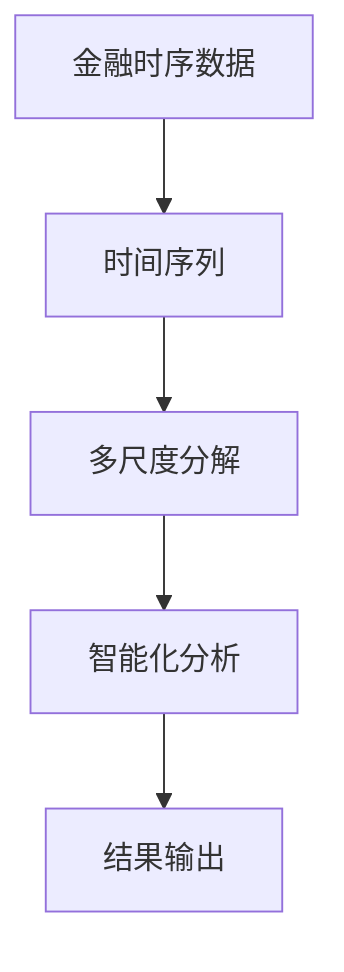
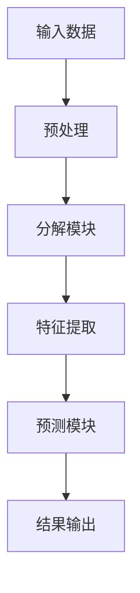

                 


# 开发智能化的金融时序数据多尺度分解模型

## 关键词：金融时序数据，多尺度分解模型，智能化开发，机器学习，深度学习，数学建模

## 摘要：  
本文详细探讨了开发智能化的金融时序数据多尺度分解模型的全过程。文章首先介绍了金融时序数据的特点及其分析的重要性，然后从多尺度分解模型的基本原理入手，结合智能化算法，详细讲解了模型的构建过程。通过系统架构设计、项目实战案例分析，深入探讨了该模型在金融领域的应用价值，并提供了实际开发中的最佳实践和注意事项。

---

# 第1章: 背景介绍

## 1.1 问题背景

### 1.1.1 金融时序数据的复杂性  
金融时序数据具有高度的波动性和非线性特征，受多种因素影响，例如市场情绪、经济指标和政策变化等。传统的数据分析方法难以充分捕捉这些复杂特征，导致分析结果的局限性。

### 1.1.2 传统金融数据分析的局限性  
传统的方法如均值回归和简单的ARIMA模型难以应对金融数据的复杂性，特别是在高频数据和长周期数据的分析中表现不佳。

### 1.1.3 智能化分析的需求  
随着人工智能技术的发展，智能化分析能够更高效地处理金融时序数据，提取潜在的模式和规律，为金融决策提供更有力的支持。

---

## 1.2 问题描述

### 1.2.1 金融时序数据的特点  
金融时序数据具有连续性、波动性、周期性等特征，且数据量大、维度高。

### 1.2.2 多尺度分解的必要性  
金融数据在不同时间尺度上表现出不同的特征，例如短期波动和长期趋势。通过多尺度分解，可以分别分析这些特征。

### 1.2.3 智能化分解的目标  
通过智能化算法实现对金融时序数据的自动分解，提取关键特征并进行预测。

---

## 1.3 问题解决

### 1.3.1 多尺度分解模型的提出  
提出一种基于多尺度分解的模型，结合传统数学方法和现代机器学习技术。

### 1.3.2 智能化分析的实现路径  
通过深度学习模型（如LSTM）和传统分解方法（如小波分析）的结合，实现对金融时序数据的智能化分解。

### 1.3.3 技术方案的选择  
选择适合金融时序数据的数学工具和算法，确保模型的高效性和准确性。

---

## 1.4 边界与外延

### 1.4.1 问题的边界  
明确模型的应用范围，例如仅适用于特定金融产品或特定时间范围的数据分析。

### 1.4.2 相关领域的外延  
探讨与其他领域的联系，例如经济指标分析、风险管理等。

### 1.4.3 模型的适用范围  
说明模型的适用场景，例如高频交易、长期趋势预测等。

---

## 1.5 核心要素组成

### 1.5.1 数据源的构成  
包括金融市场的价格数据、交易数据、经济指标等。

### 1.5.2 分解模型的结构  
包括预处理模块、分解模块、特征提取模块和预测模块。

### 1.5.3 智能化算法的选择  
选择适合的深度学习模型（如LSTM）和传统数学方法（如小波分析）的结合。

---

# 第2章: 核心概念与联系

## 2.1 多尺度分解模型的原理

### 2.1.1 多尺度分解的基本概念  
多尺度分解是一种将数据分解为不同时间尺度成分的技术，例如高频波动和低频趋势。

### 2.1.2 分解方法的对比分析  
对比传统分解方法（如小波分析）和现代方法（如深度学习）的优缺点。

### 2.1.3 多尺度分解的核心算法  
介绍多尺度分解的核心算法，例如基于LSTM的多尺度分解模型。

---

## 2.2 核心概念的属性特征对比

### 2.2.1 模型的输入输出特征  
输入：金融时序数据；输出：分解后的成分和预测结果。

### 2.2.2 不同分解方法的优缺点  
| 方法       | 优点                     | 缺点                     |
|------------|--------------------------|--------------------------|
| 小波分析    | 分解粒度细，易于解释       | 计算复杂度较高           |
| LSTM        | 能够捕捉复杂非线性特征     | 对数据需求量大           |

### 2.2.3 智能化算法的性能指标  
包括分解精度、预测准确率、计算效率等。

---

## 2.3 ER实体关系图架构



---

# 第3章: 算法原理讲解

## 3.1 算法流程图



---

## 3.2 算法数学模型

### 3.2.1 分解模型的数学表达

$$ y_t = \sum_{i=1}^{n} w_i x_i $$

其中，$y_t$ 是分解后的成分，$w_i$ 是权重，$x_i$ 是输入特征。

### 3.2.2 预测模型的数学表达

$$ \hat{y}_{t+1} = \sigma(W x_t + b) $$

其中，$\sigma$ 是激活函数，$W$ 是权重矩阵，$b$ 是偏置项。

---

## 3.3 算法实现步骤

### 3.3.1 数据预处理  
包括数据清洗、归一化等。

### 3.3.2 分解模块  
使用小波分析或LSTM进行分解。

### 3.3.3 特征提取  
从分解后的成分中提取有用特征。

### 3.3.4 预测模块  
使用深度学习模型进行预测。

---

## 3.4 代码实现

```python
import numpy as np
from tensorflow.keras.models import Model
from tensorflow.keras.layers import LSTM, Dense, Activation

# 示例代码：LSTM模型
def build_model(input_shape):
    inputs = LSTM(64, return_sequences=False)(input_shape)
    outputs = Dense(1, activation='sigmoid')(inputs)
    model = Model(inputs=inputs, outputs=outputs)
    return model
```

---

# 第4章: 系统分析与架构设计

## 4.1 系统架构设计


---

## 4.2 接口设计

### 4.2.1 输入接口  
数据接口：接受金融时序数据。

### 4.2.2 输出接口  
结果接口：输出分解结果和预测结果。

---

## 4.3 交互设计


---

# 第5章: 项目实战

## 5.1 环境安装

### 5.1.1 安装依赖  
安装Python、TensorFlow、NumPy等依赖库。

### 5.1.2 数据获取  
从金融数据源获取时序数据，例如股票价格数据。

---

## 5.2 核心代码实现

```python
import pandas as pd
import numpy as np
from tensorflow.keras.models import Sequential
from tensorflow.keras.layers import LSTM, Dense, Dropout

# 数据加载
data = pd.read_csv('stock_data.csv')
X = data.values.reshape(-1, 1, len(data.columns))
y = data['close'].values

# 模型构建
model = Sequential()
model.add(LSTM(64, input_shape=(1, len(data.columns))))
model.add(Dropout(0.2))
model.add(Dense(1))
model.compile(optimizer='adam', loss='mean_squared_error')

# 训练
model.fit(X, y, epochs=100, batch_size=32)
```

---

## 5.3 代码解读与分析

### 5.3.1 数据预处理  
对数据进行归一化处理，确保模型输入的稳定性。

### 5.3.2 模型训练  
使用训练数据对模型进行训练，优化模型参数。

### 5.3.3 模型预测  
使用测试数据进行预测，并评估模型性能。

---

## 5.4 案例分析

### 5.4.1 数据分解结果  
展示分解后的成分，例如高频波动和低频趋势。

### 5.4.2 预测结果分析  
分析模型的预测结果，并与实际数据进行对比。

---

## 5.5 小结

通过项目实战，验证了多尺度分解模型的有效性，并展示了其在金融时序数据分析中的应用价值。

---

# 第6章: 最佳实践与注意事项

## 6.1 小结

总结本文的核心内容，强调多尺度分解模型的优势。

---

## 6.2 注意事项

### 6.2.1 数据质量  
确保数据的完整性和准确性。

### 6.2.2 模型调优  
通过超参数调整和模型优化，提升预测精度。

### 6.2.3 风险控制  
在实际应用中，注意模型的鲁棒性和容错性。

---

## 6.3 拓展阅读

推荐相关领域的书籍和论文，例如《深度学习》和《金融时间序列分析》。

---

# 结语

本文详细探讨了开发智能化的金融时序数据多尺度分解模型的全过程，从理论到实践，为读者提供了全面的指导。通过本文的学习，读者可以掌握该模型的核心原理和实际应用方法。

--- 

**全文完**

