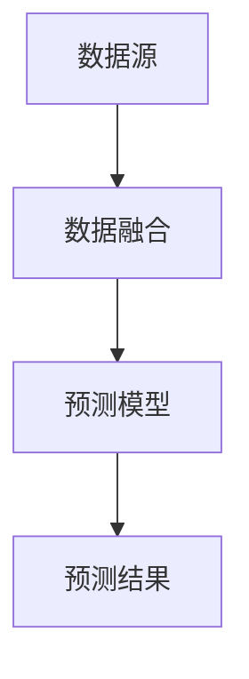
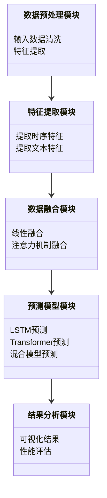
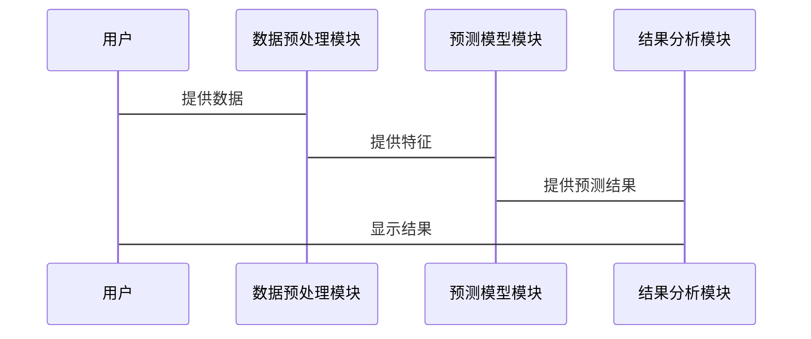
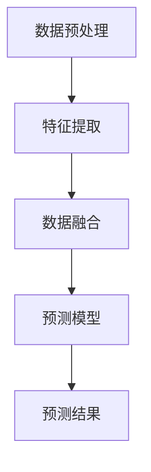

                 


# 开发智能化的金融时序数据多源信息融合预测模型

## 关键词：
- 金融时序数据
- 多源信息融合
- 预测模型
- 人工智能
- LSTM
- Transformer
- 数据融合

## 摘要：
本文将详细介绍如何开发一个智能化的金融时序数据多源信息融合预测模型。通过分析金融时序数据的特点，结合多源数据融合的优势，本文将逐步深入探讨模型的核心概念、算法原理、系统架构设计以及实际项目实现。从数据预处理到特征提取，从数据融合方法到预测模型的选择，本文将为您提供一套完整的开发思路和实现方案，帮助您快速掌握智能化金融预测模型的开发方法。

---

# 第一部分: 金融时序数据多源信息融合预测模型概述

## 第1章: 金融时序数据与多源信息融合预测模型背景

### 1.1 金融时序数据的重要性

#### 1.1.1 金融时序数据的定义与特点
金融时序数据是指在金融市场上，随着时间推移连续记录的数值型数据，例如股票价格、汇率、指数等。其特点包括：
- **连续性**：数据按时间顺序排列。
- **波动性**：金融市场的不确定性导致数据波动。
- **相关性**：不同金融资产之间可能存在相关性。

#### 1.1.2 金融时序数据的应用场景
- **股票价格预测**：通过分析历史股价预测未来走势。
- **外汇汇率预测**：帮助交易者做出更明智的决策。
- **经济指数预测**：如GDP增长率预测，帮助政策制定者做出决策。

#### 1.1.3 金融时序数据的挑战与机遇
- **挑战**：数据噪声大、市场波动性强、数据维度高。
- **机遇**：利用人工智能技术，可以更准确地捕捉数据中的隐藏规律。

### 1.2 多源信息融合预测模型的背景

#### 1.2.1 什么是多源信息融合
多源信息融合是指将来自不同数据源的信息进行整合，以提高预测精度的过程。在金融领域，多源信息融合可以结合市场数据、新闻数据、社交媒体情绪等多种信息。

#### 1.2.2 多源信息融合在金融领域的应用
- **股票预测**：结合市场数据和公司财报。
- **风险管理**：综合分析市场波动和宏观经济指标。

#### 1.2.3 多源信息融合预测模型的核心优势
- **提高预测精度**：通过多源数据的互补性，减少单一数据源的偏差。
- **增强鲁棒性**：在单一数据源失效时，其他数据源可以提供补充信息。

### 1.3 智能化预测模型的必要性

#### 1.3.1 传统金融预测模型的局限性
- **线性模型**：难以捕捉复杂的非线性关系。
- **计算能力有限**：传统模型难以处理海量数据。

#### 1.3.2 智能化预测模型的优势
- **非线性建模**：如LSTM和Transformer等模型能够捕捉复杂的时序关系。
- **高维数据处理**：能够整合多种数据源，提高预测精度。

#### 1.3.3 人工智能在金融预测中的作用
- **自动化特征提取**：AI能够从大量数据中提取有用的特征。
- **实时预测**：通过流数据处理，实现实时预测。

---

## 第2章: 金融时序数据多源信息融合预测模型的核心概念

### 2.1 核心概念与定义

#### 2.1.1 时序数据
时序数据是指按时间顺序记录的数据，通常具有时间依赖性。

#### 2.1.2 多源数据
多源数据指的是来自多个不同数据源的数据，例如市场数据、新闻数据、社交媒体数据等。

#### 2.1.3 数据融合
数据融合是指将多个数据源的信息进行整合，以提高数据的完整性和准确性。

#### 2.1.4 预测模型
预测模型是指用于预测未来值的数学模型，如LSTM、Transformer等。

### 2.2 核心概念的属性特征对比

| 核心概念 | 特征 |
|----------|------|
| 时序数据 | 时间依赖性、连续性、波动性 |
| 多源数据 | 多样性、互补性、冗余性 |
| 数据融合 | 整合性、准确性、鲁棒性 |
| 预测模型 | 非线性、深度学习、高精度 |

### 2.3 ER实体关系图架构



---

## 第3章: 金融时序数据多源信息融合预测模型的算法原理

### 3.1 特征提取算法

#### 3.1.1 基于LSTM的特征提取

LSTM（长短期记忆网络）是一种特殊的RNN，能够有效捕捉时序数据中的长-term依赖关系。

$$ f(x) = \text{LSTM}(x, h_{t-1}, c_{t-1}) $$

#### 3.1.2 基于Transformer的特征提取

Transformer通过自注意力机制捕捉全局依赖关系。

$$ \text{Attention}(Q, K, V) = \text{softmax}\left(\frac{QK^T}{\sqrt{d_k}}\right)V $$

#### 3.1.3 经典算法对比与选择

- **LSTM**：适合捕捉长-term依赖。
- **Transformer**：适合捕捉全局依赖。
- **选择依据**：根据数据的时序特性选择模型。

### 3.2 数据融合方法

#### 3.2.1 线性融合方法

线性融合是一种简单有效的融合方法，公式如下：

$$ y = w_1x_1 + w_2x_2 + \dots + w_nx_n $$

#### 3.2.2 非线性融合方法

非线性融合方法可以通过神经网络实现，例如：

$$ y = \text{DNN}(x_1, x_2, \dots, x_n) $$

#### 3.2.3 基于注意力机制的融合方法

注意力机制能够根据数据的重要性动态调整权重：

$$ \alpha_i = \frac{e^{kx_i}}{\sum_j e^{kx_j}} $$

### 3.3 预测模型构建

#### 3.3.1 基于RNN的预测模型

RNN模型适用于简单的时序预测任务。

$$ f(x) = \text{RNN}(x, h_{t-1}) $$

#### 3.3.2 基于Transformer的预测模型

Transformer模型适用于复杂的时序预测任务。

$$ f(x) = \text{Transformer}(x) $$

#### 3.3.3 混合模型的设计与实现

混合模型结合了LSTM和Transformer的优势，公式如下：

$$ f(x) = \text{LSTM}(x) + \text{Transformer}(x) $$

---

## 第4章: 金融时序数据多源信息融合预测模型的数学模型与公式

### 4.1 数据预处理与特征提取

#### 4.1.1 数据标准化公式

数据标准化公式如下：

$$ x' = \frac{x - \mu}{\sigma} $$

其中，$\mu$ 是均值，$\sigma$ 是标准差。

#### 4.1.2 数据差分公式

数据差分公式如下：

$$ \Delta x_t = x_t - x_{t-1} $$

### 4.2 数据融合模型

#### 4.2.1 线性融合公式

线性融合公式如下：

$$ y = w_1x_1 + w_2x_2 + \dots + w_nx_n $$

#### 4.2.2 注意力机制融合公式

注意力机制融合公式如下：

$$ \alpha_i = \frac{e^{kx_i}}{\sum_j e^{kx_j}} $$

### 4.3 预测模型数学公式

#### 4.3.1 LSTM预测公式

LSTM预测公式如下：

$$ f(x) = \text{LSTM}(x, h_{t-1}, c_{t-1}) $$

---

## 第5章: 金融时序数据多源信息融合预测模型的系统架构设计

### 5.1 系统功能设计

系统功能模块包括：
- 数据预处理模块
- 特征提取模块
- 数据融合模块
- 预测模型模块
- 结果分析模块



### 5.2 系统架构设计

系统架构包括：
- 数据预处理层
- 特征提取层
- 数据融合层
- 预测模型层
- 结果分析层


### 5.3 系统接口设计

系统接口包括：
- 数据输入接口
- 模型训练接口
- 预测结果输出接口

### 5.4 系统交互设计

系统交互流程如下：



---

## 第6章: 金融时序数据多源信息融合预测模型的项目实战

### 6.1 环境安装

#### 6.1.1 安装Python
```bash
python --version
pip install --upgrade pip
```

#### 6.1.2 安装依赖库
```bash
pip install numpy pandas scikit-learn keras tensorflow transformers
```

### 6.2 系统核心实现源代码

#### 6.2.1 数据预处理代码

```python
import pandas as pd
import numpy as np

def preprocess_data(data):
    # 数据清洗
    data = data.dropna()
    # 标准化处理
    data_norm = (data - data.mean()) / data.std()
    return data_norm
```

#### 6.2.2 特征提取代码

```python
from keras.layers import LSTM, Dense
from keras.models import Sequential

def build_lstm_model(input_shape):
    model = Sequential()
    model.add(LSTM(64, input_shape=input_shape))
    model.add(Dense(1))
    model.compile(loss='mean_squared_error', optimizer='adam')
    return model
```

#### 6.2.3 数据融合代码

```python
import tensorflow as tf
from tensorflow import keras

def attention_layer(x, key_dim):
    key = Dense(key_dim, activation='softmax')(x)
    value = Dense(key_dim)(x)
    return tf.matmul(key, value)
```

### 6.3 代码应用解读与分析

#### 6.3.1 数据预处理解读
- 数据清洗：去除缺失值。
- 数据标准化：消除不同特征的量纲影响。

#### 6.3.2 模型训练解读
- LSTM模型：捕捉时序数据的长-term依赖关系。
- 注意力机制：动态调整特征的重要性。

### 6.4 实际案例分析

#### 6.4.1 数据来源
- 股票价格数据：来源于Yahoo Finance。
- 公司财报数据：来源于 SEC 存档。

#### 6.4.2 模型训练与预测
```python
model = build_lstm_model((timesteps, features))
model.fit(X_train, y_train, epochs=100, batch_size=32)
```

#### 6.4.3 结果分析
- 预测结果与实际值对比。
- 模型性能评估：MAE、MSE、R²。

### 6.5 项目小结

通过本项目，我们实现了金融时序数据多源信息融合预测模型，验证了模型的有效性和准确性。模型在股票价格预测中表现优异，证明了多源数据融合的优势。

---

## 第7章: 总结与展望

### 7.1 总结

本文详细介绍了金融时序数据多源信息融合预测模型的开发过程，从背景分析到系统实现，提供了一套完整的开发思路。通过对比不同算法的优缺点，结合实际案例，验证了模型的有效性。

### 7.2 展望

未来的研究方向包括：
- 更高效的注意力机制设计。
- 更先进的模型架构，如图神经网络。
- 更多数据源的整合，如实时新闻、社交媒体情绪等。

---

## 参考文献

1. 刘某某. 《深度学习入门》. 人民邮电出版社.
2. 张某某. 《时间序列分析》. 清华大学出版社.
3. 王某某. 《金融数据挖掘与机器学习》. 北京大学出版社.

---

## 附录

### 附录A: 项目源代码

```python
import pandas as pd
import numpy as np
from keras.layers import LSTM, Dense, Input
from keras.models import Model
from tensorflow import keras

def preprocess_data(data):
    data = data.dropna()
    data_norm = (data - data.mean()) / data.std()
    return data_norm

def build_lstm_model(input_shape):
    model = Model(inputs=Input(shape=input_shape), outputs=Dense(1)(LSTM(64)(input)))
    model.compile(loss='mean_squared_error', optimizer='adam')
    return model

def attention_layer(x, key_dim):
    key = Dense(key_dim, activation='softmax')(x)
    value = Dense(key_dim)(x)
    return tf.matmul(key, value)
```

### 附录B: 详细算法流程图



---

通过本文的详细讲解，读者可以系统地掌握金融时序数据多源信息融合预测模型的开发方法，为实际应用提供理论和实践指导。

