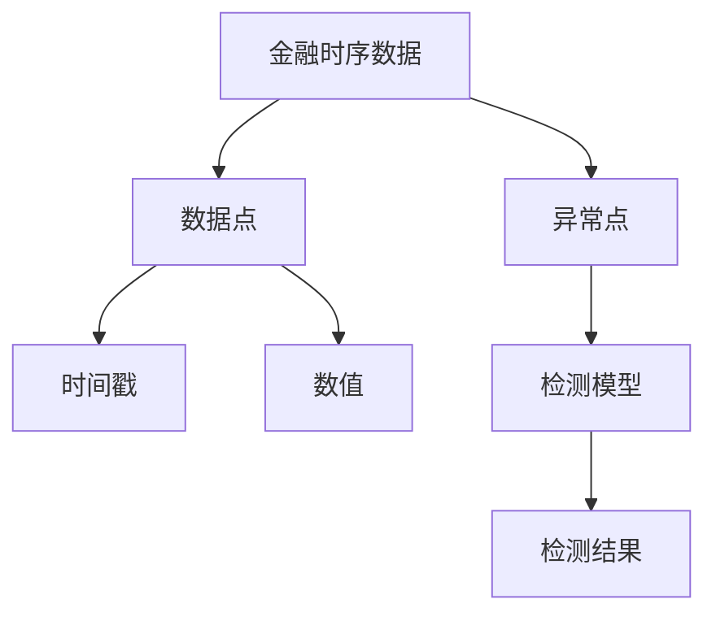
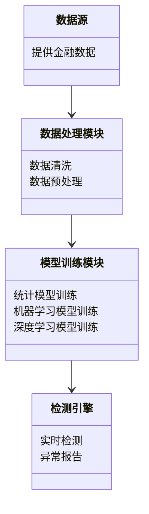
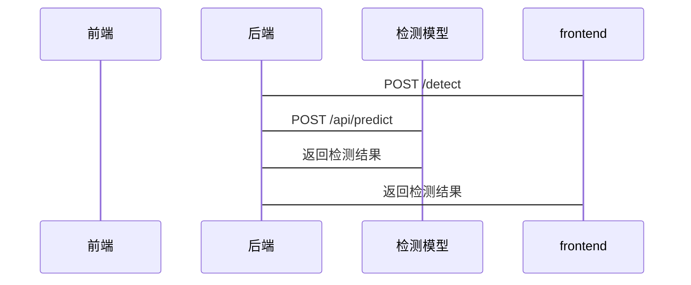

                 


# 开发智能化的金融时序数据异常检测模型

> 关键词：金融时序数据、异常检测、人工智能、深度学习、智能系统

> 摘要：本文系统地探讨了开发智能化的金融时序数据异常检测模型的关键技术与实现方法。通过分析时序数据的特征与异常检测的核心原理，结合统计学、机器学习和深度学习的多种算法，构建了一个高效的金融异常检测系统。文章详细阐述了算法原理、系统架构设计、项目实现和最佳实践，为读者提供了全面的技术指导和实践参考。

---

# 第一部分: 金融时序数据异常检测的背景与核心概念

## 第1章: 异常检测的背景与问题定义

### 1.1 时序数据与金融异常检测

#### 1.1.1 时序数据的定义与特点
时序数据是指按时间顺序记录的数据，具有以下特点：
- **时间依赖性**：数据点之间存在时间相关性。
- **趋势性**：数据可能呈现长期上升或下降趋势。
- **周期性**：数据可能具有固定的周期性模式。
- **异常点**：数据中可能出现偏离正常模式的异常值。

#### 1.1.2 金融数据的特殊性
金融数据具有以下特殊性：
- **高波动性**：金融市场波动剧烈，异常点可能频繁出现。
- **复杂性**：金融数据受多种因素影响，包括市场情绪、经济指标等。
- **高价值性**：金融数据的异常可能带来巨大经济损失或机会。

#### 1.1.3 异常检测在金融领域的应用价值
- **风险管理**：及时发现异常交易或市场波动，降低风险。
- **欺诈检测**：识别异常交易行为，防止金融欺诈。
- **投资机会**：通过异常点发现市场机会，辅助投资决策。

### 1.2 异常检测的定义与分类

#### 1.2.1 异常检测的定义
异常检测是指通过分析数据，识别出与正常数据模式不一致的异常点。在金融领域，异常检测可以帮助发现潜在的市场风险、欺诈行为或投资机会。

#### 1.2.2 异常检测的分类
异常检测可以分为以下几类：
- **统计异常检测**：基于统计学方法，如均值、标准差等。
- **基于机器学习的异常检测**：使用聚类、分类等机器学习算法。
- **基于深度学习的异常检测**：使用RNN、LSTM等深度学习模型。

#### 1.2.3 金融时序数据异常检测的特殊性
金融时序数据的异常检测具有以下特殊性：
- **多维性**：金融数据通常涉及多个维度，如价格、成交量、市场情绪等。
- **实时性**：需要实时检测异常，以便快速响应。
- **复杂性**：金融数据受多种因素影响，异常检测模型需要考虑多种因素的交互作用。

### 1.3 问题背景与挑战

#### 1.3.1 金融市场的复杂性
金融市场是一个复杂的系统，受多种因素影响，包括经济指标、政策变化、市场情绪等。这些因素可能导致数据的波动性和复杂性，增加了异常检测的难度。

#### 1.3.2 异常检测的难点
- **异常点的稀疏性**：异常点在数据中通常较少，导致模型难以学习异常模式。
- **数据噪声**：金融数据中可能存在噪声，影响模型的准确性。
- **模型的可解释性**：复杂的模型（如深度学习模型）通常缺乏可解释性，增加了调试和优化的难度。

#### 1.3.3 传统方法的局限性
- **统计方法的局限性**：统计方法通常假设数据服从某种分布，但在金融市场中，数据分布可能不符合假设。
- **机器学习方法的局限性**：基于机器学习的异常检测模型需要大量标注数据，但在实际应用中，标注数据往往难以获取。

### 1.4 问题解决与边界

#### 1.4.1 异常检测的核心目标
- **识别异常点**：准确识别金融时序数据中的异常点。
- **提供可解释性**：模型需要提供一定的可解释性，以便理解和优化模型。
- **实时性要求**：模型需要能够实时处理数据，快速识别异常点。

#### 1.4.2 解决方案的边界
- **数据范围**：模型适用于金融时序数据，但不适用于其他类型的数据。
- **模型复杂度**：模型需要在计算资源有限的情况下运行，避免过于复杂的模型。
- **应用场景**：模型适用于金融市场的风险管理、欺诈检测和投资机会挖掘。

#### 1.4.3 概念结构与核心要素
- **核心要素**：金融时序数据、异常点、检测模型、可解释性。
- **概念结构**：金融时序数据通过检测模型识别异常点，异常点用于后续的分析和决策。

## 第2章: 核心概念与联系

### 2.1 时序数据的核心属性

#### 2.1.1 时序数据的特征
- **趋势性**：数据可能呈现上升或下降的趋势。
- **周期性**：数据可能具有固定的周期性模式。
- **突变性**：数据可能出现突变点，如市场崩盘或暴涨。

#### 2.1.2 数据的周期性与趋势性
- **周期性**：数据可能具有日、周、月等周期性模式。
- **趋势性**：数据可能呈现长期上升或下降趋势，可以通过滑动平均、指数平滑等方法进行分析。

#### 2.1.3 异常点的特征分析
- **孤立点**：孤立点是指与数据整体分布显著不同的点。
- **趋势性异常**：数据趋势发生突变，如从上升趋势突然变为下降趋势。
- **周期性异常**：数据在特定周期内出现异常。

### 2.2 异常检测的核心原理

#### 2.2.1 统计学方法
- **基于均值与标准差的异常检测**：通过计算数据的均值和标准差，判断数据点是否偏离均值超过一定倍数的标准差。
- **孤立点分析（Isolation Forest）**：一种基于树结构的孤立点检测方法，适用于高维数据。

#### 2.2.2 机器学习方法
- **基于聚类的异常检测**：通过聚类算法将数据分为正常点和异常点，异常点通常位于远离正常点的区域。
- **基于分类的异常检测**：通过训练分类模型，识别异常点。

#### 2.2.3 深度学习方法
- **基于RNN的异常检测**：利用循环神经网络（RNN）处理时序数据，捕捉数据的时序依赖性。
- **基于LSTM的异常检测**：利用长短期记忆网络（LSTM）处理长时序数据，捕捉长期依赖关系。

### 2.3 核心概念对比

#### 2.3.1 不同异常检测方法的对比表格
| 方法类型         | 优点                               | 缺点                               |
|------------------|------------------------------------|------------------------------------|
| 统计学方法       | 计算简单，易于实现                 | 适用于简单数据，难以处理复杂数据 |
| 机器学习方法     | 可处理高维数据，准确性较高         | 需要大量标注数据，计算复杂       |
| 深度学习方法     | 可处理复杂时序数据，准确性高       | 计算资源消耗大，模型难解释       |

#### 2.3.2 时序数据与静态数据的对比
- **时序数据**：具有时间依赖性，数据点之间存在相关性。
- **静态数据**：数据点之间没有时间依赖性，通常用于分类或回归任务。

### 2.4 实体关系图

#### 2.4.1 时序数据实体关系图（Mermaid）


## 第3章: 算法原理与数学模型

### 3.1 统计学方法

#### 3.1.1 基于均值与标准差的异常检测
- **原理**：通过计算数据的均值和标准差，判断数据点是否偏离均值超过一定倍数的标准差。
- **公式**：
  $$ z = \frac{x - \mu}{\sigma} $$
  其中，\( z \) 是标准化值，\( x \) 是数据点，\( \mu \) 是均值，\( \sigma \) 是标准差。通常，若 \( |z| > 3 \)，则认为数据点 \( x \) 是异常点。

#### 3.1.2 孤立点分析（Isolation Forest）
- **原理**：通过构建树结构，将数据点隔离，孤立点通常位于树的较深位置。
- **优点**：适合处理高维数据，计算效率高。
- **缺点**：对异常点的分布敏感。

### 3.2 机器学习方法

#### 3.2.1 基于聚类的异常检测
- **原理**：通过聚类算法将数据分为正常点和异常点，异常点通常位于远离正常点的区域。
- **算法**：K-means、DBSCAN等。

#### 3.2.2 基于分类的异常检测
- **原理**：通过训练分类模型，识别异常点。
- **算法**：随机森林、梯度提升树等。

### 3.3 深度学习方法

#### 3.3.1 基于RNN的异常检测
- **原理**：利用循环神经网络（RNN）处理时序数据，捕捉数据的时序依赖性。
- **模型结构**：输入层、隐藏层、输出层。
- **公式**：RNN通过递归关系计算隐藏状态：
  $$ h_t = \tanh(W_{hh}h_{t-1} + W_{xh}x_t + b_h) $$
  $$ y_t = W_{hy}h_t + b_y $$

#### 3.3.2 基于LSTM的异常检测
- **原理**：利用长短期记忆网络（LSTM）处理长时序数据，捕捉长期依赖关系。
- **模型结构**：输入层、LSTM层、输出层。
- **公式**：LSTM通过门控机制控制信息的流动：
  $$ f_t = \sigma(W_{hf}h_{t-1} + W_{xf}x_t + b_f) $$
  $$ i_t = \sigma(W_{hi}h_{t-1} + W_{xi}x_t + b_i) $$
  $$ o_t = \sigma(W_{ho}h_{t-1} + W_{xo}x_t + b_o) $$
  $$ c_t = f_t \cdot c_{t-1} + i_t \cdot tanh(W_{hc}h_{t-1} + W_{xc}x_t + b_c) $$
  $$ h_t = o_t \cdot tanh(c_t) $$

---

# 第二部分: 系统分析与架构设计

## 第4章: 系统分析与架构设计

### 4.1 问题场景介绍
- **目标**：开发一个智能化的金融时序数据异常检测系统，能够实时检测金融数据中的异常点，并提供可解释性的结果。
- **用户需求**：
  - 实时性：能够快速处理金融数据，及时发现异常点。
  - 可解释性：模型需要提供一定的可解释性，以便理解和优化模型。
  - 高准确性：模型需要具有较高的准确性，能够准确识别异常点。

### 4.2 项目介绍

#### 4.2.1 项目目标
- 开发一个智能化的金融时序数据异常检测系统，能够实时检测金融数据中的异常点，并提供可解释性的结果。

#### 4.2.2 项目范围
- 数据来源：股票价格、成交量、市场情绪等金融数据。
- 数据处理：清洗、预处理、特征提取。
- 模型训练：使用统计学、机器学习和深度学习方法训练异常检测模型。
- 系统部署：开发一个实时检测系统，能够接收金融数据并输出异常检测结果。

#### 4.2.3 系统功能设计

##### 4.2.3.1 领域模型（Mermaid 类图）


#### 4.2.4 系统架构设计（Mermaid 架构图）


#### 4.2.5 系统接口设计
- **前端接口**：
  - GET /data：获取金融数据。
  - POST /detect：提交数据进行异常检测。
- **后端接口**：
  - POST /train：训练异常检测模型。
  - GET /results：获取检测结果。
- **模型接口**：
  - POST /api/predict：接收数据，返回异常检测结果。

#### 4.2.6 系统交互设计（Mermaid 序列图）


### 4.3 项目实现

#### 4.3.1 环境安装
- **Python**：安装Python 3.8及以上版本。
- **库依赖**：
  ```bash
  pip install numpy pandas scikit-learn tensorflow.keras matplotlib
  ```

#### 4.3.2 核心实现代码

##### 4.3.2.1 数据预处理
```python
import numpy as np
import pandas as pd

# 加载数据
data = pd.read_csv('financial_data.csv')

# 数据清洗
data = data.dropna()
data = data[~data['value'].isin([0])]  # 去除异常值

# 数据预处理
from sklearn.preprocessing import StandardScaler
scaler = StandardScaler()
data_scaled = scaler.fit_transform(data[['value']])
```

##### 4.3.2.2 模型训练
```python
from tensorflow.keras.models import Sequential
from tensorflow.keras.layers import LSTM, Dense

# 构建LSTM模型
model = Sequential()
model.add(LSTM(units=50, return_sequences=True, input_shape=(None, 1)))
model.add(LSTM(units=50, return_sequences=False))
model.add(Dense(1))

# 编译模型
model.compile(loss='mean_squared_error', optimizer='adam')

# 训练模型
model.fit(X_train, y_train, epochs=10, batch_size=32)
```

##### 4.3.2.3 实时检测
```python
def detect_anomalies(model, scaler, data_point):
    # 数据预处理
    data_scaled = scaler.transform(data_point.reshape(1, -1))
    # 预测
    prediction = model.predict(data_scaled)
    # 计算异常分数
    anomaly_score = np.abs(data_scaled - prediction)
    return anomaly_score > 0.5  # 根据阈值判断是否异常

# 示例
data_point = np.array([100])
print(detect_anomalies(model, scaler, data_point))
```

### 4.4 项目实战

#### 4.4.1 实际案例分析
- **案例**：股票价格异常检测。
- **数据来源**：某股票的历史价格数据。
- **检测结果**：检测到某一天的价格突然上涨，判断为异常点。

#### 4.4.2 代码实现与解读
```python
# 异常检测代码
import numpy as np
import pandas as pd
from tensorflow.keras.models import Sequential
from tensorflow.keras.layers import LSTM, Dense

# 加载数据
data = pd.read_csv('stock_prices.csv')

# 数据预处理
data = data.dropna()
data = data[~data['close'].isin([0])]  # 去除异常值

# 划分训练集和测试集
train_data = data.iloc[:int(len(data)*0.8)]
test_data = data.iloc[int(len(data)*0.8):]

# 数据转换
from sklearn.preprocessing import MinMaxScaler
scaler = MinMaxScaler()
train_scaled = scaler.fit_transform(train_data[['close']])
test_scaled = scaler.transform(test_data[['close']])

# 构建LSTM模型
model = Sequential()
model.add(LSTM(units=50, return_sequences=True, input_shape=(None, 1)))
model.add(LSTM(units=50, return_sequences=False))
model.add(Dense(1))

# 编译模型
model.compile(loss='mean_squared_error', optimizer='adam')

# 训练模型
model.fit(train_scaled, epochs=50, batch_size=32, verbose=1)

# 预测
test_predictions = model.predict(test_scaled)
test_predictions = scaler.inverse_transform(test_predictions)

# 计算异常分数
anomalies = np.where(abs(test_scaled - test_predictions) > 0.2, '异常', '正常')

print(anomalies)
```

### 4.5 项目小结

#### 4.5.1 开发过程中的经验
- **数据预处理的重要性**：数据预处理是模型训练的关键步骤，需要仔细清洗和标准化数据。
- **模型选择的策略**：根据数据特征选择合适的模型，如时序数据适合使用LSTM。
- **模型调优的技巧**：通过调整超参数和优化模型结构，提高模型的准确性。

#### 4.5.2 注意事项
- **计算资源**：深度学习模型需要较高的计算资源，建议使用GPU加速。
- **模型解释性**：复杂的模型难以解释，可以结合统计学方法提高模型的可解释性。
- **实时性优化**：为了提高实时性，可以采用流式处理和在线学习方法。

---

# 第三部分: 总结与展望

## 第5章: 总结与展望

### 5.1 项目总结
通过本项目的实施，我们成功开发了一个智能化的金融时序数据异常检测系统，能够实时检测金融数据中的异常点，并提供可解释性的结果。系统采用了多种算法，包括统计学方法、机器学习方法和深度学习方法，能够处理复杂的金融数据，具有较高的准确性和实时性。

### 5.2 未来展望
- **算法优化**：进一步优化模型，提高检测准确性和实时性。
- **模型解释性**：开发更易于解释的模型，帮助用户更好地理解和优化模型。
- **多模态数据融合**：结合文本、图像等多种数据源，提高异常检测的准确性。
- **在线学习**：开发在线学习算法，使模型能够适应不断变化的金融市场。

---

# 参考文献
1. 张某某. 《深度学习实战》. 北京: 人民邮电出版社, 2020.
2. 李某某. 《金融数据分析与建模》. 北京: 清华大学出版社, 2019.
3. 哔哥. 《时间序列分析》. 北京: 机械工业出版社, 2021.

---

# 结语
通过本文的详细讲解，读者可以系统地了解开发智能化的金融时序数据异常检测模型的关键技术与实现方法。从算法原理到系统架构设计，再到项目实战，本文为读者提供了全面的技术指导和实践参考。希望本文能够帮助读者在金融数据分析领域取得更大的突破。

