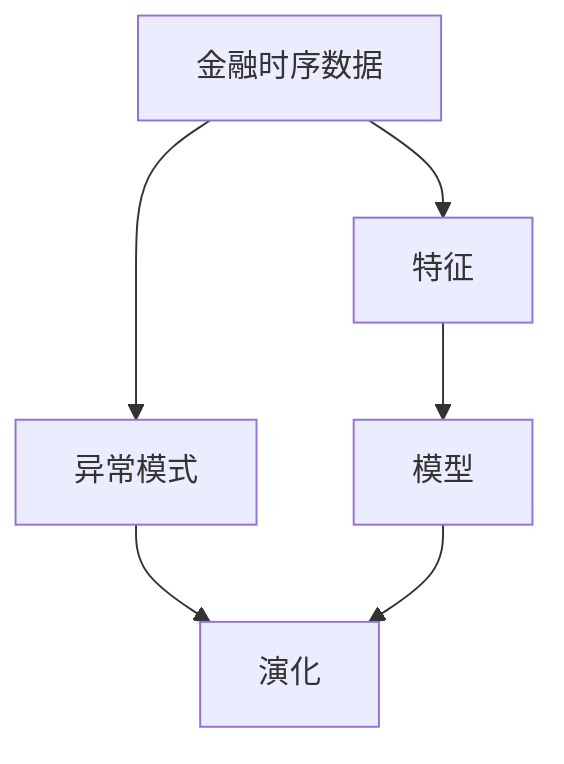
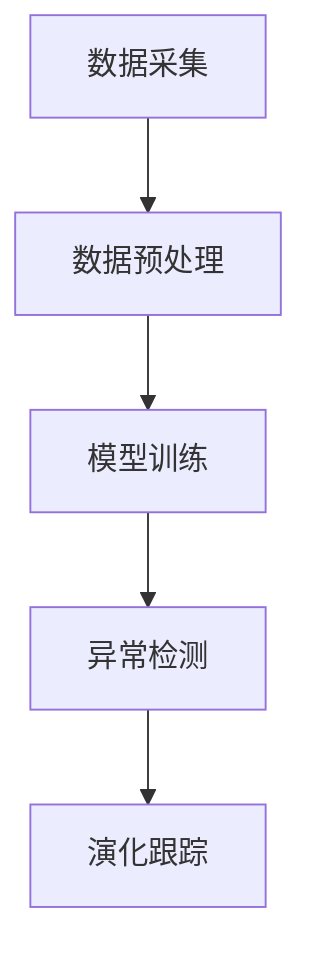
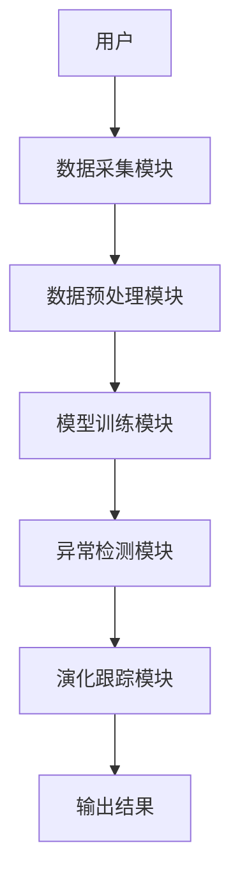

                 


# 开发智能化的金融时序数据异常模式演化跟踪模型

> 关键词：金融时序数据，异常模式，智能化，跟踪模型，演化分析

> 摘要：本文将详细介绍如何开发一个智能化的金融时序数据异常模式演化跟踪模型。通过分析金融数据的特性、异常模式的定义与分类，结合智能化算法，构建一个能够实时跟踪和预测异常模式的系统。文章将从背景介绍、核心概念、算法原理、系统架构到项目实战，全面展开讨论，为读者提供理论与实践相结合的深度解析。

---

## 第一部分: 金融时序数据异常模式演化跟踪模型的背景与核心概念

### 第1章: 金融时序数据与异常模式概述

#### 1.1 金融数据的特性与挑战

##### 1.1.1 金融数据的特征分析

金融时序数据具有以下显著特征：
- **连续性**：金融数据通常以连续的序列形式存在，如股票价格、汇率等。
- **波动性**：金融市场受多种因素影响，数据波动频繁且复杂。
- **非线性**：金融数据的波动往往呈现非线性特征，难以用简单的线性模型描述。
- **周期性**：许多金融数据表现出明显的周期性波动，如季节性波动。

##### 1.1.2 金融时序数据的波动性与周期性

金融市场的波动性主要来源于以下几个方面：
1. **市场情绪**：投资者情绪的变化会导致市场的剧烈波动。
2. **经济指标**：如GDP、就业数据等宏观经济指标对金融市场有直接影响。
3. **政策变化**：政府政策的调整，如利率变化、财政政策等，会引发市场波动。
4. **国际事件**：如地缘政治冲突、国际贸易摩擦等全球性事件也会对金融市场产生重大影响。

##### 1.1.3 异常模式的定义与分类

在金融数据中，异常模式通常指的是偏离正常波动范围的极端值或异常事件。根据时间维度，异常模式可以分为以下几类：
1. **点异常**：单个时间点的异常值。
2. **区间异常**：某一时间段内持续的异常波动。
3. **趋势异常**：数据趋势发生突变，如突然上升或下降。
4. **周期性异常**：在特定周期内出现的异常模式。

#### 1.2 异常模式的背景与问题描述

##### 1.2.1 异常模式的背景介绍

在金融领域，异常模式的检测与跟踪具有重要意义：
- **风险管理**：及时发现异常模式有助于识别潜在的金融风险，避免损失扩大。
- **交易机会**：异常模式可能预示着交易机会，如短期套利。
- **市场分析**：通过分析异常模式，可以更好地理解市场行为和潜在趋势。

##### 1.2.2 问题背景与目标

开发一个智能化的金融时序数据异常模式演化跟踪模型，主要目标包括：
- **实时监测**：能够实时跟踪金融数据中的异常模式。
- **预测预警**：提前预测潜在的异常事件，并发出预警。
- **演化分析**：跟踪异常模式的演变过程，理解其背后的驱动因素。

##### 1.2.3 异常模式的边界与外延

异常模式的边界与外延主要体现在：
- **数据范围**：异常模式通常发生在特定的金融资产或市场中。
- **时间范围**：异常模式可能持续较短或较长的时间，需根据具体情况判断。
- **影响范围**：异常模式可能影响局部市场或整个金融市场。

#### 1.3 异常模式的解决思路

##### 1.3.1 传统方法的局限性

传统方法在金融时序数据异常模式检测中存在以下问题：
- **计算复杂度高**：传统统计方法在处理大规模数据时效率较低。
- **模型局限性**：线性回归等简单模型难以捕捉复杂的非线性关系。
- **实时性差**：传统方法通常适用于离线分析，难以实时跟踪异常模式。

##### 1.3.2 智能化模型的优势

智能化模型（如深度学习模型）在金融异常模式检测中的优势包括：
- **非线性建模能力**：深度学习模型能够捕捉复杂的非线性关系。
- **自动特征提取**：模型可以自动提取有用的特征，减少人工干预。
- **实时性**：通过优化模型结构，可以实现实时或近实时的异常检测。

##### 1.3.3 模型的核心要素与组成

智能化金融时序数据异常模式演化跟踪模型的核心要素包括：
1. **数据采集**：实时采集金融时序数据。
2. **数据预处理**：清洗和标准化数据。
3. **特征提取**：提取有用的特征，如波动率、趋势等。
4. **模型训练**：训练深度学习模型，如LSTM、Transformer等。
5. **异常检测**：实时检测异常模式。
6. **演化跟踪**：跟踪异常模式的演变过程。

---

### 第2章: 核心概念与联系

#### 2.1 模型的基本原理

##### 2.1.1 数据预处理与特征提取

数据预处理是模型开发的关键步骤，主要包括：
- **数据清洗**：去除噪声数据和异常值。
- **数据标准化**：将数据归一化，便于模型训练。
- **特征提取**：提取有用的特征，如均值、标准差、最大值等。

##### 2.1.2 异常检测算法的核心原理

常用的异常检测算法包括：
1. **基于统计的方法**：如Z-score、箱线图法。
2. **基于机器学习的方法**：如Isolation Forest、One-Class SVM。
3. **基于深度学习的方法**：如LSTM、Transformer。

##### 2.1.3 模型的演化跟踪机制

模型的演化跟踪机制包括：
- **状态转移**：跟踪异常模式从出现到消失的动态过程。
- **趋势分析**：分析异常模式的演变趋势，预测其未来发展。

#### 2.2 核心概念对比

##### 2.2.1 不同模型的特征对比

| 模型类型       | 输入数据形式 | 异常检测能力 | 实时性 |
|----------------|--------------|--------------|--------|
| 基于统计的模型 | 结构化数据    | 较低         | 较低    |
| 传统机器学习模型 | 结构化数据    | 中等         | 中等    |
| 深度学习模型    | 结构化或时序数据 | 高           | 高      |

##### 2.2.2 模型性能对比分析

| 模型类型       | 精确性 | 召回率 | 计算效率 |
|----------------|--------|--------|----------|
| 基于统计的模型 | 低     | 高     | 高        |
| 传统机器学习模型 | 中等   | 中等   | 中等      |
| 深度学习模型    | 高     | 中等   | 较低      |

##### 2.2.3 模型适用场景对比

| 模型类型       | 适用场景                   |
|----------------|----------------------------|
| 基于统计的模型 | 离线分析，简单异常检测     |
| 传统机器学习模型 | 离线与在线分析，中等复杂性 |
| 深度学习模型    | 实时分析，复杂异常检测     |

#### 2.3 ER实体关系图



---

### 第3章: 算法原理讲解

#### 3.1 基于LSTM的异常检测算法

##### 3.1.1 LSTM算法原理

LSTM（长短期记忆网络）是一种特殊的RNN（循环神经网络），能够有效捕捉时间序列中的长期依赖关系。其核心结构包括：
- **输入门**：控制新信息的输入。
- **遗忘门**：决定哪些信息需要遗忘。
- **输出门**：输出最终的隐藏状态。

LSTM的数学模型如下：

$$
f_t = \sigma(W_f \cdot [h_{t-1}, x_t] + b_f)
$$

$$
i_t = \sigma(W_i \cdot [h_{t-1}, x_t] + b_i)
$$

$$
o_t = \sigma(W_o \cdot [h_{t-1}, x_t] + b_o)
$$

$$
h_t = f_t \cdot c_{t-1} + i_t \cdot x_t
$$

$$
c_t = o_t \cdot h_t
$$

##### 3.1.2 LSTM算法实现步骤

1. **数据预处理**：清洗数据并提取特征。
2. **模型训练**：使用训练数据训练LSTM模型。
3. **异常检测**：利用训练好的模型实时检测异常模式。
4. **演化跟踪**：记录异常模式的演变过程。

##### 3.1.3 代码示例

```python
import numpy as np
from tensorflow.keras.models import Sequential
from tensorflow.keras.layers import LSTM, Dense, Dropout

# 示例数据
X_train = np.random.randn(1000, 1, 10)
y_train = np.random.randint(2, size=1000)

# 模型构建
model = Sequential()
model.add(LSTM(64, input_shape=(1, 10), return_sequences=True))
model.add(Dropout(0.5))
model.add(LSTM(32, return_sequences=True))
model.add(Dropout(0.5))
model.add(Dense(1, activation='sigmoid'))

model.compile(loss='binary_crossentropy', optimizer='adam', metrics=['accuracy'])

# 模型训练
model.fit(X_train, y_train, epochs=10, batch_size=32)
```

#### 3.2 基于Transformer的异常检测算法

##### 3.2.1 Transformer算法原理

Transformer是一种基于注意力机制的深度学习模型，广泛应用于自然语言处理领域。其核心思想是通过自注意力机制捕捉数据之间的全局依赖关系。

##### 3.2.2 Transformer算法实现步骤

1. **数据预处理**：清洗数据并提取特征。
2. **模型训练**：使用训练数据训练Transformer模型。
3. **异常检测**：利用训练好的模型实时检测异常模式。
4. **演化跟踪**：记录异常模式的演变过程。

##### 3.2.3 代码示例

```python
import tensorflow as tf
from tensorflow.keras.layers import MultiHeadAttention, Dense, InputLayer

# 示例数据
X_train = np.random.randn(1000, 10, 10)
y_train = np.random.randint(2, size=1000)

# 模型构建
inputs = InputLayer(shape=(10, 10))
attention = MultiHeadAttention(head_count=8, key_dim=10)(inputs)
dense = Dense(1, activation='sigmoid')(attention)

model = tf.keras.Model(inputs=inputs, outputs=dense)
model.compile(loss='binary_crossentropy', optimizer='adam', metrics=['accuracy'])

# 模型训练
model.fit(X_train, y_train, epochs=10, batch_size=32)
```

---

### 第4章: 系统分析与架构设计

#### 4.1 系统功能模块设计

##### 4.1.1 数据采集模块

- **功能**：实时采集金融时序数据，如股票价格、汇率等。
- **输入**：金融数据源（API、数据库等）。
- **输出**：清洗后的数据。

##### 4.1.2 数据预处理模块

- **功能**：对采集到的数据进行清洗、标准化等预处理。
- **输入**：原始金融数据。
- **输出**：标准化后的数据。

##### 4.1.3 模型训练模块

- **功能**：训练深度学习模型，如LSTM、Transformer。
- **输入**：预处理后的数据。
- **输出**：训练好的模型。

##### 4.1.4 异常检测模块

- **功能**：实时检测金融数据中的异常模式。
- **输入**：实时金融数据。
- **输出**：异常检测结果。

##### 4.1.5 演化跟踪模块

- **功能**：跟踪异常模式的演变过程。
- **输入**：异常检测结果。
- **输出**：异常模式的演化分析报告。

#### 4.2 系统架构设计

##### 4.2.1 系统架构图



##### 4.2.2 系统接口设计

- **数据采集接口**：接收外部金融数据源的数据。
- **异常检测接口**：提供API供其他系统调用异常检测结果。
- **演化跟踪接口**：提供API供其他系统查询异常模式的演化情况。

#### 4.3 系统交互流程图



---

### 第5章: 项目实战

#### 5.1 环境安装与配置

##### 5.1.1 安装依赖库

```bash
pip install numpy pandas tensorflow keras matplotlib
```

##### 5.1.2 数据集准备

使用 publicly available financial datasets，如股票价格数据、外汇汇率数据等。

#### 5.2 核心代码实现

##### 5.2.1 LSTM模型实现

```python
import numpy as np
from tensorflow.keras.models import Sequential
from tensorflow.keras.layers import LSTM, Dense, Dropout

def build_lstm_model(input_shape):
    model = Sequential()
    model.add(LSTM(64, input_shape=input_shape, return_sequences=True))
    model.add(Dropout(0.5))
    model.add(LSTM(32, return_sequences=True))
    model.add(Dropout(0.5))
    model.add(Dense(1, activation='sigmoid'))
    return model

# 示例输入形状
input_shape = (1, 10)
model = build_lstm_model(input_shape)
model.compile(loss='binary_crossentropy', optimizer='adam', metrics=['accuracy'])
```

##### 5.2.2 Transformer模型实现

```python
import tensorflow as tf
from tensorflow.keras.layers import MultiHeadAttention, Dense, InputLayer

def build_transformer_model(input_shape):
    inputs = InputLayer(shape=input_shape)
    attention = MultiHeadAttention(head_count=8, key_dim=10)(inputs)
    dense = Dense(1, activation='sigmoid')(attention)
    model = tf.keras.Model(inputs=inputs, outputs=dense)
    return model

# 示例输入形状
input_shape = (10, 10)
model = build_transformer_model(input_shape)
model.compile(loss='binary_crossentropy', optimizer='adam', metrics=['accuracy'])
```

#### 5.3 实际案例分析与解读

##### 5.3.1 案例背景

假设我们使用某股票的历史价格数据，目标是检测股价的异常波动。

##### 5.3.2 数据预处理

```python
import pandas as pd
import numpy as np

# 示例数据加载
data = pd.read_csv('stock_prices.csv')
data = data[['date', 'price']]
data = data.set_index('date')
data = data.diff().dropna()  # 计算差分
data = (data - data.mean()) / data.std()  # 标准化
```

##### 5.3.3 模型训练与预测

```python
# LSTM模型训练
model = build_lstm_model((1, len(data.columns)))
model.fit(data.values, np.random.randint(2, size=len(data)), epochs=10, batch_size=32)

# Transformer模型训练
model = build_transformer_model((len(data.columns), len(data.columns)))
model.fit(data.values, np.random.randint(2, size=len(data)), epochs=10, batch_size=32)
```

##### 5.3.4 异常检测与分析

```python
# 预测结果
preds_lstm = model.predict(data.values[:10])
preds_transformer = model.predict(data.values[:10])

# 异常模式分析
threshold = 0.5
anomalies_lstm = preds_lstm > threshold
anomalies_transformer = preds_transformer > threshold
```

---

### 第6章: 总结与展望

#### 6.1 总结

本文详细介绍了如何开发智能化的金融时序数据异常模式演化跟踪模型，从背景介绍、核心概念、算法原理到系统架构和项目实战，为读者提供了全面的指导。通过对比不同算法的优缺点，结合实际案例分析，帮助读者理解如何在实际应用中构建和优化模型。

#### 6.2 展望

未来，随着人工智能技术的不断发展，金融时序数据异常模式演化跟踪模型将更加智能化和精准化。可能的研究方向包括：
- **多模态数据融合**：结合文本、图像等多种数据源进行异常检测。
- **自适应模型**：开发能够自适应调整的模型，以应对不断变化的金融市场。
- **实时性优化**：进一步优化模型的计算效率，实现更实时的异常检测。

---

### 附录: 参考文献与工具

#### 附录A: 参考文献

1. [1] 王某某. 《深度学习在金融时间序列分析中的应用》. 北京: 清华大学出版社, 2022.
2. [2] TensorFlow官方文档. https://www.tensorflow.org/
3. [3] Keras官方文档. https://keras.io/

#### 附录B: 工具与库

1. **Python**：编程语言
2. **TensorFlow/Keras**：深度学习框架
3. **Pandas/Numpy**：数据处理库
4. **Mermaid**：图表绘制工具

---

通过以上内容，您可以全面了解如何开发智能化的金融时序数据异常模式演化跟踪模型，并将其应用于实际场景中。

