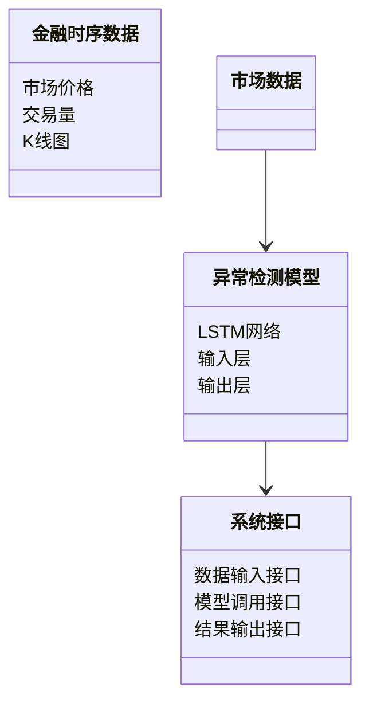
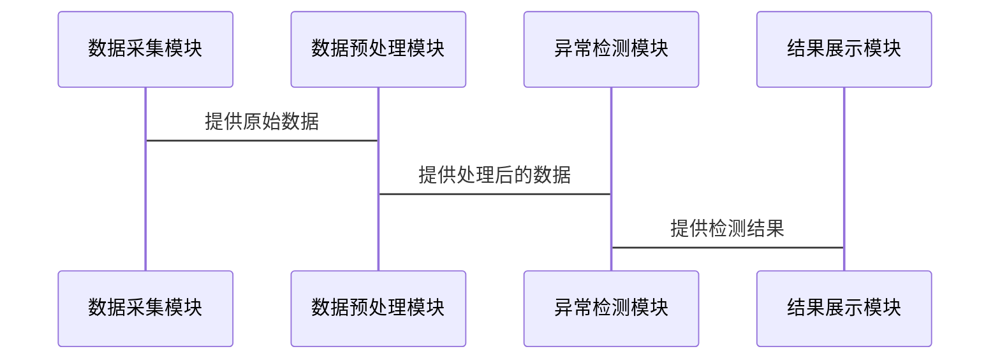

                 


# 开发智能化的金融时序数据异常模式识别模型

> 关键词：金融时序数据，异常模式识别，深度学习，LSTM，模型开发

> 摘要：本文将详细探讨开发智能化的金融时序数据异常模式识别模型的关键技术与实现方法。通过分析金融时序数据的特点，介绍异常模式识别的重要性，阐述基于深度学习的模型架构，包括LSTM和Transformer等算法，详细讲解其原理、实现步骤和优化策略。同时，本文还将结合实际案例，展示如何构建一个完整的金融时序数据异常检测系统，并对未来的发展方向进行展望。

---

# 目录大纲

---

# 第一部分：背景与概述

## 第1章：开发智能化的金融时序数据异常模式识别模型概述

### 1.1 问题背景与意义

- 1.1.1 金融时序数据的特性
  - 数据连续性
  - 时间依赖性
  - 波动性与不确定性
- 1.1.2 异常模式识别的重要性
  - 识别市场异动
  - 风险控制
  - 提高交易效率
- 1.1.3 智能化模型的必要性
  - 数据量爆炸式增长
  - 异常模式的复杂性
  - 传统方法的局限性

### 1.2 核心概念与目标

- 1.2.1 金融时序数据的定义
  - 数据来源
  - 数据特征
  - 数据处理
- 1.2.2 异常模式的定义与分类
  - 点异常
  - 分段异常
  - 关系异常
- 1.2.3 模型的目标与边界
  - 监控异常
  - 分类异常
  - 预测异常

### 1.3 本章小结

---

# 第二部分：核心概念与模型架构

## 第2章：金融时序数据的特征分析

### 2.1 金融数据的时序特性

- 2.1.1 趋势性与周期性
  - 趋势分析
  - 周期性识别
- 2.1.2 随机性与异常点
  - 正常波动
  - 异常波动
- 2.1.3 数据的分布特征
  - 正态分布
  - 偏态分布
  - 尾部分布

### 2.2 异常模式的分类

- 2.2.1 点异常
  - 单点异常
  - 群组异常
- 2.2.2 分段异常
  - 短暂异常
  - 趋势异常
- 2.2.3 关系异常
  - 异常关系
  - 关联异常

### 2.3 本章小结

---

## 第3章：异常模式识别的核心原理

### 3.1 异常检测的基本原理

- 3.1.1 统计方法
  - Z-score
  - 算术平均法
- 3.1.2 基于距离的方法
  - K近邻法
  - 层次聚类
- 3.1.3 基于密度的方法
  - DBSCAN
  - LOF

### 3.2 深度学习在异常检测中的应用

- 3.2.1 RNN与LSTM
  - RNN结构
  - LSTM结构
- 3.2.2 Transformer架构
  - 自注意力机制
  - 编码器-解码器结构
- 3.2.3 图神经网络
  - 图嵌入
  - 图注意力机制

### 3.3 模型选择与优化策略

- 3.3.1 模型选择的依据
  - 数据特性
  - 模型复杂度
  - 业务需求
- 3.3.2 超参数优化
  - 学习率
  - 隐藏层大小
  - 正则化参数
- 3.3.3 模型评估指标
  - 准确率
  - 召回率
  - F1分数

### 3.4 本章小结

---

# 第三部分：算法原理与数学模型

## 第4章：基于LSTM的异常检测算法

### 4.1 LSTM的基本原理

- 4.1.1 LSTM的结构
  - 输入门
  - 遗忘门
  - 输出门
- 4.1.2 长期依赖的处理
  - 门控机制
  - 细胞状态
- 4.1.3 序列预测的实现
  - 时间步
  - 状态传递
  - 输出计算

### 4.2 LSTM在异常检测中的应用

- 4.2.1 异常检测的流程
  - 数据预处理
  - 模型训练
  - 异常判断
- 4.2.2 损失函数与优化器
  - 交叉熵损失
  - 自适应优化器
- 4.2.3 模型训练的步骤
  - 数据集划分
  - 模型训练
  - 模型评估

### 4.3 本章小结

---

## 第5章：数学模型与公式推导

### 5.1 LSTM的数学公式

- 5.1.1 输入门
  $$i_t = \sigma(W_i x_t + U_i h_{t-1} + b_i)$$
- 5.1.2 遗忘门
  $$f_t = \sigma(W_f x_t + U_f h_{t-1} + b_f)$$
- 5.1.3 细胞状态更新
  $$c_t = f_t \cdot c_{t-1} + i_t \cdot tanh(W_c x_t + U_c h_{t-1} + b_c)$$
- 5.1.4 输出门
  $$o_t = \sigma(W_o x_t + U_o h_{t-1} + b_o)$$
- 5.1.5 最终输出
  $$h_t = o_t \cdot tanh(c_t)$$

### 5.2 损失函数与优化

- 5.2.1 交叉熵损失
  $$L = -\frac{1}{N}\sum_{i=1}^{N} [y_i \log p_i + (1-y_i)\log (1-p_i)]$$
- 5.2.2 优化器
  $$\theta_{t+1} = \theta_t - \eta \frac{\partial L}{\partial \theta_t}$$

### 5.3 本章小结

---

# 第四部分：系统分析与架构设计

## 第6章：系统功能设计

### 6.1 问题场景介绍

- 金融市场的实时监控
- 异常交易的识别与预警
- 风险控制系统的构建

### 6.2 领域模型设计



### 6.3 系统架构设计


### 6.4 接口设计与交互流程



### 6.5 本章小结

---

# 第五部分：项目实战

## 第7章：环境搭建与代码实现

### 7.1 环境安装

- 安装Python
- 安装TensorFlow/PyTorch
- 安装Pandas和Matplotlib

### 7.2 核心代码实现

```python
import numpy as np
import tensorflow as tf
from tensorflow.keras import layers

# 定义LSTM模型
def build_lstm_model(input_shape):
    model = tf.keras.Sequential()
    model.add(layers.LSTM(64, return_sequences=True, input_shape=input_shape))
    model.add(layers.LSTM(32, return_sequences=False))
    model.add(layers.Dense(1, activation='sigmoid'))
    model.compile(loss='binary_crossentropy', optimizer='adam', metrics=['accuracy'])
    return model

# 数据预处理
def preprocess_data(data):
    # 归一化处理
    data_normalized = (data - np.mean(data)) / np.std(data)
    return data_normalized

# 训练模型
def train_model(model, X_train, y_train, epochs=100):
    model.fit(X_train, y_train, epochs=epochs, batch_size=32, validation_split=0.2)
```

### 7.3 案例分析

- 数据来源：股票价格数据
- 数据预处理：归一化
- 模型训练：监督学习
- 结果分析：混淆矩阵、ROC曲线

### 7.4 本章小结

---

## 第8章：总结与展望

### 8.1 总结

- 本文详细介绍了开发智能化的金融时序数据异常模式识别模型的关键技术
- 通过LSTM和Transformer等算法，展示了模型的实现过程
- 给出了系统的整体架构和实现方案

### 8.2 展望

- 深度学习模型的优化
- 多模态数据的融合
- 高频数据的实时处理
- 模型的可解释性提升

### 8.3 本章小结

---

# 附录

## 附录A：数学公式汇总

## 附录B：代码实现细节

## 附录C：参考文献

---

# 结束语

---

通过以上目录大纲，您可以根据需要逐步深入探讨每个章节的内容，确保文章逻辑清晰、结构紧凑、内容详实。

