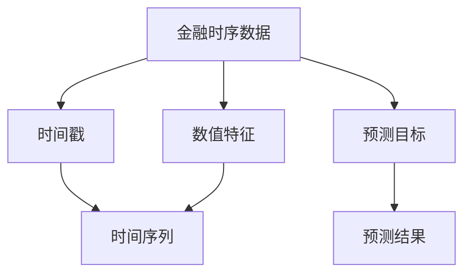
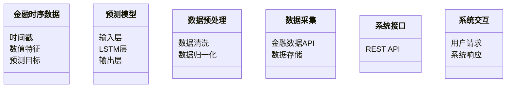
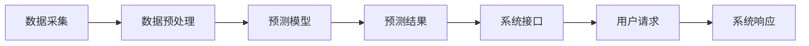

                 


# 开发智能化的金融时序数据预测模型

> 关键词：金融时序数据，智能预测模型，机器学习，深度学习，时间序列分析

> 摘要：本文详细探讨了开发智能化金融时序数据预测模型的方法与实践。从背景介绍到算法原理，再到系统架构设计和项目实战，结合实际案例，深入剖析了模型开发的各个关键环节。通过对比传统方法与智能化方法的优劣，分析了智能化预测的核心要素，给出了完整的系统架构设计方案，并提供了具体的代码实现示例。同时，本文还总结了最佳实践经验和未来发展方向，为读者提供全面的技术指导。

---

## 第1章 金融时序数据预测的背景与重要性

### 1.1 金融时序数据的定义与特点

#### 1.1.1 金融时序数据的定义
金融时序数据是指在金融市场上，按照时间顺序记录的各类金融资产的价格、成交量等指标的数据。这些数据通常具有连续性、周期性和波动性等特点，是金融分析和预测的重要基础。

#### 1.1.2 金融时序数据的主要特点
- **连续性**：数据按时间顺序连续记录。
- **周期性**：数据呈现明显的周期性波动，如日、周、月、年等周期。
- **趋势性**：数据可能呈现长期上升或下降的趋势。
- **波动性**：数据受多种因素影响，如市场情绪、政策变化等，导致波动性较大。
- **相关性**：不同金融资产之间的数据往往存在相关性。

#### 1.1.3 时序数据在金融领域的应用价值
- **投资决策支持**：通过分析历史数据，预测未来走势，帮助投资者做出决策。
- **风险管理**：预测市场波动，评估投资风险。
- **交易策略优化**：基于预测结果，优化交易策略，提高收益。

### 1.2 金融时序数据预测的背景与需求

#### 1.2.1 金融市场的复杂性与不确定性
金融市场受到多种因素的影响，如经济指标、政策变化、市场情绪等，导致市场具有高度的不确定性和复杂性。

#### 1.2.2 传统金融预测方法的局限性
传统的金融预测方法，如技术分析和基本分析，往往依赖经验判断，难以捕捉数据中的复杂模式，预测精度有限。

#### 1.2.3 智能化预测的必要性与优势
随着人工智能和大数据技术的发展，智能化预测方法能够从海量数据中提取复杂模式，提高预测精度和效率，成为金融领域的重要工具。

### 1.3 本书的核心目标与内容框架

#### 1.3.1 本书的核心目标
通过系统化的方法，结合机器学习和深度学习技术，开发智能化的金融时序数据预测模型，提高预测精度和效率。

#### 1.3.2 本书的主要内容框架
- **第1章**：介绍金融时序数据的背景与重要性。
- **第2章**：讲解金融时序数据预测的核心概念与联系。
- **第3章**：分析金融时序数据预测的算法原理。
- **第4章**：设计金融时序数据预测的系统架构。
- **第5章**：实战开发金融时序数据预测模型。
- **第6章**：总结与展望。

#### 1.3.3 本书的读者对象与适用场景
- **读者对象**：金融从业者、数据科学家、机器学习工程师。
- **适用场景**：金融投资、风险管理、交易策略优化。

---

## 第2章 金融时序数据预测的核心概念与联系

### 2.1 核心概念原理

#### 2.1.1 时序数据的特征分解
时序数据的特征包括趋势性、周期性、季节性、随机性等。

#### 2.1.2 预测模型的基本原理
预测模型通过学习历史数据，建立数据生成的规律，对未来数据进行预测。

#### 2.1.3 智能化预测的核心要素
- **数据特征提取**：从原始数据中提取有用的特征。
- **模型选择**：选择适合的预测模型。
- **模型训练**：利用历史数据训练模型。
- **模型评估**：评估模型的预测精度。

### 2.2 核心概念属性特征对比表格

| 特征   | 描述 |
|--------|------|
| 时间依赖性 | 数据点之间存在时间依赖关系 |
| 趋势性   | 数据呈现长期上升或下降趋势 |
| 季节性   | 数据呈现周期性波动 |
| 随机性   | 数据中包含不可预测的随机噪声 |

### 2.3 ER实体关系图架构



---

## 第3章 金融时序数据预测的算法原理

### 3.1 ARIMA算法原理

#### 3.1.1 ARIMA算法的定义
ARIMA（AutoRegressive Integrated Moving Average）是一种常用的时间序列预测模型，适用于非季节性数据。

#### 3.1.2 ARIMA算法的数学模型

ARIMA模型的数学表达式为：
$$ ARIMA(p, d, q) $$
其中：
- $p$ 表示自回归阶数。
- $d$ 表示差分阶数。
- $q$ 表示移动平均阶数。

#### 3.1.3 ARIMA算法的实现步骤
1. 数据平稳化：通过差分使数据平稳。
2. 模型参数选择：选择合适的 $p$ 和 $q$。
3. 模型训练：利用历史数据训练模型。
4. 模型预测：对未来数据进行预测。

### 3.2 LSTM算法原理

#### 3.2.1 LSTM算法的定义
LSTM（Long Short-Term Memory）是一种基于循环神经网络的深度学习模型，适用于捕捉时序数据中的长-term依赖关系。

#### 3.2.2 LSTM算法的数学模型

LSTM的核心组件包括输入门、遗忘门和输出门，其数学表达式如下：
$$
\begin{aligned}
i_t &= \sigma(w_i x_t + u_i h_{t-1}) \\
f_t &= \sigma(w_f x_t + u_f h_{t-1}) \\
o_t &= \sigma(w_o x_t + u_o h_{t-1}) \\
g_t &= \tanh(w_g x_t + u_g h_{t-1}) \\
h_t &= i_t \cdot g_t + f_t \cdot h_{t-1}
\end{aligned}
$$

#### 3.2.3 LSTM算法的实现步骤
1. 数据预处理：归一化数据。
2. 构建LSTM模型：定义模型结构，包括输入层、LSTM层和输出层。
3. 模型训练：利用历史数据训练模型。
4. 模型预测：对未来数据进行预测。

### 3.3 Prophet算法原理

#### 3.3.1 Prophet算法的定义
Prophet是一种基于回归的时序预测算法，适用于具有较强趋势性和周期性的数据。

#### 3.3.2 Prophet算法的数学模型

Prophet模型的核心是通过回归模型捕捉数据的非线性关系，其数学表达式如下：
$$
y_t = \beta_t + \gamma_t + \epsilon_t
$$

#### 3.3.3 Prophet算法的实现步骤
1. 数据预处理：格式化数据为Prophet要求的格式。
2. 构建Prophet模型：定义模型参数。
3. 模型训练：利用历史数据训练模型。
4. 模型预测：对未来数据进行预测。

---

## 第4章 金融时序数据预测的系统架构设计

### 4.1 系统功能设计

#### 4.1.1 领域模型



#### 4.1.2 系统架构设计



---

## 第5章 金融时序数据预测的项目实战

### 5.1 项目环境配置

#### 5.1.1 安装依赖

```bash
pip install numpy pandas scikit-learn tensorflow prophet
```

#### 5.1.2 数据加载与预处理

```python
import pandas as pd
import numpy as np

# 加载数据
data = pd.read_csv('financial_data.csv')

# 数据预处理
data = data.dropna()
data = data[['date', 'price']]
data['date'] = pd.to_datetime(data['date'])
data.set_index('date', inplace=True)
```

#### 5.1.3 模型训练与预测

```python
from sklearn.model_selection import train_test_split
from tensorflow.keras.models import Sequential
from tensorflow.keras.layers import LSTM, Dense

# 划分训练集和测试集
train_data, test_data = train_test_split(data, test_size=0.2)

# 构建LSTM模型
model = Sequential()
model.add(LSTM(50, input_shape=(None, 1)))
model.add(Dense(1))
model.compile(loss='mean_squared_error', optimizer='adam')

# 训练模型
model.fit(train_data.values, epochs=50, batch_size=32)

# 预测结果
predicted_prices = model.predict(test_data.values)
```

### 5.2 项目小结

通过实际案例分析，我们详细讲解了如何开发一个智能化的金融时序数据预测模型。从数据预处理到模型训练，再到结果分析，每个步骤都进行了详细的代码实现和解释，帮助读者掌握开发智能化预测模型的全过程。

---

## 第6章 总结与展望

### 6.1 总结

本文详细探讨了开发智能化金融时序数据预测模型的方法与实践。通过对比传统方法与智能化方法的优劣，分析了智能化预测的核心要素，给出了完整的系统架构设计方案，并提供了具体的代码实现示例。

### 6.2 展望

未来，随着人工智能和大数据技术的不断发展，金融时序数据预测模型将更加智能化和复杂化。我们可以期待更多基于深度学习的模型，如Transformer和Graph Neural Networks，将在金融预测领域发挥重要作用。此外，多模态数据的融合也将成为未来研究的热点方向。

---

通过以上内容，读者可以全面了解开发智能化金融时序数据预测模型的各个方面，从理论到实践，从算法到系统架构，为实际应用提供了全面的技术指导。

