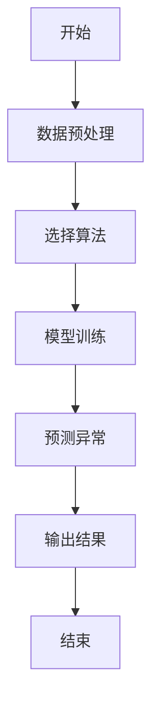
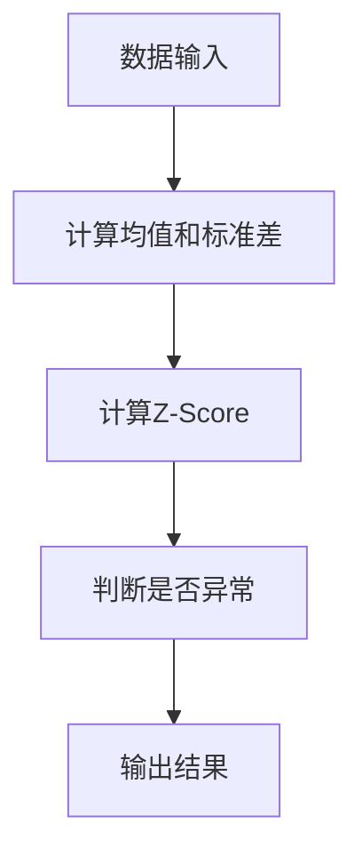
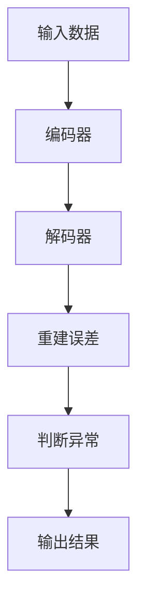
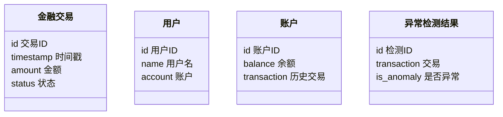
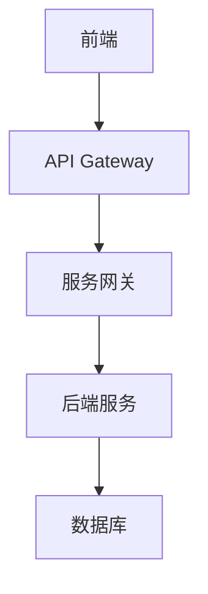
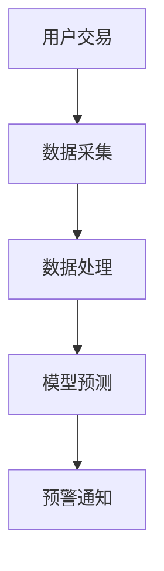

                 


# 异常检测算法在金融欺诈识别中的应用

> 关键词：异常检测，金融欺诈，机器学习，深度学习，数据挖掘

> 摘要：本文深入探讨了异常检测算法在金融欺诈识别中的应用，从基本概念到算法原理，再到系统设计和实际案例，系统地分析了如何利用异常检测技术有效识别金融欺诈行为，为金融行业的安全防护提供理论支持和实践指导。

---

## 第1章 异常检测与金融欺诈概述

### 1.1 异常检测的基本概念

#### 1.1.1 异常检测的定义
异常检测是指通过分析数据，识别出与预期模式或行为显著不同的数据点或事件的过程。在金融领域，异常检测主要用于识别潜在的欺诈行为、系统故障或异常交易。

#### 1.1.2 异常检测的核心目标
- 识别数据中的异常点
- 提供实时监控和预警
- 辅助决策者进行风险控制

#### 1.1.3 异常检测在金融领域的应用
- 信用卡欺诈检测
- 网络交易异常识别
- 账户行为分析

### 1.2 金融欺诈的定义与特征

#### 1.2.1 金融欺诈的定义
金融欺诈是指通过欺骗手段，非法获取或转移资金、资产或其他经济利益的行为。

#### 1.2.2 金融欺诈的主要类型
- 信用卡欺诈
- 网上银行欺诈
- 股票市场操纵

#### 1.2.3 金融欺诈的特征分析
- 隐蔽性：欺诈行为通常隐藏在正常交易中
- 瞬时性：欺诈行为可能在短时间内发生
- 多样性：欺诈手段多样化，难以预测

### 1.3 异常检测与金融欺诈的关系

#### 1.3.1 异常检测在金融欺诈识别中的作用
- 通过异常检测算法，快速识别潜在的欺诈交易
- 减少人工审核的工作量
- 提高欺诈检测的准确率

#### 1.3.2 异常检测技术的演进
从传统的统计方法到现代的机器学习和深度学习算法，异常检测技术不断进步，能够更精准地识别复杂的欺诈模式。

#### 1.3.3 金融欺诈识别的挑战与机遇
- 挑战：数据量大、噪声多、欺诈手段多样化
- 机遇：人工智能技术的发展为欺诈检测提供了更强大的工具

---

## 第2章 异常检测的核心概念与联系

### 2.1 异常检测的原理与方法

#### 2.1.1 基于统计的异常检测
- 使用统计指标（如均值、方差）来识别异常点
- 常用方法：Z-Score、标准差法

#### 2.1.2 基于机器学习的异常检测
- 使用监督学习或无监督学习算法（如随机森林、支持向量机）进行分类或聚类
- 适用于数据量大、特征复杂的场景

#### 2.1.3 基于深度学习的异常检测
- 使用神经网络（如Autoencoder、GAN）进行特征提取和异常识别
- 适用于高维数据和复杂模式识别

### 2.2 异常检测算法的对比分析

#### 2.2.1 算法类型对比
| 算法类型       | 适用场景               | 优缺点                     |
|----------------|------------------------|----------------------------|
| 基于统计       | 数据量小、特征明确       | 计算简单，但对复杂模式识别能力有限 |
| 基于机器学习   | 数据量较大、特征多样     | 准确率高，但需要大量标注数据 |
| 基于深度学习   | 高维数据、复杂模式       | 准确率高，但计算资源消耗大   |

#### 2.2.2 算法性能对比
- 统计方法计算效率高，但准确性较低
- 机器学习方法准确性高，但需要大量标注数据
- 深度学习方法准确性最高，但需要大量计算资源

#### 2.2.3 算法适用场景对比
| 算法类型       | 适用场景               |
|----------------|------------------------|
| 基于统计       | 小规模、简单场景         |
| 基于机器学习   | 中等规模、复杂场景       |
| 基于深度学习   | 大规模、高维数据场景     |

### 2.3 实体关系图与流程图

#### 2.3.1 实体关系图（ER图）
```mermaid
erd
    entity 金融交易 {
        id 交易ID
        timestamp 时间戳
        amount 金额
        status 状态
        user 用户
    }
    entity 用户 {
        id 用户ID
        name 用户名
        account 账户
    }
    entity 账户 {
        id 账户ID
        balance 余额
        transaction 历史交易
    }
    entity 异常检测结果 {
        id 检测ID
        transaction 交易
        is_anomaly 是否异常
    }
```

#### 2.3.2 异常检测流程图


---

## 第3章 异常检测算法的数学模型与公式

### 3.1 基于统计的异常检测

#### 3.1.1 Z-Score公式
$$ Z = \frac{X - \mu}{\sigma} $$
其中，$\mu$ 是均值，$\sigma$ 是标准差，$X$ 是数据点。

#### 3.1.2 算法流程图


### 3.2 基于机器学习的异常检测

#### 3.2.1 Isolation Forest算法
Isolation Forest是一种基于树结构的无监督异常检测算法，通过构建随机树将数据点隔离出来，判断是否为异常点。

#### 3.2.2 LOF算法
局部异常因子（LOF）通过计算数据点的局部密度来判断是否为异常点。

#### 3.2.3 算法实现代码示例
```python
from sklearn.ensemble import IsolationForest

# 初始化模型
model = IsolationForest(n_estimators=100, random_state=42)

# 训练模型
model.fit(X_train)

# 预测异常点
y_pred = model.predict(X_test)
```

### 3.3 基于深度学习的异常检测

#### 3.3.1 Autoencoder模型
Autoencoder是一种无监督学习模型，通过编码器和解码器结构来学习数据的低维表示，识别异常点。

#### 3.3.2 GAN模型
生成对抗网络（GAN）通过生成器和判别器的对抗训练，生成正常数据分布，识别异常点。

#### 3.3.3 算法流程图


---

## 第4章 系统分析与架构设计

### 4.1 金融欺诈识别系统场景

#### 4.1.1 系统目标
- 实时监控金融交易
- 自动识别异常交易
- 提供欺诈行为预警

#### 4.1.2 系统功能模块
- 数据采集模块：收集交易数据
- 数据处理模块：清洗和预处理数据
- 模型训练模块：训练异常检测模型
- 预警模块：实时检测异常交易并通知相关人员

### 4.2 系统架构设计

#### 4.2.1 领域模型类图


#### 4.2.2 系统架构图


### 4.3 接口与交互设计

#### 4.3.1 接口设计
- API接口：提供RESTful API，供前端调用
- 数据格式：JSON格式

#### 4.3.2 交互流程图


---

## 第5章 项目实战

### 5.1 环境安装

#### 5.1.1 安装Python环境
```bash
python --version
pip install --upgrade pip
```

#### 5.1.2 安装依赖库
```bash
pip install numpy pandas scikit-learn matplotlib
```

### 5.2 系统核心实现

#### 5.2.1 数据预处理
```python
import pandas as pd
import numpy as np

# 读取数据
data = pd.read_csv('transactions.csv')

# 去除缺失值
data = data.dropna()

# 标准化处理
from sklearn.preprocessing import StandardScaler
scaler = StandardScaler()
data_scaled = scaler.fit_transform(data)
```

#### 5.2.2 模型训练
```python
from sklearn.ensemble import IsolationForest

# 初始化模型
model = IsolationForest(n_estimators=100, random_state=42)

# 训练模型
model.fit(data_scaled)

# 预测异常点
y_pred = model.predict(data_scaled)
```

### 5.3 案例分析

#### 5.3.1 数据可视化
```python
import matplotlib.pyplot as plt

# 绘制交易金额分布图
plt.hist(data['amount'], bins=50)
plt.show()
```

#### 5.3.2 模型评估
```python
from sklearn.metrics import confusion_matrix, accuracy_score

# 计算混淆矩阵
cm = confusion_matrix(y_true, y_pred)
print(cm)

# 计算准确率
acc = accuracy_score(y_true, y_pred)
print(f'准确率: {acc}')
```

---

## 第6章 最佳实践与总结

### 6.1 最佳实践 tips
- 数据预处理是关键，确保数据质量
- 选择合适的算法，根据数据量和场景进行调整
- 定期更新模型，适应新的欺诈手段

### 6.2 小结
异常检测算法在金融欺诈识别中具有重要应用，通过合理选择算法和优化系统架构，可以有效降低欺诈风险，保护金融资产的安全。

### 6.3 注意事项
- 数据隐私保护
- 模型解释性
- 实时性与效率

### 6.4 拓展阅读
- 《异常检测：算法与应用》
- 《金融风险管理》
- 《深度学习在金融中的应用》

---

以上是《异常检测算法在金融欺诈识别中的应用》的完整目录和内容框架，涵盖了从理论到实践的各个方面，为读者提供了全面的知识体系。

