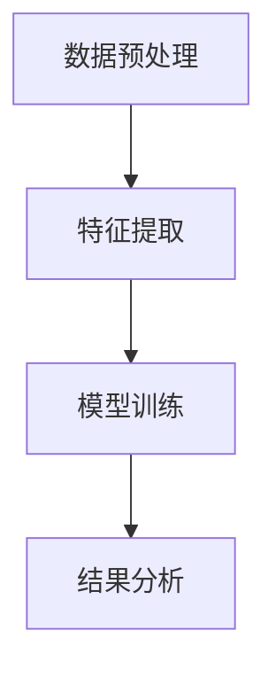

                 


# 异常检测：识别AI Agent的非正常行为

**关键词**：异常检测、AI Agent、行为分析、机器学习、数据挖掘

**摘要**：本文深入探讨了异常检测在识别AI Agent非正常行为中的应用。通过分析AI Agent的行为模式，结合统计学和机器学习方法，提出了有效的异常检测策略，旨在帮助技术从业者理解和实现AI Agent的异常检测系统。

---

# 异常检测：识别AI Agent的非正常行为

## 引言

随着AI Agent技术的快速发展，识别其非正常行为变得至关重要。本文将逐步分析异常检测的核心概念、算法原理和系统架构，帮助读者深入了解如何检测AI Agent的异常行为。

---

## 第一部分: 异常检测的背景与核心概念

### 1.1 异常检测的背景

#### 1.1.1 从传统安全到AI Agent的安全挑战
传统安全依赖规则，而AI Agent的异常行为复杂，需要新的检测方法。

#### 1.1.2 AI Agent的定义与行为模式
AI Agent通过感知和决策执行任务，其行为模式多样。

#### 1.1.3 异常检测在AI Agent中的重要性
及时检测异常行为，保障系统安全和用户体验。

### 1.2 异常检测的核心问题

#### 1.2.1 异常检测的定义与目标
识别偏离预期的行为，帮助系统采取措施。

#### 1.2.2 AI Agent异常行为的分类
分为数据异常、行为异常和逻辑异常三类。

#### 1.2.3 异常检测的挑战与意义
挑战包括数据稀疏性和模型可解释性，意义在于提升系统安全性和用户体验。

---

## 第二部分: 异常检测的核心概念与联系

### 2.1 异常检测的核心概念

#### 2.1.1 异常检测的原理
基于数据分布的偏离来识别异常。

#### 2.1.2 异常检测的关键属性
包括实时性、可扩展性和可解释性。

#### 2.1.3 异常检测的度量标准
使用精确率、召回率和F1值评估性能。

### 2.2 异常检测的核心要素对比

#### 2.2.1 统计方法与机器学习方法对比
| 方法 | 描述 | 优缺点 |
|------|------|--------|
| 统计方法 | 基于概率分布 | 简单但难以处理复杂数据 |
| 机器学习方法 | 基于数据特征 | 高精度但需要大量数据 |

#### 2.2.2 基于规则与基于模型的方法对比
| 方法 | 描述 | 优缺点 |
|------|------|--------|
| 基于规则 | 使用预定义规则 | 易实现但规则难以覆盖所有情况 |
| 基于模型 | 使用机器学习模型 | 高精度但模型复杂 |

#### 2.2.3 监督学习与无监督学习的对比
监督学习需要标记数据，无监督学习无需标记，适用于无标签数据。

### 2.3 异常检测的ER实体关系图

```mermaid
er
    entity 异常检测系统 {
        id: 唯一标识符
        检测数据: 数据特征向量
        异常评分: 数值评分
        检测时间: 时间戳
        检测结果: 异常/正常
    }
    entity AI Agent行为 {
        id: 唯一标识符
        行为数据: 用户操作记录
        行为特征: 特征向量
        行为时间: 时间戳
        行为类型: 正常/异常
    }
    entity 异常检测模型 {
        id: 唯一标识符
        模型类型: 统计/机器学习
        模型参数: 参数集合
        训练数据: 训练样本
    }
    e
```

---

## 第三部分: 异常检测的算法原理

### 3.1 基于统计的异常检测方法

#### 3.1.1 Grubbs检验
用于检测数据中的异常值。

#### 3.1.2 Z-Score方法
计算数据点与均值的距离。

### 3.2 基于机器学习的异常检测方法

#### 3.2.1 Isolation Forest算法
用于无监督学习，隔离异常样本。

#### 3.2.2 One-Class SVM
用于估计数据分布，识别异常点。

### 3.3 异常检测的数学模型

#### 3.3.1 统计模型
均值和标准差的计算：
$$ \mu = \frac{1}{n}\sum_{i=1}^{n}x_i $$
$$ \sigma = \sqrt{\frac{1}{n-1}\sum_{i=1}^{n}(x_i - \mu)^2} $$

#### 3.3.2 机器学习模型
使用随机森林进行异常检测，通过特征重要性识别异常行为。

---

## 第四部分: 异常检测的系统分析与架构设计

### 4.1 系统架构设计

#### 4.1.1 系统功能模块
数据预处理、特征提取、模型训练和结果分析。

#### 4.1.2 系统架构图


---

## 第五部分: 异常检测的项目实战

### 5.1 项目环境与工具安装

#### 5.1.1 环境要求
Python 3.8以上版本，安装sklearn、numpy、pandas库。

#### 5.1.2 数据收集
从日志文件中提取行为数据。

### 5.2 异常检测模型实现

#### 5.2.1 数据预处理
处理缺失值和标准化数据。

#### 5.2.2 特征提取
提取用户行为特征，如时间间隔和操作频率。

#### 5.2.3 模型训练
使用Isolation Forest算法训练模型。

#### 5.2.4 结果分析
解读模型输出的异常评分，判断是否异常。

### 5.3 实际案例分析

#### 5.3.1 案例背景
检测用户登录行为中的异常。

#### 5.3.2 数据分析
分析登录时间分布，发现异常登录行为。

---

## 第六部分: 异常检测的最佳实践与小结

### 6.1 最佳实践

#### 6.1.1 数据质量
确保数据完整性和准确性。

#### 6.1.2 模型可解释性
选择易于解释的模型，便于问题排查。

### 6.2 小结

异常检测是保障AI Agent安全的重要手段，结合统计和机器学习方法，能够有效识别非正常行为，提升系统安全性和用户体验。

---

## 参考文献

1. 异常检测的经典论文
2. 相关技术书籍
3. 开源项目文档

---

通过以上步骤，我们系统地分析了异常检测在识别AI Agent非正常行为中的应用，帮助读者掌握相关技术并应用于实际场景。

