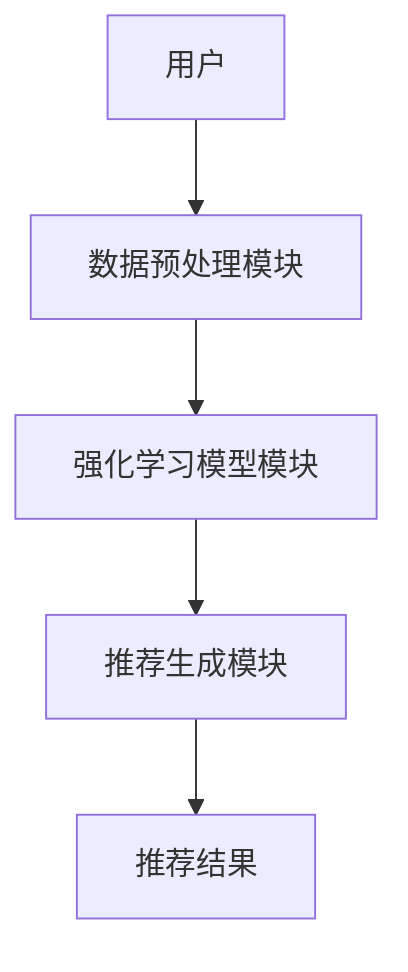
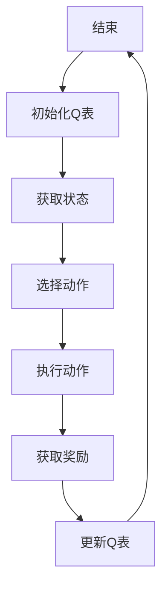
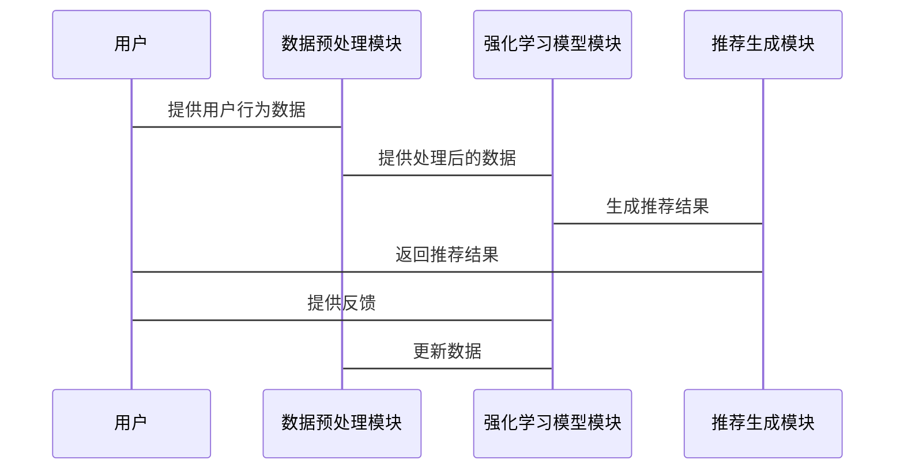

                 


# 《强化学习在AI Agent个性化推荐中的应用》

> 关键词：强化学习，AI Agent，个性化推荐，推荐系统，马尔可夫决策过程

> 摘要：本文深入探讨了强化学习在AI Agent个性化推荐中的应用，结合数学模型、算法原理和系统架构设计，详细介绍了如何利用强化学习提升推荐系统的个性化和实时性。

---

# 第1章: 强化学习与AI Agent基础

## 1.1 强化学习的基本概念

### 1.1.1 强化学习的起源与定义

强化学习（Reinforcement Learning, RL）是一种机器学习范式，其核心思想是通过智能体与环境的交互，逐步学习策略以最大化累积奖励。强化学习的起源可以追溯到20世纪50年代，但真正的发展始于20世纪90年代，随着Q-learning算法的提出，强化学习开始在学术界和工业界得到广泛关注。

### 1.1.2 强化学习的核心要素

强化学习的核心要素包括：

- **状态（State）**：智能体所处的环境状态，表示当前的环境信息。
- **动作（Action）**：智能体在给定状态下选择的一个行为。
- **奖励（Reward）**：智能体执行动作后，环境给予的反馈，表示该动作的好坏程度。
- **策略（Policy）**：智能体在给定状态下选择动作的概率分布，表示如何根据当前状态选择动作。
- **值函数（Value Function）**：衡量从当前状态出发，按照策略执行后所能获得的期望奖励。

### 1.1.3 强化学习与监督学习的区别

强化学习与监督学习的主要区别在于数据来源和反馈机制：

- **监督学习**：基于标记的训练数据，学习函数或决策边界。
- **强化学习**：通过与环境交互，逐步学习策略，基于累积奖励进行优化。

## 1.2 AI Agent的基本概念

### 1.2.1 AI Agent的定义与特点

AI Agent（智能体）是指能够感知环境、自主决策并采取行动的实体。AI Agent的特点包括：

- **自主性**：能够在没有外部干预的情况下自主决策。
- **反应性**：能够根据环境反馈实时调整行为。
- **学习能力**：能够通过经验改进自身的决策策略。

### 1.2.2 AI Agent的分类与应用场景

AI Agent可以根据智能性分为：

- **反应式Agent**：基于当前感知做出反应，不依赖历史信息。
- **认知式Agent**：具备复杂推理和规划能力，能够处理复杂任务。

### 1.2.3 AI Agent与强化学习的结合

强化学习为AI Agent提供了学习策略的框架，使其能够在动态环境中自适应调整行为。强化学习通过最大化累积奖励，帮助AI Agent在与环境的交互中不断优化决策。

## 1.3 个性化推荐系统的背景与挑战

### 1.3.1 个性化推荐的定义与目标

个性化推荐系统的目标是根据用户的偏好和行为，推荐与之相关的物品（如电影、音乐、商品等）。个性化推荐的核心目标是提高用户满意度和系统的推荐效率。

### 1.3.2 传统推荐系统的问题与局限

传统推荐系统主要基于协同过滤或内容推荐，存在以下问题：

- **数据稀疏性**：用户行为数据不足导致推荐精度下降。
- **实时性差**：难以实时更新推荐结果以适应用户行为变化。
- **冷启动问题**：新用户或新物品难以快速获得准确推荐。

### 1.3.3 强化学习在推荐系统中的优势

强化学习通过与用户的实时交互，动态调整推荐策略，能够有效解决传统推荐系统的局限性。强化学习的实时性和自适应性使其成为个性化推荐的理想选择。

## 1.4 本章小结

本章介绍了强化学习的基本概念和AI Agent的定义，分析了个性化推荐系统的背景和挑战，并探讨了强化学习在推荐系统中的优势。

---

# 第2章: 强化学习的核心概念与数学模型

## 2.1 强化学习的基本原理

### 2.1.1 状态、动作、奖励的关系

状态表示智能体所处的环境，动作是智能体在给定状态下的行为选择，奖励是对动作的反馈。强化学习的目标是通过不断试错，找到使累积奖励最大的策略。

### 2.1.2 马尔可夫决策过程（MDP）模型

马尔可夫决策过程（MDP）是强化学习的核心模型，定义了智能体与环境的交互过程。MDP由以下五个元组组成：

$$
MDP = \langle S, A, P, R, \gamma \rangle
$$

其中：
- $S$：状态空间
- $A$：动作空间
- $P$：状态转移概率
- $R$：奖励函数
- $\gamma$：折扣因子

### 2.1.3 Q-learning算法的基本原理

Q-learning是一种基于值函数的强化学习算法，通过学习Q值函数（状态-动作对的期望奖励）来优化策略。Q值的更新公式为：

$$
Q(s, a) \leftarrow Q(s, a) + \alpha \left[r + \gamma \max_{a'} Q(s', a') - Q(s, a)\right]
$$

其中：
- $\alpha$：学习率
- $\gamma$：折扣因子

### 2.1.4 Deep Q-Network（DQN）的原理

Deep Q-Network通过神经网络近似Q值函数，能够处理高维状态空间。DQN的核心思想是通过经验回放和目标网络来稳定学习过程。

### 2.1.5 策略梯度方法的数学表达

策略梯度方法直接优化策略，通过计算梯度更新参数。策略梯度的梯度公式为：

$$
\nabla \theta \leftarrow \frac{1}{N} \sum_{i=1}^{N} \nabla \log \pi_{\theta}(a|s) \cdot Q(s, a)
$$

---

## 2.2 马尔可夫决策过程（MDP）模型

### 2.2.1 MDP的定义与组成部分

马尔可夫决策过程由状态空间、动作空间、状态转移概率、奖励函数和折扣因子组成。状态空间和动作空间可以是离散的或连续的，状态转移概率描述了当前状态和动作下转移到下一个状态的概率。

### 2.2.2 状态转移概率与价值函数的数学表达

状态转移概率矩阵$P(s'|s,a)$表示从状态$s$执行动作$a$后转移到状态$s'$的概率。价值函数$V(s)$表示从状态$s$出发按照策略$\pi$所能获得的期望奖励。

### 2.2.3 动作选择的策略优化

策略优化的目标是找到使累积奖励最大的策略。策略优化可以通过值函数迭代或直接优化策略来实现。

---

## 2.3 强化学习的数学公式

### 2.3.1 Q-learning算法的数学模型

Q-learning的更新公式为：

$$
Q(s, a) \leftarrow Q(s, a) + \alpha \left[r + \gamma \max_{a'} Q(s', a') - Q(s, a)\right]
$$

### 2.3.2 Deep Q-Network（DQN）的数学推导

DQN通过神经网络近似Q值函数，经验回放和目标网络的引入使得学习更加稳定。

### 2.3.3 策略梯度方法的数学表达

策略梯度方法通过计算梯度更新参数，公式为：

$$
\nabla \theta \leftarrow \frac{1}{N} \sum_{i=1}^{N} \nabla \log \pi_{\theta}(a|s) \cdot Q(s, a)
$$

---

## 2.4 本章小结

本章详细讲解了强化学习的核心概念和数学模型，包括Q-learning算法、Deep Q-Network和策略梯度方法的数学推导。

---

# 第3章: 强化学习在推荐系统中的应用

## 3.1 基于强化学习的推荐系统框架

### 3.1.1 系统输入与输出的定义

基于强化学习的推荐系统输入包括用户历史行为、物品属性等，输出是推荐的物品列表。

### 3.1.2 状态、动作、奖励的定义与设计

- **状态**：用户当前的行为和偏好。
- **动作**：推荐具体的物品。
- **奖励**：用户对推荐物品的反馈，如点击、购买等。

### 3.1.3 推荐系统的反馈机制

基于强化学习的推荐系统通过用户的反馈不断优化推荐策略。

---

## 3.2 强化学习在推荐系统中的核心算法

### 3.2.1 Q-Learning算法在推荐系统中的应用

Q-Learning算法通过不断更新Q值函数，找到使累积奖励最大的推荐策略。

### 3.2.2 Deep Q-Network（DQN）在推荐系统中的实现

DQN通过神经网络近似Q值函数，能够处理高维状态空间。

### 3.2.3 Actor-Critic架构在推荐系统中的应用

Actor-Critic架构通过同时学习策略和价值函数，实现更高效的策略优化。

---

## 3.3 基于强化学习的推荐系统的优缺点

### 3.3.1 优点：个性化与实时性

强化学习能够实时更新推荐策略，提供个性化的推荐结果。

### 3.3.2 缺点：计算复杂度与冷启动问题

强化学习算法的计算复杂度较高，且在冷启动问题上仍需进一步研究。

---

## 3.4 本章小结

本章探讨了强化学习在推荐系统中的应用，介绍了几种经典的强化学习算法，并分析了其优缺点。

---

# 第4章: 强化学习算法的数学模型与公式

## 4.1 Q-Learning算法的数学推导

Q-Learning算法通过不断更新Q值函数，找到使累积奖励最大的策略。其数学公式为：

$$
Q(s, a) \leftarrow Q(s, a) + \alpha \left[r + \gamma \max_{a'} Q(s', a') - Q(s, a)\right]
$$

---

## 4.2 Deep Q-Network（DQN）的数学推导

DQN通过神经网络近似Q值函数，引入经验回放和目标网络来稳定学习过程。其数学公式为：

$$
\hat{Q}(s, a) \leftarrow Q(s, a) + \alpha \left[r + \gamma \max_{a'} Q(s', a') - Q(s, a)\right]
$$

---

## 4.3 策略梯度方法的数学推导

策略梯度方法通过计算梯度更新参数，公式为：

$$
\nabla \theta \leftarrow \frac{1}{N} \sum_{i=1}^{N} \nabla \log \pi_{\theta}(a|s) \cdot Q(s, a)
$$

---

## 4.4 本章小结

本章详细推导了强化学习算法的数学模型，包括Q-Learning、DQN和策略梯度方法的数学公式。

---

# 第5章: 系统架构设计与实现

## 5.1 系统模块划分

基于强化学习的推荐系统主要包括以下模块：

- **数据预处理模块**：对用户行为数据和物品属性数据进行预处理。
- **强化学习模型模块**：实现强化学习算法，更新推荐策略。
- **推荐生成模块**：根据优化后的策略生成推荐结果。

### 5.1.1 数据预处理模块

数据预处理包括数据清洗、特征提取和数据格式转换。

### 5.1.2 强化学习模型模块

强化学习模型模块实现具体的强化学习算法，如Q-Learning或DQN。

### 5.1.3 推荐生成模块

推荐生成模块根据优化后的策略生成最终的推荐结果。

---

## 5.2 系统架构设计

### 5.2.1 系统功能设计

系统功能包括用户行为收集、推荐策略优化和推荐结果生成。

### 5.2.2 系统架构图

以下是基于强化学习的推荐系统架构图：



---

## 5.3 系统交互设计

### 5.3.1 用户与系统的交互流程

用户输入行为，系统生成推荐结果，用户反馈用于优化推荐策略。

### 5.3.2 推荐系统的反馈机制

系统根据用户反馈调整推荐策略，以提高推荐的准确性和相关性。

---

## 5.4 本章小结

本章详细设计了基于强化学习的推荐系统的架构，包括模块划分、系统功能设计和交互流程。

---

# 第6章: 项目实战——基于强化学习的电影推荐系统

## 6.1 项目背景与目标

本项目旨在通过强化学习实现一个个性化的电影推荐系统，目标是提高用户的推荐满意度。

---

## 6.2 项目环境与工具安装

### 6.2.1 环境配置

- **Python**：3.8及以上版本
- **TensorFlow**或**Keras**：用于神经网络实现
- **Scikit-learn**：用于数据预处理和评估

---

## 6.3 系统核心实现

### 6.3.1 数据预处理

```python
import pandas as pd
import numpy as np

# 加载数据
data = pd.read_csv('movies.csv')

# 数据清洗
data.dropna(inplace=True)

# 特征提取
from sklearn.preprocessing import StandardScaler
scaler = StandardScaler()
scaled_data = scaler.fit_transform(data[['rating', 'year']])
```

### 6.3.2 强化学习模型实现

```python
class DQN:
    def __init__(self, state_dim, action_dim):
        self.state_dim = state_dim
        self.action_dim = action_dim
        self.model = self.build_model()

    def build_model(self):
        from tensorflow.keras import layers
        model = layers.Sequential([
            layers.Dense(64, activation='relu', input_dim=self.state_dim),
            layers.Dense(self.action_dim, activation='linear')
        ])
        return model

    def remember(self, state, action, reward, next_state):
        # 经验回放
        pass

    def act(self, state):
        # 动作选择
        pass

    def update(self, batch):
        # 模型更新
        pass
```

### 6.3.3 推荐结果生成

```python
def generate_recommendations(user_id):
    # 获取用户状态
    state = get_state(user_id)
    # 动作选择
    action = dqn.act(state)
    # 生成推荐结果
    recommendation = actions_to_items[action]
    return recommendation
```

---

## 6.4 项目评估与优化

### 6.4.1 评估指标

- **准确率**：推荐结果与用户实际兴趣的匹配程度。
- **召回率**：推荐结果覆盖用户兴趣的比例。
- **F1分数**：准确率和召回率的调和平均数。

### 6.4.2 算法优化

- **超参数调整**：学习率、折扣因子等参数的优化。
- **网络结构优化**：调整神经网络的层数和节点数。

---

## 6.5 本章小结

本章通过一个具体的电影推荐系统案例，详细讲解了强化学习在推荐系统中的实现过程，包括数据预处理、模型训练和结果生成。

---

# 第7章: 最佳实践与总结

## 7.1 最佳实践

### 7.1.1 数据质量的重要性

高质量的数据是强化学习推荐系统的基础，需要进行充分的数据清洗和特征工程。

### 7.1.2 算法选择的注意事项

根据具体场景选择合适的强化学习算法，如Q-Learning或DQN。

### 7.1.3 系统优化技巧

通过经验回放和目标网络优化DQN的训练过程，提高学习效率。

---

## 7.2 项目总结

基于强化学习的推荐系统通过实时交互和动态调整策略，能够有效提高推荐的个性化和准确率。然而，仍需进一步研究如何解决冷启动问题和优化算法的计算复杂度。

---

## 7.3 未来研究方向

- **多目标优化**：在复杂场景下实现多目标的协同优化。
- **强化学习与知识图谱的结合**：利用知识图谱提升推荐的准确性和可解释性。
- **强化学习的可解释性**：研究如何提高强化学习推荐系统的可解释性。

---

## 7.4 注意事项

- **数据隐私**：在处理用户数据时，需要注意数据隐私保护。
- **计算资源**：强化学习算法对计算资源要求较高，需要充足的硬件支持。
- **反馈机制**：设计合理的反馈机制，确保系统的实时性和准确性。

---

## 7.5 拓展阅读

- **《Deep Reinforcement Learning》**：深入学习强化学习的核心思想和算法。
- **《Reinforcement Learning: Theory and Algorithms》**：系统介绍强化学习的理论和算法。

---

## 7.6 本章小结

本章总结了基于强化学习的推荐系统的实现过程，并提出了未来的研究方向和注意事项。

---

# 附录

## 附录A: 强化学习算法的代码实现

```python
# Q-Learning算法实现
class QLearning:
    def __init__(self, state_space, action_space):
        self.state_space = state_space
        self.action_space = action_space
        self.Q = np.zeros((state_space, action_space))

    def act(self, state):
        return np.argmax(self.Q[state])

    def update(self, state, action, reward, next_state):
        alpha = 0.1
        gamma = 0.9
        self.Q[state][action] += alpha * (reward + gamma * np.max(self.Q[next_state]) - self.Q[state][action])
```

---

## 附录B: 系统架构的ER图

```mermaid
erDiagram
    用户 --> 数据预处理模块
    数据预处理模块 --> 强化学习模型模块
    强化学习模型模块 --> 推荐生成模块
    推荐生成模块 --> 推荐结果
```

---

## 附录C: 算法流程图



---

## 附录D: 系统交互序列图



---

# 参考文献

- [1] Sutton, R. S., & Barto, A. G. (2018). Reinforcement learning: An introduction.
- [2] Mnih, V., et al. (2015). Human-level control through deep reinforcement learning.
- [3] LeCun, Y., Bengio, Y., & Hinton, G. (2015). Deep learning.

---

# 结语

通过本文的深入探讨，我们了解了强化学习在AI Agent个性化推荐中的应用，从基本概念到算法实现，再到系统设计和项目实战，为读者提供了一个全面的学习路径。未来的研究方向和实际应用将为这一领域带来更多的创新和突破。

--- 

> 如果您觉得上述内容有帮助，欢迎点赞、收藏、分享、关注！
> 您的鼓励是我持续创作的最大动力！
> 感谢您的支持！

