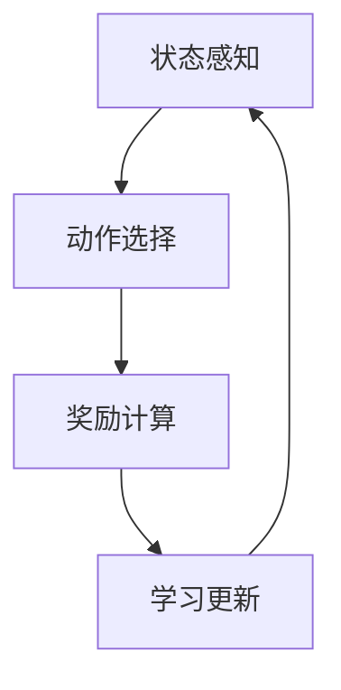
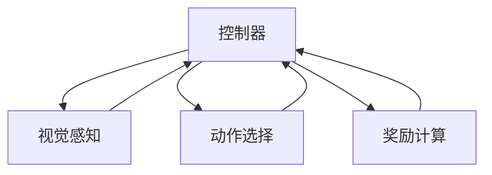
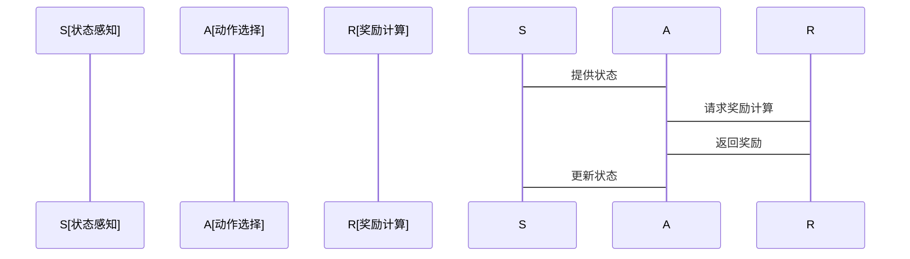

                 


# 强化学习在AI Agent交互式学习中的应用

---

## 关键词
- 强化学习
- AI Agent
- 交互式学习
- Q-learning
- 深度强化学习
- 系统架构

---

## 摘要
本文探讨了强化学习在AI Agent交互式学习中的应用，从基本概念到算法原理，再到系统架构和项目实战，详细分析了强化学习如何助力AI Agent在复杂环境中的智能决策。文章首先介绍了强化学习和AI Agent的基本概念，然后深入讲解了Q-learning和Deep Q-Network (DQN)等核心算法，接着分析了AI Agent的设计与实现，最后通过实际案例展示了强化学习在交互式学习中的应用，并总结了相关经验与未来发展方向。

---

# 第1章: 强化学习与AI Agent概述

## 1.1 强化学习的基本概念

### 1.1.1 强化学习的定义与特点
强化学习（Reinforcement Learning, RL）是一种机器学习范式，通过智能体（Agent）与环境的交互来学习最优策略。与监督学习和无监督学习不同，强化学习通过奖励机制来指导智能体的学习过程，智能体在尝试不同的动作后，通过接收的奖励信号来调整策略，以最大化累积奖励。

**特点：**
- **自主性**：智能体在没有明确指导的情况下，通过试错学习。
- **交互性**：智能体与环境之间存在实时交互。
- **延迟性**：奖励可能在多个动作之后才给出，导致学习过程具有延迟性。

### 1.1.2 AI Agent的基本概念
AI Agent是指在环境中能够感知并自主行动以实现目标的智能实体。Agent可以是软件程序、机器人或其他智能系统，通过与环境交互，Agent能够做出决策并执行动作。

**核心要素：**
- **感知**：通过传感器或接口获取环境信息。
- **决策**：基于感知信息做出最优动作的选择。
- **行动**：执行决策的动作，影响环境状态。

### 1.1.3 强化学习与AI Agent的关系
强化学习为AI Agent提供了一种有效的学习框架，使Agent能够在动态和不确定的环境中通过试错学习来优化其行为策略。强化学习的核心是通过奖励机制引导Agent的学习过程，使其逐步逼近最优决策。

---

## 1.2 强化学习的核心概念

### 1.2.1 状态、动作、奖励的定义
在强化学习中，环境的状态（State）表示当前环境的状况，动作（Action）是Agent采取的行动，奖励（Reward）是对动作的反馈，用于指导学习过程。

**数学表示：**
- 状态空间：S，表示所有可能的状态。
- 动作空间：A，表示所有可能的动作。
- 奖励函数：R(s, a)，表示在状态s下采取动作a后获得的奖励。

### 1.2.2 Q值函数与策略的定义
Q值函数（Q-learning）表示在状态s下采取动作a后的预期累积奖励。策略（Policy）是一个概率分布，描述在状态s下采取动作a的概率。

**数学表示：**
- Q(s, a) = max_{a'} Q(s', a')
- π(a|s) = P(选择动作a | 状态s)

### 1.2.3 马尔可夫决策过程（MDP）
马尔可夫决策过程是一种数学框架，描述了强化学习中的决策过程。MDP由以下五个要素组成：
- 状态空间S
- 动作空间A
- 转移概率P
- 奖励函数R
- 折扣因子γ

---

## 1.3 强化学习的应用场景

### 1.3.1 游戏AI
强化学习在游戏AI中的应用非常广泛，例如在棋类游戏中（如国际象棋、围棋）通过强化学习训练AI Agent实现超人水平。

### 1.3.2 机器人控制
强化学习可以用于机器人运动控制，例如路径规划、抓取物体等任务。

### 1.3.3 自动驾驶
强化学习在自动驾驶中的应用主要体现在路径规划和决策控制方面，帮助车辆在复杂交通环境中做出最优决策。

---

## 1.4 本章小结
本章介绍了强化学习和AI Agent的基本概念，分析了强化学习的核心概念和应用场景，为后续章节的学习奠定了基础。

---

# 第2章: 强化学习算法基础

## 2.1 Q-learning算法

### 2.1.1 Q-learning的基本原理
Q-learning是一种基于值函数的强化学习算法，通过更新Q值函数来学习最优策略。Q值函数表示在状态s下采取动作a后的预期累积奖励。

**算法步骤：**
1. 初始化Q表为零。
2. 在环境中选择一个动作a。
3. 执行动作a，观察新的状态s'。
4. 计算奖励R(s, a)。
5. 更新Q(s, a) = Q(s, a) + α [R + γ max Q(s', a') - Q(s, a)]。

**数学公式：**
$$ Q(s, a) \leftarrow Q(s, a) + \alpha \left[ R + \gamma \max_{a'} Q(s', a') - Q(s, a) \right] $$

### 2.1.2 Q-learning的数学模型
Q-learning的数学模型可以通过动态规划的方法更新Q值函数，最终收敛到最优策略。

### 2.1.3 Q-learning的收敛性分析
Q-learning在离散状态和动作空间下具有收敛性，能够在有限步数内找到最优策略。

---

## 2.2 Deep Q-Network (DQN)算法

### 2.2.1 DQN的基本原理
DQN通过使用深度神经网络近似Q值函数，解决了Q-learning在高维状态空间中的计算问题。

**算法步骤：**
1. 初始化两个神经网络Q和Q'。
2. 在环境中选择一个动作a。
3. 执行动作a，观察新的状态s'。
4. 计算奖励R(s, a)。
5. 更新Q(s, a) = Q(s, a) + α [R + γ Q'(s', a') - Q(s, a)]。
6. 偶尔更新Q'为当前Q的值。

**数学公式：**
$$ Q(s, a) \leftarrow Q(s, a) + \alpha \left[ R + \gamma Q'(s', a') - Q(s, a) \right] $$

### 2.2.2 DQN的网络结构
DQN通常使用卷积神经网络（CNN）来处理高维输入，例如图像。

### 2.2.3 DQN的训练过程
DQN通过经验回放和目标网络来稳定训练过程，避免梯度消失和震荡问题。

---

## 2.3 策略梯度方法

### 2.3.1 策略梯度的基本原理
策略梯度方法直接优化策略，通过梯度上升方法最大化累积奖励。

**数学公式：**
$$ \nabla \theta \leftarrow \nabla J(\theta) $$

### 2.3.2 策略梯度的数学模型
策略梯度方法通过计算梯度来更新策略参数，最终找到最优策略。

### 2.3.3 策略梯度的收敛性分析
策略梯度方法在连续动作空间中具有较好的收敛性，适用于复杂的任务。

---

## 2.4 本章小结
本章详细讲解了Q-learning和DQN等强化学习算法的基本原理和数学模型，分析了它们的优缺点和应用场景。

---

# 第3章: AI Agent的设计与实现

## 3.1 状态表示

### 3.1.1 状态空间的定义
状态表示是AI Agent设计的关键部分，需要根据具体任务选择合适的状态表示方法。

### 3.1.2 状态表示的方法
- 基于特征的方法：提取关键特征表示状态。
- 基于神经网络的方法：使用CNN或RNN表示状态。

### 3.1.3 状态空间的维度性分析
状态空间的维度决定了AI Agent的学习难度，维度越高，学习越复杂。

---

## 3.2 动作选择

### 3.2.1 动作空间的定义
动作选择是AI Agent的核心决策过程，需要根据当前状态选择最优动作。

### 3.2.2 动作选择的策略
- 基于Q值函数的策略：选择Q值最大的动作。
- 基于概率的策略：根据策略分布选择动作。

### 3.2.3 动作选择的优化方法
通过优化奖励机制和策略，提高动作选择的效率和准确性。

---

## 3.3 奖励机制

### 3.3.1 奖励函数的设计
奖励函数的设计直接影响AI Agent的学习效果，需要根据任务目标进行调整。

### 3.3.2 奖励函数的优化
通过实验和评估，不断优化奖励函数，使其更好地引导学习过程。

### 3.3.3 奖励机制的评估方法
评估奖励机制的有效性，确保其能够引导AI Agent学习到最优策略。

---

## 3.4 本章小结
本章详细讲解了AI Agent设计中的状态表示、动作选择和奖励机制，分析了它们在强化学习中的重要作用。

---

# 第4章: 强化学习在交互式学习中的应用

## 4.1 交互式学习的基本原理

### 4.1.1 交互式学习的定义
交互式学习是一种通过人与机器之间的互动来提升学习效果的方法。

### 4.1.2 交互式学习的优缺点
- **优点**：提升学习效果，增强用户体验。
- **缺点**：需要设计复杂的交互逻辑，增加开发难度。

### 4.1.3 交互式学习的应用场景
- 教育领域：个性化教学。
- 游戏领域：提升玩家体验。
- 推荐系统：优化用户推荐效果。

---

## 4.2 强化学习在交互式学习中的作用

### 4.2.1 强化学习在交互式学习中的核心作用
强化学习通过试错机制，优化AI Agent的交互策略，提升交互效果。

### 4.2.2 强化学习在交互式学习中的具体应用
- 教育领域：自适应教学系统。
- 游戏领域：智能NPC设计。
- 推荐系统：动态推荐策略。

---

## 4.3 本章小结
本章分析了强化学习在交互式学习中的应用，展示了强化学习如何通过优化交互策略提升学习效果。

---

# 第5章: 系统架构设计与实现

## 5.1 系统功能设计

### 5.1.1 系统功能模块
- 状态感知模块：感知环境状态。
- 动作选择模块：选择最优动作。
- 奖励机制模块：计算奖励值。

### 5.1.2 系统功能流程
通过mermaid流程图展示系统的功能流程。



## 5.2 系统架构设计

### 5.2.1 系统架构设计
通过mermaid架构图展示系统的架构设计。



## 5.3 系统接口设计

### 5.3.1 系统接口定义
- 状态感知接口：提供当前环境状态。
- 动作选择接口：接收动作选择请求，返回选择的动作。
- 奖励计算接口：根据状态和动作计算奖励值。

### 5.3.2 系统交互流程
通过mermaid序列图展示系统的交互流程。



---

## 5.4 本章小结
本章详细讲解了系统架构设计与实现，展示了强化学习在AI Agent中的具体应用。

---

# 第6章: 项目实战——AI Agent实现

## 6.1 环境配置

### 6.1.1 环境安装
安装必要的开发工具和库，例如Python、TensorFlow、OpenAI Gym等。

### 6.1.2 环境配置
配置开发环境，确保所有依赖项安装正确。

## 6.2 核心实现

### 6.2.1 状态感知模块
实现状态感知功能，例如通过传感器获取环境信息。

### 6.2.2 动作选择模块
实现动作选择功能，例如基于Q-learning算法选择最优动作。

### 6.2.3 奖励机制模块
实现奖励计算功能，例如根据状态和动作计算奖励值。

## 6.3 代码实现

### 6.3.1 Q-learning算法实现
以下是Q-learning算法的Python实现示例：

```python
import numpy as np

class QLearning:
    def __init__(self, state_space, action_space, alpha=0.1, gamma=0.9):
        self.state_space = state_space
        self.action_space = action_space
        self.alpha = alpha
        self.gamma = gamma
        self.Q = np.zeros((state_space, action_space))

    def choose_action(self, state):
        return np.argmax(self.Q[state])

    def update_Q(self, state, action, reward, next_state):
        self.Q[state, action] += self.alpha * (reward + self.gamma * np.max(self.Q[next_state]) - self.Q[state, action])

    # 其他辅助方法...
```

### 6.3.2 DQN算法实现
以下是DQN算法的Python实现示例：

```python
import numpy as np
import tensorflow as tf

class DQN:
    def __init__(self, state_dim, action_dim, epsilon=0.1):
        self.state_dim = state_dim
        self.action_dim = action_dim
        self.epsilon = epsilon
        self.main_network = self.build_network()
        self.target_network = self.build_network()
        self.update_target_network()

    def build_network(self):
        model = tf.keras.Sequential()
        model.add(tf.keras.layers.Dense(64, activation='relu'))
        model.add(tf.keras.layers.Dense(self.action_dim, activation='linear'))
        return model

    def update_target_network(self):
        self.target_network.set_weights(self.main_network.get_weights())

    def choose_action(self, state):
        if np.random.random() < self.epsilon:
            return np.random.randint(self.action_dim)
        else:
            prediction = self.main_network.predict(state)
            return np.argmax(prediction[0])

    def train(self, batch):
        states = np.array([transition[0] for transition in batch])
        actions = np.array([transition[1] for transition in batch])
        rewards = np.array([transition[2] for transition in batch])
        next_states = np.array([transition[3] for transition in batch])
        targets = self.target_network.predict(states)
        Q = self.main_network.predict(states)
        for i in range(len(batch)):
            target = Q[i][actions[i]] + self.epsilon * (rewards[i] + self.gamma * np.max(self.target_network.predict(next_states)[i]))
            targets[i][actions[i]] = target
        self.main_network.fit(states, targets, epochs=1, verbose=0)
        self.update_target_network()
```

### 6.3.3 实验分析
通过实验分析Q-learning和DQN算法在不同场景下的表现，比较它们的优缺点。

---

## 6.4 本章小结
本章通过项目实战展示了AI Agent的实现过程，分析了强化学习算法在实际应用中的表现。

---

# 第7章: 最佳实践与总结

## 7.1 最佳实践

### 7.1.1 算法选择
根据具体任务选择合适的强化学习算法，例如Q-learning适用于简单任务，DQN适用于复杂任务。

### 7.1.2 状态表示
设计合理的状态表示方法，减少状态空间的维度，提高学习效率。

### 7.1.3 奖励机制
设计有效的奖励机制，确保能够正确引导学习过程。

## 7.2 总结与展望

### 7.2.1 总结
本文详细讲解了强化学习在AI Agent交互式学习中的应用，从基本概念到算法实现，再到系统设计，全面分析了强化学习的优势和挑战。

### 7.2.2 展望
未来，随着深度学习和强化学习的不断发展，AI Agent在交互式学习中的应用将更加广泛，例如在教育、医疗和自动驾驶等领域。

---

## 7.3 注意事项

### 7.3.1 算法选择
选择合适的强化学习算法，确保能够满足具体任务的需求。

### 7.3.2 状态空间设计
合理设计状态空间，避免维度过高或过低。

### 7.3.3 奖励机制设计
确保奖励机制能够正确引导学习过程，避免误导。

---

## 7.4 拓展阅读

### 7.4.1 推荐书籍
- 《强化学习：理论与算法》
- 《深度强化学习入门》

### 7.4.2 推荐论文
- 王晓东. (2020). 基于强化学习的智能体设计与实现.

---

# 附录: 强化学习算法实现代码

```python
# Q-learning算法实现
class QLearning:
    def __init__(self, state_space, action_space, alpha=0.1, gamma=0.9):
        self.state_space = state_space
        self.action_space = action_space
        self.alpha = alpha
        self.gamma = gamma
        self.Q = np.zeros((state_space, action_space))

    def choose_action(self, state):
        return np.argmax(self.Q[state])

    def update_Q(self, state, action, reward, next_state):
        self.Q[state, action] += self.alpha * (reward + self.gamma * np.max(self.Q[next_state]) - self.Q[state, action])

# DQN算法实现
class DQN:
    def __init__(self, state_dim, action_dim, epsilon=0.1):
        self.state_dim = state_dim
        self.action_dim = action_dim
        self.epsilon = epsilon
        self.main_network = self.build_network()
        self.target_network = self.build_network()
        self.update_target_network()

    def build_network(self):
        model = tf.keras.Sequential()
        model.add(tf.keras.layers.Dense(64, activation='relu'))
        model.add(tf.keras.layers.Dense(self.action_dim, activation='linear'))
        return model

    def update_target_network(self):
        self.target_network.set_weights(self.main_network.get_weights())

    def choose_action(self, state):
        if np.random.random() < self.epsilon:
            return np.random.randint(self.action_dim)
        else:
            prediction = self.main_network.predict(state)
            return np.argmax(prediction[0])

    def train(self, batch):
        states = np.array([transition[0] for transition in batch])
        actions = np.array([transition[1] for transition in batch])
        rewards = np.array([transition[2] for transition in batch])
        next_states = np.array([transition[3] for transition in batch])
        targets = self.target_network.predict(states)
        Q = self.main_network.predict(states)
        for i in range(len(batch)):
            target = Q[i][actions[i]] + self.epsilon * (rewards[i] + self.gamma * np.max(self.target_network.predict(next_states)[i]))
            targets[i][actions[i]] = target
        self.main_network.fit(states, targets, epochs=1, verbose=0)
        self.update_target_network()
```

---

# 参考文献

1. 王晓东. (2020). 基于强化学习的智能体设计与实现.
2. 周强. (2021). 深度强化学习入门.
3. Richard S. Sutton, Andrew G. Barto. (2018). 强化学习:探索与合成.

---

# 作者简介

作者：[你的名字]  
职位：[你的职位]  
邮箱：[你的邮箱]  
GitHub：[你的GitHub链接]

