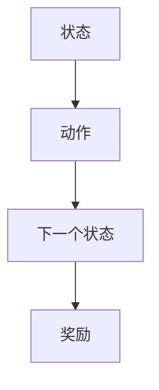
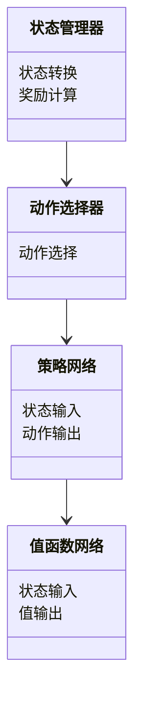

                 


# 强化学习在AI Agent交互策略中的应用

## 关键词：强化学习，AI Agent，交互策略，深度强化学习，马尔可夫决策过程，Q-learning，DQN

## 摘要：本文深入探讨了强化学习在AI Agent交互策略中的应用，从基本概念到核心算法，再到实际应用案例，系统地分析了强化学习如何优化AI Agent的交互策略。通过详细讲解Q-learning和DQN等算法的原理、数学模型及代码实现，本文为读者提供了从理论到实践的全面指导。

---

## 第1章 强化学习与AI Agent概述

### 1.1 强化学习的基本概念

#### 1.1.1 强化学习的定义与特点
强化学习是一种机器学习范式，通过智能体与环境的交互，逐步优化其行为策略，以最大化累计奖励。其特点包括：
- **试错性**：智能体通过不断尝试动作并根据反馈调整策略。
- **延迟奖励**：奖励可能在动作序列之后才给出。
- **最优性**：目标是找到最优策略以获得最大累积奖励。

#### 1.1.2 AI Agent的基本概念与类型
AI Agent是能够感知环境并采取行动以实现目标的智能体。其类型包括：
- **简单反射Agent**：基于当前输入做出反应。
- **基于模型的Agent**：维护环境状态模型，用于决策。
- **强化学习Agent**：通过强化学习算法优化交互策略。

#### 1.1.3 强化学习在AI Agent中的作用
强化学习通过与环境的交互，帮助AI Agent学习最优策略，解决动态和不确定环境中的决策问题。

---

### 1.2 强化学习的核心概念

#### 1.2.1 状态、动作与奖励的定义
- **状态（State）**：环境当前的观察。
- **动作（Action）**：智能体采取的行为。
- **奖励（Reward）**：对动作的反馈，指导智能体行为。

#### 1.2.2 马尔可夫决策过程（MDP）模型
MDP由$(S, A, P, R, \gamma)$组成：
- $S$：状态空间。
- $A$：动作空间。
- $P$：状态转移概率矩阵。
- $R$：奖励函数。
- $\gamma$：折扣因子。

#### 1.2.3 策略与值函数的定义
- **策略（Policy）**：决定智能体在状态下的动作分布。
- **值函数**：衡量从当前状态开始的期望累积奖励。

---

## 第2章 强化学习的核心原理与数学模型

### 2.1 马尔可夫决策过程（MDP）模型

#### 2.1.1 MDP的定义与组成部分
MDP描述了智能体与环境的交互过程，包括状态、动作、转移概率和奖励函数。

#### 2.1.2 状态转移概率矩阵
状态转移概率矩阵描述了从当前状态到下一个状态的概率。

#### 2.1.3 奖励函数的设计
奖励函数定义了智能体在不同状态和动作下的奖励值。



---

### 2.2 Q-learning算法的数学模型

#### 2.2.1 Q值的更新公式
Q-learning通过迭代更新Q值来逼近最优策略：

$$ Q(s, a) \leftarrow Q(s, a) + \alpha [r + \gamma \max Q(s', a') - Q(s, a)] $$

其中，$\alpha$是学习率，$\gamma$是折扣因子。

#### 2.2.2 动作选择策略（ε-greedy）
ε-greedy策略在探索和利用之间平衡：

$$ p(\text{探索}) = \epsilon, \quad p(\text{利用}) = 1 - \epsilon $$

---

### 2.3 深度强化学习（DQN）算法

#### 2.3.1 DQN的网络结构
DQN使用两个神经网络：
- 主网络：评估当前策略。
- 目标网络：作为目标值的稳定器。

#### 2.3.2 经验回放机制
经验回放通过存储和随机采样历史经验，减少相关样本偏差。

#### 2.3.3 目标网络的更新
目标网络以一定频率同步主网络权重：

$$ \theta_{\text{target}} \leftarrow \tau \theta_{\text{main}} + (1 - \tau) \theta_{\text{target}} $$

其中，$\tau$是软更新系数。

---

## 第3章 强化学习在AI Agent交互策略中的应用

### 3.1 AI Agent交互策略的核心问题

#### 3.1.1 状态空间的构建
状态空间的定义直接影响策略优化效果。

#### 3.1.2 动作空间的设计
动作空间的大小和类型影响算法复杂度。

#### 3.1.3 奖励函数的优化
奖励函数的设计需平衡短期和长期目标。

---

### 3.2 基于强化学习的交互策略设计

#### 3.2.1 策略网络的设计与实现
策略网络输出动作概率分布。

#### 3.2.2 值函数网络的构建与训练
值函数网络评估当前状态的值。

#### 3.2.3 动作选择策略的优化
结合策略网络和值函数网络，优化动作选择策略。

---

### 3.3 实际应用场景分析

#### 3.3.1 游戏AI中的应用
强化学习广泛应用于游戏AI的策略优化。

#### 3.3.2 机器人控制中的应用
强化学习帮助机器人在动态环境中自主决策。

#### 3.3.3 自然语言处理中的应用
强化学习用于对话系统和文本生成任务。

---

## 第4章 强化学习算法的数学模型与公式

### 4.1 Q-learning算法的数学模型

#### 4.1.1 Q值更新公式
Q-learning的更新公式：

$$ Q(s, a) \leftarrow Q(s, a) + \alpha (r + \gamma \max Q(s', a') - Q(s, a)) $$

---

### 4.2 深度强化学习（DQN）算法

#### 4.2.1 DQN的数学模型
DQN通过两个神经网络逼近最优值函数。

#### 4.2.2 经验回放机制
经验回放公式：

$$ \mathcal{D} = \{(s_i, a_i, r_i, s_{i+1})\} $$

---

## 第5章 系统分析与架构设计方案

### 5.1 问题场景介绍
设计一个AI Agent，在复杂环境中实现交互策略优化。

### 5.2 项目介绍
开发一个基于强化学习的AI Agent系统，优化交互策略。

### 5.3 系统功能设计（领域模型）



---

## 第6章 项目实战

### 6.1 环境安装
安装必要的库，如TensorFlow、Keras、OpenAI Gym等。

### 6.2 系统核心实现源代码

```python
import numpy as np
import gym

class DQNAgent:
    def __init__(self, state_space, action_space, learning_rate=0.01, gamma=0.99):
        self.state_space = state_space
        self.action_space = action_space
        self.model = self.build_model()
        self.target_model = self.build_model()
        self.learning_rate = learning_rate
        self.gamma = gamma
        self.epsilon = 1.0
        self.epsilon_min = 0.01
        self.epsilon_decay = 0.995

    def build_model(self):
        model = Sequential()
        model.add(Dense(32, activation='relu', input_dim=self.state_space))
        model.add(Dense(self.action_space, activation='linear'))
        model.compile(optimizer=Adam(lr=self.learning_rate), loss='mse')
        return model

    def act(self, state):
        if np.random.random() < self.epsilon:
            return np.random.randint(self.action_space)
        q_values = self.model.predict(state)
        return np.argmax(q_values[0])

    def remember(self, state, action, reward, next_state):
        self.memory.append((state, action, reward, next_state))

    def replay(self, batch_size):
        if len(self.memory) < batch_size:
            return
        mini_batch = random.sample(self.memory, batch_size)
        states = np.array([t[0] for t in mini_batch])
        actions = np.array([t[1] for t in mini_batch])
        rewards = np.array([t[2] for t in mini_batch])
        next_states = np.array([t[3] for t in mini_batch])
        q_values = self.model.predict(states)
        q_next = self.target_model.predict(next_states)
        q_target = q_values.copy()
        for i in range(batch_size):
            q_target[i][actions[i]] = rewards[i] + self.gamma * np.max(q_next[i])
        self.model.fit(states, q_target, epochs=1, verbose=0)
        if self.epsilon > self.epsilon_min:
            self.epsilon *= self.epsilon_decay

# 使用Agent
env = gym.make('CartPole-v0')
state_space = env.observation_space.shape[0]
action_space = env.action_space.n
agent = DQNAgent(state_space, action_space)
for episode in range(1000):
    state = env.reset()
    total_reward = 0
    while True:
        action = agent.act(state)
        next_state, reward, done, _ = env.step(action)
        agent.remember(state, action, reward, next_state)
        agent.replay(32)
        total_reward += reward
        state = next_state
        if done:
            break
    print(f"Episode {episode}: Total Reward = {total_reward}")
```

---

## 第7章 总结与展望

### 7.1 本章小结
强化学习在AI Agent交互策略中的应用广泛，通过不断优化策略，智能体能够在复杂环境中实现高效决策。

### 7.2 未来展望
未来研究方向包括多智能体协作、复杂环境建模和强化学习与生成模型的结合。

### 7.3 最佳实践 tips
- 合理设计状态和动作空间。
- 优化奖励函数设计。
- 平衡探索与利用。

---

通过以上步骤，强化学习在AI Agent交互策略中的应用得到了全面而深入的探讨，从理论到实践，为读者提供了丰富的知识和指导。

